## 一. 报错总结

### 1. 多次 hadoop namenode -format格式化

- **造成有个问题的原因最常见的是多次 `hadoop namenode -format`格式化`namenode`造成的，即 `namespaceID` 不一致。**

#### 1）查看

```shell
[root@master hduser]# hadoop fs -put /home/hduser/Desktop/test.txt /input
2019-09-01 09:44:29,336 WARN hdfs.DataStreamer: DataStreamer Exception
org.apache.hadoop.ipc.RemoteException(java.io.IOException): File /input/test.txt._COPYING_ could only be written to 0 of the 1 minReplication nodes. There are 0 datanode(s) running and 0 node(s) are excluded in this operation.
        at org.apache.hadoop.hdfs.server.blockmanagement.BlockManager.chooseTarget4NewBlock(BlockManager.java:2121)
        at org.apache.hadoop.hdfs.server.namenode.FSDirWriteFileOp.chooseTargetForNewBlock(FSDirWriteFileOp.java:295)
        at org.apache.hadoop.hdfs.server.namenode.FSNamesystem.getAdditionalBlock(FSNamesystem.java:2702)
        at org.apache.hadoop.hdfs.server.namenode.NameNodeRpcServer.addBlock(NameNodeRpcServer.java:875)
        at org.apache.hadoop.hdfs.protocolPB.ClientNamenodeProtocolServerSideTranslatorPB.addBlock(ClientNamenodeProtocolServerSideTranslatorPB.java:561)
        at org.apache.hadoop.hdfs.protocol.proto.ClientNamenodeProtocolProtos$ClientNamenodeProtocol$2.callBlockingMethod(ClientNamenodeProtocolProtos.java)
        at org.apache.hadoop.ipc.ProtobufRpcEngine$Server$ProtoBufRpcInvoker.call(ProtobufRpcEngine.java:523)
        at org.apache.hadoop.ipc.RPC$Server.call(RPC.java:991)
        at org.apache.hadoop.ipc.Server$RpcCall.run(Server.java:872)
        at org.apache.hadoop.ipc.Server$RpcCall.run(Server.java:818)
        at java.security.AccessController.doPrivileged(Native Method)
        at javax.security.auth.Subject.doAs(Subject.java:422)
        at org.apache.hadoop.security.UserGroupInformation.doAs(UserGroupInformation.java:1729)
        at org.apache.hadoop.ipc.Server$Handler.run(Server.java:2678)

        at org.apache.hadoop.ipc.Client.getRpcResponse(Client.java:1511)
        at org.apache.hadoop.ipc.Client.call(Client.java:1457)
        at org.apache.hadoop.ipc.Client.call(Client.java:1367)
        at org.apache.hadoop.ipc.ProtobufRpcEngine$Invoker.invoke(ProtobufRpcEngine.java:228)
        at org.apache.hadoop.ipc.ProtobufRpcEngine$Invoker.invoke(ProtobufRpcEngine.java:116)
        at com.sun.proxy.$Proxy9.addBlock(Unknown Source)
        at org.apache.hadoop.hdfs.protocolPB.ClientNamenodeProtocolTranslatorPB.addBlock(ClientNamenodeProtocolTranslatorPB.java:510)
        at sun.reflect.NativeMethodAccessorImpl.invoke0(Native Method)
        at sun.reflect.NativeMethodAccessorImpl.invoke(NativeMethodAccessorImpl.java:62)
        at sun.reflect.DelegatingMethodAccessorImpl.invoke(DelegatingMethodAccessorImpl.java:43)
        at java.lang.reflect.Method.invoke(Method.java:498)
        at org.apache.hadoop.io.retry.RetryInvocationHandler.invokeMethod(RetryInvocationHandler.java:422)
        at org.apache.hadoop.io.retry.RetryInvocationHandler$Call.invokeMethod(RetryInvocationHandler.java:165)
        at org.apache.hadoop.io.retry.RetryInvocationHandler$Call.invoke(RetryInvocationHandler.java:157)
        at org.apache.hadoop.io.retry.RetryInvocationHandler$Call.invokeOnce(RetryInvocationHandler.java:95)
        at org.apache.hadoop.io.retry.RetryInvocationHandler.invoke(RetryInvocationHandler.java:359)
        at com.sun.proxy.$Proxy10.addBlock(Unknown Source)
        at org.apache.hadoop.hdfs.DFSOutputStream.addBlock(DFSOutputStream.java:1081)
        at org.apache.hadoop.hdfs.DataStreamer.locateFollowingBlock(DataStreamer.java:1866)
        at org.apache.hadoop.hdfs.DataStreamer.nextBlockOutputStream(DataStreamer.java:1668)
        at org.apache.hadoop.hdfs.DataStreamer.run(DataStreamer.java:716)
put: File /input/test.txt._COPYING_ could only be written to 0 of the 1 minReplication nodes. There are 0 datanode(s) running and 0 node(s) are excluded in this operation.


```

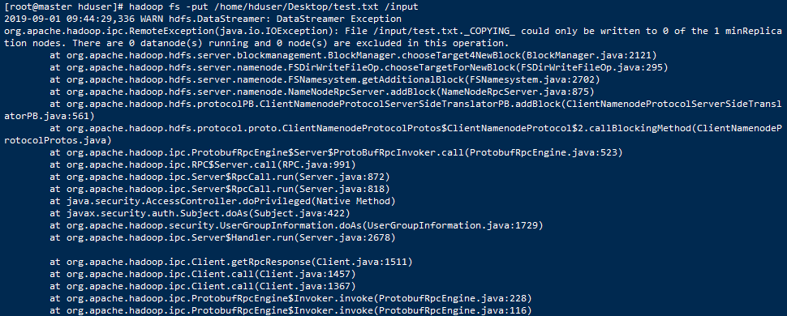


#### 2）使用`hadoop dfsadmin -report`命令查看磁盘使用情况，发现出现以下问题

```shell
[root@master hduser]# hadoop dfsadmin -report
WARNING: Use of this script to execute dfsadmin is deprecated.
WARNING: Attempting to execute replacement "hdfs dfsadmin" instead.

Configured Capacity: 0 (0 B)
Present Capacity: 0 (0 B)
DFS Remaining: 0 (0 B)
DFS Used: 0 (0 B)
DFS Used%: 0.00%
Replicated Blocks:
        Under replicated blocks: 0
        Blocks with corrupt replicas: 0
        Missing blocks: 0
        Missing blocks (with replication factor 1): 0
        Low redundancy blocks with highest priority to recover: 0
        Pending deletion blocks: 0
Erasure Coded Block Groups: 
        Low redundancy block groups: 0
        Block groups with corrupt internal blocks: 0
        Missing block groups: 0
        Low redundancy blocks with highest priority to recover: 0
        Pending deletion blocks: 0

-------------------------------------------------
```

- **造成有个问题的原因最常见的是多次 `hadoop namenode -format`格式化`namenode`造成的，即 `namespaceID` 不一致。**
   这种情况清空logs，重启启动有时候甚至有时候都没有`datanode`的日志产生。

#### 第一种解决方法

- 找到不一致的 `VERSION` 修改  `namespaceID`

- 查看`namenode`和`datanode`的文件夹在哪里，从`hdfs-site.xml`可以查看到

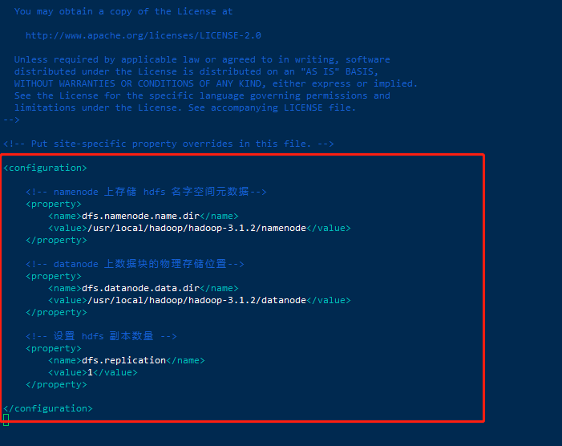

- 进入文件夹，找到一个叫做VERSION的文件

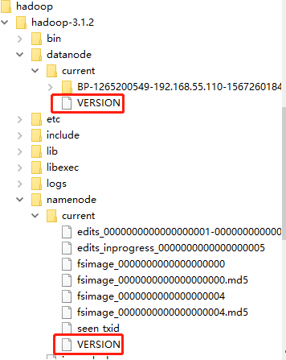

- 查找到`datenode`和`namenode`文件夹中的`VERSION`中`clusterID`字段，修改一致。


- 如果产生了数据，还需要保证data中VERSION一致。在`hdfs`中配置的data目录（即在`core-site.xml`中配置的`hadoop.tmp.dir`对应文件件）下面的`VERSION`中`clusterID`也需要对应。

  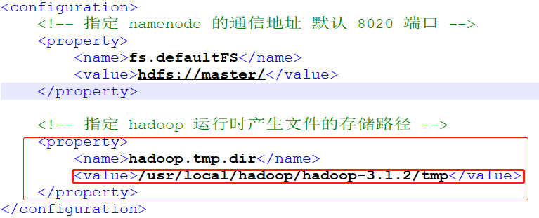

- 查找到文件中的这个`clusterID`字段，修改与上面一致。

  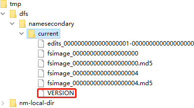

- 需要保证当前正在使用的`namenode`、`datanode`、`tmp`中VERSION中的`clusterID`是相同的。这样集群跑起来就是正常的了。

  ```shell
  [root@master hduser]# start-all.sh
  Starting namenodes on [master]
  Last login: Sun Sep  1 15:15:40 CST 2019 on pts/0
  Starting datanodes
  Last login: Sun Sep  1 15:19:07 CST 2019 on pts/0
  Starting secondary namenodes [master]
  Last login: Sun Sep  1 15:19:10 CST 2019 on pts/0
  Starting resourcemanager
  Last login: Sun Sep  1 15:19:20 CST 2019 on pts/0
  Starting nodemanagers
  Last login: Sun Sep  1 15:19:32 CST 2019 on pts/0
  [root@master hduser]# jps
  25696 Jps
  23911 NameNode
  24455 SecondaryNameNode
  24951 ResourceManager
  [root@master hduser]# hadoop dfsadmin -report
  WARNING: Use of this script to execute dfsadmin is deprecated.
  WARNING: Attempting to execute replacement "hdfs dfsadmin" instead.
  
  Safe mode is ON
  Configured Capacity: 160982630400 (149.93 GB)
  Present Capacity: 144526098432 (134.60 GB)
  DFS Remaining: 144526061568 (134.60 GB)
  DFS Used: 36864 (36 KB)
  DFS Used%: 0.00%
  Replicated Blocks:
          Under replicated blocks: 0
          Blocks with corrupt replicas: 0
          Missing blocks: 0
          Missing blocks (with replication factor 1): 0
          Low redundancy blocks with highest priority to recover: 0
          Pending deletion blocks: 0
  Erasure Coded Block Groups: 
          Low redundancy block groups: 0
          Block groups with corrupt internal blocks: 0
          Missing block groups: 0
          Low redundancy blocks with highest priority to recover: 0
          Pending deletion blocks: 0
  
  -------------------------------------------------
  Live datanodes (3):
  
  Name: 192.168.55.111:9866 (slave1)
  Hostname: slave1
  Decommission Status : Normal
  Configured Capacity: 53660876800 (49.98 GB)
  DFS Used: 12288 (12 KB)
  Non DFS Used: 5541580800 (5.16 GB)
  DFS Remaining: 48119283712 (44.81 GB)
  DFS Used%: 0.00%
  DFS Remaining%: 89.67%
  Configured Cache Capacity: 0 (0 B)
  Cache Used: 0 (0 B)
  Cache Remaining: 0 (0 B)
  Cache Used%: 100.00%
  Cache Remaining%: 0.00%
  Xceivers: 1
  Last contact: Sun Sep 01 15:20:59 CST 2019
  Last Block Report: Sun Sep 01 15:20:00 CST 2019
  Num of Blocks: 0
  
  
  Name: 192.168.55.112:9866 (slave2)
  Hostname: slave2
  Decommission Status : Normal
  Configured Capacity: 53660876800 (49.98 GB)
  DFS Used: 12288 (12 KB)
  Non DFS Used: 5377015808 (5.01 GB)
  DFS Remaining: 48283848704 (44.97 GB)
  DFS Used%: 0.00%
  DFS Remaining%: 89.98%
  Configured Cache Capacity: 0 (0 B)
  Cache Used: 0 (0 B)
  Cache Remaining: 0 (0 B)
  Cache Used%: 100.00%
  Cache Remaining%: 0.00%
  Xceivers: 1
  Last contact: Sun Sep 01 15:20:57 CST 2019
  Last Block Report: Sun Sep 01 15:20:42 CST 2019
  Num of Blocks: 0
  
  
  Name: 192.168.55.113:9866 (slave3)
  Hostname: slave3
  Decommission Status : Normal
  Configured Capacity: 53660876800 (49.98 GB)
  DFS Used: 12288 (12 KB)
  Non DFS Used: 5537935360 (5.16 GB)
  DFS Remaining: 48122929152 (44.82 GB)
  DFS Used%: 0.00%
  DFS Remaining%: 89.68%
  Configured Cache Capacity: 0 (0 B)
  Cache Used: 0 (0 B)
  Cache Remaining: 0 (0 B)
  Cache Used%: 100.00%
  Cache Remaining%: 0.00%
  Xceivers: 1
  Last contact: Sun Sep 01 15:20:59 CST 2019
  Last Block Report: Sun Sep 01 15:20:41 CST 2019
  Num of Blocks: 0
  
  ```

  

#### 第二种解决方案

- 删除 `hdfs/data` 中全部文件，重新初始化`namenode`，这样做数据就全部没了（看到的结果是这样）

- 1、停止集群

  ```shell
  [root@master hduser]# stop-all.sh
  ```

- 2、删除在`hdfs`中配置的data目录（即在`core-site.xml`中配置的`hadoop.tmp.dir`对应文件件）下面的所有数据。

- 

- 4、删除

  ```shell
  [root@master hduser]# rm -rf /usr/local/hadoop/hadoop-3.1.2/tmp/*
  ```

- 5、重新格式化`namenode`

  ```shell
  [root@master hduser]# hdfs namenode -format
  ```

- 5、重新启动集群

  ```shell
  [root@master hduser]# start-all.sh
  ```

- 补充一点

  - **`hdfs namenode -format`只需要在Master节点执行一次！！！**

  - 如果不小心在slave1、slave2、slave3执行了`hdfs namenode -format`，可以删除多余的文件夹及文件（一般会多余一个`namenode`文件夹即tmp目录下多个dfs文件夹）。下面使slave节点的目录。

    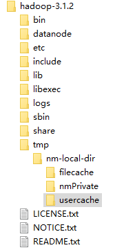


参考：

https://blog.csdn.net/wild46cat/article/details/53424049

https://blog.csdn.net/weiyongle1996/article/details/74094989


### 2. Web访问不了50070端口 

- 是否安装vpn了，按的话，关闭
- 是否开防火墙，关闭

1、查看50070端口是否已经开了

```shell
[root@master hduser]# netstat -ntlp

#或者这个命令
[root@master hduser]# netstat -ant
```

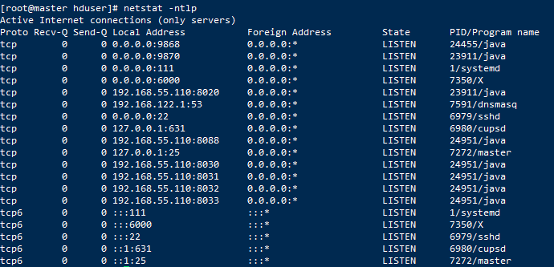

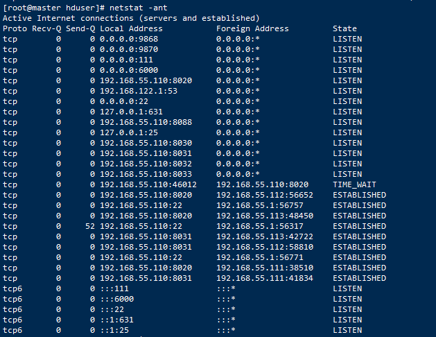

- 没有50070端口号

2、修改`hadoop-3.1.2/etc/hadoop/hdfs-site.xml`文件，我的是在`/usr/local/hadoop/hadoop-3.1.2/etc/hadoop/hdfs-site.xml`，在最后加入。

```properties
<!-- 设置访问端口号 -->
<property>
<name>dfs.http.address</name>
<value>0.0.0.0:50070</value>
</property>
```

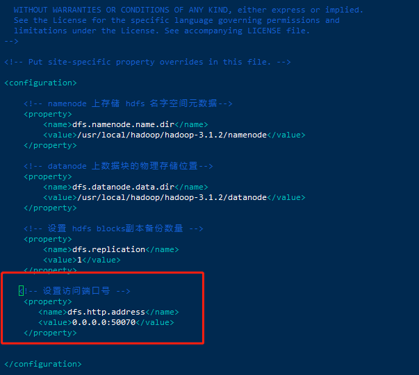

3、先关闭集群，再重启即可。

```shell
[root@master hduser]# stop-all.sh

[root@master hduser]# start-all.sh
```

4、再次查看50070端口是否已经开了

```shell
[root@master hduser]# netstat -ant 

#或者下面这个命令
[root@master hduser]# netstat -ntlp

```

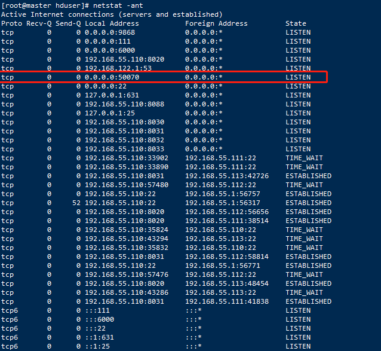

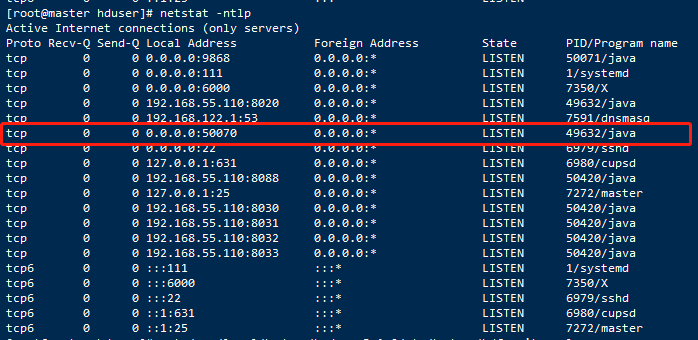

5、浏览器访问

[http://192.168.55.110:50070](http://192.168.55.110:50070/)

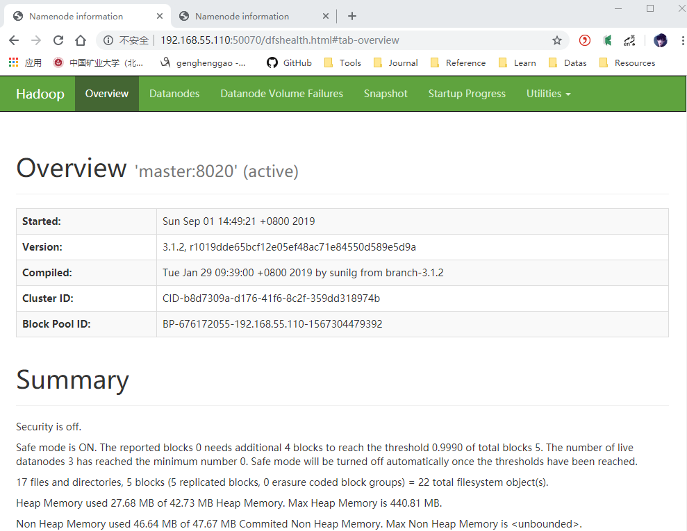


参考：

https://blog.csdn.net/lidew521/article/details/87901849

### 3. Name node is in safe mode

- 报错如下`Name node is in safe mode`

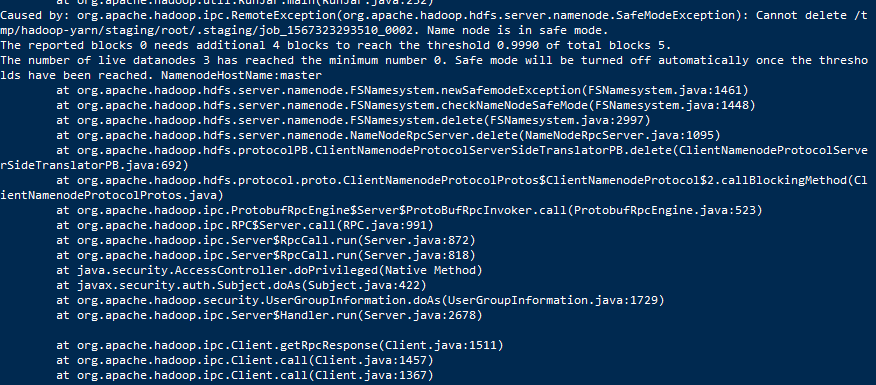

- 原因是namenode处在安全模式下 

  ```
  #获取安全模式的状态:
  
  hdfs dfsadmin -safemode get
  
  #安全模式打开
  
  hdfs dfsadmin -safemode enter
  
  #安全模式关闭
  
  hdfs dfsadmin -safemode leave
  ```

  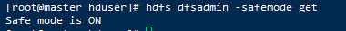

  解决方式：

  ```
  #关闭安全模式即可
  hdfs dfsadmin -safemode leave 
  ```

  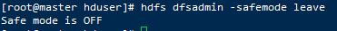

### 4. java.net.NoRouteToHostException: No route to host

- centos7环境下，hadoop集群已启动。

```shell
[root@master hduser]# hadoop jar /usr/local/hadoop/hadoop-3.1.2/share/hadoop/mapreduce/hadoop-mapreduce-examples-3.1.2.jar wordcount /input /output
2019-09-02 10:36:44,257 INFO client.RMProxy: Connecting to ResourceManager at master/192.168.55.110:8032
2019-09-02 10:36:44,888 INFO mapreduce.JobResourceUploader: Disabling Erasure Coding for path: /tmp/hadoop-yarn/staging/root/.staging/job_1567391095576_0002
2019-09-02 10:36:45,012 INFO hdfs.DataStreamer: Exception in createBlockOutputStream blk_1073741863_1039
java.net.NoRouteToHostException: No route to host
        at sun.nio.ch.SocketChannelImpl.checkConnect(Native Method)
        at sun.nio.ch.SocketChannelImpl.finishConnect(SocketChannelImpl.java:717)
        at org.apache.hadoop.net.SocketIOWithTimeout.connect(SocketIOWithTimeout.java:206)
        at org.apache.hadoop.net.NetUtils.connect(NetUtils.java:531)
        at org.apache.hadoop.hdfs.DataStreamer.createSocketForPipeline(DataStreamer.java:253)
        at org.apache.hadoop.hdfs.DataStreamer.createBlockOutputStream(DataStreamer.java:1725)
        at org.apache.hadoop.hdfs.DataStreamer.nextBlockOutputStream(DataStreamer.java:1679)
        at org.apache.hadoop.hdfs.DataStreamer.run(DataStreamer.java:716)
2019-09-02 10:36:45,013 WARN hdfs.DataStreamer: Abandoning BP-676172055-192.168.55.110-1567304479392:blk_1073741863_1039
2019-09-02 10:36:45,019 WARN hdfs.DataStreamer: Excluding datanode DatanodeInfoWithStorage[192.168.55.112:9866,DS-e7f367e9-9f7a-4fc0-881b-09694d89f468,DISK]
2019-09-02 10:36:45,031 INFO hdfs.DataStreamer: Exception in createBlockOutputStream blk_1073741864_1040
java.net.NoRouteToHostException: No route to host
        at sun.nio.ch.SocketChannelImpl.checkConnect(Native Method)
        at sun.nio.ch.SocketChannelImpl.finishConnect(SocketChannelImpl.java:717)
        at org.apache.hadoop.net.SocketIOWithTimeout.connect(SocketIOWithTimeout.java:206)
        at org.apache.hadoop.net.NetUtils.connect(NetUtils.java:531)
        at org.apache.hadoop.hdfs.DataStreamer.createSocketForPipeline(DataStreamer.java:253)
        at org.apache.hadoop.hdfs.DataStreamer.createBlockOutputStream(DataStreamer.java:1725)
        at org.apache.hadoop.hdfs.DataStreamer.nextBlockOutputStream(DataStreamer.java:1679)
        at org.apache.hadoop.hdfs.DataStreamer.run(DataStreamer.java:716)
2019-09-02 10:36:45,031 WARN hdfs.DataStreamer: Abandoning BP-676172055-192.168.55.110-1567304479392:blk_1073741864_1040
2019-09-02 10:36:45,033 WARN hdfs.DataStreamer: Excluding datanode DatanodeInfoWithStorage[192.168.55.113:9866,DS-6b56664f-9339-4066-8505-0a0bb949752e,DISK]
2019-09-02 10:36:45,040 INFO hdfs.DataStreamer: Exception in createBlockOutputStream blk_1073741865_1041
java.net.NoRouteToHostException: No route to host
        at sun.nio.ch.SocketChannelImpl.checkConnect(Native Method)
        at sun.nio.ch.SocketChannelImpl.finishConnect(SocketChannelImpl.java:717)
        at org.apache.hadoop.net.SocketIOWithTimeout.connect(SocketIOWithTimeout.java:206)
        at org.apache.hadoop.net.NetUtils.connect(NetUtils.java:531)
        at org.apache.hadoop.hdfs.DataStreamer.createSocketForPipeline(DataStreamer.java:253)
        at org.apache.hadoop.hdfs.DataStreamer.createBlockOutputStream(DataStreamer.java:1725)
        at org.apache.hadoop.hdfs.DataStreamer.nextBlockOutputStream(DataStreamer.java:1679)
        at org.apache.hadoop.hdfs.DataStreamer.run(DataStreamer.java:716)
2019-09-02 10:36:45,040 WARN hdfs.DataStreamer: Abandoning BP-676172055-192.168.55.110-1567304479392:blk_1073741865_1041
2019-09-02 10:36:45,043 WARN hdfs.DataStreamer: Excluding datanode DatanodeInfoWithStorage[192.168.55.111:9866,DS-be61024b-ec42-48c8-9b91-10e28ff89e93,DISK]
2019-09-02 10:36:45,051 WARN hdfs.DataStreamer: DataStreamer Exception
org.apache.hadoop.ipc.RemoteException(java.io.IOException): File /tmp/hadoop-yarn/staging/root/.staging/job_1567391095576_0002/job.jar could only be written to 0 of the 1 minReplication nodes. There are 3 datanode(s) running and 3 node(s) are excluded in this operation.
        at org.apache.hadoop.hdfs.server.blockmanagement.BlockManager.chooseTarget4NewBlock(BlockManager.java:2121)
        at org.apache.hadoop.hdfs.server.namenode.FSDirWriteFileOp.chooseTargetForNewBlock(FSDirWriteFileOp.java:295)
        at org.apache.hadoop.hdfs.server.namenode.FSNamesystem.getAdditionalBlock(FSNamesystem.java:2702)
        at org.apache.hadoop.hdfs.server.namenode.NameNodeRpcServer.addBlock(NameNodeRpcServer.java:875)
        at org.apache.hadoop.hdfs.protocolPB.ClientNamenodeProtocolServerSideTranslatorPB.addBlock(ClientNamenodeProtocolServerSideTranslatorPB.java:561)
        at org.apache.hadoop.hdfs.protocol.proto.ClientNamenodeProtocolProtos$ClientNamenodeProtocol$2.callBlockingMethod(ClientNamenodeProtocolProtos.java)
        at org.apache.hadoop.ipc.ProtobufRpcEngine$Server$ProtoBufRpcInvoker.call(ProtobufRpcEngine.java:523)
        at org.apache.hadoop.ipc.RPC$Server.call(RPC.java:991)
        at org.apache.hadoop.ipc.Server$RpcCall.run(Server.java:872)
        at org.apache.hadoop.ipc.Server$RpcCall.run(Server.java:818)
        at java.security.AccessController.doPrivileged(Native Method)
        at javax.security.auth.Subject.doAs(Subject.java:422)
        at org.apache.hadoop.security.UserGroupInformation.doAs(UserGroupInformation.java:1729)
        at org.apache.hadoop.ipc.Server$Handler.run(Server.java:2678)

        at org.apache.hadoop.ipc.Client.getRpcResponse(Client.java:1511)
        at org.apache.hadoop.ipc.Client.call(Client.java:1457)
        at org.apache.hadoop.ipc.Client.call(Client.java:1367)
        at org.apache.hadoop.ipc.ProtobufRpcEngine$Invoker.invoke(ProtobufRpcEngine.java:228)
        at org.apache.hadoop.ipc.ProtobufRpcEngine$Invoker.invoke(ProtobufRpcEngine.java:116)
        at com.sun.proxy.$Proxy9.addBlock(Unknown Source)
        at org.apache.hadoop.hdfs.protocolPB.ClientNamenodeProtocolTranslatorPB.addBlock(ClientNamenodeProtocolTranslatorPB.java:510)
        at sun.reflect.NativeMethodAccessorImpl.invoke0(Native Method)
        at sun.reflect.NativeMethodAccessorImpl.invoke(NativeMethodAccessorImpl.java:62)
        at sun.reflect.DelegatingMethodAccessorImpl.invoke(DelegatingMethodAccessorImpl.java:43)
        at java.lang.reflect.Method.invoke(Method.java:498)
        at org.apache.hadoop.io.retry.RetryInvocationHandler.invokeMethod(RetryInvocationHandler.java:422)
        at org.apache.hadoop.io.retry.RetryInvocationHandler$Call.invokeMethod(RetryInvocationHandler.java:165)
        at org.apache.hadoop.io.retry.RetryInvocationHandler$Call.invoke(RetryInvocationHandler.java:157)
        at org.apache.hadoop.io.retry.RetryInvocationHandler$Call.invokeOnce(RetryInvocationHandler.java:95)
        at org.apache.hadoop.io.retry.RetryInvocationHandler.invoke(RetryInvocationHandler.java:359)
        at com.sun.proxy.$Proxy10.addBlock(Unknown Source)
        at org.apache.hadoop.hdfs.DFSOutputStream.addBlock(DFSOutputStream.java:1081)
        at org.apache.hadoop.hdfs.DataStreamer.locateFollowingBlock(DataStreamer.java:1866)
        at org.apache.hadoop.hdfs.DataStreamer.nextBlockOutputStream(DataStreamer.java:1668)
        at org.apache.hadoop.hdfs.DataStreamer.run(DataStreamer.java:716)
2019-09-02 10:36:45,056 INFO mapreduce.JobSubmitter: Cleaning up the staging area /tmp/hadoop-yarn/staging/root/.staging/job_1567391095576_0002
org.apache.hadoop.ipc.RemoteException(java.io.IOException): File /tmp/hadoop-yarn/staging/root/.staging/job_1567391095576_0002/job.jar could only be written to 0 of the 1 minReplication nodes. There are 3 datanode(s) running and 3 node(s) are excluded in this operation.
        at org.apache.hadoop.hdfs.server.blockmanagement.BlockManager.chooseTarget4NewBlock(BlockManager.java:2121)
        at org.apache.hadoop.hdfs.server.namenode.FSDirWriteFileOp.chooseTargetForNewBlock(FSDirWriteFileOp.java:295)
        at org.apache.hadoop.hdfs.server.namenode.FSNamesystem.getAdditionalBlock(FSNamesystem.java:2702)
        at org.apache.hadoop.hdfs.server.namenode.NameNodeRpcServer.addBlock(NameNodeRpcServer.java:875)
        at org.apache.hadoop.hdfs.protocolPB.ClientNamenodeProtocolServerSideTranslatorPB.addBlock(ClientNamenodeProtocolServerSideTranslatorPB.java:561)
        at org.apache.hadoop.hdfs.protocol.proto.ClientNamenodeProtocolProtos$ClientNamenodeProtocol$2.callBlockingMethod(ClientNamenodeProtocolProtos.java)
        at org.apache.hadoop.ipc.ProtobufRpcEngine$Server$ProtoBufRpcInvoker.call(ProtobufRpcEngine.java:523)
        at org.apache.hadoop.ipc.RPC$Server.call(RPC.java:991)
        at org.apache.hadoop.ipc.Server$RpcCall.run(Server.java:872)
        at org.apache.hadoop.ipc.Server$RpcCall.run(Server.java:818)
        at java.security.AccessController.doPrivileged(Native Method)
        at javax.security.auth.Subject.doAs(Subject.java:422)
        at org.apache.hadoop.security.UserGroupInformation.doAs(UserGroupInformation.java:1729)
        at org.apache.hadoop.ipc.Server$Handler.run(Server.java:2678)

        at org.apache.hadoop.ipc.Client.getRpcResponse(Client.java:1511)
        at org.apache.hadoop.ipc.Client.call(Client.java:1457)
        at org.apache.hadoop.ipc.Client.call(Client.java:1367)
        at org.apache.hadoop.ipc.ProtobufRpcEngine$Invoker.invoke(ProtobufRpcEngine.java:228)
        at org.apache.hadoop.ipc.ProtobufRpcEngine$Invoker.invoke(ProtobufRpcEngine.java:116)
        at com.sun.proxy.$Proxy9.addBlock(Unknown Source)
        at org.apache.hadoop.hdfs.protocolPB.ClientNamenodeProtocolTranslatorPB.addBlock(ClientNamenodeProtocolTranslatorPB.java:510)
        at sun.reflect.NativeMethodAccessorImpl.invoke0(Native Method)
        at sun.reflect.NativeMethodAccessorImpl.invoke(NativeMethodAccessorImpl.java:62)
        at sun.reflect.DelegatingMethodAccessorImpl.invoke(DelegatingMethodAccessorImpl.java:43)
        at java.lang.reflect.Method.invoke(Method.java:498)
        at org.apache.hadoop.io.retry.RetryInvocationHandler.invokeMethod(RetryInvocationHandler.java:422)
        at org.apache.hadoop.io.retry.RetryInvocationHandler$Call.invokeMethod(RetryInvocationHandler.java:165)
        at org.apache.hadoop.io.retry.RetryInvocationHandler$Call.invoke(RetryInvocationHandler.java:157)
        at org.apache.hadoop.io.retry.RetryInvocationHandler$Call.invokeOnce(RetryInvocationHandler.java:95)
        at org.apache.hadoop.io.retry.RetryInvocationHandler.invoke(RetryInvocationHandler.java:359)
        at com.sun.proxy.$Proxy10.addBlock(Unknown Source)
        at org.apache.hadoop.hdfs.DFSOutputStream.addBlock(DFSOutputStream.java:1081)
        at org.apache.hadoop.hdfs.DataStreamer.locateFollowingBlock(DataStreamer.java:1866)
        at org.apache.hadoop.hdfs.DataStreamer.nextBlockOutputStream(DataStreamer.java:1668)
        at org.apache.hadoop.hdfs.DataStreamer.run(DataStreamer.java:716)
```

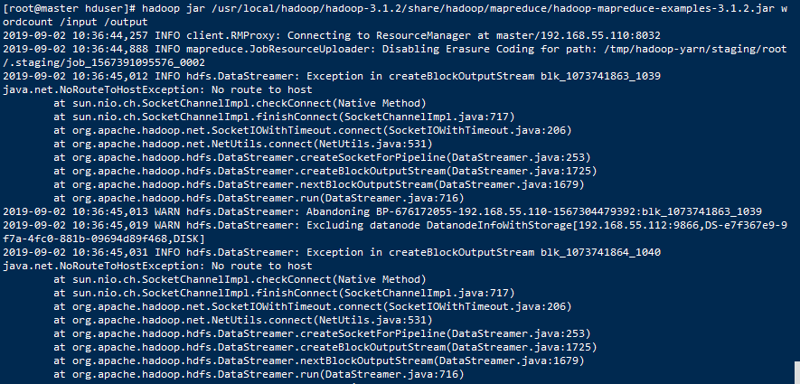

- 问题分析

  - 原因是master无法穿透slaver的防火墙，只需要关闭所有主机的防火墙即可。在slave1、slave2、slave3上都需要执行。

    ```shell
    [root@slave1 hduser]# jps
    108193 NodeManager
    109842 Jps
    107398 DataNode
    
    #查看防火墙状态
    [root@slave1 hduser]# firewall-cmd --state
    running
    
    #需要关闭防火墙
    [root@slave1 hduser]# systemctl stop firewalld.service
    
    #设置主节点上禁止开机启动防火墙
    [root@slave1 hduser]# systemctl disable firewalld.service
    Removed symlink /etc/systemd/system/multi-user.target.wants/firewalld.service.
    Removed symlink /etc/systemd/system/dbus-org.fedoraproject.FirewallD1.service.
    ```


关闭Hadoop集群，重新启动集群。


### 5.2.5 GB of 2.1 GB virtual memory used. Killing container

- Container [pid=18037,containerID=container_1567394951806_0001_01_000002] is running 476404224B beyond the 'VIRTUAL'

```
[root@master hduser]# hadoop jar /usr/local/hadoop/hadoop-3.1.2/share/hadoop/mapreduce/hadoop-mapreduce-examples-3.1.2.jar wordcount /input /output1
2019-09-02 11:30:00,137 INFO client.RMProxy: Connecting to ResourceManager at master/192.168.55.110:8032
2019-09-02 11:30:00,848 INFO mapreduce.JobResourceUploader: Disabling Erasure Coding for path: /tmp/hadoop-yarn/staging/root/.staging/job_1567394951806_0001
2019-09-02 11:30:01,719 INFO input.FileInputFormat: Total input files to process : 1
2019-09-02 11:30:01,969 INFO mapreduce.JobSubmitter: number of splits:1
2019-09-02 11:30:02,882 INFO mapreduce.JobSubmitter: Submitting tokens for job: job_1567394951806_0001
2019-09-02 11:30:02,883 INFO mapreduce.JobSubmitter: Executing with tokens: []
2019-09-02 11:30:03,040 INFO conf.Configuration: resource-types.xml not found
2019-09-02 11:30:03,040 INFO resource.ResourceUtils: Unable to find 'resource-types.xml'.
2019-09-02 11:30:03,463 INFO impl.YarnClientImpl: Submitted application application_1567394951806_0001
2019-09-02 11:30:03,642 INFO mapreduce.Job: The url to track the job: http://master:8088/proxy/application_1567394951806_0001/
2019-09-02 11:30:03,642 INFO mapreduce.Job: Running job: job_1567394951806_0001
2019-09-02 11:30:12,792 INFO mapreduce.Job: Job job_1567394951806_0001 running in uber mode : false
2019-09-02 11:30:12,793 INFO mapreduce.Job:  map 0% reduce 0%
2019-09-02 11:30:23,003 INFO mapreduce.Job: Task Id : attempt_1567394951806_0001_m_000000_0, Status : FAILED
[2019-09-02 11:30:21.709]Container [pid=18037,containerID=container_1567394951806_0001_01_000002] is running 476404224B beyond the 'VIRTUAL' memory limit. Current usage: 199.2 MB of 1 GB physical memory used; 2.5 GB of 2.1 GB virtual memory used. Killing container.
Dump of the process-tree for container_1567394951806_0001_01_000002 :
        |- PID PPID PGRPID SESSID CMD_NAME USER_MODE_TIME(MILLIS) SYSTEM_TIME(MILLIS) VMEM_USAGE(BYTES) RSSMEM_USAGE(PAGES) FULL_CMD_LINE
        |- 18047 18037 18037 18037 (java) 247 86 2615365632 50693 /usr/local/java/jdk1.8.0_212/bin/java -Djava.net.preferIPv4Stack=true -Dhadoop.metrics.log.level=WARN -Xmx820m -Djava.io.tmpdir=/usr/local/hadoop/hadoop-3.1.2/tmp/nm-local-dir/usercache/root/appcache/application_1567394951806_0001/container_1567394951806_0001_01_000002/tmp -Dlog4j.configuration=container-log4j.properties -Dyarn.app.container.log.dir=/usr/local/hadoop/hadoop-3.1.2/logs/userlogs/application_1567394951806_0001/container_1567394951806_0001_01_000002 -Dyarn.app.container.log.filesize=0 -Dhadoop.root.logger=INFO,CLA -Dhadoop.root.logfile=syslog org.apache.hadoop.mapred.YarnChild 192.168.55.113 33976 attempt_1567394951806_0001_m_000000_0 2 
        |- 18037 18036 18037 18037 (bash) 0 0 115896320 305 /bin/bash -c /usr/local/java/jdk1.8.0_212/bin/java -Djava.net.preferIPv4Stack=true -Dhadoop.metrics.log.level=WARN   -Xmx820m -Djava.io.tmpdir=/usr/local/hadoop/hadoop-3.1.2/tmp/nm-local-dir/usercache/root/appcache/application_1567394951806_0001/container_1567394951806_0001_01_000002/tmp -Dlog4j.configuration=container-log4j.properties -Dyarn.app.container.log.dir=/usr/local/hadoop/hadoop-3.1.2/logs/userlogs/application_1567394951806_0001/container_1567394951806_0001_01_000002 -Dyarn.app.container.log.filesize=0 -Dhadoop.root.logger=INFO,CLA -Dhadoop.root.logfile=syslog org.apache.hadoop.mapred.YarnChild 192.168.55.113 33976 attempt_1567394951806_0001_m_000000_0 2 1>/usr/local/hadoop/hadoop-3.1.2/logs/userlogs/application_1567394951806_0001/container_1567394951806_0001_01_000002/stdout 2>/usr/local/hadoop/hadoop-3.1.2/logs/userlogs/application_1567394951806_0001/container_1567394951806_0001_01_000002/stderr  

[2019-09-02 11:30:21.731]Container killed on request. Exit code is 143
[2019-09-02 11:30:21.735]Container exited with a non-zero exit code 143. 

2019-09-02 11:30:34,103 INFO mapreduce.Job: Task Id : attempt_1567394951806_0001_m_000000_1, Status : FAILED
[2019-09-02 11:30:33.674]Container [pid=22324,containerID=container_1567394951806_0001_01_000003] is running 476404224B beyond the 'VIRTUAL' memory limit. Current usage: 198.4 MB of 1 GB physical memory used; 2.5 GB of 2.1 GB virtual memory used. Killing container.
Dump of the process-tree for container_1567394951806_0001_01_000003 :
        |- PID PPID PGRPID SESSID CMD_NAME USER_MODE_TIME(MILLIS) SYSTEM_TIME(MILLIS) VMEM_USAGE(BYTES) RSSMEM_USAGE(PAGES) FULL_CMD_LINE
        |- 22334 22324 22324 22324 (java) 184 198 2615365632 50474 /usr/local/java/jdk1.8.0_212/bin/java -Djava.net.preferIPv4Stack=true -Dhadoop.metrics.log.level=WARN -Xmx820m -Djava.io.tmpdir=/usr/local/hadoop/hadoop-3.1.2/tmp/nm-local-dir/usercache/root/appcache/application_1567394951806_0001/container_1567394951806_0001_01_000003/tmp -Dlog4j.configuration=container-log4j.properties -Dyarn.app.container.log.dir=/usr/local/hadoop/hadoop-3.1.2/logs/userlogs/application_1567394951806_0001/container_1567394951806_0001_01_000003 -Dyarn.app.container.log.filesize=0 -Dhadoop.root.logger=INFO,CLA -Dhadoop.root.logfile=syslog org.apache.hadoop.mapred.YarnChild 192.168.55.113 33976 attempt_1567394951806_0001_m_000000_1 3 
        |- 22324 22323 22324 22324 (bash) 0 0 115896320 305 /bin/bash -c /usr/local/java/jdk1.8.0_212/bin/java -Djava.net.preferIPv4Stack=true -Dhadoop.metrics.log.level=WARN   -Xmx820m -Djava.io.tmpdir=/usr/local/hadoop/hadoop-3.1.2/tmp/nm-local-dir/usercache/root/appcache/application_1567394951806_0001/container_1567394951806_0001_01_000003/tmp -Dlog4j.configuration=container-log4j.properties -Dyarn.app.container.log.dir=/usr/local/hadoop/hadoop-3.1.2/logs/userlogs/application_1567394951806_0001/container_1567394951806_0001_01_000003 -Dyarn.app.container.log.filesize=0 -Dhadoop.root.logger=INFO,CLA -Dhadoop.root.logfile=syslog org.apache.hadoop.mapred.YarnChild 192.168.55.113 33976 attempt_1567394951806_0001_m_000000_1 3 1>/usr/local/hadoop/hadoop-3.1.2/logs/userlogs/application_1567394951806_0001/container_1567394951806_0001_01_000003/stdout 2>/usr/local/hadoop/hadoop-3.1.2/logs/userlogs/application_1567394951806_0001/container_1567394951806_0001_01_000003/stderr  

[2019-09-02 11:30:33.708]Container killed on request. Exit code is 143
[2019-09-02 11:30:33.714]Container exited with a non-zero exit code 143. 

2019-09-02 11:30:43,145 INFO mapreduce.Job: Task Id : attempt_1567394951806_0001_m_000000_2, Status : FAILED
[2019-09-02 11:30:42.723]Container [pid=22623,containerID=container_1567394951806_0001_01_000004] is running 476404224B beyond the 'VIRTUAL' memory limit. Current usage: 199.1 MB of 1 GB physical memory used; 2.5 GB of 2.1 GB virtual memory used. Killing container.
Dump of the process-tree for container_1567394951806_0001_01_000004 :
        |- PID PPID PGRPID SESSID CMD_NAME USER_MODE_TIME(MILLIS) SYSTEM_TIME(MILLIS) VMEM_USAGE(BYTES) RSSMEM_USAGE(PAGES) FULL_CMD_LINE
        |- 22633 22623 22623 22623 (java) 206 9 2615365632 50669 /usr/local/java/jdk1.8.0_212/bin/java -Djava.net.preferIPv4Stack=true -Dhadoop.metrics.log.level=WARN -Xmx820m -Djava.io.tmpdir=/usr/local/hadoop/hadoop-3.1.2/tmp/nm-local-dir/usercache/root/appcache/application_1567394951806_0001/container_1567394951806_0001_01_000004/tmp -Dlog4j.configuration=container-log4j.properties -Dyarn.app.container.log.dir=/usr/local/hadoop/hadoop-3.1.2/logs/userlogs/application_1567394951806_0001/container_1567394951806_0001_01_000004 -Dyarn.app.container.log.filesize=0 -Dhadoop.root.logger=INFO,CLA -Dhadoop.root.logfile=syslog org.apache.hadoop.mapred.YarnChild 192.168.55.113 33976 attempt_1567394951806_0001_m_000000_2 4 
        |- 22623 22622 22623 22623 (bash) 0 0 115896320 305 /bin/bash -c /usr/local/java/jdk1.8.0_212/bin/java -Djava.net.preferIPv4Stack=true -Dhadoop.metrics.log.level=WARN   -Xmx820m -Djava.io.tmpdir=/usr/local/hadoop/hadoop-3.1.2/tmp/nm-local-dir/usercache/root/appcache/application_1567394951806_0001/container_1567394951806_0001_01_000004/tmp -Dlog4j.configuration=container-log4j.properties -Dyarn.app.container.log.dir=/usr/local/hadoop/hadoop-3.1.2/logs/userlogs/application_1567394951806_0001/container_1567394951806_0001_01_000004 -Dyarn.app.container.log.filesize=0 -Dhadoop.root.logger=INFO,CLA -Dhadoop.root.logfile=syslog org.apache.hadoop.mapred.YarnChild 192.168.55.113 33976 attempt_1567394951806_0001_m_000000_2 4 1>/usr/local/hadoop/hadoop-3.1.2/logs/userlogs/application_1567394951806_0001/container_1567394951806_0001_01_000004/stdout 2>/usr/local/hadoop/hadoop-3.1.2/logs/userlogs/application_1567394951806_0001/container_1567394951806_0001_01_000004/stderr  

[2019-09-02 11:30:42.752]Container killed on request. Exit code is 143
[2019-09-02 11:30:42.752]Container exited with a non-zero exit code 143. 

2019-09-02 11:30:53,207 INFO mapreduce.Job:  map 100% reduce 100%
2019-09-02 11:30:55,223 INFO mapreduce.Job: Job job_1567394951806_0001 failed with state FAILED due to: Task failed task_1567394951806_0001_m_000000
Job failed as tasks failed. failedMaps:1 failedReduces:0 killedMaps:0 killedReduces: 0

2019-09-02 11:30:55,285 INFO mapreduce.Job: Counters: 12
        Job Counters 
                Failed map tasks=4
                Killed reduce tasks=1
                Launched map tasks=4
                Other local map tasks=4
                Total time spent by all maps in occupied slots (ms)=32625
                Total time spent by all reduces in occupied slots (ms)=0
                Total time spent by all map tasks (ms)=32625
                Total vcore-milliseconds taken by all map tasks=32625
                Total megabyte-milliseconds taken by all map tasks=33408000
        Map-Reduce Framework
                CPU time spent (ms)=0
                Physical memory (bytes) snapshot=0
                Virtual memory (bytes) snapshot=0
```

- 问题分析

  - Container [pid=22623,containerID=container_1567394951806_0001_01_000004] is running 476404224B beyond the 'VIRTUAL' memory limit. Current usage: 199.1 MB of 1 GB physical memory used; 2.5 GB of 2.1 GB virtual memory used. Killing container.
  - Container要用2.5GB的内存，而虚拟内存只有2.1GB，不够用了，所以Kill了Container.

- 问题解决

  - 物理内存是1G，Yarn默认的虚拟内存和物理内存比例是2.1，也就是说虚拟内存是2.1G，小于了需要的内存2.5G。解决的办法是把拟内存和物理内存比例增大，在yarn-site.xml中增加一个设置：

  ```properties
  <property>
          <name>yarn.nodemanager.vmem-pmem-ratio</name>
          <value>2.9</value>
  </property>
  ```

  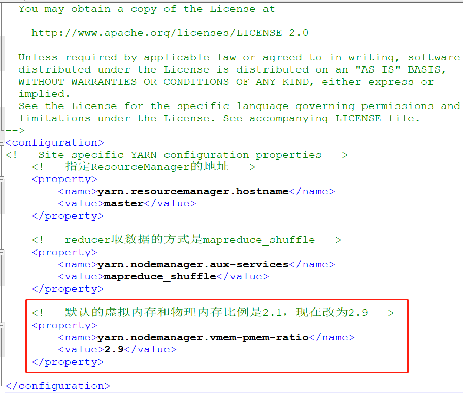

- 发送到相应的slave1、slave2、slave3节点

  ```shell
  [root@master hduser]# scp -r /usr/local/hadoop/hadoop-3.1.2/etc/hadoop/yarn-site.xml root@slave1:/usr/local/hadoop/hadoop-3.1.2/etc/hadoop/
  
  [root@master hduser]# scp -r /usr/local/hadoop/hadoop-3.1.2/etc/hadoop/yarn-site.xml root@slave2:/usr/local/hadoop/hadoop-3.1.2/etc/hadoop/
  
  [root@master hduser]# scp -r /usr/local/hadoop/hadoop-3.1.2/etc/hadoop/yarn-site.xml root@slave3:/usr/local/hadoop/hadoop-3.1.2/etc/hadoop/
  ```

- 重启集群

  

参考：

https://www.cnblogs.com/mstk/p/6860035.html

https://blog.csdn.net/abysscarry/article/details/80331311

https://stackoverflow.com/questions/43441437/container-is-running-beyond-virtual-memory-limits

https://blog.csdn.net/z3935212/article/details/78637157


### 6.