[TOC]


## 一. 配置 hosts、hostname

- 配置规划
  - 192.168.55.110 master
  - 192.168.55.111 slave1
  - 192.168.55.112 slave2
  - 192.168.55.113 slave3

1、四 台主机的 hosts 配置文件如下

```shell
[hduser@master ~]$ cat /etc/hosts
127.0.0.1   localhost localhost.localdomain localhost4 localhost4.localdomain4
::1         localhost localhost.localdomain localhost6 localhost6.localdomain6
192.168.55.110 master
192.168.55.111 slave1
192.168.55.112 slave2
192.168.55.113 slave3
```


2、master 的 hostname，同样在另外三台机器查询。

```shell
[hduser@master ~]$ cat /etc/hostname
master
```


## 二.配置SSH

### 2.1、安装 ssh（三个主机都要安装）

```shell
[root@master hduser]# sudo yum install openssh-server
```

### 2.2、 配置集群间 ssh 无密钥登陆

#### 第一种方式：

**1）** 首先在 master 上生成 ssh 公钥

```shell
[root@master hduser]# ssh-keygen -t rsa
```

- 然后连续按 3 个回车即可。再到生成 ssh 密钥的目录下查看是否成功

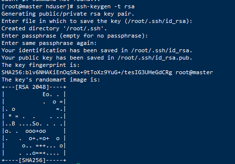

- 注意：若没有生成 `authorized_keys` 文件，需要自己手动创建


```shell
[root@master hduser]# touch ~/.ssh/authorized_keys
```

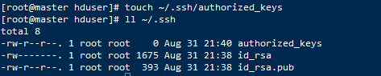

**2）**然后将 `id_rsa.pub` 中的内容复制到 `authorized_keys` 文件中。

```shell
[root@master hduser]# cd ~/.ssh

[root@master .ssh]# cat id_rsa.pub >> authorized_keys
```

**3）**最后将 authorized_keys 分发给另外三个节点slave1、slave2、slave3

```shell
[root@master .ssh]# scp authorized_keys slave1:~/.ssh/

[root@master .ssh]# scp authorized_keys slave2:~/.ssh/

[root@master .ssh]# scp authorized_keys slave3:~/.ssh/
```

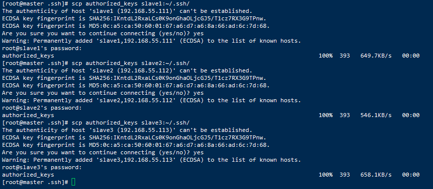


#### 第二种方式

**1）** 首先在 master 上生成 ssh 公钥

```shell
[root@master hduser]# ssh-keygen -t rsa
```

**2）**然后连续按 3 个回车即可。

**3）**复制

```
[root@master hduser]# ssh-copy-id -i ~/.ssh/id_rsa.pub master@root
[root@master hduser]# ssh-copy-id -i ~/.ssh/id_rsa.pub slave1@root
[root@master hduser]# ssh-copy-id -i ~/.ssh/id_rsa.pub slave2@root
[root@master hduser]# ssh-copy-id -i ~/.ssh/id_rsa.pub slave3@root
```


#### 第三种方式

**1）** 首先在 master 上生成 ssh 公钥

```shell
[root@master hduser]# ssh-keygen -t rsa
```

**2）**然后连续按 3 个回车即可。

**3）**复制

```shell
[root@master hduser]# ssh-copy-id master
[root@master hduser]# ssh-copy-id slave1
[root@master hduser]# ssh-copy-id slave2
[root@master hduser]# ssh-copy-id slave3
```


## 三.配置JDK


## 四.关闭防火墙

1、切换到root账号下，检查防火墙状态

```shell
[root@master hduser]# firewall-cmd --state
```

2、需要关闭防火墙

```shell
[root@master hduser]# systemctl stop firewalld.service
```

- 再次检查防火墙状态,已经是not running

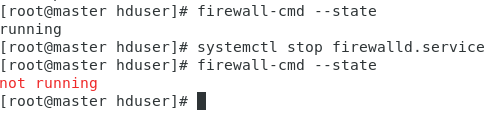

 3、设置主节点上禁止开机启动防火墙

```shell
[root@master hduser]# systemctl disable firewalld.service
```

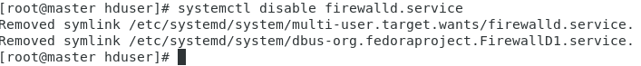


## 五.下载、解压 Hadoop

### 5.1、下载 Hadoop 3.1.2 版本

- 访问官网：http://hadoop.apache.org/

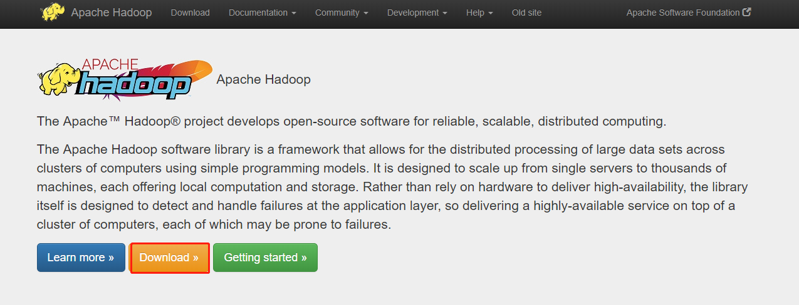

- 下载二进制文件

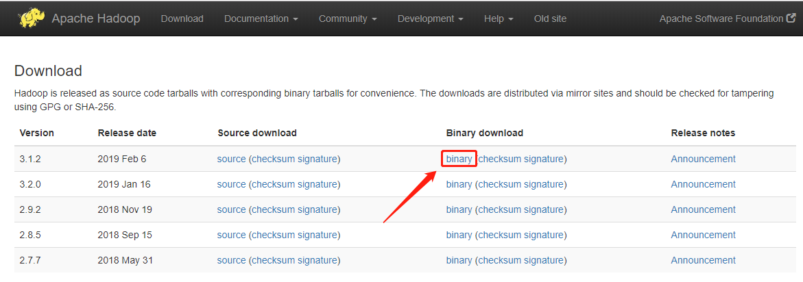

- 选择下载链接

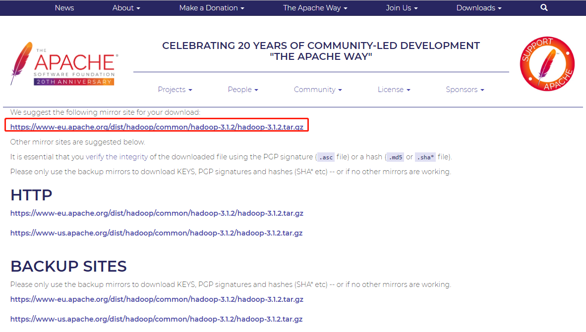

- 官方下载链接特别慢，可以使用清华镜像站下载。
  - 官方url：https://archive.apache.org/dist/hadoop/common/hadoop-3.1.2/hadoop-3.1.2.tar.gz
  - 清华镜像站：http://mirrors.tuna.tsinghua.edu.cn/apache/hadoop/common/hadoop-3.1.2/hadoop-3.1.2.tar.gz

### 5.2、创建 hadoop 目录

```shell
mkdir /usr/local/hadoop
```

### 5.3、解压 hadoop 压缩包到指定目录

```shell
tar -zxvf hadoop-3.1.2.tar.gz -C /usr/local/hadoop/
```

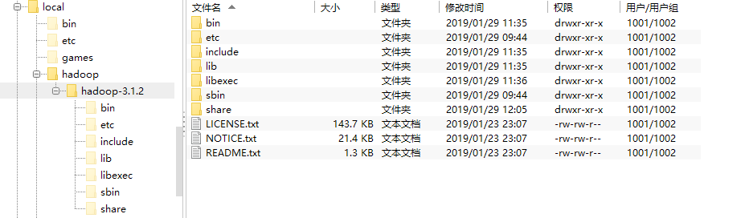


## 六.修改配置文件

- 配置文件的路径在 `/usr/local/hadoop/hadoop-3.1.2/etc/hadoop`

- 配置Hadoop的主要5个文件

  | 序号 |   配置文件名    |       配置对象       |                           主要内容                           |
  | :--: | :-------------: | :------------------: | :----------------------------------------------------------: |
  |  1   |  hadoop-env.sh  |    hadoop运行环境    |             用来定义hadoop运行环境相关的配置信息             |
  |  2   |  core-site.xml  |     集群全局参数     |   用于定义系统级别的参数，如HDFS URL 、Hadoop的临时目录等    |
  |  3   |  hdfs-site.xml  |         HDFS         | 如名称节点和数据节点的存放位置、文件副本的个数、文件的读取权限等 |
  |  4   | mapred-site.xml |    Mapreduce参数     | 包括JobHistory Server 和应用程序参数两部分，如reduce任务的默认个数、任务所能够使用内存的默认上下限等 |
  |  5   |  yarn-site.xml  | 集群资源管理系统参数 |  配置ResourceManager ，nodeManager的通信端口，web监控端口等  |


### 6.1、配置`hadoop-env.sh`

```shell
vim /usr/local/hadoop/hadoop-3.1.2/etc/hadoop/hadoop-env.sh
```

- 添加如下信息：

```shell
#添加这一行
export JAVA_HOME=/usr/local/java/jdk1.8.0_212
```

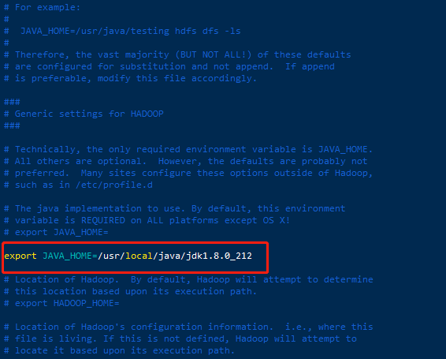

### 6.2、配置`core-site.xml`

```
vim /usr/local/hadoop/hadoop-3.1.2/etc/hadoop/core-site.xml 
```

- 添加如下信息

```properties
<configuration>
    <!-- 指定 namenode 的通信地址 默认 8020 端口 -->
    <property>
        <name>fs.defaultFS</name>
        <value>hdfs://master/</value>
    </property>

    <!-- 指定 hadoop 运行时产生文件的存储路径 -->
    <property>
        <name>hadoop.tmp.dir</name>
        <value>/usr/local/hadoop/hadoop-3.1.2/tmp</value>
    </property>
</configuration>
```

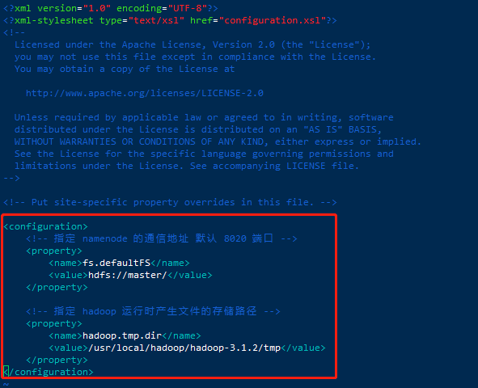

### 6.3、配置`hdfs-site.xml`

```shell
vim /usr/local/hadoop/hadoop-3.1.2/etc/hadoop/hdfs-site.xml 
```

- 添加如下信息

```properties
<configuration>

    <!-- namenode 上存储 hdfs 名字空间元数据-->
    <property>
        <name>dfs.namenode.name.dir</name>
        <value>/usr/local/hadoop/hadoop-3.1.2/namenode</value>
    </property>

    <!-- datanode 上数据块的物理存储位置-->
    <property>
        <name>dfs.datanode.data.dir</name>
        <value>/usr/local/hadoop/hadoop-3.1.2/datanode</value>
    </property>

    <!-- 设置 hdfs 副本数量 -->
    <property>
        <name>dfs.replication</name>
        <value>1</value>
    </property>

</configuration>
```


- 后续补充：还需要添加如下信息（解决Web访问不了50070）

  ```properties
  <?xml version="1.0" encoding="UTF-8"?>
  <?xml-stylesheet type="text/xsl" href="configuration.xsl"?>
  <!--
    Licensed under the Apache License, Version 2.0 (the "License");
    you may not use this file except in compliance with the License.
    You may obtain a copy of the License at
  
      http://www.apache.org/licenses/LICENSE-2.0
  
    Unless required by applicable law or agreed to in writing, software
    distributed under the License is distributed on an "AS IS" BASIS,
    WITHOUT WARRANTIES OR CONDITIONS OF ANY KIND, either express or implied.
    See the License for the specific language governing permissions and
    limitations under the License. See accompanying LICENSE file.
  -->
  
  <!-- Put site-specific property overrides in this file. -->
  
  <configuration>
      
      <!-- namenode 上存储 hdfs 名字空间元数据-->
      <property>
          <name>dfs.namenode.name.dir</name>
          <value>/usr/local/hadoop/hadoop-3.1.2/namenode</value>
      </property>
  
      <!-- datanode 上数据块的物理存储位置-->  
      <property>
          <name>dfs.datanode.data.dir</name>
          <value>/usr/local/hadoop/hadoop-3.1.2/datanode</value>
      </property>
  
      <!-- 设置 hdfs blocks副本备份数量 -->
      <property>
          <name>dfs.replication</name>
          <value>1</value>
      </property>
  	
  	<!-- 设置访问端口号 -->
  	<property>
         <name>dfs.http.address</name>
         <value>0.0.0.0:50070</value>
      </property>
  	
  
  </configuration>
  ```

  

### 6.4、配置`mapred-site.xml

```shell
vim /usr/local/hadoop/hadoop-3.1.2/etc/hadoop/mapred-site.xml
```

- 添加如下信息

```shell
<configuration>

    <!-- 指定yarn运行-->
    <property>
        <name>mapreduce.framework.name</name>
        <value>yarn</value>
    </property>

    <property>
        <name>yarn.app.mapreduce.am.env</name>
        <value>HADOOP_MAPRED_HOME=/usr/local/hadoop/hadoop-3.1.2</value>
    </property>

    <property>
        <name>mapreduce.map.env</name>
        <value>HADOOP_MAPRED_HOME=/usr/local/hadoop/hadoop-3.1.2</value>
    </property>

    <property>
        <name>mapreduce.reduce.env</name>
        <value>HADOOP_MAPRED_HOME=/usr/local/hadoop/hadoop-3.1.2</value>
    </property>

</configuration>
```

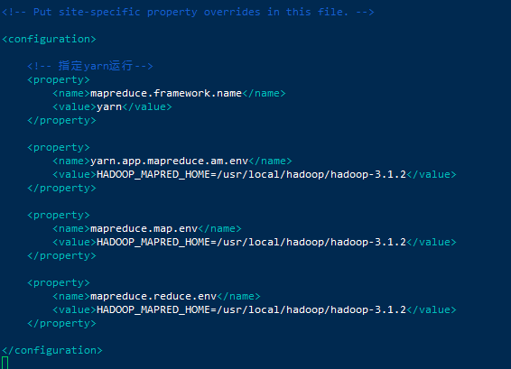

### 6.5、配置`yarn-site.xml

```shell
vim /usr/local/hadoop/hadoop-3.1.2/etc/hadoop/yarn-site.xml
```

- 添加如下信息

```shell
<configuration>
<!-- Site specific YARN configuration properties -->
    <!-- 指定ResourceManager的地址 -->
    <property>
        <name>yarn.resourcemanager.hostname</name>
        <value>master</value>
    </property>

    <!-- reducer取数据的方式是mapreduce_shuffle -->
    <property>
        <name>yarn.nodemanager.aux-services</name>
        <value>mapreduce_shuffle</value>
    </property>

</configuration>
```

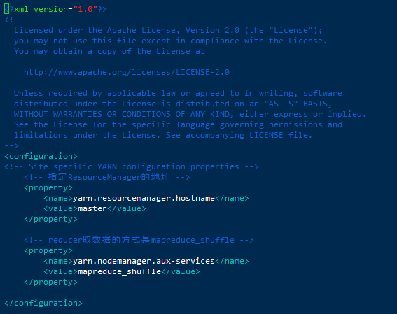

- 后续补充：还需要添加如下信息（解决问题：2.5 GB of 2.1 GB virtual memory used. Killing container）

- ```properties
  <?xml version="1.0"?>
  <!--
    Licensed under the Apache License, Version 2.0 (the "License");
    you may not use this file except in compliance with the License.
    You may obtain a copy of the License at
  
      http://www.apache.org/licenses/LICENSE-2.0
  
    Unless required by applicable law or agreed to in writing, software
    distributed under the License is distributed on an "AS IS" BASIS,
    WITHOUT WARRANTIES OR CONDITIONS OF ANY KIND, either express or implied.
    See the License for the specific language governing permissions and
    limitations under the License. See accompanying LICENSE file.
  -->
  <configuration>
  <!-- Site specific YARN configuration properties -->
      <!-- 指定ResourceManager的地址 -->
  	<property>
  		<name>yarn.resourcemanager.hostname</name>
  		<value>master</value>
  	</property>
  
      <!-- reducer取数据的方式是mapreduce_shuffle -->  
  	<property>
  		<name>yarn.nodemanager.aux-services</name>
  		<value>mapreduce_shuffle</value>
  	</property>
  	
  	<!-- 默认的虚拟内存和物理内存比例是2.1，现在改为2.9 --> 
  	<property>
  		<name>yarn.nodemanager.vmem-pmem-ratio</name>
  		<value>2.9</value>
  	</property>
  
  </configuration>
  ```

  

### 6.6、配置workers

```shell
vim /usr/local/hadoop/hadoop-3.1.2/etc/hadoop/workers 
```

- 添加如下信息

```shell
#添加如下信息
slave1
slave2
slave3
```


### 6.7、配置`start-dfs.sh` 和 `stop-dfs.sh`

- 这两个文件在 `/usr/local/hadoop/hadoop-3.1.2/sbin/` 中，分别在 `start-dfs.sh`和 `stop-dfs.sh`中

```shell
vim /usr/local/hadoop/hadoop-3.1.2/sbin/start-dfs.sh

vim /usr/local/hadoop/hadoop-3.1.2/sbin/stop-dfs.sh
```

- 文件开始添加如下信息

```shell
HDFS_DATANODE_USER=root
HDFS_DATANODE_SECURE_USER=hdfs
HDFS_NAMENODE_USER=root
HDFS_SECONDARYNAMENODE_USER=root
```


### 6.8、配置`start-yarn.sh` 和 `stop-yarn.sh`

- 这两个文件在 `/usr/local/hadoop/hadoop-3.1.2/sbin/` 中，分别在 `start-yarn.sh`和 `stop-yarn.sh`中

```shell
vim /usr/local/hadoop/hadoop-3.1.2/sbin/start-yarn.sh 

vim /usr/local/hadoop/hadoop-3.1.2/sbin/stop-yarn.sh 
```

- 文件开始添加如下信息

```shell
YARN_RESOURCEMANAGER_USER=root
HADOOP_SECURE_DN_USER=yarn
YARN_NODEMANAGER_USER=root
```


### 6.9、配置 hadoop 环境变量

- 在 `/etc/profile` 中添加如下内容

```shell
vim /etc/profile
```

- 添加如下信息

- ```shell
  export HADOOP_HOME=/usr/local/hadoop/hadoop-3.1.2
  export PATH=$PATH:$JAVA_HOME/bin:$HADOOP_HOME/bin:$HADOOP_HOME/sbin
  ```

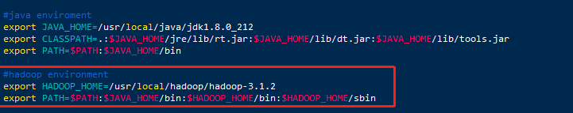

- 添加成功后，使配置生效。

```shell
source /etc/profile
```

## 七.复制master配置到slave1、slave2、salve3节点

- 步骤6中的操作要在每一个节点上都同步，但是一个一个的去编辑太麻烦了，可以用 scp 命令，在 master 节点编辑好之后，直接发送给 slave 节点。

- scp覆盖原有文件，slave1、slave2、slave3节点中`/usr/local/hadoop/hadoop-3.1.2/etc/hadoop/`

- ```shell
  #这个命令不行
  scp -r /usr/local/hadoop/hadoop-3.1.2/etc/hadoop/ root@slave1:/usr/local/hadoop/hadoop-3.1.2/etc/hadoop/
  #使用这个进行覆盖文件夹
  scp -r /usr/local/hadoop/hadoop-3.1.2/etc/hadoop/ root@slave1:/usr/local/hadoop/hadoop-3.1.2/etc/
  ```

  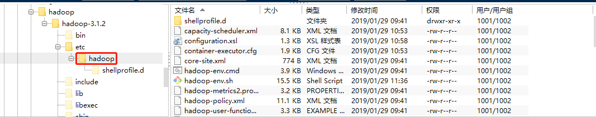

### 7.1、覆盖slave1、slave2、slave3节点中`/usr/local/hadoop/hadoop-3.1.2/etc/hadoop/`

- 在Master节点执行下面内容

```shell
scp -r /usr/local/hadoop/hadoop-3.1.2/etc/hadoop/ root@slave1:/usr/local/hadoop/hadoop-3.1.2/etc/


scp -r /usr/local/hadoop/hadoop-3.1.2/etc/hadoop/ root@slave2:/usr/local/hadoop/hadoop-3.1.2/etc/

scp -r /usr/local/hadoop/hadoop-3.1.2/etc/hadoop/ root@slave3:/usr/local/hadoop/hadoop-3.1.2/etc/
```

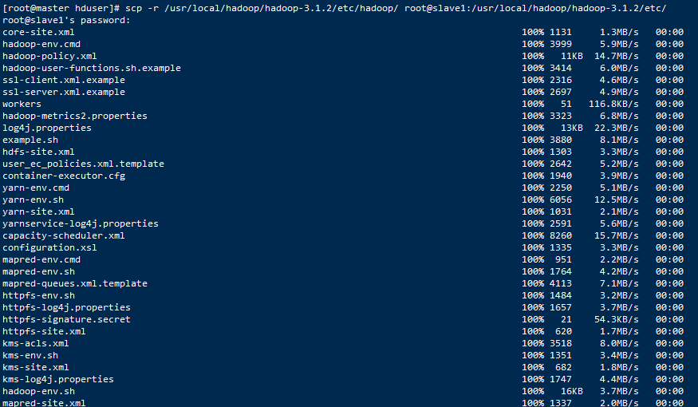

### 7.2、覆盖slave1、slave2、slave3节点中`/usr/local/hadoop/hadoop-3.1.2/sbin/

- 在Master节点执行下面内容

```shell
scp -r /usr/local/hadoop/hadoop-3.1.2/sbin/ root@slave1:/usr/local/hadoop/hadoop-3.1.2/

scp -r /usr/local/hadoop/hadoop-3.1.2/sbin/ root@slave2:/usr/local/hadoop/hadoop-3.1.2/

scp -r /usr/local/hadoop/hadoop-3.1.2/sbin/ root@slave3:/usr/local/hadoop/hadoop-3.1.2/
```


### 7.3配置slave1、slave2、slave3中 hadoop 环境变量

- 在 `/etc/profile` 中添加如下内容

```
vim /etc/profile
```

- 添加如下信息

```shell
#hadoop environment
export HADOOP_HOME=/usr/local/hadoop/hadoop-3.1.2
export PATH=$PATH:$JAVA_HOME/bin:$HADOOP_HOME/bin:$HADOOP_HOME/sbin
```

- 添加成功后

```shell
source /etc/profile
```


## 八.启动 hadoop（在主节点上操作）

### 8.1 启动 hadoop 之前在 master 上 format 名称节点

```shell
[root@master hduser]# cd /usr/local/hadoop/hadoop-3.1.2/bin

# 格式化HDFS [只有首次部署才可使用]【谨慎操作，只在master上操作】
[root@master bin]# hdfs namenode -format
```


- 出现以下信息则说明 namenode 格式化成功。

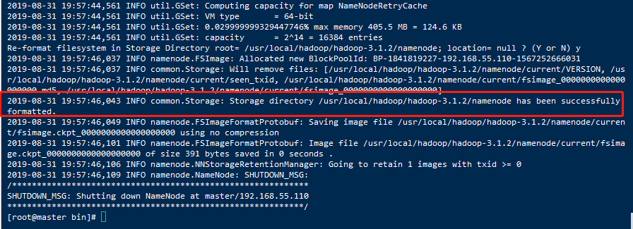

### 8.2 在 master 节点上启动 hadoop 服务

```shell
start-all.sh
```

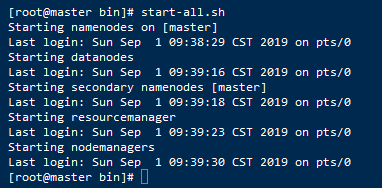

### 8.3 查看 hadoop 服务是否启动成功

- 查看 `master` 节点

```shell
[root@master hduser]# jps
112400 NameNode
113216 ResourceManager
114153 Jps
112844 SecondaryNameNode
```

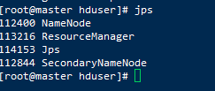

- 查看 `slave1` 节点

```shell
[root@slave1 hduser]# jps
41676 Jps
31917 DataNode
35534 NodeManager
```


- 查看 `slave2` 节点

```shell
[root@slave2 hduser]# jps
86161 NodeManager
90587 Jps
82474 DataNode
```

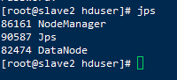

- 查看 `slave3 `节点

```shell
[root@slave3 hduser]# jps
64837 Jps
58780 NodeManager
55229 DataNode
```

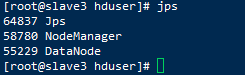

当 4台节点分别出现这些 java 进程，则 hadoop 启动成功.

## 九、运行wordcount示例

- Wordcount 是 MapReduce 的示例程序，可以统计某个文件中，各个单词出现的次数


### 9.1 在 hdfs 文件系统中创建存放被测试文件的目录 `input`

```shell
[root@master hduser]# hadoop fs -mkdir /input
```


### 9.2 查看 `input` 目录是否创建成功

```shell
[root@master hduser]# hadoop fs -ls -R /
```

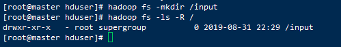

### 9.3 创建测试文件 `test.txt` 并上传到 hdfs 中

- 首先介绍一些 hdfs 常用的命令语句

```shell
#列出 hdfs 下的文件
hadoop dfs -ls

#列出 hdfs / 路径下的所有文件，文件夹  
hadoop dfs -ls -R /

#创建目录 /input
hadoop dfs -mkdir /input

#列出 hsfs 名为 input 的文件夹中的文件
hadoop dfs -ls /input

#将 test.txt 上传到 hdfs 中
hadoop fs -put /home/hduser/Desktop/test.txt /input

#将 hsdf 中的 test.txt 文件保存到本地桌面文件夹
hadoop dfs -get /input/test.txt /home/hduser/Desktop

#删除 hdfs 上的 test.txt 文件
hadoop dfs -rmr /input/test.txt

#查看 hdfs 下 input 文件夹中的内容
hadoop fs -cat /input/*

#进入安全模式
hadoop dfsadmin –safemode enter

#退出安全模式
hadoop dfsadmin -safemode leave

#报告 hdfs 的基本统计情况
hadoop dfsadmin -report
```

**1）在 Desktop 下创建 `test.txt**`

```shell
[root@master hduser]# vim /home/hduser/Desktop/test.txt
```

**2）输入内容**

```shell
hello world
hello hadoop
```


**3）将 `test.txt` 上传到 hdfs 中**

```shell
[root@master hduser]# hadoop fs -put /home/hduser/Desktop/test.txt /input
```

### 9.4 运行 wordcount 程序

```shell
[root@master hduser]# hadoop jar /usr/local/hadoop/hadoop-3.1.2/share/hadoop/mapreduce/hadoop-mapreduce-examples-3.1.2.jar wordcount /input /output
```

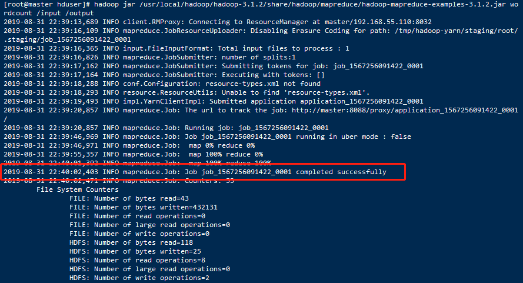

- 日志信息出现

```
INFO mapreduce.Job: Job job_1567256091422_0001 completed successfully
```

- 则运行成功

- 然后查看 hdfs 中新生成的文件

```shell
[root@master hduser]# hadoop fs -ls -R /
```

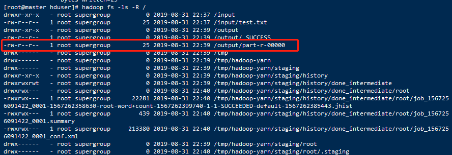

- `/output/part-r-00000` 里就是本次运行的结果

```shell
[root@master hduser]# hadoop fs -cat /output/part-r-00000
```

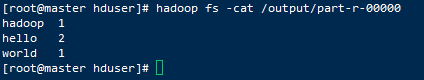

### 9.5 Web界面访问

#### 一、访问50070端口

- 访问：http://localhost:50070/dfshealth.html#tab-overview
- 在虚拟机CentOS中访问

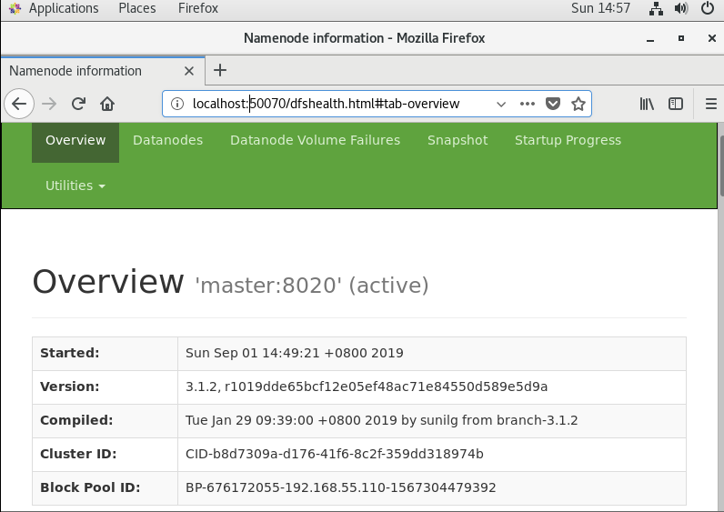

- 或者访问：http://master:50070/dfshealth.html#tab-overview

- 虚拟机CentOS和主机Windows都可以

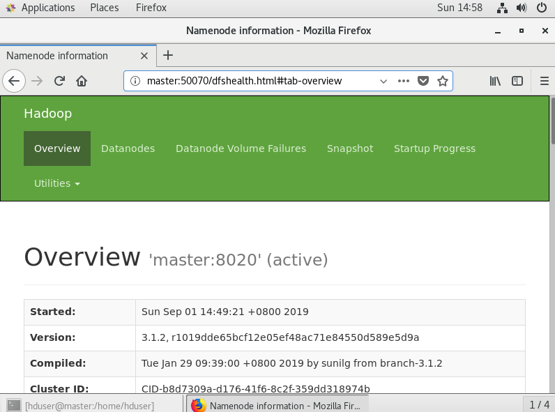

- 或者访问：http://192.168.55.110:50070/dfshealth.html#tab-overview

- 虚拟机CentOS和主机Windows都可以


- 查看DataNode

  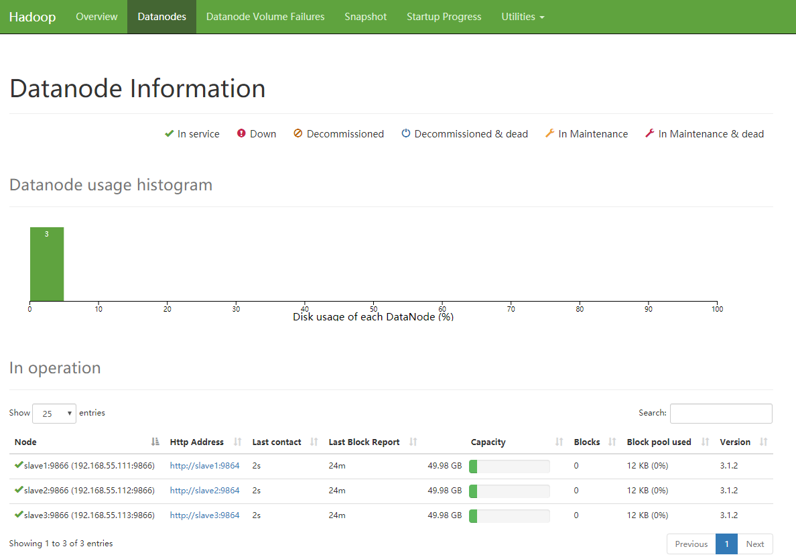

#### 二、访问8088端口

- 同样有50070的几种访问方式

- 访问：http://master:8088/cluster

  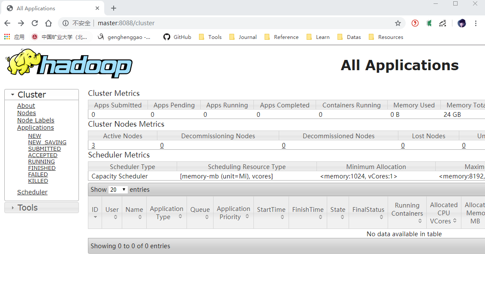

- 点击Nodes查看

  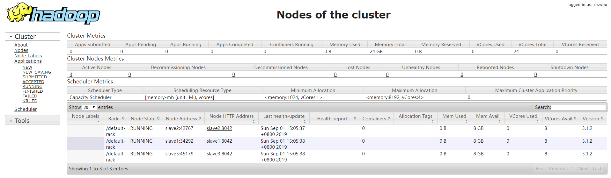


参考：

https://blog.csdn.net/nenguou04/article/details/88770031

https://blog.csdn.net/lidew521/article/details/87901849

https://blog.csdn.net/ViMan1204/article/details/88725387