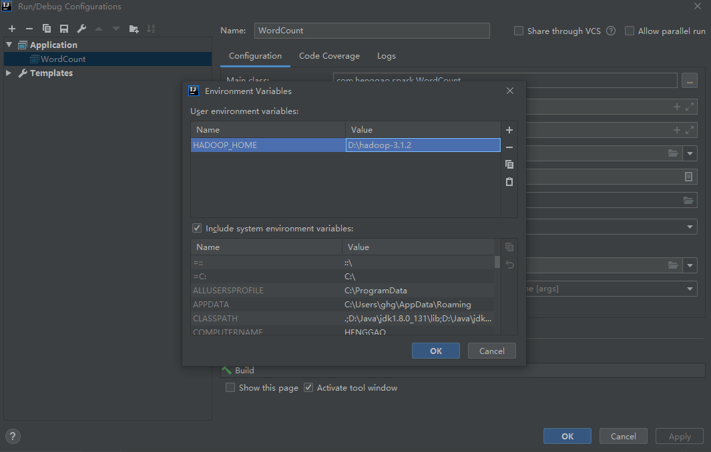

# Windows下IDEA中配置Hadoop运行（UnSuccess）

配置运行参数

在Intellij菜单栏中选择Run->Edit Configurations，在弹出来的对话框中点击+，新建一个Application配置。配置Main class为WordCount（可以点击右边的...选择），

Program arguments为input/ output/，即输入路径为刚才创建的input文件夹，输出为output

在IDEA中配置Run Configuration，添加HADOOP_HOME变量

