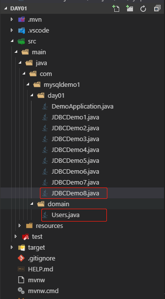
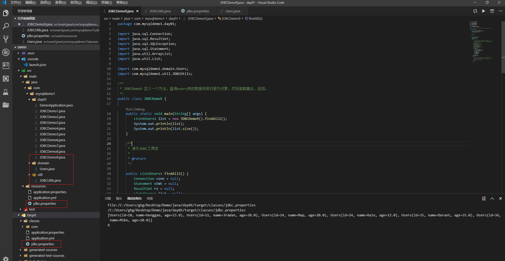

# JDBC增删改

###### 1、JDBC添加一条记录

```java
package com.mysqldemo1.day01;

import java.sql.Connection;
import java.sql.DriverManager;
import java.sql.SQLException;
import java.sql.Statement;

/**
 * JDBCDemo2 JDBC添加记录
 */
public class JDBCDemo2 {

    public static void main(String[] args) {

        Statement stmt = null;
        Connection conn = null;
        try {
            // 1、注册驱动
            // Class.forName("com.mysql.jdbc.Driver");
            Class.forName("com.mysql.cj.jdbc.Driver");
            // 2、定义sql
            String sql = "insert into users values(null ,'Aj',20)";
            // 3、获取Connection对象
            conn = DriverManager.getConnection("jdbc:mysql://169.254.28.208:3306/db1", "henggao", "abc123");
            // 4、获取执行sql的对象
            stmt = conn.createStatement();
            // 5、执行sql语句
            int count = stmt.executeUpdate(sql);// 影响的行数
            // 6、处理结果
            System.out.println(count);
            if (count > 0) {
                System.out.println("添加成功！");
            } else {
                System.out.println("添加失败！");
            }
        } catch (ClassNotFoundException e) {
            e.printStackTrace();
        } catch (SQLException e) {
            e.printStackTrace();
        } finally {
            // stmt.close();
            // 7、释放资源
            // 避免空指针异常
            if (stmt != null) {
                try {
                    stmt.close();
                } catch (SQLException e) {
                    e.printStackTrace();
                }
            }

            if (conn != null) {
                try {
                    conn.close();
                } catch (SQLException e) {
                    e.printStackTrace();
                }
            }
        }
    }

}
```

###### 2、JDBC修改一条记录

```java
package com.mysqldemo1.day01;

import java.sql.Connection;
import java.sql.DriverManager;
import java.sql.SQLException;
import java.sql.Statement;

/**
 * JDBCDemo3  修改一条记录
 */
public class JDBCDemo3 {
    public static void main(String[] args) {

        Statement stmt = null;
        Connection conn = null;
        try {
            // 1、注册驱动
            // Class.forName("com.mysql.jdbc.Driver");
            Class.forName("com.mysql.cj.jdbc.Driver");
            // 2、定义sql
            String sql = "update  users set age = 22 where id = 37";
            // 3、获取Connection对象
            conn = DriverManager.getConnection("jdbc:mysql://169.254.28.208:3306/db1", "henggao", "abc123");
            // 4、获取执行sql的对象
            stmt = conn.createStatement();
            // 5、执行sql语句
            int count = stmt.executeUpdate(sql);// 影响的行数
            // 6、处理结果
            System.out.println(count);
            if (count > 0) {
                System.out.println("修改成功！");
            } else {
                System.out.println("修改失败！");
            }
        } catch (ClassNotFoundException e) {
            e.printStackTrace();
        } catch (SQLException e) {
            e.printStackTrace();
        } finally {
            // stmt.close();
            // 7、释放资源
            // 避免空指针异常
            if (stmt != null) {
                try {
                    stmt.close();
                } catch (SQLException e) {
                    e.printStackTrace();
                }
            }

            if (conn != null) {
                try {
                    conn.close();
                } catch (SQLException e) {
                    e.printStackTrace();
                }
            }
        }
    }

}
```

###### 3、JDBC删除一条记录

```java
package com.mysqldemo1.day01;

import java.sql.Connection;
import java.sql.DriverManager;
import java.sql.SQLException;
import java.sql.Statement;

/**
 * JDBCDemo4 JDBC删除一条记录
 */
public class JDBCDemo4 {
    public static void main(String[] args) {

        Statement stmt = null;
        Connection conn = null;
        try {
            // 1、注册驱动
            // Class.forName("com.mysql.jdbc.Driver");
            Class.forName("com.mysql.cj.jdbc.Driver");
            // 2、定义sql
            String sql = "delete from users where id = 37";
            // 3、获取Connection对象
            conn = DriverManager.getConnection("jdbc:mysql://169.254.28.208:3306/db1", "henggao", "abc123");
            // 4、获取执行sql的对象
            stmt = conn.createStatement();
            // 5、执行sql语句
            int count = stmt.executeUpdate(sql);// 影响的行数
            // 6、处理结果
            System.out.println(count);
            if (count > 0) {
                System.out.println("删除成功！");
            } else {
                System.out.println("删除失败！");
            }
        } catch (ClassNotFoundException e) {
            e.printStackTrace();
        } catch (SQLException e) {
            e.printStackTrace();
        } finally {
            // stmt.close();
            // 7、释放资源
            // 避免空指针异常
            if (stmt != null) {
                try {
                    stmt.close();
                } catch (SQLException e) {
                    e.printStackTrace();
                }
            }

            if (conn != null) {
                try {
                    conn.close();
                } catch (SQLException e) {
                    e.printStackTrace();
                }
            }
        }
    }

}
```

###### 4、JDBC创建表

```java
package com.mysqldemo1.day01;

import java.sql.Connection;
import java.sql.DriverManager;
import java.sql.SQLException;
import java.sql.Statement;

/**
 * JDBCDemo5 JDBC创建表
 */
public class JDBCDemo5 {
    public static void main(String[] args) {

        Statement stmt = null;
        Connection conn = null;
        try {
            // 1、注册驱动
            // Class.forName("com.mysql.jdbc.Driver");
            Class.forName("com.mysql.cj.jdbc.Driver");
            // 2、定义sql
            String sql = "create table student(id int, name varchar(20))";
            // 3、获取Connection对象
            conn = DriverManager.getConnection("jdbc:mysql://169.254.28.208:3306/db1", "henggao", "abc123");
            // 4、获取执行sql的对象
            stmt = conn.createStatement();
            // 5、执行sql语句
            int count = stmt.executeUpdate(sql);// 影响的行数
            // 6、处理结果
            System.out.println(count);

        } catch (ClassNotFoundException e) {
            e.printStackTrace();
        } catch (SQLException e) {
            e.printStackTrace();
        } finally {
            // stmt.close();
            // 7、释放资源
            // 避免空指针异常
            if (stmt != null) {
                try {
                    stmt.close();
                } catch (SQLException e) {
                    e.printStackTrace();
                }
            }

            if (conn != null) {
                try {
                    conn.close();
                } catch (SQLException e) {
                    e.printStackTrace();
                }
            }
        }
    }

}
```

###### 5、JDBC查询

```java
package com.mysqldemo1.day01;

import java.sql.Connection;
import java.sql.DriverManager;
import java.sql.ResultSet;
import java.sql.SQLException;
import java.sql.Statement;

/**
 * JDBCDemo6 JDBC查询
 */
public class JDBCDemo6 {
    public static void main(String[] args) {

        Statement stmt = null;
        Connection conn = null;
        ResultSet rs = null;
        try {
            // 1、注册驱动
            // Class.forName("com.mysql.jdbc.Driver");
            Class.forName("com.mysql.cj.jdbc.Driver");
            // 2、定义sql
            String sql = "select * from users";
            // 3、获取Connection对象
            conn = DriverManager.getConnection("jdbc:mysql://169.254.28.208:3306/db1", "henggao", "abc123");
            // 4、获取执行sql的对象
            stmt = conn.createStatement();
            // 5、执行sql语句
            rs = stmt.executeQuery(sql);
            // 6、处理结果
            // 6.1让游标向下移动一行
            rs.next();
            // 6.2获取数据
            int id = rs.getInt(1);
            String name = rs.getString("name");
            double age = rs.getDouble(3);

            System.out.println(id + "---" + name + "---" + age);

        } catch (ClassNotFoundException e) {
            e.printStackTrace();
        } catch (SQLException e) {
            e.printStackTrace();
        } finally {
            // stmt.close();
            // 7、释放资源
            // 避免空指针异常
            if (stmt != null) {
                try {
                    stmt.close();
                } catch (SQLException e) {
                    e.printStackTrace();
                }
            }

            if (conn != null) {
                try {
                    conn.close();
                } catch (SQLException e) {
                    e.printStackTrace();
                }
            }
        }
    }

}
```

###### 6、JDBC查询完善

```java
package com.mysqldemo1.day01;

import java.sql.Connection;
import java.sql.DriverManager;
import java.sql.ResultSet;
import java.sql.SQLException;
import java.sql.Statement;

/**
 * JDBCDemo7 JDBC查询
 */
public class JDBCDemo7 {
    public static void main(String[] args) {

        Statement stmt = null;
        Connection conn = null;
        ResultSet rs = null;
        try {
            // 1、注册驱动
            // Class.forName("com.mysql.jdbc.Driver");
            Class.forName("com.mysql.cj.jdbc.Driver");
            // 2、定义sql
            String sql = "select * from users";
            // 3、获取Connection对象
            conn = DriverManager.getConnection("jdbc:mysql://169.254.28.208:3306/db1", "henggao", "abc123");
            // 4、获取执行sql的对象
            stmt = conn.createStatement();
            // 5、执行sql语句
            rs = stmt.executeQuery(sql);
            // 6、处理结果
            // 循环判断游标是否是最后一行末尾。
            while (rs.next()) {
                // 获取数据
                // 6.2获取数据
                int id = rs.getInt(1);
                String name = rs.getString("name");
                double age = rs.getDouble(3);
                System.out.println(id + "---" + name + "---" + age);
            }

            // if (rs.next()) {
            // // 判断是否有数据
            // // 6.2获取数据
            // int id = rs.getInt(1);
            // String name = rs.getString("name");
            // double age = rs.getDouble(3);
            // System.out.println(id + "---" + name + "---" + age);
            // }

            // // 6.1让游标向下移动一行
            // rs.next();
            // // 6.2获取数据
            // int id = rs.getInt(1);
            // String name = rs.getString("name");
            // double age = rs.getDouble(3);

            // System.out.println(id + "---" + name + "---" + age);

        } catch (ClassNotFoundException e) {
            e.printStackTrace();
        } catch (SQLException e) {
            e.printStackTrace();
        } finally {
            // stmt.close();
            // 7、释放资源
            // 避免空指针异常
            if (stmt != null) {
                try {
                    stmt.close();
                } catch (SQLException e) {
                    e.printStackTrace();
                }
            }

            if (conn != null) {
                try {
                    conn.close();
                } catch (SQLException e) {
                    e.printStackTrace();
                }
            }
        }
    }

}
```

###### 7、练习

- 定义一个方法，查询users表的数据将其封装为对象，然后装载集合，返回。

  - 定义一个users类

  - 定义方法

  ```java
  pubic List<Users> findAll(){}
  ```

  - 实现方法

  ```sql
  select * from users;
  ```

1. 新建domain文件，写Users.java类

   ```java
   package com.mysqldemo1.domain;
   
   import lombok.Data;
   
   /**
    * Users
    */
   @Data
   public class Users {
   
       private int id;
       private String name;
       private double age;
   }
   ```

2. 写JDBCDemo8.java类，运行。

   ```java
   package com.mysqldemo1.day01;
   
   import java.sql.Connection;
   import java.sql.DriverManager;
   import java.sql.ResultSet;
   import java.sql.SQLException;
   import java.sql.Statement;
   import java.util.ArrayList;
   import java.util.List;
   
   import com.mysqldemo1.domain.Users;
   
   /**
    * JDBCDemo8 定义一个方法，查询users表的数据将其封装为对象，然后装载集合，返回。
    */
   public class JDBCDemo8 {
   
       public static void main(String[] args) {
           List<Users> list = new JDBCDemo8().findAll();
           System.out.println(list);
           System.out.println(list.size());
       }
   
       /**
        * 查询所有users对象
        * 
        * @return
        */
       public List<Users> findAll() {
           Connection conn = null;
           Statement stmt = null;
           ResultSet rs = null;
           List<Users> list = null;
           try {
               // 1、注册驱动
               // Class.forName("com.mysql.jdbc.Driver");
               Class.forName("com.mysql.cj.jdbc.Driver");
               // 2、获取Connection对象
               conn = DriverManager.getConnection("jdbc:mysql://169.254.28.208:3306/db1", "henggao", "abc123");
               // 3、定义sql
               String sql = "select * from users";
               // 4、获取执行SQL对象
               stmt = conn.createStatement();
               // 5、执行sql
               rs = stmt.executeQuery(sql);
               // 6、遍历结果集，封装对象，装载集合
               Users users = null;
               list = new ArrayList<Users>();
               while (rs.next()) {
                   // 获取数据
                   int id = rs.getInt("id");
                   String name = rs.getString("name");
                   double age = rs.getDouble("age");
                   // 创建users对象，并赋值
                   users = new Users();
                   users.setId(id);
                   users.setName(name);
                   users.setAge(age);
                   // 装载集合
                   list.add(users);
               }
           } catch (ClassNotFoundException e) {
               e.printStackTrace();
           } catch (SQLException e) {
               e.printStackTrace();
           } finally {
               if (rs != null) {
                   try {
                       rs.close();
                   } catch (SQLException e) {
                       e.printStackTrace();
                   }
               }
               if (stmt != null) {
                   try {
                       rs.close();
                   } catch (SQLException e) {
                       e.printStackTrace();
                   }
               }
               if (conn != null) {
                   try {
                       rs.close();
                   } catch (SQLException e) {
                       e.printStackTrace();
                   }
               }
           }
   
           return list;
       }
   }
   ```

3. 目录结构

   

###### 8、抽取JDBC工具类：JDBCUtils

1. 目的

   - 简化书写

2. 分析

   - 注册驱动也抽取
   - 抽取一个方法获取连接对象
   - 抽取一个方法

3. 在resources文件下编写配置文件jdbc.properties.

   - 注意点：这里的存路径会导致运行报错。我这里使用的是VSCode建立的java。

     ```properties
     url=jdbc:mysql://169.254.28.208:3306/db1
     user=henggao
     password=abc123
     driver=com.mysql.cj.jdbc.Driver
     ```

4. 在domain文件夹下编写Users.java

   ```java
   package com.mysqldemo1.domain;
   
   import lombok.Data;
   
   /**
    * Users
    */
   @Data
   public class Users {
   
       private int id;
       private String name;
       private double age;
   }
   ```

5. 编写JDBCUtils.java

   ```java
   package com.mysqldemo1.util;
   
   import java.io.FileReader;
   import java.io.IOException;
   import java.net.URL;
   import java.sql.Connection;
   import java.sql.DriverManager;
   import java.sql.ResultSet;
   import java.sql.SQLException;
   import java.sql.Statement;
   import java.util.Properties;
   
   /**
    * JDBCUtils
    */
   public class JDBCUtils {
   
       private static String url;
       private static String user;
       private static String password;
       private static String driver;
   
       /**
        * 
        * 文件的读取，只需要读取一次即可拿到这些值。使用静态代码块
        */
   
       static {
           // 读取资源文件，获取值。
   
           try {
               // 1、创建Properties集合集
               Properties pro = new Properties();
   
               // 获取src路径下的文件的方式--->ClassLoader 类加载器
               ClassLoader classLoader = JDBCUtils.class.getClassLoader();
               URL res = classLoader.getResource("jdbc.properties");
               System.out.println(res);
               String path = res.getPath();
               System.out.println(path); // C:/Users/ghg/Desktop/Demo/java/day01/target/classes/jdbc.properties
               // 2、加载文件
               // pro.load(new
               // FileReader("C:\\Users\\ghg\\Desktop\\Demo\\java\\day01\\src\\main\\resources\\jdbc.properties"));
               // //绝对路径
               pro.load(new FileReader(path));
   
               // 3、获取参数，赋值
               url = pro.getProperty("url");
               user = pro.getProperty("user");
               password = pro.getProperty("password");
               driver = pro.getProperty("driver");
               // 4、注册驱动
               Class.forName(driver);
           } catch (IOException e) {
               e.printStackTrace();
           } catch (ClassNotFoundException e) {
               e.printStackTrace();
           }
   
       }
   
       /**
        * 获取连接
        * 
        * @return 连接对象
        * @throws SQLException
        */
       public static Connection getConnection() throws SQLException {
           return DriverManager.getConnection(url, user, password);
       }
   
       /**
        * 释放资源
        * 
        * @param stmt
        * @param conn
        */
       public static void close(Statement stmt, Connection conn) {
           if (stmt != null) {
               try {
                   stmt.close();
               } catch (SQLException e) {
                   e.printStackTrace();
               }
           }
           if (conn != null) {
               try {
                   conn.close();
               } catch (SQLException e) {
                   e.printStackTrace();
               }
           }
       }
   
       /**
        * 释放资源
        * 
        * @param stmt
        * @param conn
        */
       public static void close(ResultSet rs, Statement stmt, Connection conn) {
           if (rs != null) {
               try {
                   rs.close();
               } catch (SQLException e) {
                   e.printStackTrace();
               }
           }
           if (stmt != null) {
               try {
                   stmt.close();
               } catch (SQLException e) {
                   e.printStackTrace();
               }
           }
           if (conn != null) {
               try {
                   conn.close();
               } catch (SQLException e) {
                   e.printStackTrace();
               }
           }
       }
   }
   ```

6. 在JDBCDemo9.java中测试JDBCUntils工具类

   ```java
   package com.mysqldemo1.day01;
   
   import java.sql.Connection;
   import java.sql.ResultSet;
   import java.sql.SQLException;
   import java.sql.Statement;
   import java.util.ArrayList;
   import java.util.List;
   
   import com.mysqldemo1.domain.Users;
   import com.mysqldemo1.util.JDBCUtils;
   
   /**
    * JDBCDemo9 定义一个方法，查询users表的数据将其封装为对象，然后装载集合，返回。
    */
   public class JDBCDemo9 {
   
       public static void main(String[] args) {
           List<Users> list = new JDBCDemo9().findAll2();
           System.out.println(list);
           System.out.println(list.size());
       }
   
       /**
        * 演示JDBC工具类
        * 
        * @return
        */
   
       public List<Users> findAll2() {
           Connection conn = null;
           Statement stmt = null;
           ResultSet rs = null;
           List<Users> list = null;
           try {
               /*
                * // 1、注册驱动 // Class.forName("com.mysql.jdbc.Driver");
                * Class.forName("com.mysql.cj.jdbc.Driver"); // 2、获取Connection对象 conn =
                * DriverManager.getConnection("jdbc:mysql://169.254.28.208:3306/db1",
                * "henggao", "abc123");
                */
               conn = JDBCUtils.getConnection();
               // 3、定义sql
               String sql = "select * from users";
               // 4、获取执行SQL对象
               stmt = conn.createStatement();
               // 5、执行sql
               rs = stmt.executeQuery(sql);
               // 6、遍历结果集，封装对象，装载集合
               Users users = null;
               list = new ArrayList<Users>();
               while (rs.next()) {
                   // 获取数据
                   int id = rs.getInt("id");
                   String name = rs.getString("name");
                   double age = rs.getDouble("age");
                   // 创建users对象，并赋值
                   users = new Users();
                   users.setId(id);
                   users.setName(name);
                   users.setAge(age);
                   // 装载集合
                   list.add(users);
               }
           } catch (SQLException e) {
               e.printStackTrace();
           } finally {
               /*
                * if (rs != null) { try { rs.close(); } catch (SQLException e) {
                * e.printStackTrace(); } } if (stmt != null) { try { rs.close(); } catch
                * (SQLException e) { e.printStackTrace(); } } if (conn != null) { try {
                * rs.close(); } catch (SQLException e) { e.printStackTrace(); } }
                */
               JDBCUtils.close(rs, stmt, conn);
           }
   
           return list;
       }
   }
   ```

7. 查看目录结构，及输出情况

   

   

