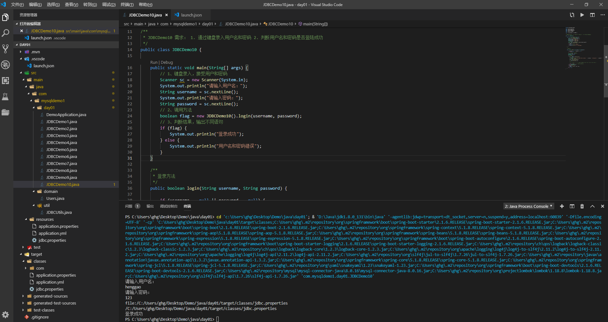

# JDBC

###### Demo1

- 需求：
  1. 通过键盘录入用户名和密码
  2. 判断用户名和密码是否登陆成功
- 步骤
  1. 创建数据库表User

1. 配置jdbc.properties

   ```properties
   url=jdbc:mysql://169.254.28.208:3306/db1
   user=henggao
   password=abc123
   driver=com.mysql.cj.jdbc.Driver
   ```

2. JDBCUtils.java工具类

   ```java
   package com.mysqldemo1.util;
   
   import java.io.FileReader;
   import java.io.IOException;
   import java.net.URL;
   import java.sql.Connection;
   import java.sql.DriverManager;
   import java.sql.ResultSet;
   import java.sql.SQLException;
   import java.sql.Statement;
   import java.util.Properties;
   
   /**
    * JDBCUtils
    */
   public class JDBCUtils {
   
       private static String url;
       private static String user;
       private static String password;
       private static String driver;
   
       /**
        * 
        * 文件的读取，只需要读取一次即可拿到这些值。使用静态代码块
        */
   
       static {
           // 读取资源文件，获取值。
   
           try {
               // 1、创建Properties集合集
               Properties pro = new Properties();
   
               // 获取src路径下的文件的方式--->ClassLoader 类加载器
               ClassLoader classLoader = JDBCUtils.class.getClassLoader();
               URL res = classLoader.getResource("jdbc.properties");
               System.out.println(res);
               String path = res.getPath();
               System.out.println(path); // C:/Users/ghg/Desktop/Demo/java/day01/target/classes/jdbc.properties
               // 2、加载文件
               // pro.load(new
               // FileReader("C:\\Users\\ghg\\Desktop\\Demo\\java\\day01\\src\\main\\resources\\jdbc.properties"));
               // //绝对路径
               pro.load(new FileReader(path));
   
               // 3、获取参数，赋值
               url = pro.getProperty("url");
               user = pro.getProperty("user");
               password = pro.getProperty("password");
               driver = pro.getProperty("driver");
               // 4、注册驱动
               Class.forName(driver);
           } catch (IOException e) {
               e.printStackTrace();
           } catch (ClassNotFoundException e) {
               e.printStackTrace();
           }
   
       }
   
       /**
        * 获取连接
        * 
        * @return 连接对象
        * @throws SQLException
        */
       public static Connection getConnection() throws SQLException {
           return DriverManager.getConnection(url, user, password);
       }
   
       /**
        * 释放资源
        * 
        * @param stmt
        * @param conn
        */
       public static void close(Statement stmt, Connection conn) {
           if (stmt != null) {
               try {
                   stmt.close();
               } catch (SQLException e) {
                   e.printStackTrace();
               }
           }
           if (conn != null) {
               try {
                   conn.close();
               } catch (SQLException e) {
                   e.printStackTrace();
               }
           }
       }
   
       /**
        * 释放资源
        * 
        * @param stmt
        * @param conn
        */
       public static void close(ResultSet rs, Statement stmt, Connection conn) {
           if (rs != null) {
               try {
                   rs.close();
               } catch (SQLException e) {
                   e.printStackTrace();
               }
           }
           if (stmt != null) {
               try {
                   stmt.close();
               } catch (SQLException e) {
                   e.printStackTrace();
               }
           }
           if (conn != null) {
               try {
                   conn.close();
               } catch (SQLException e) {
                   e.printStackTrace();
               }
           }
       }
   }
   ```

3. 编写JDBCDemo10.java类

   ```java
   package com.mysqldemo1.day01;
   
   import java.sql.Connection;
   import java.sql.ResultSet;
   import java.sql.SQLException;
   import java.sql.Statement;
   import java.util.Scanner;
   
   import com.mysqldemo1.util.JDBCUtils;
   
   /**
    * JDBCDemo10 需求： 1. 通过键盘录入用户名和密码 2. 判断用户名和密码是否登陆成功
    */
   public class JDBCDemo10 {
   
       public static void main(String[] args) {
           // 1、键盘录入，接受用户和密码
           Scanner sc = new Scanner(System.in);
           System.out.println("请输入用户名：");
           String username = sc.nextLine();
           System.out.println("请输入密码：");
           String password = sc.nextLine();
           // 2、调用方法
           boolean flag = new JDBCDemo10().login(username, password);
           // 3、判断结果，输出不同语句
           if (flag) {
               System.out.println("登录成功");
           } else {
               System.out.println("用户名和密码错误");
           }
       }
   
       /**
        * 登录方法
        */
       public boolean login(String username, String password) {
   
           if (username == null || password == null) {
               return false;
           }
           // 链接数据库判断是否登录成功
           Connection conn = null;
           Statement stmt = null;
           ResultSet rs = null;
           // 1、获取连接
           try {
               conn = JDBCUtils.getConnection();
               // 2、定义sql
               String sql = "select * from student where username = '" + username + "' and password = '" + password + "' ";
               // 3、获取执行sql的对象
               stmt = conn.createStatement();
               // 4、执行查询
               rs = stmt.executeQuery(sql);
               // 5、判断
               /*
                * if (rs.next()) { //如果有下一行，则返回true return true; } else { return false; }
                */
               return rs.next();// 如果有下一行，则返回true
           } catch (SQLException e) {
               e.printStackTrace();
           } finally {
               JDBCUtils.close(rs, stmt, conn);
           }
           return false;
       }
   }
   ```

4. 使用VSCode时，由于不能够在控制台输入，需要在launch.json中添加一条语句。

   ```json
   {
       "configurations": [
           {
               "type": "java",
               "name": "CodeLens (Launch) - JDBCDemo10",
               "request": "launch",
               "mainClass": "com.mysqldemo1.day01.JDBCDemo10",
               "projectName": "day01",
               "console":"integratedTerminal" ////添加这一条语句
           }
       ]
   }
   ```

5. 运行，查看。

   

   

   注意：
   
   1. SQ注入问题：在拼接sql时，有一些sql特殊关键字参与字符串的拼接，会造成安全性问题。
   2. 解决sql注入问题，使用PreparedStatement对象
   3. 预编译的sql：参数使用？作为占位符
   4. 步骤
      1. 导入驱动jar包
      2. 注册驱动
      3. 获取数据库连接对象Connection
      4. 定义sql
      5. 获取执行sql语句对象PreparedStatment Connection.preparedStatement(String sql)
      6. 给?赋值：
         - 方法： setxxx（参数1，参数2）
           - 参数1： ？的位置编号  从1开始
           - 参数2：？的值
      7. 执行sql，接受返回结果，不需要传递sql语句
      8. 处理结果
      9. 释放资源
   5. **注意：后期都会使用PreparedStatement来完成增删改查的所有操作**
      1. 可以防止SQL注入
      2. 效率更高

###### Demo2

- 完善Demo1，解决sql注入问题。使用PrepareStatement方法

  ```java
  package com.mysqldemo1.day01;
  
  import java.sql.Connection;
  import java.sql.PreparedStatement;
  import java.sql.ResultSet;
  import java.sql.SQLException;
  import java.sql.Statement;
  import java.util.Scanner;
  
  import com.mysqldemo1.util.JDBCUtils;
  
  /**
   * JDBCDemo10 需求： 1. 通过键盘录入用户名和密码 2. 判断用户名和密码是否登陆成功
   */
  public class JDBCDemo10 {
  
      public static void main(String[] args) {
          // 1、键盘录入，接受用户和密码
          Scanner sc = new Scanner(System.in);
          System.out.println("请输入用户名：");
          String username = sc.nextLine();
          System.out.println("请输入密码：");
          String password = sc.nextLine();
          // 2、调用方法
          // boolean flag = new JDBCDemo10().login(username, password);
          boolean flag = new JDBCDemo10().login2(username, password);
          // 3、判断结果，输出不同语句
          if (flag) {
              System.out.println("登录成功");
          } else {
              System.out.println("用户名和密码错误");
          }
      }
  
      /**
       * 登录方法
       */
      public boolean login(String username, String password) {
  
          if (username == null || password == null) {
              return false;
          }
          // 链接数据库判断是否登录成功
          Connection conn = null;
          Statement stmt = null;
          ResultSet rs = null;
          // 1、获取连接
          try {
              conn = JDBCUtils.getConnection();
              // 2、定义sql
              String sql = "select * from student where username = '" + username + "' and password = '" + password + "' ";
              // 3、获取执行sql的对象
              stmt = conn.createStatement();
              // 4、执行查询
              rs = stmt.executeQuery(sql);
              // 5、判断
              /*
               * if (rs.next()) { //如果有下一行，则返回true return true; } else { return false; }
               */
              return rs.next();// 如果有下一行，则返回true
          } catch (SQLException e) {
              e.printStackTrace();
          } finally {
              JDBCUtils.close(rs, stmt, conn);
          }
          return false;
      }
  
      /**
       * 登录方法,使用PreparedStatement实现
       */
      public boolean login2(String username, String password) {
  
          if (username == null || password == null) {
              return false;
          }
          // 链接数据库判断是否登录成功
          Connection conn = null;
          // Statement stmt = null;
          PreparedStatement pstmt = null;
          ResultSet rs = null;
          // 1、获取连接
          try {
              conn = JDBCUtils.getConnection();
              // 2、定义sql
              String sql = "select * from student where username = ? and password = ?";
              // 3、获取执行sql的对象
              // stmt = conn.createStatement();
              pstmt = conn.prepareStatement(sql);
              // 给?赋值
              pstmt.setString(1, username);
              pstmt.setString(2, password);
              // 4、执行查询
              // rs = stmt.executeQuery(sql);
              rs = pstmt.executeQuery();
              // 5、判断
              /*
               * if (rs.next()) { //如果有下一行，则返回true return true; } else { return false; }
               */
              return rs.next();// 如果有下一行，则返回true
          } catch (SQLException e) {
              e.printStackTrace();
          } finally {
              // JDBCUtils.close(rs, stmt, conn);
              JDBCUtils.close(rs, pstmt, conn);
          }
          return false;
      }
  }
  ```

###### JDBC控制事务

1. 事务：一个包含多个步骤的业务操作。如果这个业务操作被事务管理，则这多个步骤要么同时成功，要么同时失败。

2. 操作

   1. 开启事务
   2. 提交事务
   3. 回滚事务

3. 使用Connection对象来管理事务

   1. 开启事务：setAutoCommit(boolean autoCommit):调用该方法设置参数为false，即开启事务。
      - 在执行sql之前开启事务
   2. 提交事务：commit()
      - 当所有sql都执行完提交事务
   3. 回滚事务：rollback
      - 在catch中回滚事务

   编写JDBCDemo11.java

   ```java
   package com.mysqldemo1.day01;
   
   import java.sql.Connection;
   import java.sql.PreparedStatement;
   import java.sql.SQLException;
   
   import com.mysqldemo1.util.JDBCUtils;
   
   /**
    * JDBC Demo11事务操作
    */
   public class JDBCDemo11 {
   
       public static void main(String[] args) {
           Connection conn = null;
           PreparedStatement pstmt1 = null;
           PreparedStatement pstmt2 = null;
           try {
               // 1、获取连接
               conn = JDBCUtils.getConnection();
               // 开启事务
               conn.setAutoCommit(false);
               // 2、定义sql
               // 2.1 henggao年龄 -5
               String sql1 = "update users set age = age - ? where id = ?";
               // 2.2 zhangsan年龄 +5
               String sql2 = "update users set age = age + ? where id = ?";
               // 3、获取执行sql对象
               pstmt1 = conn.prepareStatement(sql1);
               pstmt2 = conn.prepareStatement(sql2);
               // 4、设置参数
               pstmt1.setDouble(1, 5);
               pstmt1.setInt(2, 10);
   
               pstmt2.setDouble(1, 5);
               pstmt2.setInt(2, 11);
               // 5、执行sql
               pstmt1.executeUpdate();
   
               /* //手动制造一个异常
               int i = 3/0; */
               pstmt2.executeUpdate();
   
               // 提交事务
               conn.commit();
           } catch (SQLException e) {
               // 事务的回滚
               try {
                   if (conn != null) {
                       conn.rollback();
                   }
               } catch (SQLException e1) {
                   e1.printStackTrace();
               }
               e.printStackTrace();
           } finally {
               JDBCUtils.close(pstmt1, conn);
               JDBCUtils.close(pstmt2, conn);
           }
       }
   }
   ```

   

