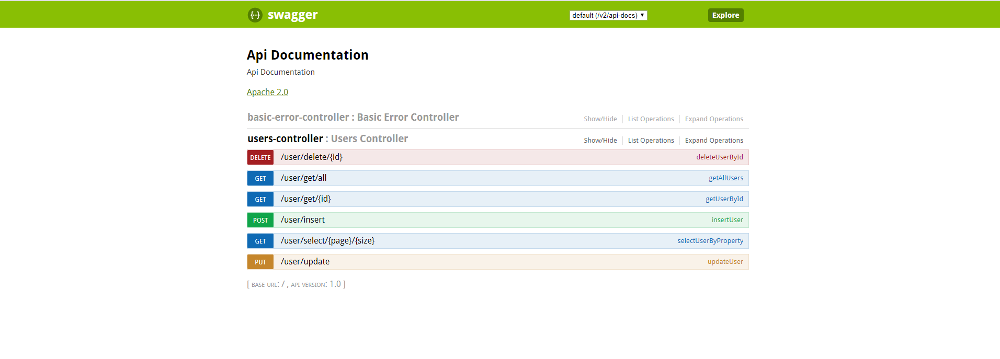

# SpringBoot 整合 MongoDB 之 MongoTemplate 实现 CRUD、分页接口

## 1、实体类

在entity文件夹下写Users.java类。

```java
package com.henggao.mongeostore_version1.entity;

import lombok.Data;
import org.springframework.data.annotation.Id;
import org.springframework.data.mongodb.core.mapping.Document;
import org.springframework.data.mongodb.core.mapping.Field;

@Data
@Document(collection = "t_user")
public class Users {

    @Id //指定id
    private String id;
    @Field("userName") // 指定域名，覆盖默认
    private String username;
    @Field("password") // 指定域名，覆盖默认
    private String password;
}
```

## 2、控制层

在controller文件夹下写UsersController.java类。

```java
package com.henggao.mongeostore_version1.controller;

import com.henggao.mongeostore_version1.entity.Users;
import org.springframework.beans.factory.annotation.Autowired;
import org.springframework.data.mongodb.core.MongoTemplate;
import org.springframework.data.mongodb.core.query.Criteria;
import org.springframework.data.mongodb.core.query.Query;
import org.springframework.stereotype.Controller;
import org.springframework.web.bind.annotation.*;
import springfox.documentation.swagger2.annotations.EnableSwagger2;

import java.util.HashMap;
import java.util.List;
import java.util.Map;


@Controller
@RequestMapping("/user")
@EnableSwagger2
public class UsersController {

    @Autowired
    MongoTemplate mongoTemplate;

    /**
     * 1、增加
     *
     * @param users
     * @return
     */
    @PostMapping("/insert")
    public Users insertUser(Users users) {
        //可以用save代替
        mongoTemplate.insert(users);
        return users;
    }

    /**
     * 2、查
     *
     * @param id
     * @return
     */
    @GetMapping("/get/{id}")
    public Users getUserById(@PathVariable String id) {
        return mongoTemplate.findById(id, Users.class);
    }

    /**
     * 3、删
     *
     * @param id
     * @return
     */
    @DeleteMapping("/delete/{id}")
    public Users deleteUserById(@PathVariable String id) {
        Users users = mongoTemplate.findById(id, Users.class);
        mongoTemplate.remove(users);
        return users;
    }

    /**
     * 4、改
     *
     * @param users
     * @return
     */
    @PutMapping("/update")
    public Users updateUser(Users users) {
        //save可增可改
        mongoTemplate.save(users);
        return users;
    }

    /**
     * 5、全
     *
     * @return
     */
    @GetMapping("/get/all")
    public List<Users> getAllUsers() {
        return mongoTemplate.findAll(Users.class);
    }

    /**
     * 6、查++：属性、分页
     *
     * @param users
     * @param page
     * @param size
     * @return
     */
    @GetMapping("/select/{page}/{size}")
    public Map<String, Object> selectUserByProperty(Users users, @PathVariable int page, @PathVariable int size) {

        //条件
        Criteria criteria1 = Criteria.where("username").is(users.getUsername());  //注意导入的是org.springframework.data.mongodb.core.query.Criteria
        Criteria criteria2 = Criteria.where("password").is(users.getPassword());
        Query query = new Query();  //这里是mongoDBQuery
        if (users.getUsername() != null) {
            query.addCriteria(criteria1);
        }
        if (users.getPassword() != null) {
            query.addCriteria(criteria2);
        }
        //数量
        long total = mongoTemplate.count(query, Users.class);
        //分页
        query.skip((page - 1) * size).limit(size);

        List<Users> data = mongoTemplate.find(query, Users.class);
        Map<String, Object> map = new HashMap<String, Object>();

        map.put("data", data);
        map.put("total", total);

        return map;
    }
}
```

## 3、application.properties

```properties
#Tomcat
server.address=localhost
server.port=80
server.tomcat.uri-encoding=utf-8
server.tomcat.min-spare-threads=30
server.connection-timeout=5000ms
#mongoDB
spring.data.mongodb.uri=mongodb://169.254.28.208:27017/test
```

## 4、pom.xml

```xml
<?xml version="1.0" encoding="UTF-8"?>
<project xmlns="http://maven.apache.org/POM/4.0.0" xmlns:xsi="http://www.w3.org/2001/XMLSchema-instance"
         xsi:schemaLocation="http://maven.apache.org/POM/4.0.0 http://maven.apache.org/xsd/maven-4.0.0.xsd">
    <modelVersion>4.0.0</modelVersion>
    <parent>
        <groupId>org.springframework.boot</groupId>
        <artifactId>spring-boot-starter-parent</artifactId>
        <version>2.1.7.RELEASE</version>
        <relativePath/> <!-- lookup parent from repository -->
    </parent>
    <groupId>com.henggao</groupId>
    <artifactId>mongeostore_version1</artifactId>
    <version>0.0.1-SNAPSHOT</version>
    <name>mongeostore_version1</name>
    <description>Demo project for Spring Boot</description>

    <properties>
        <java.version>1.8</java.version>
    </properties>

    <dependencies>
        <dependency>
            <groupId>org.springframework.boot</groupId>
            <artifactId>spring-boot-starter-data-mongodb</artifactId>
        </dependency>
        <dependency>
            <groupId>org.springframework.boot</groupId>
            <artifactId>spring-boot-starter-thymeleaf</artifactId>
        </dependency>
        <dependency>
            <groupId>org.springframework.boot</groupId>
            <artifactId>spring-boot-starter-web</artifactId>
        </dependency>

        <dependency>
            <groupId>org.springframework.boot</groupId>
            <artifactId>spring-boot-devtools</artifactId>
            <scope>runtime</scope>
            <optional>true</optional>
        </dependency>
        <dependency>
            <groupId>org.projectlombok</groupId>
            <artifactId>lombok</artifactId>
            <optional>true</optional>
        </dependency>
        <dependency>
            <groupId>org.springframework.boot</groupId>
            <artifactId>spring-boot-starter-test</artifactId>
            <scope>test</scope>
        </dependency>
        <!-- swagger生成接口API -->
        <dependency>
            <groupId>io.springfox</groupId>
            <artifactId>springfox-swagger2</artifactId>
            <version>2.7.0</version>
        </dependency>

        <!-- 接口API生成html文档 -->
        <dependency>
            <groupId>io.springfox</groupId>
            <artifactId>springfox-swagger-ui</artifactId>
            <version>2.6.1</version>
        </dependency>

    </dependencies>

    <build>
        <plugins>
            <plugin>
                <groupId>org.springframework.boot</groupId>
                <artifactId>spring-boot-maven-plugin</artifactId>
            </plugin>
        </plugins>
    </build>

</project>
```

## 5、效果测试

输入网址：http://localhost/swagger-ui.html#/users-controller查看。




参考：https://blog.csdn.net/larger5/article/details/79760317

