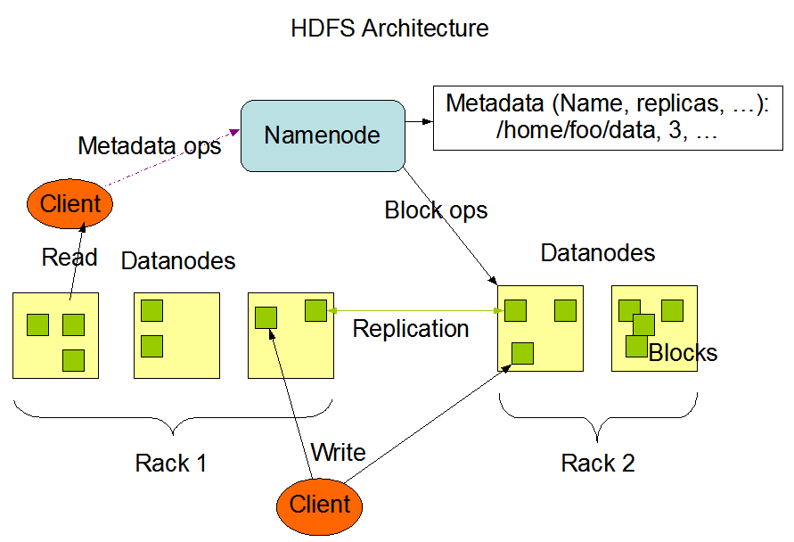

# Hadoop

## 一、基本概念

### 1、Hadoop 起源

谷歌发布了三篇论文：

- GFS：分布式存储系统
- MapReduce：分布式计算框架
- BigTable

| Hadoop    | Google    |
| --------- | --------- |
| HDFS      | GFS       |
| MapReduce | MapReduce |
| Hbase     | BigTable  |


### 2、版本

- Hadoop1x 版本中核心组件就是HDFS、MapReduce

- Hadoop2x 版本：HDFS、MapReduce、YARN

  

### 3、YARN


## 二、Hadoop 生态圈

数据进行清洗：Hive、Sqoop、Flume、Hbase、HDFS、MapReduce、Zookeeper


## 三、Hadoop 中组件信息

### 1、HDFS 架构

分布式存储系统，分布式的架构存在主/从的架构关系，在HDFS文件系统上存在主节点，以及从节点。

- 主节点：namenode 负责管理HDFS集群文件中元数据（文件的名称，文件的位置，文件的副本）

- 从节点：datanode 负责存储真正的数据



> 在HDFS中数据的存储是以块的方式进行存储的的，block默认块的大小为128M。


### 2、YARN 架构

分布式架构，分为主从架构

- 主节点：ResourceManager  负责管理集群中的所有资源（CPU、内存、磁盘、网络IO）
- 从节点NodeManager 负责管理集群中每一台服务器资源


### 3、MapReduce

- Map端和Reduce端进行数据分析
- 数据在Map端进行分开处理，处理完成之后，在交给Reduce经进行统计，在Map和Reduce中间的阶段通过Shuffle进行连接。


## 四、搭建Hadoop伪分布环境

### 1、安装前的准备

- 设置普通用户及设置sudo权限
- 关闭防火墙
- 设置主机名称
- IP与主机名称进行绑定


### 2、安装JDK环境


# Linux

## 一、Linux的主要特点

### 1、基本思想

Linux的基本思想：

- 一切都是文件
- 每个软件都是确定的用途


### 2、常用Linux的版本

- Red Hat

- Centos

- Debian

- Ubuntu

## 二、安装

- Vmware

- VirtualBox

### 1、网络模式

- -bridged（桥接方式）
- -nat（网络地址转换模式）
- -host-only（仅主机模式）

## 三、Linux命名

```shell
cp ./test/123
```

```shell
#!/bin/bash
class='1701A'
echo "class is ${class}"		#class is 1701A

class1="abcdef"
echo ${class1}		#abcdef

class2="this is 1701A class"
echo ${class2:1:6}		#his is

class3="this is 1701A class"
echo `expr index "$class3" is`		#3
```

```shell
#!/bin/bash
arr1=(1 2 3 4 'hello' 'Arry')
arr2=(
'Hello Arrytest'
)

echo ${arr1[*]}		#1 2 3 4 hello Arry
echo ${arr1[2]}		#3
echo ${arr1[@]}		#1 2 3 4 hello Arry
echo ${arr2}		#Hello Arrytest
```

```shell
#远程分发
scp -r ./local  ./remote
```

# Hadoop


## 一、HDFS

### 1、特点

- 高可靠性
- 高扩展性
- 高效性
- 高容错性


### 2、缺点


## 二、HDFS 架构

- `NameNode`
- `Secondary NameNode`
- `DataNode`


### 1、NameNode

NameNode是一个中心服务，单一节点（负责系统设计和实现），负责文件系统的名字空间（namespace）以及客户端对文件的访问。

### 2、Secondary NameNode


### 3、DataNode

一个数据块在DataNode以文件存储在磁盘上，包括两个文件，一个是数据本身，一个是元数据包括的数据块长度，块数据校验以时间戳。

## 三、YARN 服务组件

ResourceManager、NodeManager、ApplicationMaster


## 四、Hadoop RPC协议

RPC（Remote Procedure Call）—[远程过程调用](https://baike.baidu.com/item/远程过程调用/7854346)，它是一种通过[网络](https://baike.baidu.com/item/网络/143243)从远程计算机程序上请求服务，而不需要了解底层网络技术的协议。[RPC协议](https://baike.baidu.com/item/RPC协议)假定某些[传输协议](https://baike.baidu.com/item/传输协议/8048821)的存在，如TCP或UDP，为通信程序之间携带信息数据。在OSI[网络通信](https://baike.baidu.com/item/网络通信/9636548)模型中，RPC跨越了[传输层](https://baike.baidu.com/item/传输层/4329536)和[应用层](https://baike.baidu.com/item/应用层/4329788)。RPC使得开发包括网络[分布式](https://baike.baidu.com/item/分布式)多程序在内的应用程序更加容易。


# 云计算

- Iaas 基础设施即服务

- Pass 平台即服务

- Saas 软件即服务