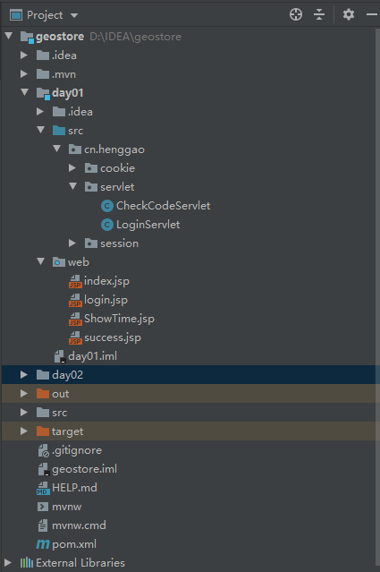

# Session实现验证码登录

- 编译器：IDEA2019.2

1、在servlet下创建CheckCodeServlet.java、LoginServlet.java

```java
package cn.henggao.servlet;

import javax.imageio.ImageIO;
import javax.servlet.ServletException;
import javax.servlet.annotation.WebServlet;
import javax.servlet.http.HttpServlet;
import javax.servlet.http.HttpServletRequest;
import javax.servlet.http.HttpServletResponse;
import java.awt.*;
import java.awt.image.BufferedImage;
import java.io.IOException;
import java.util.Random;

@WebServlet("/CheckCodeServlet")
public class CheckCodeServlet extends HttpServlet {
    protected void doPost(HttpServletRequest request, HttpServletResponse response) throws ServletException, IOException {
        this.doGet(request, response);
    }

    protected void doGet(HttpServletRequest request, HttpServletResponse response) throws ServletException, IOException {
        int width = 100;
        int height = 50;
        // 1、创建一对象，在内存中图片（验证码对象）
        BufferedImage image = new BufferedImage(width, height, BufferedImage.TYPE_INT_RGB);
        // 2、美化图片
        // 2.1、填充颜色
        Graphics g = image.getGraphics();
        g.setColor(Color.PINK);
        g.fillRect(0, 0, width, height);
        // 2.2、画边框
        g.setColor(Color.BLUE);
        g.drawRect(0, 0, width - 1, height - 1);

        String str = "ABCDEFGHIJKLMNOPQRSTUVWXYZabcdefghijklmnopqrstuvwxyz0123456789";
        // 生成随机角标
        Random ran = new Random();
        StringBuilder sb = new StringBuilder();
        for (int i = 1; i <= 4; i++) {
            int index = ran.nextInt(str.length());
            // 获取字符
            char ch = str.charAt(index);// 随机字符
            sb.append(ch);
            // 2.3、写验证码
            g.drawString(ch + "", width / 5 * i, height / 2);
        }
        String checkCode_session = sb.toString();
        //将验证码存入Session
        request.getSession().setAttribute("checkCode_session", checkCode_session);
        // 2.4、画干扰线
        g.setColor(Color.GREEN);
        // 随机生成坐标点
        for (int i = 0; i < 10; i++) {

            int x1 = ran.nextInt(width);
            int x2 = ran.nextInt(width);
            int y1 = ran.nextInt(height);
            int y2 = ran.nextInt(height);
            g.drawLine(x1, x2, y1, y2);
        }

        // 3、将图片输出到网页展示
        ImageIO.write(image, "jpg", response.getOutputStream());

    }
}
```

```java
package cn.henggao.servlet;

import javax.servlet.ServletException;
import javax.servlet.annotation.WebServlet;
import javax.servlet.http.HttpServlet;
import javax.servlet.http.HttpServletRequest;
import javax.servlet.http.HttpServletResponse;
import javax.servlet.http.HttpSession;
import java.io.IOException;

@WebServlet("/loginServlet")
public class LoginServlet extends HttpServlet {
    protected void doPost(HttpServletRequest request, HttpServletResponse response) throws ServletException, IOException {
        //1、设置request编码
        request.setCharacterEncoding("utf-8");
        //2、获取参数
        String username = request.getParameter("username");
        String password = request.getParameter("password");
        String checkCode = request.getParameter("checkCode");
        //3、先获取生成的验证码
        HttpSession session = request.getSession();
        String checkCode_session = (String) session.getAttribute("checkCode_session");
        //s删除session中存储的验证码
        session.removeAttribute("checkCode_session");
        //3、先判断验证码是否正确
        if (checkCode_session != null && checkCode_session.equalsIgnoreCase(checkCode)) {
            //忽略大小写
            //验证码正确
            //判断用户名和密码是否一致
            if ("zhangsan".equals(username) && "123".equals(password)) { //需要调用UserDao查询数据库
                //登陆成功
                //存储信息，用户信息
                session.setAttribute("user", username);
                //重定向到success.jsp
                response.sendRedirect(request.getContextPath() + "/success.jsp");
            } else {
                //登录失败
                //存储提示信息到request
                request.setAttribute("login_error", "用户名或密码错误");
                //转发到在登录界面
                request.getRequestDispatcher("/login.jsp").forward(request, response);
            }
        } else {
            //验证码不一致
            //存储提示信息到request
            request.setAttribute("cc_error", "验证码错误");
            //转发到在登录界面
            request.getRequestDispatcher("/login.jsp").forward(request, response);
        }

    }

    protected void doGet(HttpServletRequest request, HttpServletResponse response) throws ServletException, IOException {
        this.doPost(request, response);
    }
}
```

2、在web下创建login.jsp、success.jsp

```jsp
<%--
  Created by IntelliJ IDEA.
  User: ghg
  Date: 2019/8/6
  Time: 10:16
  To change this template use File | Settings | File Templates.
--%>

<%@ page contentType="text/html;charset=UTF-8" language="java" %>
<html>
<head>
    <title>Login</title>
    <style>
        div {
            color: red;
        }
    </style>
</head>
<body>
<form action="/day01/loginServlet" method="post">
    <table>
        <tr>
            <td>用户名</td>
            <td><input type="text" name="username"></td>
        </tr>
        <tr>
            <td>密码</td>
            <td><input type="password" name="password"></td>
        </tr>
        <tr>
            <td>验证码</td>
            <td><input type="text" name="checkCode"></td>
        </tr>
        <tr>
            <td colspan="2"></td>
        </tr>
        <tr>
            <td colspan="2"><input type="submit" value="登录"></td>
        </tr>
    </table>
</form>

<div><%=request.getAttribute("cc_error") == null ? "" : request.getAttribute("cc_error")%>
</div>
<div><%=request.getAttribute("login_error") == null ? "" : request.getAttribute("login_error")%>
</div>


<script>
    window.onload = function () {
        document.getElementById("img").onclick = function () {
            this.src = "/day01/CheckCodeServlet?time=" + new Date().getTime();
        }
    }
</script>
</body>
</html>
```

```jsp
<%--
  Created by IntelliJ IDEA.
  User: ghg
  Date: 2019/8/6
  Time: 14:18
  To change this template use File | Settings | File Templates.
--%>
<%@ page contentType="text/html;charset=UTF-8" language="java" %>
<html>
<head>
    <title>success</title>
</head>
<body>
<h1><%=request.getSession().getAttribute("user") %>,欢迎您</h1>
</body>
</html>
```

项目目录结构如下：

