# Git

## 一、Git的远程SSH设置

1、安装好Git，打开Git Bash

2、查看是否存在密钥ssh keys（这里没有keys）

```shell
ll ~/.ssh
```

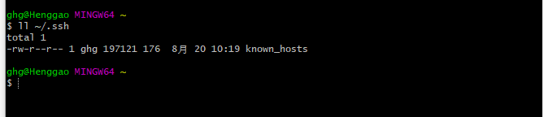

3、创建新的ssh keys，输入`ssh-keygen -t rsa -C genghenggao@outlook.com`，一路回车。

```shell
ssh-keygen -t rsa -C genghenggao@outlook.com
```

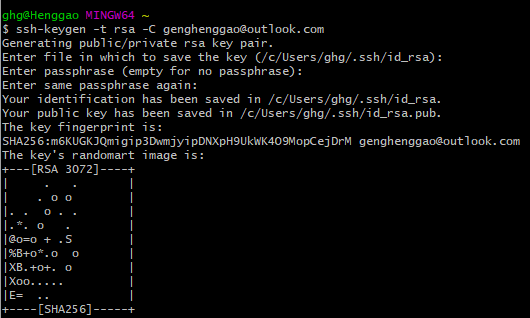

从上面配置发现keys存放在`/c/Users/ghg/.ssh/id_rsa.pub.

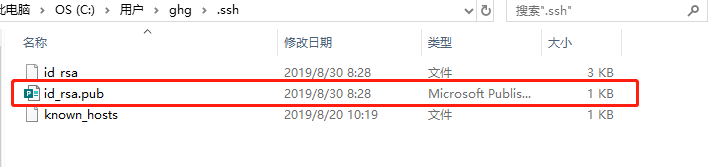

4、浏览器进入自己的github，打开Settings

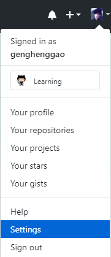

5、进入ssh and GPG keys，然后再点击右上角添加新密钥按钮New SSH key

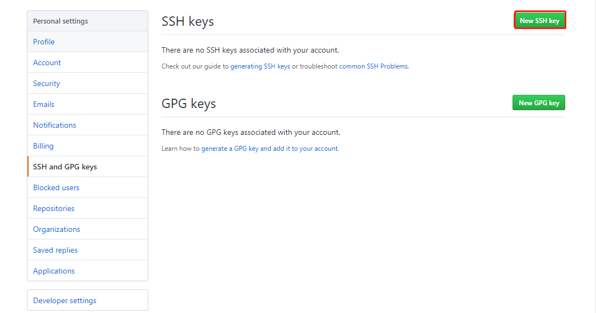

6、将idb_rsa.pub里的内容拷贝到Key内，Title内容随便填，确定即可。

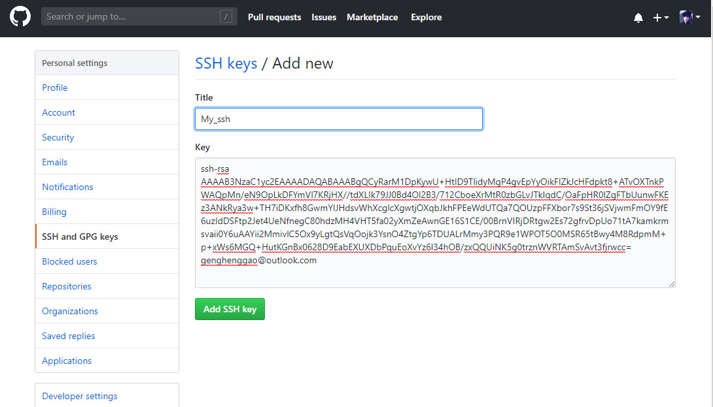

7、提示输入GitHub密码，返回页面。

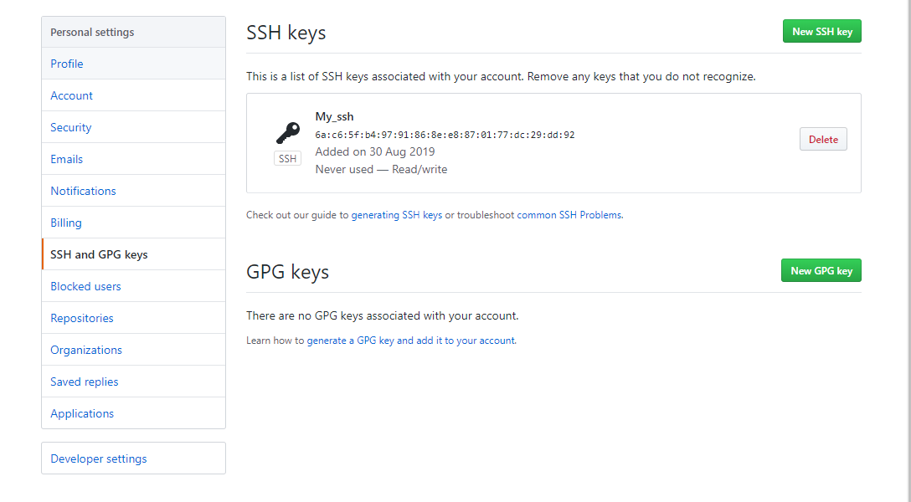

8、用`ssh -T git@github.com`测试自己是否可以连接成功了，中间有个输入需要输入yes，后面可以看到`Hi genghenggao! You've successfully authenticated, but GitHub does not provide shell access.`表示成功。

```shell
ssh -T git@github.com
```

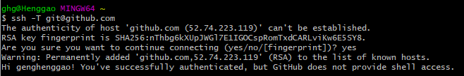


## 二、Git上传到GitHub

1、切换到需要上传的本地文件夹。（可以右击创建，也可以通过Git命令创建）


2、通过命令`git init`把这个文件夹变成Git可管理的仓库

```shell
git init
```

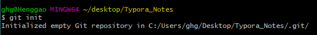

3、打开文件夹，可以发现多了一个`.git`文件夹。（如果看不到，是因为它默认是隐藏文件，那你就需要设置一下让隐藏文件可见。）

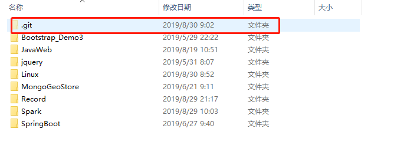

4、这时候你就可以把你的项目粘贴到这个本地Git仓库里面（粘贴后你可以通过git status来查看你当前的状态），然后通过git add把项目添加到仓库（或git add .把该目录下的所有文件添加到仓库，注意点是用空格隔开的）。在这个过程中你其实可以一直使用git status来查看你当前的状态。如果文件内有东西会出现红色的字，不是绿色，这不是错误。

```shell
git status
```

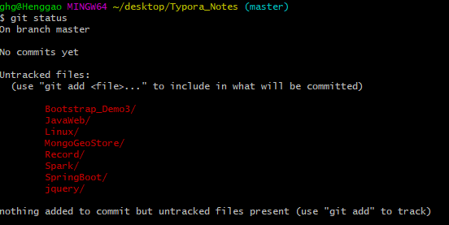

4、这里提示你虽然把项目粘贴过来了，但还没有add到Git仓库上，然后我们通过git add .把刚才复制过来的项目全部添加到仓库上。

```shell
git add .
```


6、用git commit -m "日志" 把项目提交到仓库。

```shell
git commit -m "Commit_logs" 
```

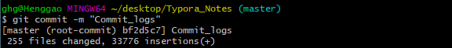


7、在Github上创建一个Git仓库。点New repository来创建

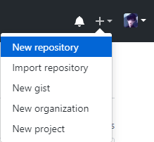

8、创建项目

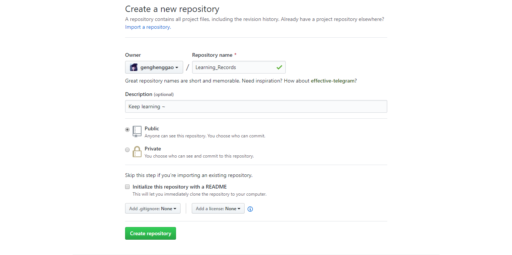

9、复制链接

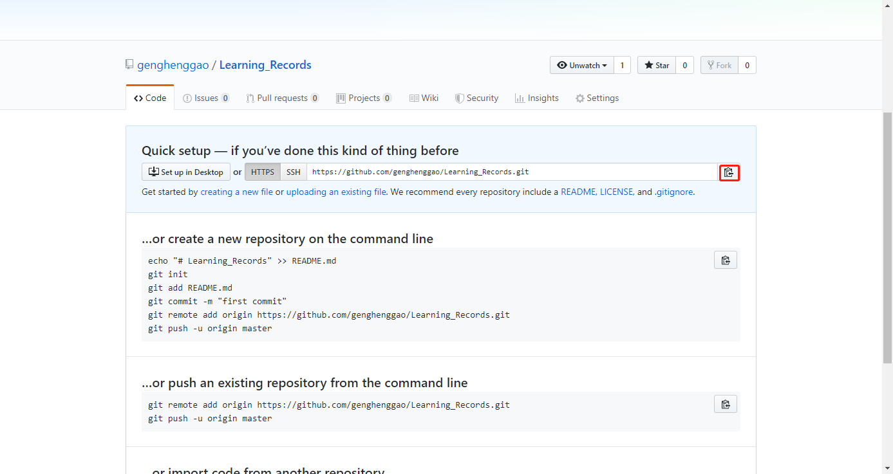


10、在Github上创建好Git仓库之后我们就可以和本地仓库进行关联了，根据创建好的Git仓库页面的提示，可以在本地Typora_Notes仓库的命令行输入：

```shell
git remote add origin https://github.com/genghenggao/Learning_Records.git
```

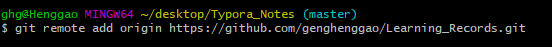

11、关联好之后我们就可以把本地库的所有内容推送到远程仓库（也就是Github）上了，通过：`git push -u origin master`

```shell
git push -u origin master
```

- 由于新建的远程仓库是空的，所以要加上-u这个参数，等远程仓库里面有了内容之后，下次再从本地库上传内容的时候只需下面这样就可以了：

```shell
git push origin master
```

12、输入邮箱、密码。

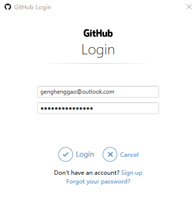


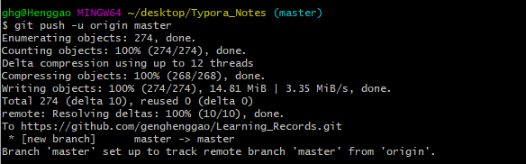

13、刷新你的Github页面进入刚才新建的那个仓库里面就会发现项目已经成功上传了。

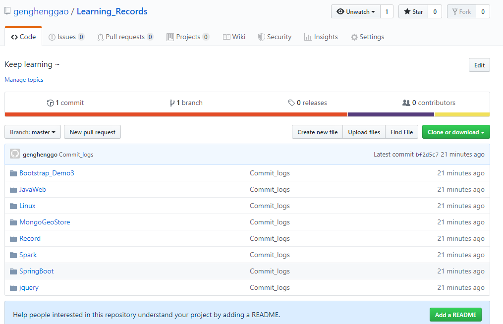

14、有个坑需要注意一下，就是在上面第2、8步创建远程仓库的时候，如果你勾选了Initialize this repository with a README（就是创建仓库的时候自动给你创建一个README文件），那么到了第6步你将本地仓库内容推送到远程仓库的时候就会报一个`error：failed to push some refs to https://github.com/xxx`的错。

 这是由于你新创建的那个仓库里面的README文件不在本地仓库目录中，这时我们可以通过以下命令先将内容合并以下:

```shell
git pull --rebase origin master
```

这时你再push就能成功了。


## 三、更新本地Git项目到GitHub仓库

1、远程仓库$ git remote add origin git@github.com:yourName/yourRepo.gitwison。yourName是你的用户名，yourRepo.gitwison是你要上传项目的仓库。

```shell
git remote add origin https://github.com/genghenggao/Learning_Records.git
```

2、添加你要上传的文件，git add .  .代表上传目录下所有文件，可以在git add后面加上你要添加的文件，比如git add aa.html。

```shell
git add .
```

3、提交项目，输入git commit -a -m "xxx"   xxx是标记谁上传。再输入git push origin master，大功告成，可以在GitHub查看项目。

```shell
git commit -m "Commit_logs"

git push origin master
```


## 忽略文件设置

创建`.gitignore`文件，输入相关信息。

- Django项目建议忽略的文件清单

  ```
  # Django #
  *.log
  *.pot
  *.pyc
  __pycache__
  db.sqlite3
  media
   
  # Backup files #
  *.bak
   
  # If you are using PyCharm #
  .idea/**/workspace.xml
  .idea/**/tasks.xml
  .idea/dictionaries
  .idea/**/dataSources/
  .idea/**/dataSources.ids
  .idea/**/dataSources.xml
  .idea/**/dataSources.local.xml
  .idea/**/sqlDataSources.xml
  .idea/**/dynamic.xml
  .idea/**/uiDesigner.xml
  .idea/**/gradle.xml
  .idea/**/libraries
  *.iws /out/
   
  # Python #
  *.py[cod]
  *$py.class
   
  # Distribution / packaging
  .Python build/
  develop-eggs/
  dist/
  downloads/
  eggs/
  .eggs/
  lib/
  lib64/
  parts/
  sdist/
  var/
  wheels/
  *.egg-info/
  .installed.cfg
  *.egg
  *.manifest
  *.spec
   
  # Installer logs
  pip-log.txt
  pip-delete-this-directory.txt
   
  # Unit test / coverage reports
  htmlcov/
  .tox/
  .coverage
  .coverage.*
  .cache
  .pytest_cache/
  nosetests.xml
  coverage.xml
  *.cover
  .hypothesis/
   
  # pyenv
  .python-version
   
  # celery
  celerybeat-schedule.*
   
  # SageMath parsed files
  *.sage.py
   
  # Environments
  .env
  .venv
  env/
  venv/
  ENV/
  env.bak/
  venv.bak/
   
  # mkdocs documentation
  /site
   
  # mypy
  .mypy_cache/
   
  # Sublime Text #
  *.tmlanguage.cache
  *.tmPreferences.cache
  *.stTheme.cache
  *.sublime-workspace
  *.sublime-project
   
  # sftp configuration file
  sftp-config.json
   
  # Package control specific files Package
  Control.last-run
  Control.ca-list
  Control.ca-bundle
  Control.system-ca-bundle
  GitHub.sublime-settings
  
  ```

  

## 常用命令

```shell
#提交所有变化  
git add -A 

#提交被修改(modified)和被删除(deleted)文件，不包括新文件(new)
git add -u

#提交新文件(new)和被修改(modified)文件，不包括被删除(deleted)文件
git add . 

#查看状态
git status  

#提交，把本机缓存中的内容提交到本机的 HEAD 里面
git commit -m "注释"     

#把本地的 commit(提交) push 到远程服务器上， origin 也就是之前 git remote add origin 那个命令里面的 origin，origin 替代了服务器仓库地址：git push git@github.com:winter1991/helloworld.git master
git push origin master   
```


参考：

https://www.cnblogs.com/sdcs/p/8270029.html

https://www.cnblogs.com/superjt/p/5977719.html

