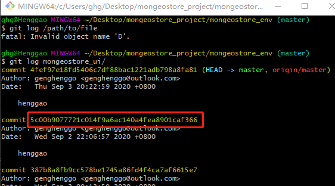
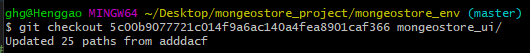

# git还原某个特定的文件到之前的版本


- 场景： 对于某个git控制下的文件进行了修改，但是改的不满意，想退回到改之前的版本。假定该文件或文件夹为 `mongeostore_ui`

## 1、第一步

```
#git log 文件

git log mongeostore_ui/
```

## 2、第二步

- 复制需要回退版本的hash，在此假设我们回退到  `5c00b9077721c014f9a6ac140a4fea8901caf366`,则复制该序列即可



## 3、第三步

- checkout 对应版本。格式为 git checkout <hash> <filename>, 在此即为命令行中输入 

```
git checkout 5c00b9077721c014f9a6ac140a4fea8901caf366 mongeostore_ui/
```




## 4、第四步

- 提交checkout下来的版本。 如： git commit -m "revert to previous version"

```
 git commit -m "revert to previous version"
 
 git push origin master
```

