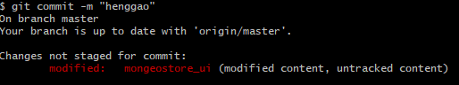
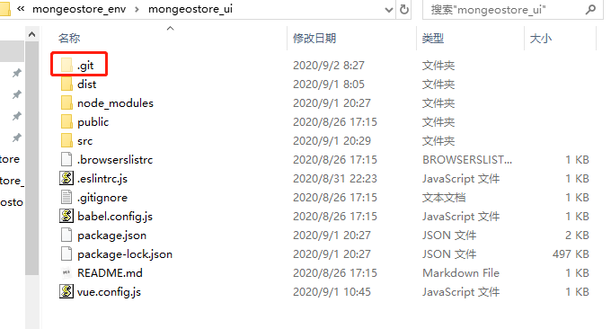
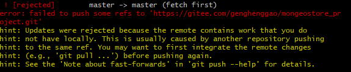

# Git报错

[TOC]


## 1、modified: (modified content, untracked content)

### 1、报错提示



- xxx目录没有被跟踪，那自然push上去的时候是空的了。

- 分析：项目目录创建了一个`.git`目录，但创建的vue项目mongeostore_ui会自动再创建一个`.git`目录。

  

### 2、解决方法

目录下有一个.git 目录，删除.git目录

重新git add .就可。

## 2、[rejected] master -> master (fetch first)问题



### 方案1：

- 我们只需加上 -f 参数即可push成功。它会忽略版本不一致等问题，强制将本地库上传的远程库，但是一定要谨慎使用，因为-f会用本地库覆盖掉远程库，如果远程库上有重要更新，或者有其他同伴做的修改，也都会被覆盖，所以一定要在确定无严重后果的前提下使用此操作。

```
git push -f  
```

### 方案2

- 我们只需加上 --rebase 参数，将github修改的文件更新到本地。然后再重新 push 一次即可。

```
git pull --rebase origin master 

git push -u origin master
```


## 3、Github或Gitee中有空文件夹

修改文件夹名称，上传是否成功？成功在修改回来即可!


## 4、Git 由于push超大文件导致失败后，虽删除超大文件再次push时仍push此文件解决办法


[参考1](https://blog.csdn.net/qq997843911/article/details/88979051?utm_medium=distribute.pc_relevant_t0.none-task-blog-BlogCommendFromMachineLearnPai2-1.edu_weight&depth_1-utm_source=distribute.pc_relevant_t0.none-task-blog-BlogCommendFromMachineLearnPai2-1.edu_weight)

#### 1 看哪个文件占的大

报错信息：

```bash
Counting objects: 15, done.
Delta compression using up to 8 threads.
Compressing objects: 100% (14/14), done.
Writing objects: 100% (15/15), 382.90 MiB | 1.88 MiB/s, done.
Total 15 (delta 8), reused 0 (delta 0)
remote: Resolving deltas: 100% (8/8), completed with 7 local objects.
remote: error: GH001: Large files detected. You may want to try Git Large File Storage - https://g
it-lfs.github.com.
remote: error: Trace: 32cfdd82801eb81f072baeca0f5ca78b
remote: error: See http://git.io/iEPt8g for more information.
remote: error: File resultDataset/resultDataset/gplus_combined.csv is 1279.62 MB; this exceeds Git
Hub's file size limit of 100.00 MB
To git@github.com:LiXiaoRan/dataHandle.git
 ! [remote rejected] master -> master (pre-receive hook declined)
error: failed to push some refs to 'git@github.com:LiXiaoRan/dataHandle.git'
```

注意这一句：`remote: error: File resultDataset/resultDataset/gplus_combined.csv is 1279.62 MB; this exceeds Git`可以发现，是gplus_combined.csv 文件太大，超过了100Mb的限制。那么要处理的就是这个文件了。

#### 2 重写commit，删除大文件

```bash
git filter-branch --force --index-filter 'git rm -rf --cached --ignore-unmatch resultDataset/resultDataset/gplus_combined.csv' --prune-empty --tag-name-filter cat -- --all
```

```

```

#### 需要注意的是，此处可能会报错

出现这个错误

```bash
Cannot rewrite branches: You have unstaged changes
```

##### 解决方案：执行`git stash`即可解决。

#### 3 推送修改后的repo

以强制覆盖的方式推送你的repo, 命令如下:

```bash
git push origin master --force
```

#### 4 清理和回收空间

虽然上面我们已经删除了文件, 但是我们的repo里面仍然保留了这些objects, 等待垃圾回收(GC), 所以我们要用命令彻底清除它, 并收回空间，命令如下:

```bash
rm -rf .git/refs/original/
 
git reflog expire --expire=now --all
 
git gc --prune=now
```

彻底解决。

#### 如果上述方法不管用

可以按照以下方法：

#### 1、移除错误缓存

首先应该移除所有错误的 cache，对于文件：

```bash
git rm --cached path_of_a_giant_file
```

对于文件夹：

```bash
git rm --cached -r path_of_a_giant_dir
```

例如对于我的例子就是这样的：

```bash
git rm --cached resultDataset/resultDataset/gplus_combined.csv
```

#### 2、重新提交：

编辑最后提交信息：

```bash
git commit --amend
```

修改 log 信息后保存返回。
重新提交

```bash
git push
```

参考文献

1. [Git] 处理 github 不允许上传超过 100MB 文件的问题：http://www.liuxiao.org/2017/02/git-处理-github-不允许上传超过-100mb-文件的问题/


## 5.报错

- 问题：在我尝试拉取github项目的时候报错。

  ```
  fatal: unable to access 'https://github.com/genghenggao/mongeostore_project.git/': OpenSSL SSL_read: Connection was reset, errno 10054
  ```

- 解决，输入如下命令，重新拉取即可。

  ```
  git config --global http.sslVerify "false"
  ```

  

