# Vmware中CentOS

[TOC]


## 一、安装CentOS7.6


## 二、设置网络NAT

1、针对Windows宿主机防火墙（可以关闭，我这里是打开的），windows下CMD中ipconfig命令查看。

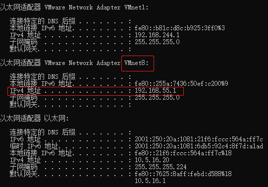


DNS设置，在目录

```shell
vi /etc/resolv.conf 
nameserver 8.8.8.8
nameserver 8.8.4.4
```

参考：

https://blog.csdn.net/llluluyi/article/details/79041791


## 三、CentOS时间设置

1、安装ntp服务软件包：

```shell
yum install ntp
```

2、将ntp设置为缺省启动：

```shell
systemctl enable ntpd
```

3、修改启动参数，增加-g -x参数，允许ntp服务在系统时间误差较大时也能正常工作：

```
vi /etc/sysconfig/ntpd
```

4、启动ntp服务：

```
service ntpd restart
```

5、将系统时区改为上海时间（即CST时区）：

```
ln -sf /usr/share/zoneinfo/Asia/Shanghai /etc/localtime
```

6、输入date命令查看时间是否正确


启动自动同步时间

```shell
timedatectl set-ntp yes
```


## 四、克隆虚拟机

1、被克隆的虚拟机处于关闭状态

2、右击被克隆的虚拟机-->管理-->克隆

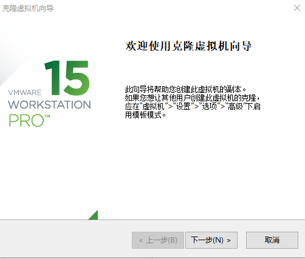

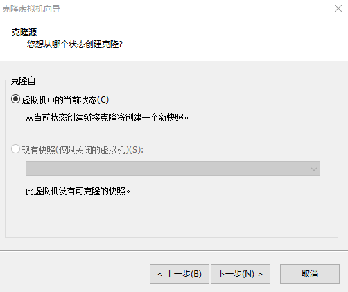

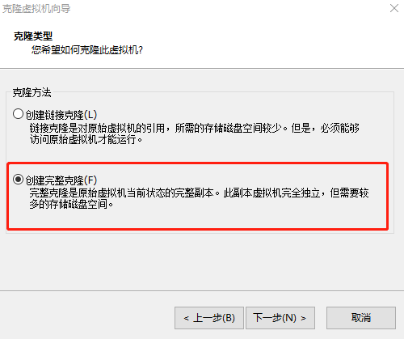

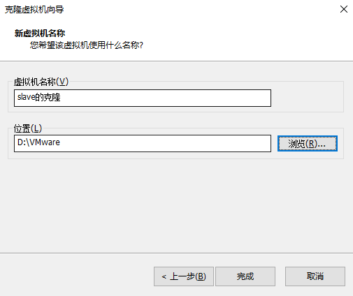


## 五、修改虚拟机配置

1、修改网卡配置（root权限）

```shell
vi /etc/sysconfig/network-scripts/ifcfg-ens33
```

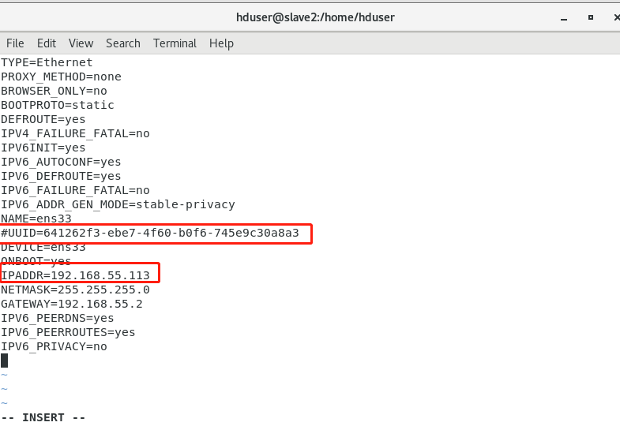

- 删除UUID信息

- 修改IPADDR信息为“192.168.55.113”

- 并保存退出。

2、修改完IPADDR后**再执行  service network restart**

```shell
service network restart
```

3、删除部分文件，查看。

```
ll /etc/udev/rules.d/
```


4、切换到目录，输入命令 “rm -rf 70-persistent-net.rules”删除文件

```
cd /etc/udev/rules.d

rm -rf 70-persistent-net.rules
```

5、关机，设置MAC地址

5.1、编辑虚拟机设置

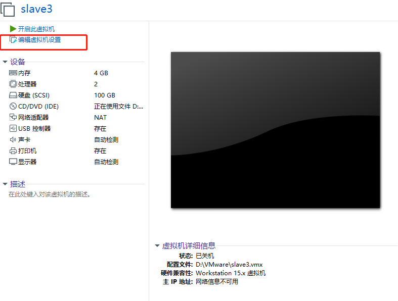

5.2、选择NAT模式，点击高级

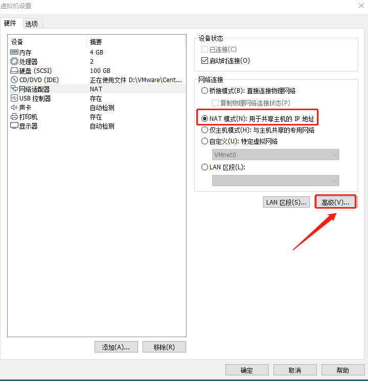

5.3、点击生成-->确定

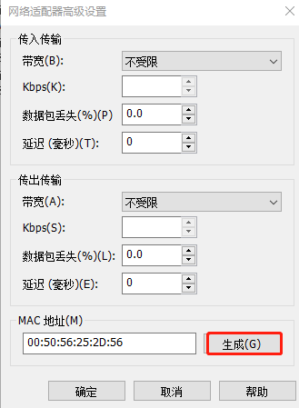


6、开机，测试互ping

```shell
#被复制机器上
ping 192.168.55.113

#复制的新机器上
ping 192.168.55.111
```

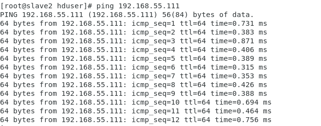

6、CentOS7修改hostname

```shell
[root@slave2 hduser]# hostnamectl set-hostname slave3
[root@slave2 hduser]# hostname 
slave3
[root@slave2 hduser]# vim /etc/hosts
[root@slave2 hduser]# cat /etc/hosts
```

- 给127.0.0.1添加hostname

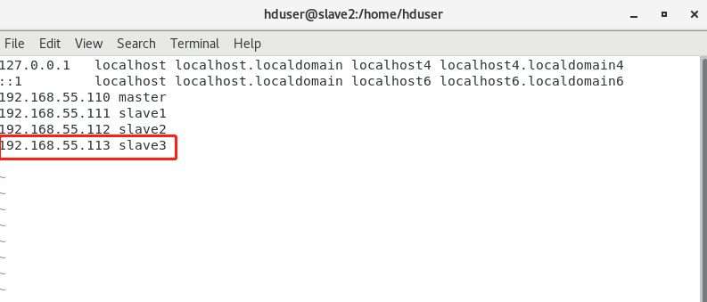


参考：

https://blog.csdn.net/mijichui2153/article/details/80918285


## 六、CentOS中Java环境配置

### 6.1、CentOS7.6自带jdk环境修改变量

1、查看

```shell
java -version
```

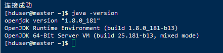

2、查看默认jdk的位置

```shell
 which java
```


3、继续追踪

```shell
ls -lrt /usr/bin/java
```


4、继续追踪

```shell
ls -lrt /etc/alternatives/java
```

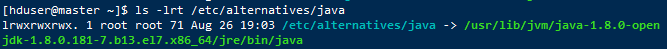

5、查看jdk，有俩个版本1.7、1.8

```shell
ll /usr/lib/jvm
```


找到了初始的jdk1.7和jdk1.8位置（即系统当前jdk），而我们需要的jdk1.8版本的位置，即`jre-1.8.0-openjdk-1.8.0.181-7.b13.el7.x86_64`，记录下位置：

`/usr/lib/jvm/jre-1.8.0-openjdk-1.8.0.181-7.b13.el7.x86_64`

6、编辑环境变量（root权限）

```shell
vim /etc/profile
```

7、在文本最后添加

```shell
#java
export JAVA_HOME=/usr/lib/jvm/jre-1.8.0-openjdk-1.8.0.181-7.b13.el7.x86_64
export PATH=$PATH:$JAVA_HOME/bin
export CLASSPATH=.:$JAVA_HOME/lib/tools.jar:$JAVA_HOME/lib/dt.jar
```

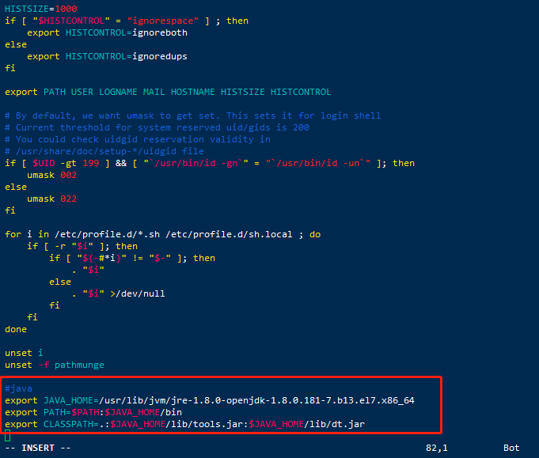

8、按esc输入:wq保存并退出

9、使环境变量生效

```shell
source /etc/profile 
```


参考：

https://www.cnblogs.com/zhenxiqia/p/9049290.html


### 6.2、CentOS7.6安装自定义JDK

#### 一、删除自带的OpneJDK以及相关的java文件

1、查看系统自带的OpenJDK版本信息

```shell
java -version
```

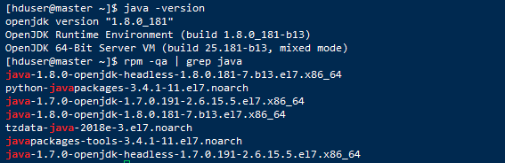

2、确认删除 centos 系统自带的 jdk

```shell
rpm -qa | grep java
```

- 命令说明：

  - rpm 　　管理套件    

  - -qa 　　 使用询问模式，查询所有套件

  - grep　　查找文件里符合条件的字符串

  - java 　　查找包含java字符串的文件


以上文件中，下面这四个可以删除。（名称里有 `openjdk` 的要删除）

```shell
java-1.8.0-openjdk-headless-1.8.0.181-7.b13.el7.x86_64
java-1.7.0-openjdk-1.7.0.191-2.6.15.5.el7.x86_64
java-1.8.0-openjdk-1.8.0.181-7.b13.el7.x86_64
java-1.7.0-openjdk-headless-1.7.0.191-2.6.15.5.el7.x86_64
```

3、使用root权限删除

```shell
[hduser@master ~]$ su
Password: 
ABRT has detected 1 problem(s). For more info run: abrt-cli list --since 1567148361
[root@master hduser]# rpm -e --nodeps java-1.8.0-openjdk-headless-1.8.0.181-7.b13.el7.x86_64
[root@master hduser]# rpm -e --nodeps java-1.7.0-openjdk-1.7.0.191-2.6.15.5.el7.x86_64
[root@master hduser]# rpm -e --nodeps java-1.8.0-openjdk-1.8.0.181-7.b13.el7.x86_64
[root@master hduser]# rpm -e --nodeps java-1.7.0-openjdk-headless-1.7.0.191-2.6.15.5.el7.x86_64
```

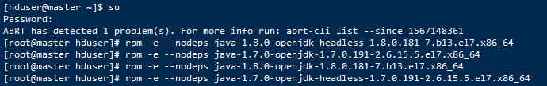

- 命令介绍：
  - rpm 　　　　管理套件  
  - -e　　　　　删除指定的套件
  - --nodeps　　不验证套件档的相互关联性

4、检查是否已经删除成功

```shell
java -version
```


已经删除成功了。


#### 二、下载最新稳定JDK

**【注意】:JDK安装在哪个用户下，就是给哪个用户使用**

- 下载地址为

　　当前最新版本下载地址：http://www.oracle.com/technetwork/java/javase/downloads/index.html

　　历史版本下载地址：http://www.oracle.com/technetwork/java/javase/archive-139210.html  

1、下载jdk，选择版本。

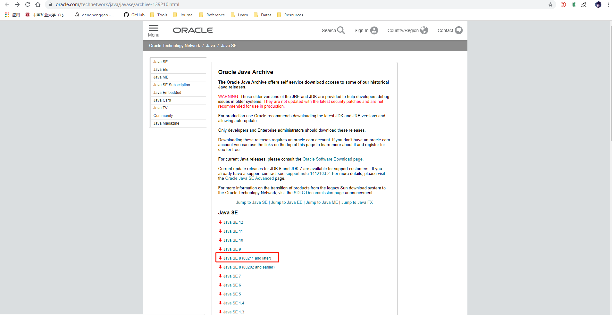


2、选择

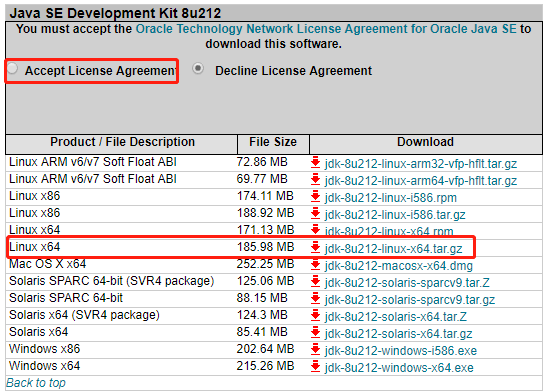

3、通过终端在/usr/local目录下新建java文件夹，命令行：

```shell
mkdir /usr/local/java
```

4、给文件夹赋予权限（为了能够从Windows下载传输到VMware中CentOS机器上）

```shell
chmod -R 777 /usr/local/java
```

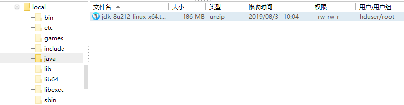


5、进入java目录

```shell
cd /usr/local/java
```

6、解压压缩包

```shell
tar -zxvf jdk-8u212-linux-x64.tar.gz
```

- 命令介绍：
  - tar	备份文件
  - -zxvf　　　　　
    - -z	通过gzip指令处理备份文件
    - -x 	从备份文件中还原文件
    - -v	显示指令执行过程
    - -f	指定备份文件
    - jdk-8u212-linux-x64.tar.gz	文件名

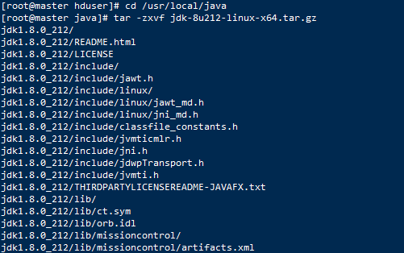

7、然后可以把压缩包删除

```shell
rm -rf jdk-8u212-linux-x64.tar.gz
```

- 命令解释：
  - rm　　　　删除文件或目录
  - -rf　　　　  强制删除文件或目录

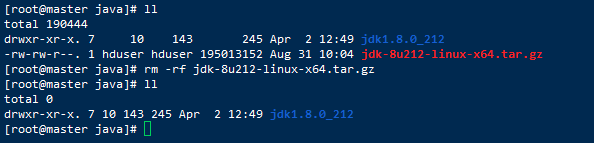


#### 三、配置JDK变量

1、编辑全局变量

```
vim /etc/profile
```

- 按`i`进入插入状态：

- 在文本的最后一行粘贴如下

```shell
#java enviroment
export JAVA_HOME=/usr/local/java/jdk1.8.0_212
export CLASSPATH=.:$JAVA_HOME/jre/lib/rt.jar:$JAVA_HOME/lib/dt.jar:$JAVA_HOME/lib/tools.jar
export PATH=$PATH:$JAVA_HOME/bin
```

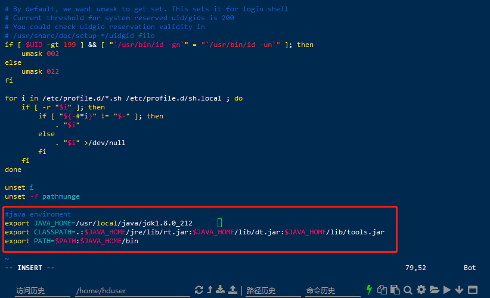

2、保存，退出。esc-->:wq

3、使配置生效

```shell
source /etc/profile
```

4、测试是否配置成功

```shell
[root@master hduser]# java -version
java version "1.8.0_212"
Java(TM) SE Runtime Environment (build 1.8.0_212-b10)
Java HotSpot(TM) 64-Bit Server VM (build 25.212-b10, mixed mode)
```


```shell
javac
```

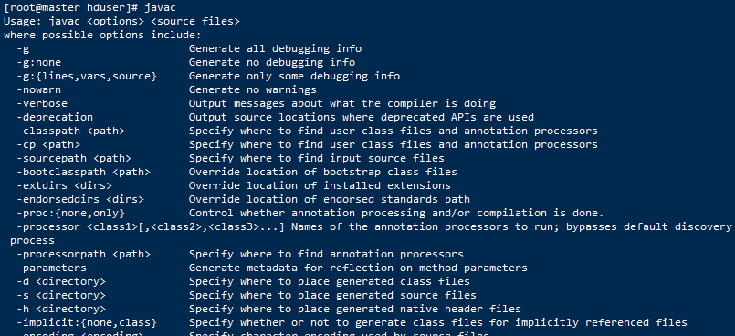


CentOS7.6中JDK安装参考：

https://www.cnblogs.com/116970u/p/10400436.html


## 七、CentOS7 配置免密码登录

- 4台主机（首先设置好映射`vim /etc/hosts`）
  - 192.168.55.110 master
  - 192.168.55.111 slave1
  - 192.168.55.112 slave2
  - 192.168.55.113 slave3

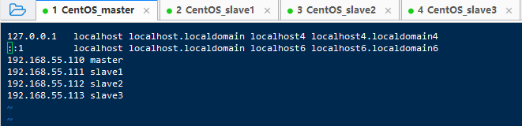

1、四台主机检查 ~/.ssh 文件夹（这里以master节点为例）

```shell
#查看~/.ssh 文件夹
ll ~/.ssh
```

2、没有 ~/.ssh 文件夹则新建。输入`ssh-keygen -t rsa`，一路回车。

```shell
#新建
ssh-keygen -t rsa
```

3、查看  ~/.ssh 目录，会发现它下面生成了两个 id_rsa  ， id_rsa.pub文件


4、在master上将公钥（id_rsa.pub）拷贝到其它节点，包括本机。

```shell
ssh-copy-id master

ssh-copy-id slave1

ssh-copy-id slave2

ssh-copy-id slave3
```

5、在四台机器重复上述步骤即可。


## 八、CentOS问题

### 1、问题描述

- 只针对平配好以后突然出现问题

- 之前好好的，突然master、slave1、slave2节点ping不通网络、windows主机，相互也ping不通。
- FinalShell、XShell连接不了

### 2、解决方法

- windows桌面：右键计算机——管理——服务和应用程序——服务，找到VMware DHCP Service与VMware NAT Service并确保已开启 

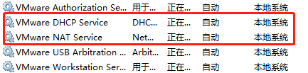

我的问题在这里解决了。原因分析：可能是使用电脑管家加速时关闭了。

