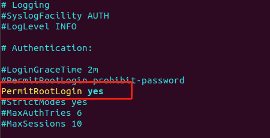
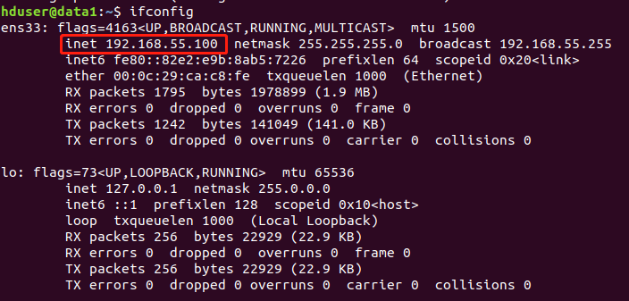

[TOC]


## 一、VMware Workstation下安装VMware Tools（Ubuntu系统）

参考：https://blog.csdn.net/wuzhiwuweisun/article/details/79204514


## 二、VMware中Ubuntu网络设置

1、VMware-->编辑tab->虚拟网络编辑器单，查看网络配置:

```
子网IP：192.168.55.0
子网掩码：255.255.255.0
网关IP：192.168.55.2
```

- 条件

  1、主机通过桥接、nat方式ping通虚拟机的Ubuntu系统

  2、Ubuntu系统能ping通外网

  本人是通过nat方式连接，Ubuntu的网络设置：

  

2、设置设备远程连接 SSH

```shell
sudo apt-get update
 
sudo apt-get install openssh-client 
sudo apt-get install openssh-server
 
vi /etc/ssh/sshd_config
```



3、重启SSH服务

```
sudo service ssh restart
```

4、查看SSH，

- ssh-agent表示ssh-client启动
- sshd表示ssh-server启动了

```
ps -ef |grep ssh
```


5、ifconfig假如出现command not found，可以执行下面的命令来安装net-tools

```
sudo apt install net-tools
```



6、在XShell、FinalShell远程工具进行连接。NotePad++的插件NppFTP也可以链接。


## 三、解决ubuntu vi编辑器上下箭头变成ABCD的问题

```shell
sudo apt-get remove vim-common

sudo apt-get install vim
```

