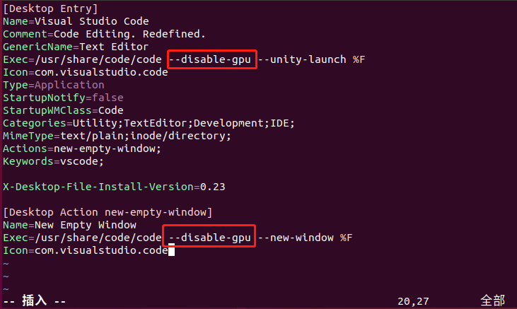
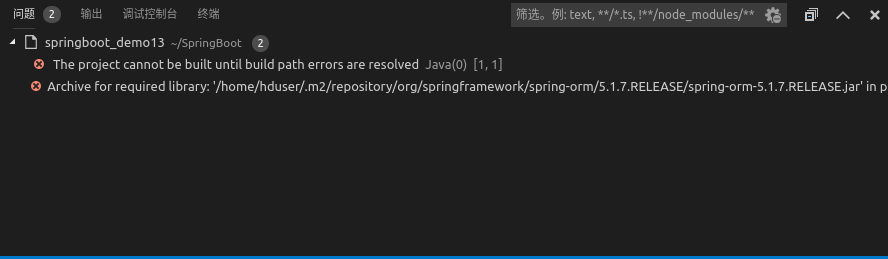
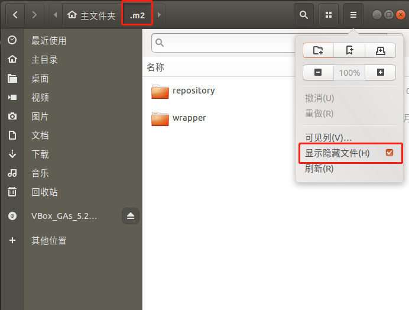
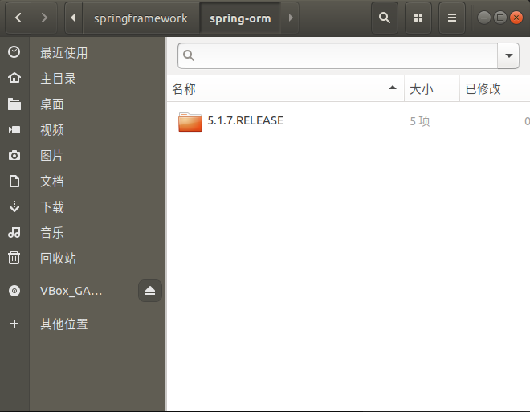

## VSCode优化

网上查了下，说是要禁用 gpu。那怎么设置呢？我自己将 vscode 设置到左边快速启动栏了。所以需要修改配置

```shell
hduser@data1:~$ cd /usr/share/applications
hduser@data1:/usr/share/applications$ sudo vim code.desktop
```

在打开的文件中`两处地方`加入 `--disable-gpu`，如下：

下面是修改添加的部分




## problems

出现如下问题

```java
The project cannot be built until build path errors are resolved
Archive for required library: '/home/hduser/.m2/repository/org/springframework/spring-orm/5.1.7.RELEASE/spring-orm-5.1.7.RELEASE.jar' in project 'springboot_demo13' cannot be read or is not a valid ZIP file
```



解决，找到.m2文件夹，按问题找到对应目录，我这里对应：/home/hduser/.m2/repository/org/springframework/spring-orm，删除所有文件。



删除如下内容，刷新项目（新建项目），问题消失。



