## 1、启动CDM命令

```powershell
#1.找到VirtualBox安装目录,输入cmd
```

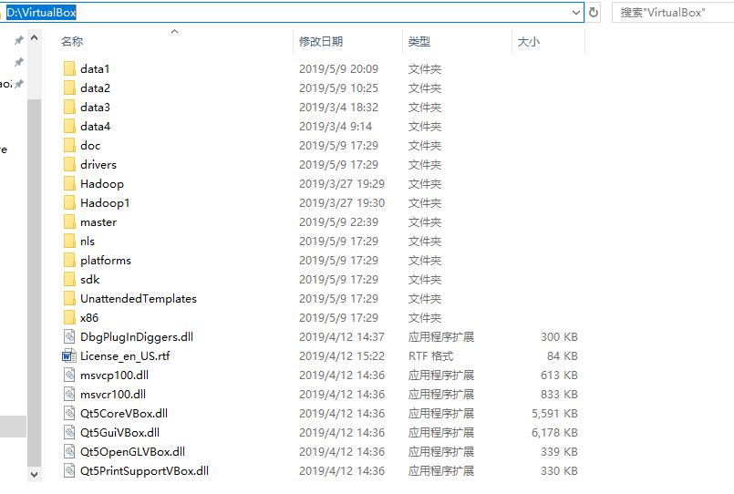

```powershell
#2、然后查看需要修改的虚拟硬盘：
D:\VirtualBox>VBoxManage list hdds
```

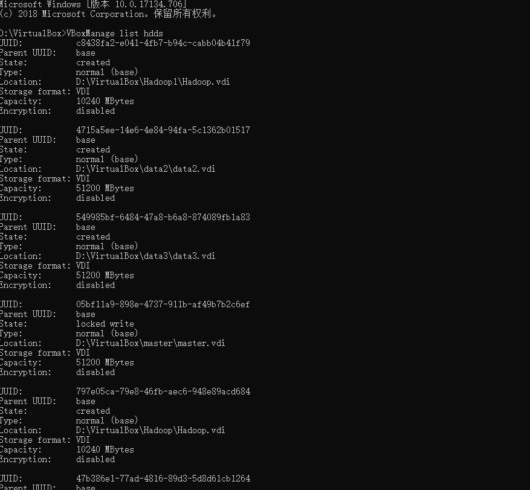

## 2、修改硬盘镜像

### 1）、查看到要修改的UUID

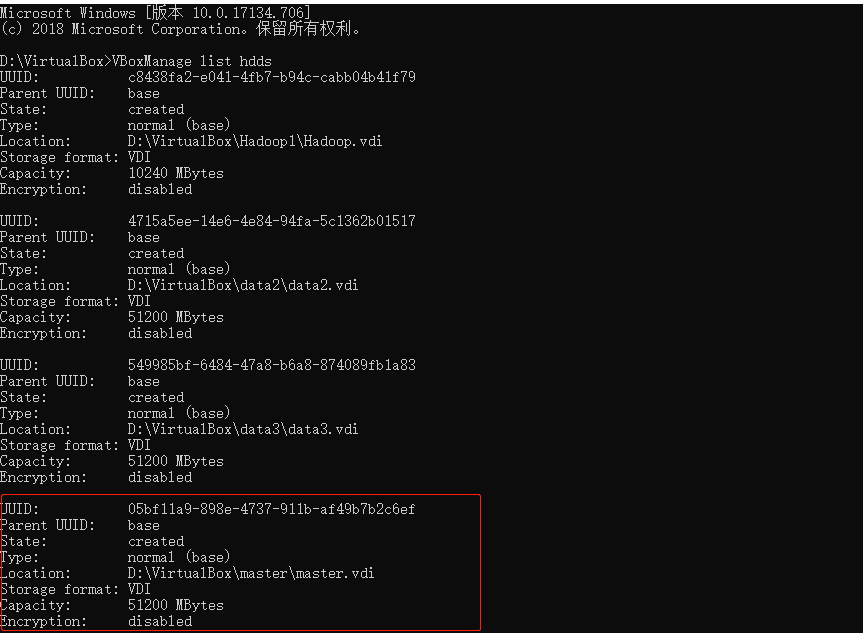

```powershell
VBoxManage modifyhd YOUR_HARD_DISK.vdi –resize SIZE_IN_MB
```

#其中YOUR_HARD_DISK.vdi用真实的虚拟机文件替代，SIZE_IN_MB则由调整后的空间大小替代。如：

```powershell
D:\VirtualBox>VBoxManage modifyhd 05bf11a9-898e-4737-911b-af49b7b2c6ef --resize 102400
```

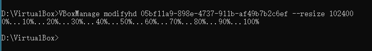

### 2）、再重新查看下虚拟硬盘的大小

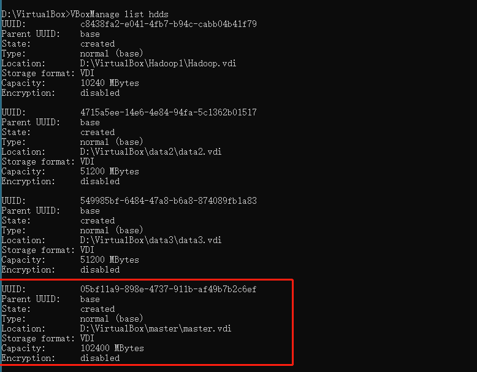

### 3）、打开虚拟机

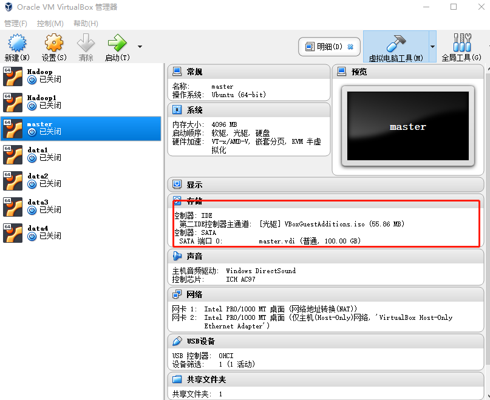

### 4）、进入虚拟机Master

```shell
hduser@master:~$ sudo fdisk -l /dev/sda
```


## 3、开始分区

```shell
#输入命令
hduser@master:~$ sudo fdisk /dev/sda
#然后按m查看帮助文档
```

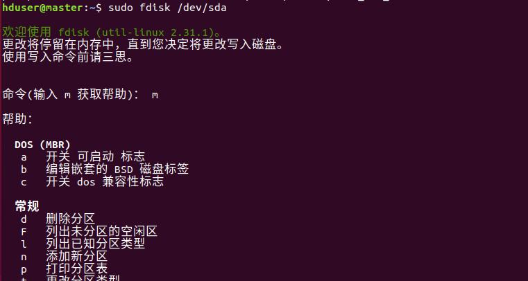

首先输入命令：n(添加新分区)之后回车： 

接着输入命令:p 

剩下步骤全按回车默认， 

最后输入命令w保存分区信息。

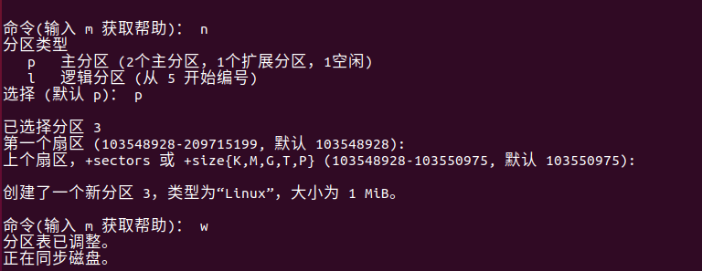

再查看下分区信息：fdisk -l (这里会出现权限不够，如图)

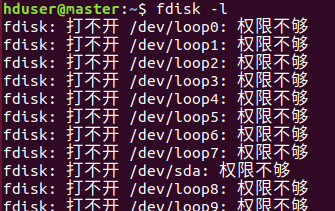

```shell
#使用root权限
hduser@master:~$ sudo -i
root@master:~# fdisk -l
```

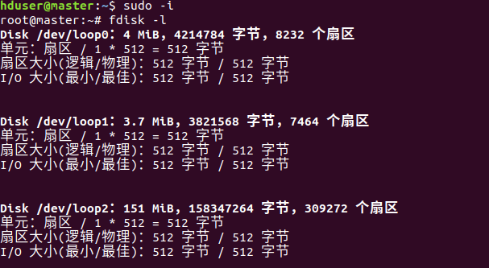

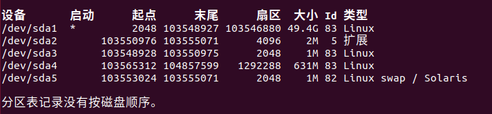

(这个地方还是没显示刚刚添加的分区，具体原因目前不清楚，重复步骤3，查看如下)

## 4、格式化分区

