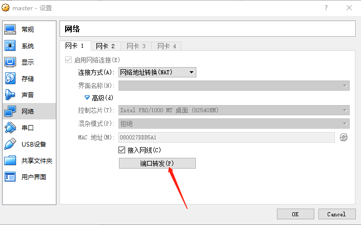
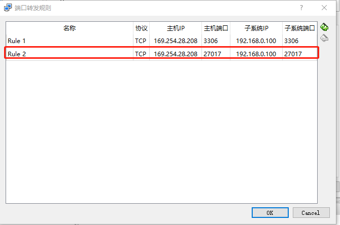
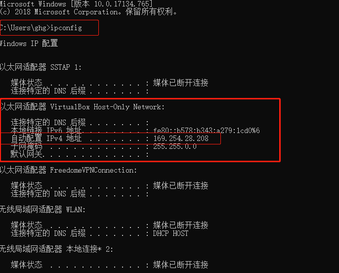
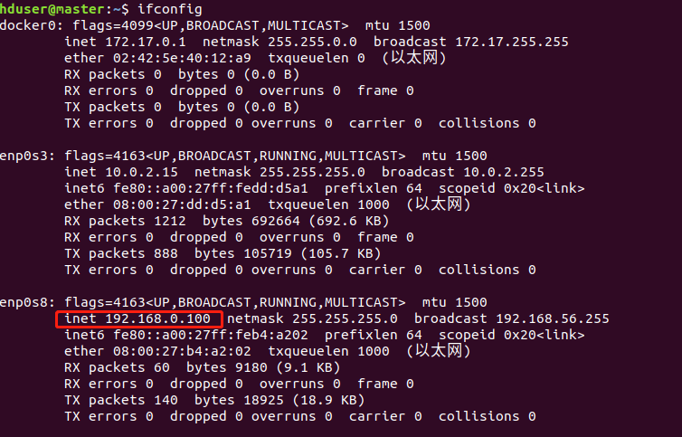
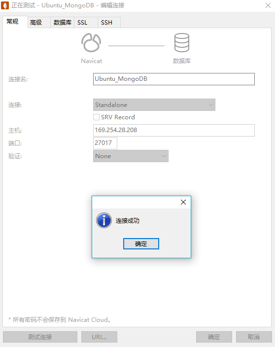

# Windows本机Navicat连接Ubuntu中MongoDB连接

1）、相关配置

- 本机系统：Window10
  - Navicate Premium 12
- VirtualBox：
  - Ubuntu18.04
  - MongoDB 3.6.3

2）、修改配置文件mongodb.conf。把 bind_ip=127.0.0.1 这一行修改成 bind_ip=0.0.0.0

```shell
hduser@master:~$ vim /etc/mongodb.conf
```

2）、查看端口号开放情况，可以看出我的27017端口号可以远程访问0.0.0.0

```shell
hduser@master:~$ netstat -tln
激活Internet连接 (仅服务器)
Proto Recv-Q Send-Q Local Address           Foreign Address         State      
tcp        0      0 0.0.0.0:27017           0.0.0.0:*               LISTEN     
tcp        0      0 0.0.0.0:139             0.0.0.0:*               LISTEN     
tcp        0      0 127.0.0.53:53           0.0.0.0:*               LISTEN     
tcp        0      0 0.0.0.0:22              0.0.0.0:*               LISTEN     
tcp        0      0 127.0.0.1:631           0.0.0.0:*               LISTEN     
tcp        0      0 0.0.0.0:445             0.0.0.0:*               LISTEN     
tcp6       0      0 :::3306                 :::*                    LISTEN     
tcp6       0      0 :::139                  :::*                    LISTEN     
tcp6       0      0 :::22                   :::*                    LISTEN     
tcp6       0      0 ::1:631                 :::*                    LISTEN     
tcp6       0      0 :::445                  :::*                    LISTEN  
```

3）、在VirtualBox中点击需要设置的，我这里是master机器。点击设置-->网络-->端口转发



4）、解释一下这里，主机IP就是Virtualbox虚拟网卡的IP，子系统IP就是虚拟机IP，需要在虚拟机系统中查看。



5）、主机查看Virtualbox虚拟网卡的IP。运行cmd-->ipconfig。



6）、虚拟机Ubuntu中ip。终端输入ifconfig。



7）、主机Window中打开Navicat Premium。

