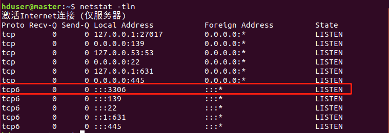

# Windows本机Navicat连接Ubuntu中MySQL连接

1）、相关配置

- 本机系统：Window10
  - Navicate Premium 12
- VirtualBox：
  - Ubuntu18.04

2）、确定用户远程权限打开，如下我的henggao用户可以在远程机器访问。

```shell
#进入mysql
root@master:~# mysql

#选中数据库
use mysql;

#接着查看当前数据库账户信息
mysql> select user,host from user;
+------------------+-----------+
| user             | host      |
+------------------+-----------+
| henggao          | %         |
| debian-sys-maint | localhost |
| mysql.session    | localhost |
| mysql.sys        | localhost |
| root             | localhost |
+------------------+-----------+
5 rows in set (0.00 sec)
```

3）、在VirtualBox中点击需要设置的，我这里是master机器。点击设置-->网络-->端口转发-->


解释一下这里，主机IP就是Virtualbox虚拟网卡的IP，子系统IP就是虚拟机IP，需要在虚拟机系统中查看（第4、5步）。


4）、主机查看Virtualbox虚拟网卡的IP。运行cmd-->ipconfig。


5）、虚拟机Ubuntu中ip。终端输入ifconfig。


6）、主机Window中打开Navicat Premium。


**注意：**如果仍然连接不上，尝试查看配置文件my.cnf是否注释了`# bind-address = 127.0.0.1`这一项，很多时候远程连不上是因为这个配置项的原因。

查看端口号是否可以远程访问，我这里已经开放。

```shell
hduser@master:~$ netstat -tln
```




**注意**：如果你Windows本机也装了Mysql，巧的是也是自动启动，那么可能会报错。需要关闭，重启虚拟机Ubuntu，重启Navicat，在连接即可。

参考：<https://blog.csdn.net/w410589502/article/details/51767212>