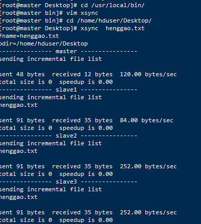

# xsync分发脚本

- rsync主要用于备份和镜像。具有速度快、避免复制相同内容和支持符号链接的优点。

- rsync做文件的复制要比scp的速度快，rsync只对差异文件做更新。scp是把所有文件都复制过去。

1. 在/usr/local/bin 目录下创建 xsync 文件

   ```shell
   [root@master ~]# cd /usr/local/bin/
   [root@master bin]# touch xsync
   [root@master bin]# ll
   total 4
   -rw-r--r--. 1 root root 457 Sep 11 09:28 xsync
   ```

   

2. 在xsync文件下编写

   ```shell
   #!/bin/bash
   # $#：表示传递给脚本或函数的参数个数。
   #1 获取输入参数个数，如果没有参数，直接退出
   pcount=$#
   if((pcount==0)); then
   echo no args;
   exit;
   fi
   
   #2 获取文件名称
   p1=$1
   fname=`basename $p1`
   echo fname=$fname
   
   #3 获取上级目录到绝对路径
   pdir=`cd -P $(dirname $p1); pwd`
   echo pdir=$pdir
   
   #4 获取当前用户名称
   user=`whoami`
   
   #5 循环
   for host in {master,slave1,slave2,slave3}; do
           #echo $pdir/$fname $user@$host:$pdir
           echo --------------- $host ----------------
           rsync -rvl $pdir/$fname $user@$host:$pdir
   done
   ```

   - Note:这里的slave对应自己主机名，需要做相应修改。

3. 修改脚本xsync具有执行权限

   ```shell
   [root@master bin]# chmod 777 xsync
   ```

4. 调用脚本

```shell
#xsync  文件名
[root@master Desktop]# xsync  henggao.txt
```

