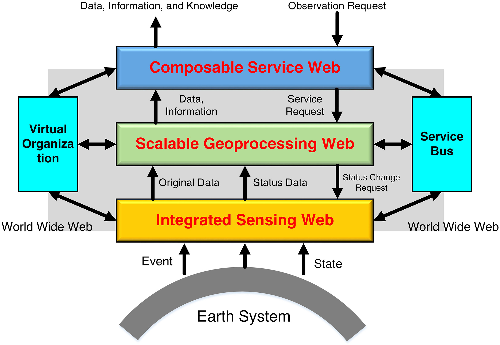
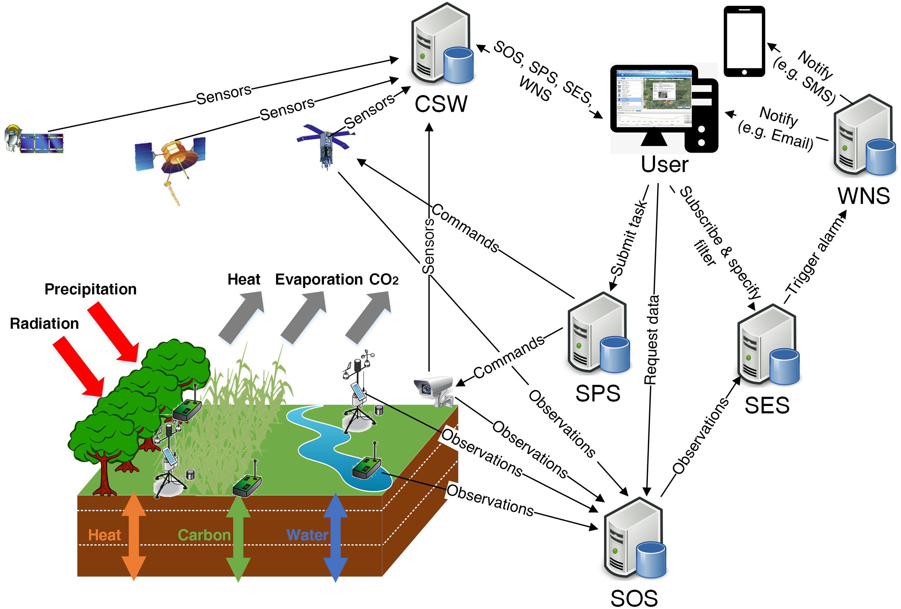
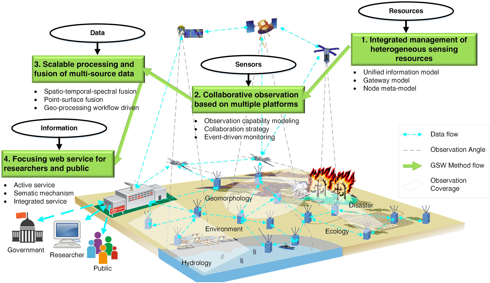
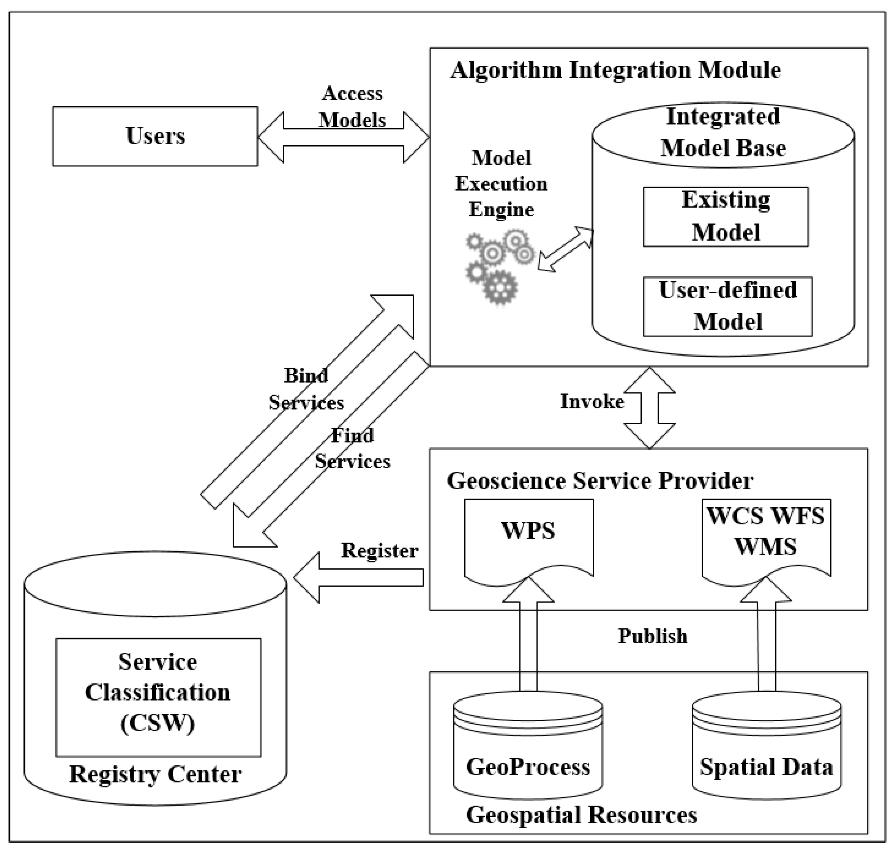
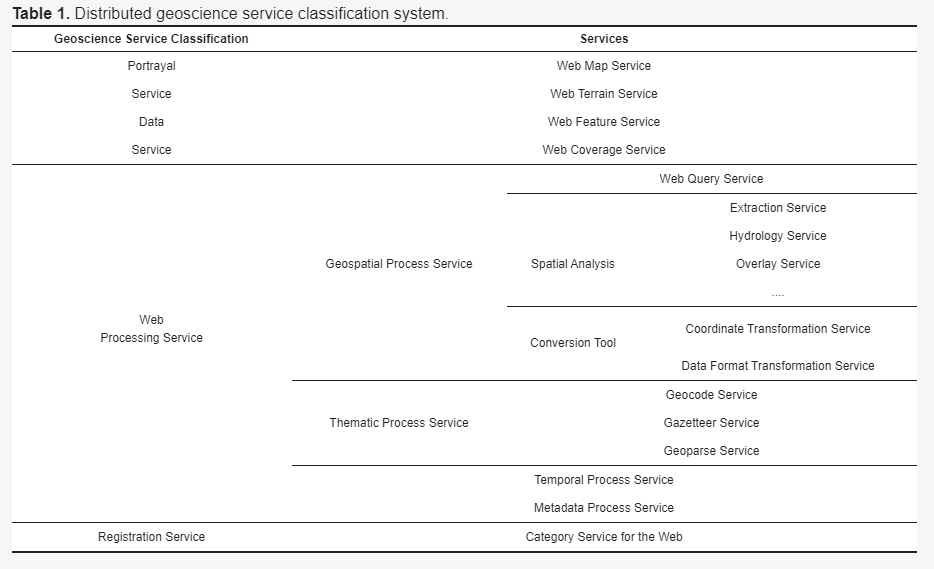
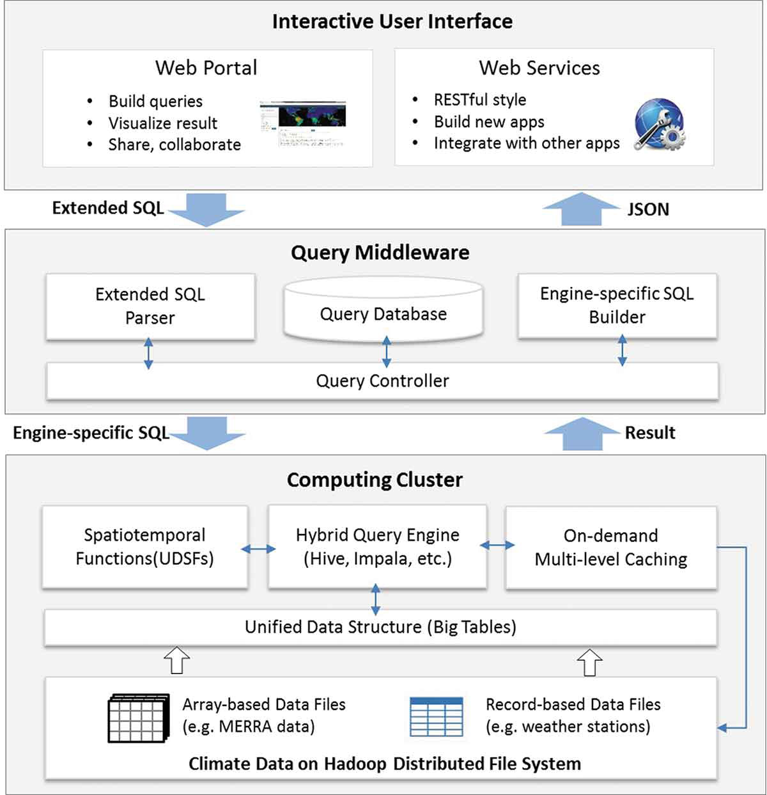
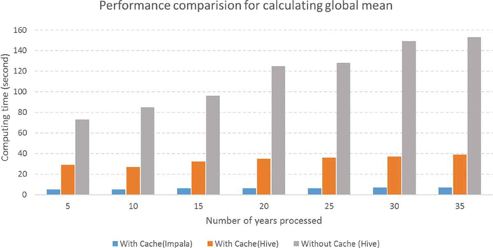

# 2019.10-11
[TOC]

## A framework for real time end to end monitoring and big data oriented management of smart environments

### 1、Highlights

- Monitoring of IoT device requires the analysis of big data.
- We propose a piece framework integrating AllJoyn with MongoDB and Storm.
- Different data patterns were designed to manage several smart home scenarios.
- Simulation experiments prove the feasibility of the proposed system.

### 2、Keywords

- Cloud computing

- Edge computing

- IoT

- Big data

- Monitoring

- Management

### 3、Transactions

- investigated 验证

- actuator 执行器

- smart  IoT Systems 智能物联网系统

- embedded devices 嵌入式设备
- threshold of energy 能量阈值
- energy consumption 能量消耗
- residence 住处
- In such a scenario 在这种情况下
- heterogeneous distributed systems 异构分布式系统
- storage/computing platforms 
- The [Internet of Things](https://www.sciencedirect.com/topics/engineering/internet-of-things) market is fragmented, amorphous, and continually changing 物联网市场是零散的，不固定的并且不断变化。

### 4、Quotations&Comments

MongoDB [[20\]](https://www.sciencedirect.com/science/article/pii/S0743731518308256?via%3Dihub#b20) is one of the major distributed document-oriented NoSQL databases, useful to store and efficiently manage Big Data originated by physical and composed measurements on the environment and on systems.

### 5、Methods

### 6、Technologies

- AllJoyn
- MongoDB
- Storm

### 7、Tasks

### 8、Overview

## [Geospatial sensor web: A cyber-physical infrastructure for geoscience research and application](https://www.sciencedirect.com/science/article/pii/S0012825217305044?via%3Dihub)

### 1、Highlights

### 2、Keywords

- Collaborative observation
- Focusing service
- Geoscience
- Geospatial
- Infrastructure
- Integrated management
- Scalable processing
- Sensor web

### 3、Transactions

- Geospatial Sensor Web 地理空间传感器网（GSW）

- Information and  Communication Technology 信息和通信技术（ICT）

- Open Geospatial Consortium 开放地理空间联盟（OGC）

- five sub-capabilities 五个子功能

- strike-slip faults	走滑断层 

- geoscience decisions	地球科学决策

- there is a need to develop effective interventions for removing or mitigating decision bias. 需要开发有效的干预措施来消除或减轻决策偏见。

- we discuss the cognitive mechanisms underlying decision biases and describe three biases that have been shown to influence geoscientists’ decision-making (availability bias, framing bias, anchoring bias).  我们讨论了决策偏见背后的认知机制，并描述了已证明会影响地球科学家的决策的三个偏见（可用性偏见，框架偏见，锚定偏见）。

- multidisciplinary technologies  多学科技术

- geoscience measurements, data processing, and information services 

- spatiotemporal  时空的

- interactions  相互作用

- This is a rebirth of old geoscience research that is now powered by state-of-the-art Information and Communication Technology (ICT). 这是旧的地球科学研究的重生，现在它由最新的信息和通信技术（ICT）提供支持。

- in-situ sample material  现场样品材料

- seismology 地震学

- hydrology  水文学

-  geomorphology 地貌学

- indispensable  必要的

- satellite remote sensing 卫星遥感

- The most vital component was the integration and display of all earth data 最重要的组成部分是所有地球数据的集成和显示

- overall 总而言之

- the most distinguishing feature 

-  pervasive sensor networks  普遍的传感器网络

-  revolutionize earth systems science  革新了地球系统科学

-  The subsequent GSW 随后的GSW

-  In this way, data integration can be decoupled from the analysis and visualization components, allowing for flexible and dynamic service chaining.  这样，可以将数据集成与分析和可视化组件分离，从而实现灵活而动态的服务链。

-   GSW is an advanced stage sensor web, which not only inherits the advantages of sensor webs but also possesses a greater capability for data processing and information services  GSW是一种先进的传感器网络，它不仅继承了传感器网络的优势，而且还具有更大的数据处理和信息服务能力

-  the emphasis of sensor webs 传感器网的重点

-   it acts as a “bridge” between geoscience observation/phenomenon and geoscience information/knowledge/decision-making. 它是地球科学观测/现象与地球科学信息/知识/决策制定之间的“桥梁”。

  

-  rich connotations 丰富的内涵

-  interoperable 可互操作的

-  This feature is quite different from an archival data based geoscience system. 此功能与基于档案数据的地球科学系统完全不同。

- optimizes the data flow 优化数据流

-  scalable processing and fusion of multi-source data 多源数据的可伸缩处理和融合

-  integrated management of heterogeneous sensing resources 异构传感资源的综合管理

-   syntax-level integration 语法级集成

-   semantic-level integration. 语义级别的集成。

-  Whereas  鉴于

-  obtain instant flood detection 获得即时洪水检测

-   on-demand retrieval 按需检索

-   a simulation/theoretical way  模拟/理论方法

-  simulation  名词：模拟，仿真，假装，仿拟

-  exploit  动词：利用，开发，剥削，开采，应用，勋绩

-  specifications 名词：规格，规范，格式

- feasibility 名词：可行性，可能性，或然性

-  geoscience disciplines 地球科学学科

-  Several emerging technologies could greatly facilitate the **convergence** of a model web, though each has limitations.  尽管每种新兴技术都有其局限性，但几种新兴技术可以极大地促进模型网络的**融合**。

  

### 4、Quotations&Comments

- live and historical sensor data 实时和历史传感器数据
- Geoscience big data has the following three features:
  - high dimensions
  - high complexity
  - high uncertainty
- [satellite remote sensing](https://www.sciencedirect.com/topics/earth-and-planetary-sciences/satellite-remote-sensing) first provides estimations for large areas, which is the most important evolutionary development in geoscience research ([Nash, 1988](https://www.sciencedirect.com/science/article/pii/S0012825217305044?via%3Dihub#bb0825)). 

### 5、Methods

- Three typical research paradigms in geoscience field

  - Experiment-based paradigm.	
  - Sensor-based paradigm.
  - GSW-based paradigm.

- Four key methods of GSW

  -  [integrated management](https://www.sciencedirect.com/topics/earth-and-planetary-sciences/integrated-management) of heterogeneous sensing resources, 

  - collaborative observation based on multiple platforms, 

  - scalable processing and fusion of multi-source data, 

  - focusing web services for researchers, government, and the public.

    
  
    
  
  

### 6、Technologies

- GSW first provides two technologies
  - a gateway model .
  -  a unified information model.

### 7、Tasks

### 8、Overview

## [A novel method for parallel indexing of real time geospatial big data generated by IoT devices](https://www.sciencedirect.com/science/article/pii/S0167739X18303637?via%3Dihub)

### 1、Highlights

### 2、Keywords

- IoT

- Zetta

- ADS-B

- R tree

- R+ tree

- R∗ tree

- MapReduce

- Apache spark

### 3、Transactions

-  in today’s scenario 在今天的情况下
-  the issues of parallel **bulk** loading of data 并行**批量**加载数据的问题
-  protocol  名词：协议，协定，礼仪，礼节，草约

### 4、Quotations&Comments

-  R Tree and its variants have emerged as most efficient, widely accepted and have adopted indexing method for the management and processing of geospatial data.  
-  Geospatial big data can be broadly classified into three types, **i.e.** raster data, vector data, and graph data [[34\]](https://www.sciencedirect.com/science/article/pii/S0167739X18303637?via%3Dihub#b34). 地理空间大数据可以大致分为三种类型，**即**栅格数据，矢量数据和图形数据

### 5、Methods

### 6、Technologies

### 7、Tasks

### 8、Overview

## [The Australian Geoscience Data Cube — Foundations and lessons learned](https://www.sciencedirect.com/science/article/pii/S0034425717301086?via%3Dihub)

### 1、Highlights

### 2、Keywords

- Landsat

- Time-series

- Big data

- Data cube

- High performance computing

- High performance data

- Collection management

- Geometric correction

- Pixel quality

- Australian Geoscience Data Cube

### 3、Transactions

- radiometric corrections辐射校正
-  lessons learnt 得到教训
-   magnetic and gravimetric field intensities 磁场和重力场强度
-   multispectral data 多光谱数据
-   Considering only a handful of these missions, e.g., 仅考虑其中一些任务，例如，
-   which use **slope** and **aspect** to modify the reflectance estimates at each pixel 使用**坡度**和**纵横比**修改每个像素的反射率估算值，
-   Geometric correction is a prerequisite to radiometric correction as the latter requires ancillary data, which must be combined with the image data without introducing errors due to positional mismatching. 几何校正是放射线校正的先决条件，因为后者需要辅助数据，该辅助数据必须与图像数据组合在一起，而不会由于位置不匹配而引入错误。
-    topographic shadow flag  地形阴影标志
-    

### 4、Quotations&Comments

-  The Earth and its systems are complex and interconnected and gaining a comprehensive understanding of these systems and how we interact with them is of critical national and international interest ([Boyd and Crawford, 2012](https://www.sciencedirect.com/science/article/pii/S0034425717301086?via%3Dihub#bb0030), [Frankel and Reid, 2008](https://www.sciencedirect.com/science/article/pii/S0034425717301086?via%3Dihub#bb0090), [Hart and Saunders, 1997](https://www.sciencedirect.com/science/article/pii/S0034425717301086?via%3Dihub#bb0115), [Lynch, 2008](https://www.sciencedirect.com/science/article/pii/S0034425717301086?via%3Dihub#bb0200)). 
-  The Oxford Dictionary defines ‘Big Data’ as “Datasets that are too large and complex to manipulate or interrogate with standard methods or tools”. The term was first described by [Laney (2001)](https://www.sciencedirect.com/science/article/pii/S0034425717301086?via%3Dihub#bb0165) as “the three V's: Volume, Velocity and Variety”. Others have extended this list to include validity, veracity, value, and visibility. 

### 5、Methods

### 6、Technologies

### 7、Tasks

### 8、Overview

## [Distributed Geoscience Algorithm Integration Based on OWS Specifications: A Case Study of the Extraction of a River Network](https://www.mdpi.com/2220-9964/8/1/12/htm)  

### 1、Highlights

- OGC web service; 
- geospatial service; 
- geoscience algorithm; 
- distributed algorithm integration 

### 2、Keywords

### 3、Transactions

-  Open Geospatial Consortium web service (OWS)   开放式地理空间联盟Web服务
-  encapsulated  封装的
-  specifications 名词：规格，规范，格式

### 4、Quotations&Comments

- The pivotal issue that needs to be addressed is the identification of a method to effectively combine geoscience algorithms in a distributed environment to promote cooperation. 需要解决的关键问题是确定一种在分布式环境中有效组合地球科学算法以促进合作的方法。

- Many researchers utilize distributed computing technology to solve these challenges and they have achieved positive results [[1](https://www.mdpi.com/2220-9964/8/1/12/htm#B1-ijgi-08-00012),[2](https://www.mdpi.com/2220-9964/8/1/12/htm#B2-ijgi-08-00012),[3](https://www.mdpi.com/2220-9964/8/1/12/htm#B3-ijgi-08-00012)].  

- In the study, a management mechanism for geoscience algorithms is designed and implemented, which facilitates the registration of, search for, and invocation of the distributed geoscience algorithms.   Geoscience algorithm integration is implemented using an XML-based script. 

- As early as 1983, Blanning proposed the problem of managing various types of geoscience models and algorithms in the form of a document and proposed the concept of the model library, which managed models and algorithms with a defined model library query language (MQL) [[4](https://www.mdpi.com/2220-9964/8/1/12/htm#B4-ijgi-08-00012)]. 

- Driven by network technology, web service platforms have become a new solution for the integration of network applications. Web service technologies have been widely used to construct distributed, modular applications and service-oriented applications. 

- Service-oriented applications have become the direction of new geoscience developments. Geospatial application activities are moving from a professional field to a networked, socialized, and popular service that is being accepted by various domain experts and even nonprofessionals [[7](https://www.mdpi.com/2220-9964/8/1/12/htm#B7-ijgi-08-00012)].  

- The emergence of common web services also enables geospatial data sharing and algorithm interoperability, and, when compared with other distributed architectures, the geoscience algorithm sharing based on a common service-oriented architecture (SOA) has obvious advantages. 

- To meet the requirements of distributed geoscience data and algorithm sharing, the International Organization for Standardization/Technical Committee (ISO/TC 211) and the Open Geospatial Consortium (OGC) formulated a series of geographical data services and processing service standards, including a Web Map Service (**WMS**), Web Feature Service (**WFS**), Web Coverage Service (**WCS**), and Web Processing Service (**WPS**), to standardize data transmission and processing interfaces. 

-  **Figure 1.** The architecture of distributed geoscience algorithm integration. 

  

-  **Table 1.** Distributed geoscience service classification system. 

  

-  Experiment
  
  - Four server host virtual machines (VMs) are launched in Beijing, Shanghai, Guangzhou, and Hong Kong, as shown in [Figure 7](https://www.mdpi.com/2220-9964/8/1/12/htm#fig_body_display_ijgi-08-00012-f007)a. Each VM is equipped with four virtual CPUs of 2.2 GHz, 8-GB RAM, and a 20 Mb/s network.   To test the feasibility and performance of the proposed method around the world, the test environment is also built on Alibaba Cloud, which is a cloud service that is available around the world. Four server host VMs are launched in London (UK), Silicon Valley (USA), Beijing (CHN), and Sydney (AUS), as shown in [Figure 7](https://www.mdpi.com/2220-9964/8/1/12/htm#fig_body_display_ijgi-08-00012-f007)b. Each VM is equipped with four virtual CPUs of 2.5 GHz, 8-GB RAM, and 40G ROM. 
- 

### 5、Methods

### 6、Technologies

### 7、Tasks

### 8、Overview

## [SOVAS: a scalable online visual analytic system for big climate data analysis](https://www.tandfonline.com/doi/full/10.1080/13658816.2019.1605073)

### 1、Highlights

### 2、Keywords

- big spatiotemporal data, 
- query analytics
- climate
- Hadoop

### 3、Transactions

- back-end parallel processing and front-end data visualization. 

### 4、Quotations&Comments

- Meanwhile, various parallel computing paradigms have been developed to manipulate massive spatiotemporal data from the traditional Cluster and Grid Computing, to Cloud Computing and heterogeneous CPU/GPU Computing (Schadt *et al*. [2010](https://www.tandfonline.com/doi/full/10.1080/13658816.2019.1605073#), Li *et al*. [2013a](https://www.tandfonline.com/doi/full/10.1080/13658816.2019.1605073#), Huang *et al*. [2013b](https://www.tandfonline.com/doi/full/10.1080/13658816.2019.1605073#), Yang *et al*. [2017](https://www.tandfonline.com/doi/full/10.1080/13658816.2019.1605073#), Hu *et al*. [2018a](https://www.tandfonline.com/doi/full/10.1080/13658816.2019.1605073#)).  

- While these online systems can integrate and analyze distributed geospatial data, most of them only support fixed user interface with predefined functions. 

- high performance computing using MapReduce parallel computing framework (Li *et al*. [2016](https://www.tandfonline.com/doi/full/10.1080/13658816.2019.1605073#)), 

- SOVAS adopts a layer-based architecture that seamlessly synthesizes big spatiotemporal data management, parallel computing, spatiotemporal query analytics, visualization, and spatial web portal in a unified environment ([Figure 1](https://www.tandfonline.com/doi/full/10.1080/13658816.2019.1605073#F0001)).  

-  **Figure 1.** **Overall system architecture.** 

  

- 

### 5、Methods

- The web portal is developed with Javascript and HTML by utilizing a set of third-party libraries, including jQuery, Bootstrap for interface, as well as D3.js, Google Chart API, Google Maps APIs, and Web WorldWind for visualizations. 

- More computer nodes can be added without the need of modifying the system. We observed that most queries were finished within several minutes when analyzing the two terabytes of climate data using our 13-node cluster. 

-  Figure 14. Performance comparison for calculating global mean with different mechanisms. 

  

- 

### 6、Technologies

### 7、Tasks

### 8、Overview

## [Developing a web-based spatial decision support system for geothermal exploration at the Olkaria geothermal field](https://www.tandfonline.com/doi/full/10.1080/17538947.2017.1284909)

### 1、Highlights

### 2、Keywords

- GIS
- SDSS
- geothermal
- a web based 
- multi-criteria decision analysis

### 3、Transactions

- State of the art 最先进的
- multidisciplinary 多学科的
- electrical resistivity 电阻率
-  Pressure data  
-  Gravity surveys 
- DEM
  -  In order to measure slope information, a DEM was used. 
- Presentation tier展示层

### 4、Quotations&Comments

- An extensible system is one that can be modified by changing or adding features (Miller [2004](https://www.tandfonline.com/doi/full/10.1080/17538947.2017.1284909#)). 

### 5、Methods

### 6、Technologies

### 7、Tasks

### 8、Overview

## AkvaGIS: An open source tool for water quantity and quality management

### 1、Highlights

### 2、Keywords

### 3、Transactions

### 4、Quotations&Comments

### 5、Methods

### 6、Technologies

### 7、Tasks

### 8、Overview

## [Modelling the Distribution and Quality of Sand and Gravel Resources in 3D: a Case Study in the Thames Basin, UK](https://link.springer.com/article/10.1007%2Fs10666-018-9650-2)

### 1、Highlights

### 2、Keywords

### 3、Transactions

### 4、Quotations&Comments

### 5、Methods

### 6、Technologies

### 7、Tasks

### 8、Overview

## [Big Geo-Data Handling Based on Parallel and Distributed System’s Strategies](https://link.springer.com/chapter/10.1007/978-3-319-51629-5_4)

### 1、Highlights

### 2、Keywords

### 3、Transactions

### 4、Quotations&Comments

### 5、Methods

### 6、Technologies

### 7、Tasks

### 8、Overview