# 一、搭建开发环境

[TOC]


## 1、技术基础

- Vue.js官网：https://cn.vuejs.org/
- Vue.js教程：http://www.runoob.com/vue2/vue-tutorial.html
- Vue-router教程：https://router.vuejs.org/zh/guide/
- Vuex教程：https://vuex.vuejs.org/zh/guide/
- Element教程：https://element.eleme.cn/#/zh-CN


## 2、开发环境

- 编译器：Visual Studio Code

### 2.1、Node JS

#### 2.1.1、下载

下载地址：https://nodejs.org/en/download/，选择windows系统64位。

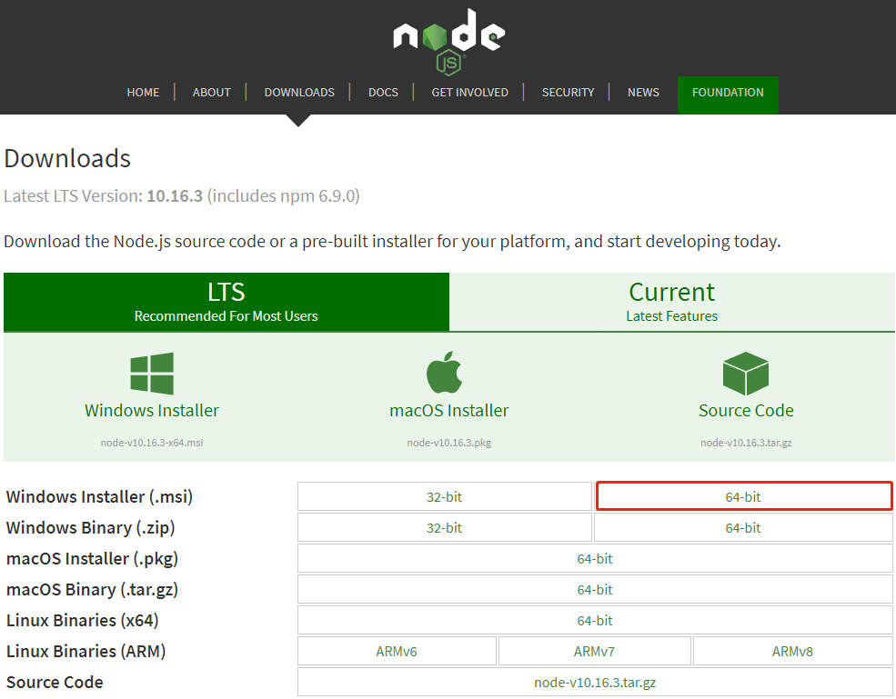

#### 2.1.2、开始安装

下载完之后，双击打开。

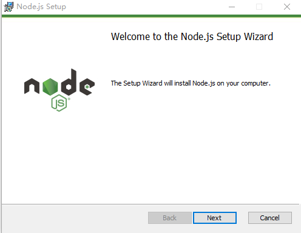

点击【Next】按钮

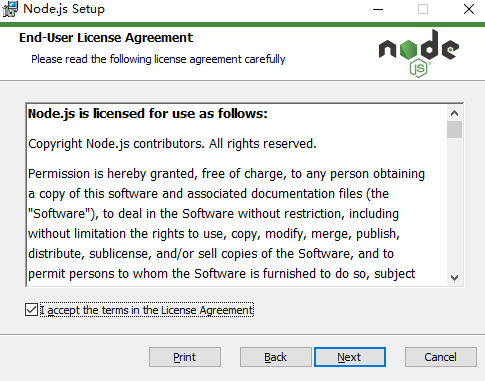

勾选复选框，点击【Next】按钮

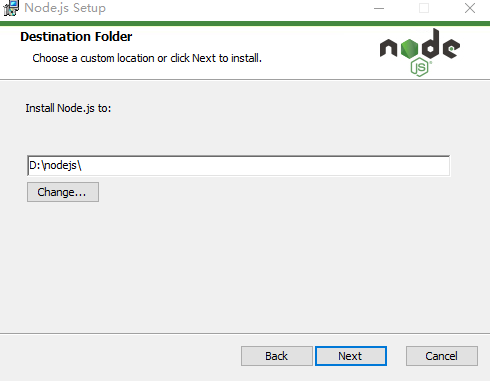

修改好目录后，点击【Next】按钮

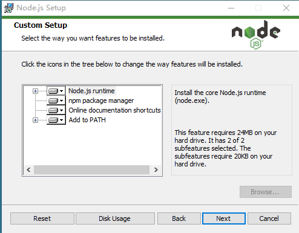

默认安装这四个选项，点击【Next】按钮

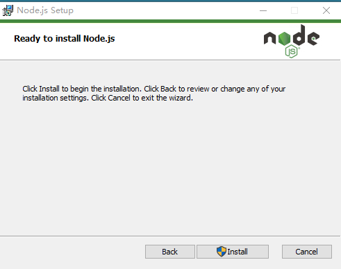

点击【Install】按钮

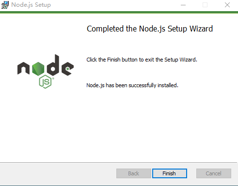

安装完后点击【Finish】按钮完成安装

#### 2.1.3、测试安装

打开终端 window+R，输入cmd，在终端输入命令查询。

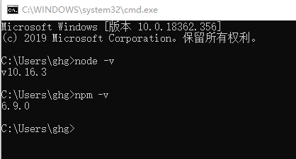

安装完后的目录如下图所示：

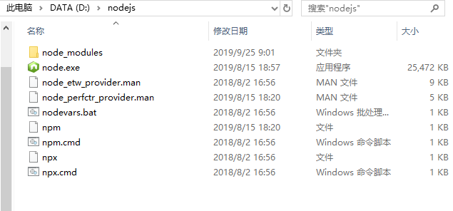

#### 2.1.4、配置环境变量

NodeJS和NPM安装好了以后并不能直接使用，默认情况下，NPM安装的模块并不会安装到NodeJS的程序目录，比如我们安装的时候设置的D盘，“D:\Program Files\nodejs”，而我们使用npm安装一个cluster模块他会出现在C盘默认的路径下面，所以，如果我们不修改npm的模块安装目录，那么它默认情况下都会安装到这里，随着你测试开发各种不同的项目，安装的模块越来越多，这个文件夹的体积就会越来越大，直到占满你的C盘。所以我们要修改npm的配置。

- 在nodejs文件夹下，创建两个为文件夹：【 node_global】、【node_cache】

  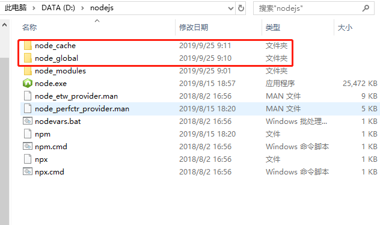

- 创建完两个空文件夹之后，打开cmd命令窗口，输入

```
npm config set prefix "D:\nodejs\node_global"

npm config set cache "D:\nodejs\node_cache"
```

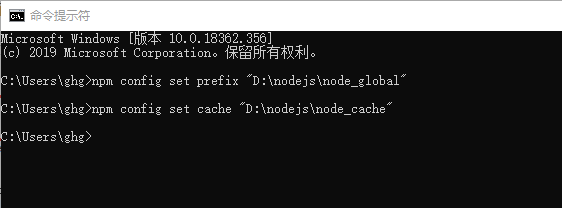

- 接下来设置环境变量，关闭cmd窗口，“我的电脑”-右键-“属性”-“高级系统设置”-“高级”-“环境变量”

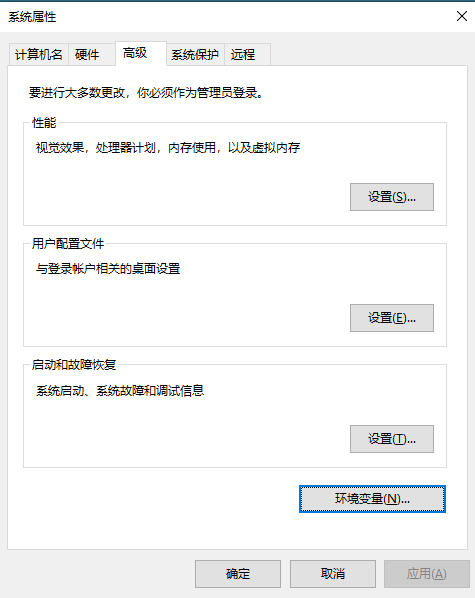

- 进入环境变量对话框，在【系统变量】下新建【NODE_PATH】，输入【D:\nodejs\node_global\node_modules】

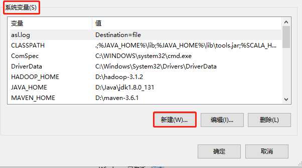

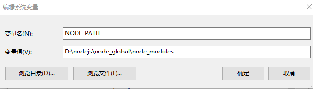

- 将【用户变量】下的【Path】修改为【D:\nodejs\node_global】

  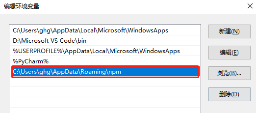

  点击【编辑】，修改为【D:\nodejs\node_global】

  


#### 2.1.5、测试

- 输入：node回车

- 输入：

  ```shell
  require('cluster')
  ```

  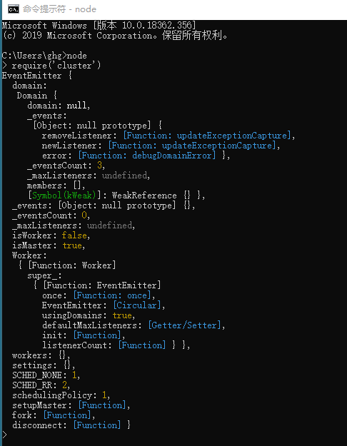

  出现以上内容说明配置成功。

配置完后，安装个module测试下，我们就安装最常用的express模块，打开cmd窗口，
输入如下命令进行模块的全局安装：

```shell
npm install  express -g
```

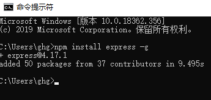

查看【D:\nodejs\node_global\node_modules\express】

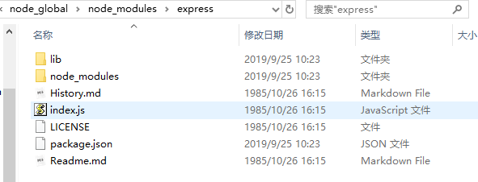

### 2.2、安装`webpack`

安装好`npm`之后，可以通过npm命令来下载工具。安装打包工具`webpack`，-g表示全局安装。

```shell
npm install webpack -g
```

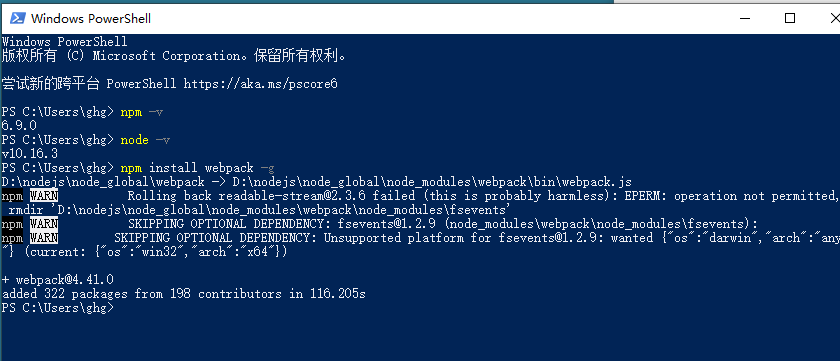

- `webpack`教程：https://www.runoob.com/w3cnote/webpack-tutorial.html

- 补充

  webpack打包时可能报错。

  ```shell
  #查看信息
  webpack -v
  ```

  - 输入命令报信息如下，输入‘’no“

  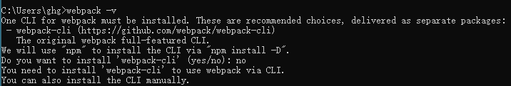

  ```shell
  npm install webpack-cli -g
  
  #再次查看信息
  webpack -v
  ```

  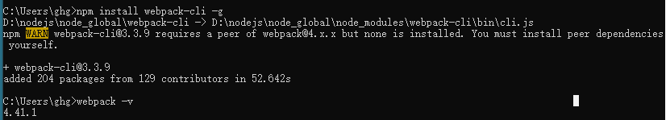

### 2.3、安装`vue-cli`

安装`vue`脚手架初始化工具`vue-cli`，-g表示全局安装。

```shell
npm install vue-cli -g
```

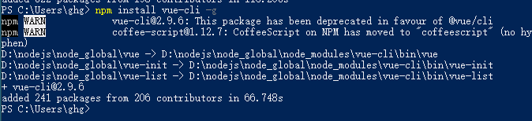

### 2.4、淘宝镜像

- 因为`NPM`使用国外的中央仓库，下载比较慢。建议使用淘宝镜像。

- 安装淘宝镜像，安装成功后用`cnpm`代替`npm`命令即可。

```shell
npm install -g cnpm --registry=https://registry.npm.taobao.org
```

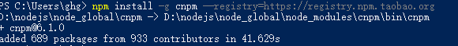

### 2.5、安装Yarn

Yarn是Facebook发布的node.js包管理器，比npm更快、更高效，可以使用Yarn替代npm。

```shell
npm i yarn -g -verbose
```

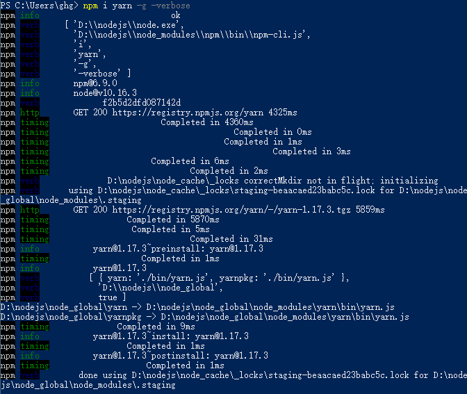

NPM官方源访问速度较慢，使用之前切换为淘宝镜像。在安装Yarn之后执行指令：

```shell
yarn config set registry https://registry.npm.taobao.org
```

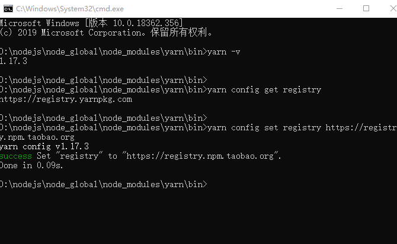

- 注意：由于windows主机环境变量配置类Hadoop，而Hadoop里Yarn会与Node中Yarn发生冲突。这里切换到【D:\nodejs\node_global\node_modules\yarn\bin】中使用yarn命令。


## 3、创建项目

### 3.1、生成项目

```shell
vue init webpack mongeostore-ui
```

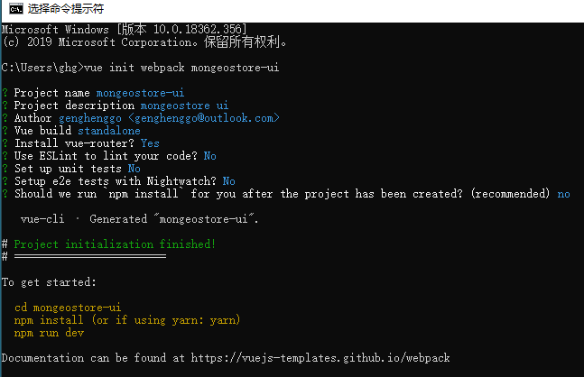

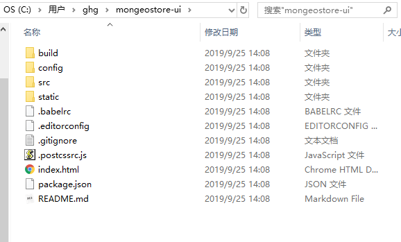

### 3.2、安装依赖

进入项目更目录，执行`cnpm install`（也可以用`npm install`或者`yarn install`，我们这里使用淘宝的`cnpm install`） 安装依赖。（由于windows本机配置了`Hadoop` ，使用yarn会报错）

```shell
cd mongeostore-ui
cnpm install
```

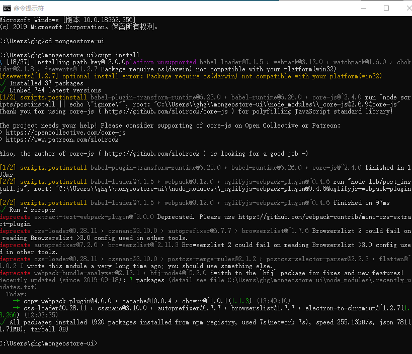

等到依赖安装完成之后，会在项目根目录下生成`node_modules`文件夹，这个目录下载的依赖包的统一存放目录。

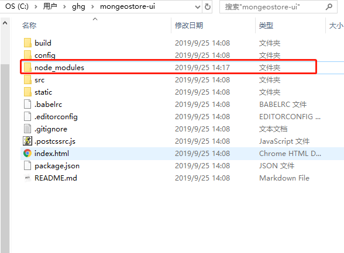

### 3.3、启动运行

安装完成之后，执行命令，运行项目。

```shell
npm run dev
```

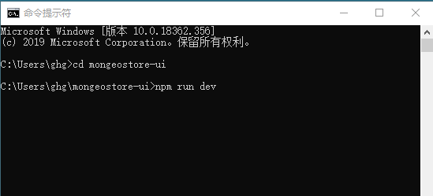


浏览器访问对应地址 localhost:8080

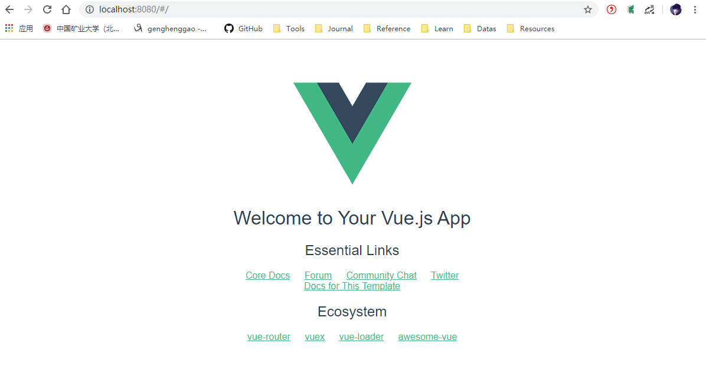

项目的脚手架就建立起来了。