# 七、管理应用状态

[TOC]

## 1、安装依赖

安装vuex依赖

```shell
 cnpm install --save vuex 
```

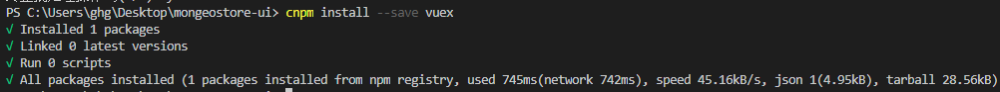

## 2、添加store

在src目录下新建一个store目录，专门管理应用状态。

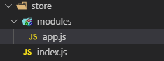

### 2.1、index.js

在index.js中引入vuex并统一组织到如何管理模块。

- index.js

```js
/*
 * @Description: 
 * @version: 
 * @Author: henggao
 * @Date: 2019-09-27 11:05:34
 * @LastEditors: henggao
 * @LastEditTime: 2019-09-27 11:05:34
 */
import Vue from 'vue'
import vuex from 'vuex'

Vue.use(vuex)

//引入子模块
import app from './modules/app'

const store = new vuex.Store({
    modules: {
        app: app
    }
});

export default store
```

### 2.2、app.js

app.js是属于应用内全局性配置，如主题色、导航栏收缩状态等。

- app.js

```js
/*
 * @Description: 
 * @version: 
 * @Author: henggao
 * @Date: 2019-09-27 11:05:54
 * @LastEditors: henggao
 * @LastEditTime: 2019-09-27 11:05:54
 */
export default{
    state: {
        appName: "Mongeostore Platform" ,//应用名称
        themeColor: "#14889A", //主题色
        oldThemeColor: "#14889A", //上一次主题
        collapse: false, //导航栏收缩状态
        menuRouteLoaded: false //菜单和路由是否已经加载
    },
    getters:{
        collapse(state){
            //对应着上面的state
            return state.collapse
        }
    },
    mutations: {
        onCollapse(state){ //改变收缩状态
            state.collapse = !state.collapse
        },
        setThemeColor(state,themeColor){ //改变主题颜色
            state.oldThemeColor = state.themeColor
            state.themeColor = themeColor
        },
        menuRouteLoaded(state,menuRouteLoaded){ //改变菜单和路由的加载状态
            state.menuRouteLoaded = menuRouteLoaded
        }
    },
    actions: {
        
    }
}
```

### 2.3、引入Store

在main.js中引入store

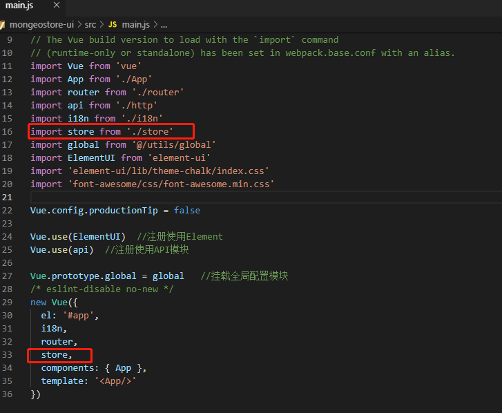

### 2.4、使用Store

头部页面HeadBar.vue、主要内容页面MainContent.vue

通过computed计算属性引入store属性，这样可以直接在页面中通过collapse引用状态值了。

- HeadBar.vue

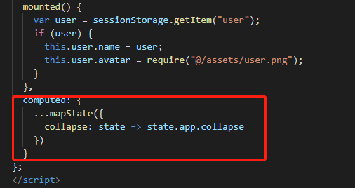

- 需要导入mapState

  ```shell
  import { mapState } from "vuex";
  ```

在页面中通过collapse的状态值来绑定不同的宽度样式。

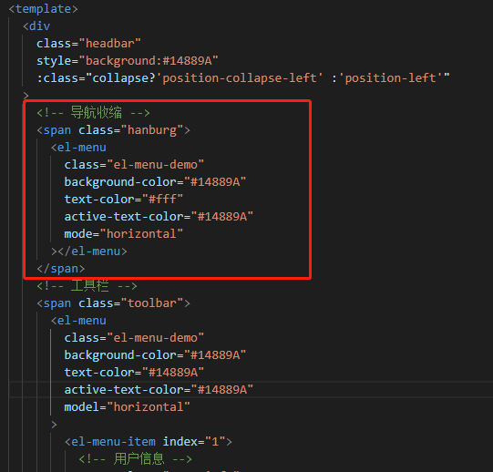

```vue
<!--
 * @Description: 
 * @version: 
 * @Author: henggao
 * @Date: 2019-09-27 09:13:12
 * @LastEditors: henggao
 * @LastEditTime: 2019-09-27 15:58:56
 -->
<template>
  <div
    class="headbar"
    style="background:#14889A"
    :class="collapse?'position-collapse-left':'position-left'"
  >
    <!-- 导航收缩 -->
    <span class="hamburg">
      <el-menu
        class="el-menu-demo"
        background-color="#14889A"
        text-color="#fff"
        active-text-color="#14889A"
        mode="horizontal"
      >
        <el-menu-item index="1" @click="onCollapse">
          <hamburger :isActive="collapse"></hamburger>
        </el-menu-item>
      </el-menu>
    </span>
    <!-- 工具栏 -->
    <span class="toolbar">
      <el-menu
        class="el-menu-demo"
        background-color="#14889A"
        text-color="#14889A"
        active-text-color="#14889A"
        mode="horizontal"
      >
        <el-menu-item index="1">
          <!-- 用户信息 -->
          <span class="user-info">
            
            {{user.name}}
          </span>
        </el-menu-item>
      </el-menu>
    </span>
  </div>
</template>

<script>
import { mapState } from "vuex";
import mock from "@/mock/index";
import Hamburger from "@/components/Hamburger";
export default {
  components: {
    Hamburger
  },
  data() {
    return {
      user: {
        name: "henggao",
        avatar: "",
        role: "超级管理员",
        registerInfo: "注册时间: 2019-10-01"
      },
      activeIndex: "1",
      langVisible: false
    };
  },
  methods: {
    selectNavBar(key, keyPath) {
      console.log(key, keyPath);
    },
    //折叠导航栏
    onCollapse: function() {
      this.$store.commit("onCollapse");
    }
  },
  mounted() {
    var user = sessionStorage.getItem("user");
    if (user) {
      this.user.name = user;
      this.user.avatar = require("@/assets/user.png");
    }
  },
  computed: {
    ...mapState({
      collapse: state => state.app.collapse
    })
  }
};
</script>

<script>
import { mapState } from "vuex";
import mock from "@/mock/index";
import Hamburger from "@/components/Hamburger";
export default {
  components: {
    Hamburger
  },
  data() {
    return {
      user: {
        name: "Louis",
        avatar: "",
        role: "超级管理员",
        registeInfo: "注册时间：2018-12-20 "
      },
      activeIndex: "1",
      langVisible: false
    };
  },
  methods: {
    selectNavBar(key, keyPath) {
      console.log(key, keyPath);
    },
    // 折叠导航栏
    onCollapse: function() {
      this.$store.commit("onCollapse");
    }
  },
  mounted() {
    var user = sessionStorage.getItem("user");
    if (user) {
      this.user.name = user;
      this.user.avatar = require("@/assets/user.png");
    }
  },
  computed: {
    ...mapState({
      collapse: state => state.app.collapse
    })
  }
};
</script>

<style scoped lang="scss">
.headbar {
  position: fixed;
  top: 0;
  right: 0;
  z-index: 1030;
  height: 60px;
  line-height: 60px;
  border-color: rgba(180, 190, 190, 0.8);
  border-left-width: 1px;
  border-left-style: solid;
}
.hamburg,
.navbar {
  float: left;
}
.toolbar {
  float: right;
}
.user-info {
  font-size: 20px;
  color: #fff;
  cursor: pointer;
  img {
    width: 40px;
    height: 40px;
    border-radius: 10px;
    margin: 10px 0px 10px 10px;
    float: right;
  }
}
.position-left {
  left: 200px;
}
.position-collapse-left {
  left: 65px;
}
</style>
```

- MainContent.vue

  ```vue
  <!--
   * @Description: 
   * @version: 
   * @Author: henggao
   * @Date: 2019-09-27 09:13:32
   * @LastEditors: henggao
   * @LastEditTime: 2019-09-27 15:56:04
   -->
  <template>
    <div
      id="main-container"
      class="main-container"
      :class="$store.state.app.collapse?'position-collapse-left':'position-left'"
    >
      <!-- 标签页 -->
      <div class="tab-container"></div>
      <!-- 主内容区域 -->
      <div class="main-content">
        <keep-alive>
          <transition name="fade" mode="out-in">
            <router-view></router-view>
          </transition>
        </keep-alive>
      </div>
    </div>
  </template>
  
  <script>
  export default {
    data() {
      return {};
    },
    methods: {}
  };
  </script>
  
  <style scoped lang="scss">
  .main-container {
    padding: 0 5px 5px;
    position: absolute;
    top: 60px;
    left: 1px;
    right: 1px;
    bottom: 0px;
    background: rgba(67, 69, 70, 0.1);
    .main-content {
      position: absolute;
      top: 45px;
      left: 5px;
      right: 5px;
      bottom: 5px;
      padding: 5px;
    }
  }
  .position-left {
    left: 200px;
  }
  .position-collapse-left {
    left: 65px;
  }
  </style>
  ```

### 2.5、收缩组件

#### 2.5.1、文件结构

在src新建components目录，并在其下创建导航栏收缩展开组件Hamburger。

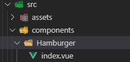

#### 2.5.2、代码

组件使用SVG绘制，绘制根据isActive状态来决定是否旋转、显示收缩和展开状态不通的图形。

- index.vue

  ```vue
  <!--
   * @Description: 
   * @version: 
   * @Author: henggao
   * @Date: 2019-09-27 15:15:10
   * @LastEditors: henggao
   * @LastEditTime: 2019-09-27 15:15:10
   -->
  <template>
    <svg
      t="1492500959545"
      @click="onClick == null ? emptyClick : onClick"
      class="hamburger"
      fill="#fff"
      fill-opacity="0.8"
      :class="{'is-active':isActive}"
      viewBox="0 0 1024 1024"
      version="1.1"
      xmlns="http://www.w3.org/2000/svg"
      p-id="1691"
      xmlns:xlink="http://www.w3.org/1999/xlink"
      width="64"
      height="64"
    >
      <path
        d="M966.8023 568.849776 57.196677 568.849776c-31.397081 0-56.850799-25.452695-56.850799-56.850799l0 0c0-31.397081 25.452695-56.849776 56.850799-56.849776l909.605623 0c31.397081 0 56.849776 25.452695 56.849776 56.849776l0 0C1023.653099 543.397081 998.200404 568.849776 966.8023 568.849776z"
        p-id="1692"
      />
      <path
        d="M966.8023 881.527125 57.196677 881.527125c-31.397081 0-56.850799-25.452695-56.850799-56.849776l0 0c0-31.397081 25.452695-56.849776 56.850799-56.849776l909.605623 0c31.397081 0 56.849776 25.452695 56.849776 56.849776l0 0C1023.653099 856.07443 998.200404 881.527125 966.8023 881.527125z"
        p-id="1693"
      />
      <path
        d="M966.8023 256.17345 57.196677 256.17345c-31.397081 0-56.850799-25.452695-56.850799-56.849776l0 0c0-31.397081 25.452695-56.850799 56.850799-56.850799l909.605623 0c31.397081 0 56.849776 25.452695 56.849776 56.850799l0 0C1023.653099 230.720755 998.200404 256.17345 966.8023 256.17345z"
        p-id="1694"
      />
    </svg>
  </template>
  
  <script>
  export default {
    name: "hamburger",
    props: {
      isActive: {
        type: Boolean,
        default: false
      },
      onClick: {
        type: Function,
        default: null
      }
    },
    methods: {
      emptyClick() {}
    }
  };
  </script>
  
  <style scoped>
  .hamburger {
    display: inline-block;
    cursor: pointer;
    width: 20px;
    height: 20px;
    transform: rotate(90deg);
    transition: 0.38s;
    transform-origin: 50% 50%;
  }
  .hamburger.is-active {
    transform: rotate(0deg);
  }
  </style>
  ```

  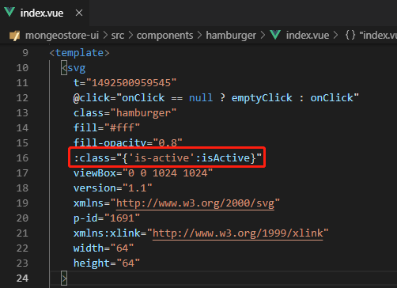

在头部区域HeadBar中引入hamburger，并将自身isActive状态跟收缩状态collapse绑定。

- headBar.vue

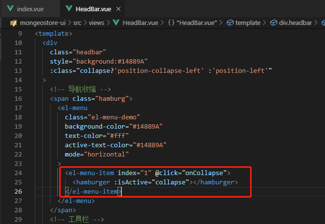

单击导航栏收缩组件区域的响应函数，设置导航收缩状态到Store。

- Header.vue

```vue
<!--
 * @Description: 
 * @version: 
 * @Author: henggao
 * @Date: 2019-09-27 09:13:12
 * @LastEditors: henggao
 * @LastEditTime: 2019-09-27 15:58:56
 -->
<template>
  <div
    class="headbar"
    style="background:#14889A"
    :class="collapse?'position-collapse-left':'position-left'"
  >
    <!-- 导航收缩 -->
    <span class="hamburg">
      <el-menu
        class="el-menu-demo"
        background-color="#14889A"
        text-color="#fff"
        active-text-color="#14889A"
        mode="horizontal"
      >
        <el-menu-item index="1" @click="onCollapse">
          <hamburger :isActive="collapse"></hamburger>
        </el-menu-item>
      </el-menu>
    </span>
    <!-- 工具栏 -->
    <span class="toolbar">
      <el-menu
        class="el-menu-demo"
        background-color="#14889A"
        text-color="#14889A"
        active-text-color="#14889A"
        mode="horizontal"
      >
        <el-menu-item index="1">
          <!-- 用户信息 -->
          <span class="user-info">
            
            {{user.name}}
          </span>
        </el-menu-item>
      </el-menu>
    </span>
  </div>
</template>

<script>
import { mapState } from "vuex";
import mock from "@/mock/index";
import Hamburger from "@/components/Hamburger";
export default {
  components: {
    Hamburger
  },
  data() {
    return {
      user: {
        name: "henggao",
        avatar: "",
        role: "超级管理员",
        registerInfo: "注册时间: 2019-10-01"
      },
      activeIndex: "1",
      langVisible: false
    };
  },
  methods: {
    selectNavBar(key, keyPath) {
      console.log(key, keyPath);
    },
    //折叠导航栏
    onCollapse: function() {
      this.$store.commit("onCollapse");
    }
  },
  mounted() {
    var user = sessionStorage.getItem("user");
    if (user) {
      this.user.name = user;
      this.user.avatar = require("@/assets/user.png");
    }
  },
  computed: {
    ...mapState({
      collapse: state => state.app.collapse
    })
  }
};
</script>

<style scoped lang="scss">
.headbar {
  position: fixed;
  top: 0;
  right: 0;
  z-index: 1030;
  height: 60px;
  line-height: 60px;
  border-color: rgba(180, 190, 190, 0.8);
  border-left-width: 1px;
  border-left-style: solid;
}
.hamburg,
.navbar {
  float: left;
}
.toolbar {
  float: right;
}
.user-info {
  font-size: 20px;
  color: #fff;
  cursor: pointer;
  img {
    width: 40px;
    height: 40px;
    border-radius: 10px;
    margin: 10px 0px 10px 10px;
    float: right;
  }
}
.position-left {
  left: 200px;
}
.position-collapse-left {
  left: 65px;
}
</style>
```

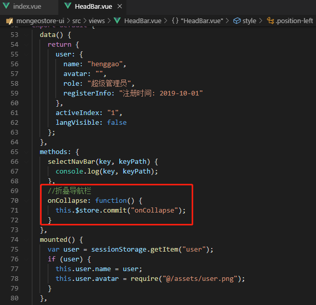

### 2.6、页面测试

启动应用，访问http://localhost:8080/#/login ，单击【登录】进入主页面。

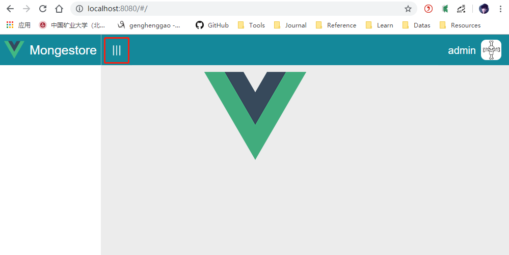

单击导航收缩展开组件，导航菜单收缩起来。

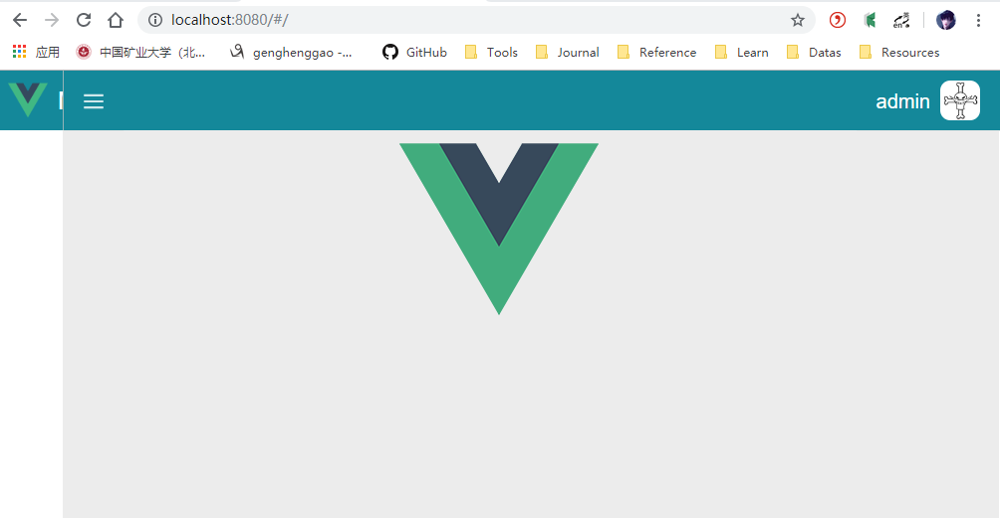

