# 三、工具模块封装

[TOC]

## 1、封装axios模块

### 1.1、封装背景

使用axios发起一个请求是比较简单的，但项目多了，会引起代码冗余，难以维护，所以对axios进行二次封装。

### 1.2、封装要点

- 统一url配置
- 统一api请求
- request（请求）拦截器
- respons（响应）拦截器
- 结合Vuex做全局的loading动画，或者错误处理
- 将axios封装成Vue插件使用

### 1.3、文件结构

在src目录下，新建一个http文件夹，用来存放http交互api代码。文件结构如下

- config.js：axios默认配置，包含基础路径等。
- axios.js：二次封装 axios模块，聚合所有模块API
- index.js：将axios封装成插件，安插件方式引入
- modules：用户 管理、菜单管理等子模块API

http模块目录结构图

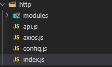

子模块Modules目录结构图

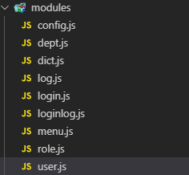

### 1.4、代码说明

#### 1、config.js

AXIOS相关配置

```js
/*
 * @Description: 
 * @version: 
 * @Author: henggao
 * @Date: 2019-09-25 20:15:49
 * @LastEditors: henggao
 * @LastEditTime: 2019-09-25 20:25:26
 */
import { baseUrl } from '@/utils/global'

export default{
    method: 'get',
    //基础url前缀
    baseUrl: baseUrl,
    //请求头信息
    headers: {
        'Content-Type': 'application/json;charset=UTF-8'
    },
    //参数
    data: {},
    //设置时间
    timeout: 10000,
    //携带凭证
    withCredentials: true,
    //返回数据类型
    responseType: 'json'
}
```

#### 2、axios.js

axios拦截器，可以进行请求的拦截和响应兰戒。

1）、这里导入类配置文件的信息（如baseURL、headers等）搭配axios对象。

2）、发送请求的时候获取token，如果token不存在，说明未登录，就重定向到系统登录界面，否则携带token继续大发送请求。

3）、若需要，可以在这里通过response响应拦截器对返回结果进行统一处理。

```js
/*
 * @Description: 
 * @version: 
 * @Author: henggao
 * @Date: 2019-09-25 20:13:38
 * @LastEditors: henggao
 * @LastEditTime: 2019-09-26 09:01:17
 */
import axios from 'axios'
import config from './config'
import Cookies from "js-cookie"
import router from '@/router'

export default function $axios(options) {
    return new Promise((resolve, reject) => {
        const instance = axios.create({
            baseURL: config.baseUrl,
            headers: config.headers,
            timeout: config.timeout,
            withCredentials: config.withCredentials
        })
        //request请求拦截器
        instance.interceptors.request.use(
            config => {
                let token = Cookies.get('token')
                if (token) { //发送请求时携带token
                    config.headers.token = token
                } else {    //重定向到登录界面
                    router.push('/login')
                }
                return config
            },
            error => {
                return Promise.reject(error)
            }
        )

        //response 相应拦截器
        instance.interceptors.response.use(
            response => {
                return response.data
            },
            err => {
                return Promise.reject(err)
            }
        )

        //请求处理
        instance(options).then( res => {
            resolve(res)
            return false
        }).catch(error => {
            reject(error)
        })
    })
}
```

#### 3、index.js

把axios注册位Vue插件使用，并将api模块挂载在Vue原型的$api对象上。

```js
/*
 * @Description: 
 * @version: 
 * @Author: henggao
 * @Date: 2019-09-25 20:14:09
 * @LastEditors: henggao
 * @LastEditTime: 2019-09-25 20:14:09
 */
import api from './api'
const install = Vue => {
    if ( install.installed)
    return;
    install.installed = true;
    Object.defineProperties(Vue.prototype,{
        //注意，此处挂载在Vue原型的$api对象上
        $api: {
            get() {
                return api
            }
        }
    })
}

export default install
```

#### 4、api.js

此模块是一个聚合模块，回合modules目录下的所有子模块API

```js
/*
 * @Description: 
 * @version: 
 * @Author: henggao
 * @Date: 2019-09-25 20:13:30
 * @LastEditors: henggao
 * @LastEditTime: 2019-09-25 20:13:30
 */
//接口统一集成模块
import * as login from './modules/login'
import * as user from './modules/user'
import * as dept from './modules/dept'
import * as role from './modules/role'
import * as menu from './modules/menu'
import * as dict from './modules/dict'
import * as config from './modules/config'
import * as log from './modules/log'
import * as loginlog from './modules/loginlog'
//默认全部导出
export default{
    login,user,dept,role,menu,dict,config,log,loginlog
}
```

#### 5、user.js

modules目录下，以user.js、login.js为例。

- user.js

```js
/*
 * @Description: 
 * @version: 
 * @Author: henggao
 * @Date: 2019-09-25 20:17:50
 * @LastEditors: henggao
 * @LastEditTime: 2019-09-25 21:17:02
 */
import axios from "../axios"

/*用户管理模块 */
//保存
export const save = (data) =>{
    return axios({ url: '/user/save', method: 'post', data})
}


//删除
export const batchDelete = (data) =>{
    return axios({ url: '/user/delete',method: 'post', data})
}

//分页查询
export const findPage = (data) => {
    return axios({ url: '/user/findPage', method: 'post', data})
}


//查找用户的菜单权限表示集合
export const findPermissions = (params) => {
    return axios({url: '/user/finPermissions',method: 'get', params})
}
```

- login.js

  ```js
  /*
   * @Description: 
   * @version: 
   * @Author: henggao
   * @Date: 2019-09-25 20:17:08
   * @LastEditors: henggao
   * @LastEditTime: 2019-09-26 09:11:12
   */
  import axios from '../axios'
  
  /* 
   * 系统登录模块
   */
  
  // 登录
  export const login = data => {
      return axios({
          url: 'login',
          method: 'post',
          data
      })
  }
  
  // 登出
  export const logout = () => {
      return axios({
          url: 'logout',
          method: 'get'
      })
  }
  ```

#### 6、global.js

把一些全局的配置、常量和方法放置在此文件中。在src下新建utils文件夹，创建globals.js

```js
/*
 * @Description: 
 * @version: 
 * @Author: henggao
 * @Date: 2019-09-25 21:22:51
 * @LastEditors: henggao
 * @LastEditTime: 2019-09-25 21:22:51
 */
/**
 * 全局常量、方法封装模块
 * 通过原型挂载到Vue属性
 * 通过 this.Global 调用
 */
// 后台管理系统服务器地址
export const baseurl = 'http://localhost:8001'

// 系统数据备份还原服务器地址
export const backupBaseUrl = 'http://localhost:8002'

export default {
    baseUrl,
    backupBaseUrl
}
```

#### 7、main.js

修改main.js，导入API模块，并通过Vue.use(api)语句进行使用注册。

```js
/*
 * @Descripttion: 
 * @version: 
 * @Author: henggao
 * @Date: 2019-09-25 14:08:37
 * @LastEditors: henggao
 * @LastEditTime: 2019-09-25 21:33:57
 */
// The Vue build version to load with the `import` command
// (runtime-only or standalone) has been set in webpack.base.conf with an alias.
import Vue from 'vue'
import App from './App'
import router from './router'
import api from './http'
import global from '@/utils/global'
import ElementUI from 'element-ui'
import 'element-ui/lib/theme-chalk/index.css'

Vue.config.productionTip = false

Vue.use(ElementUI)  //注册使用Element
Vue.use(api)  //注册使用API模块

Vue.prototype.global = global   //挂载全局配置模块
/* eslint-disable no-new */
new Vue({
  el: '#app',
  router,
  components: { App },
  template: '<App/>'
})
```

### 1.5、安装js-cookie

在上面的axios.js中，会用到Cookie获取token，所以需要把依赖安装一下。

```shell
cnpm install --save js-cookie
```

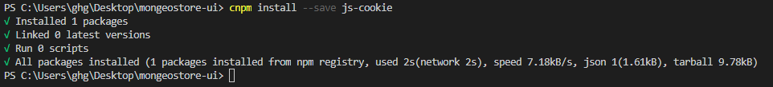

### 1.6、测试案例

#### 1、登录页面

在Login.vue中，添加一个登录按钮，单击处理函数通过axios调用login接口返回数据。

```vue
<!--
 * @Descripttion: 
 * @version: 
 * @Author: henggao
 * @Date: 2019-09-25 15:47:23
 * @LastEditors: henggao
 * @LastEditTime: 2019-09-25 21:47:53
 -->
<template>
  <div class="page">
    <h2>Login Page</h2>
    <el-button type="primary" @click="login()">登录</el-button>
  </div>
</template>

<script>
import mock from "@/mock/mock.js";
import Cookie from "js-cookie";
import router from "@/router";

export default {
  name: "Login",
  methods: {
    login() {
      this.$api.login
        .login()
        .then(function(res) {
          alert(res.token);
          Cookie.set("token", res.token); //放置token到Cookie
          router.push("/"); //登录成功，跳转到主页
        })
        .catch(function(res) {
          alert(res);
        });
    }
  }
};
</script>

<style>
</style>
```

#### 2、Mock接口

在mock.js中添加login接口进行拦截，返回一个token

```js
/*
 * @Descripttion: 
 * @version: 
 * @Author: henggao
 * @Date: 2019-09-25 17:13:45
 * @LastEditors: henggao
 * @LastEditTime: 2019-09-25 21:51:51
 */
import Mock from 'mockjs'

Mock.mock('http://localhost:8001/login',{
    'token': '122fr5d1edeasd'   //令牌
})
Mock.mock('http://localhost:8080/user',{
    'name': '@name',    //随机生成姓名
    'name': '@email',   //随机生成邮箱
    'age|1-10': 5,      //随机生成1~10岁
})

Mock.mock('http://localhost:8080/menu',{
    'id': '@increment',    //id自增
    'name': 'menu',   //名称为menu
    'order|1-20': 5,      //排序在1~20之间
})
```

#### 3、页面测试

在浏览器中访问http://localhost:8080/#/login

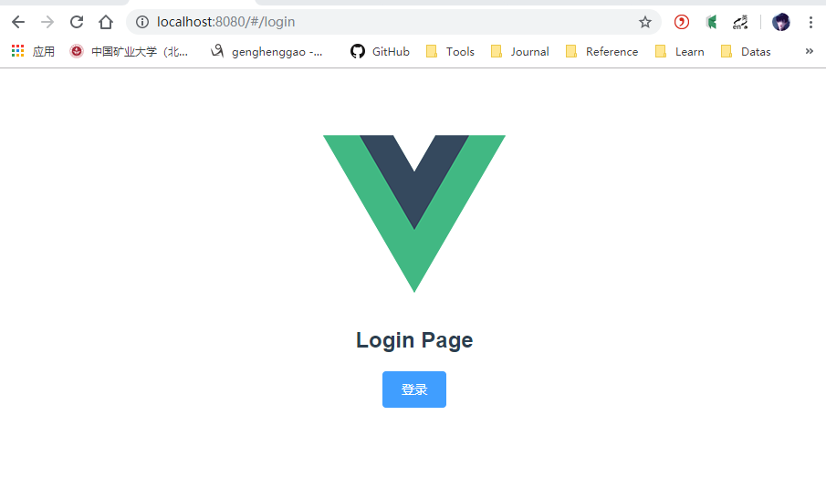

单击【登录】，弹出框，显示返回的token信息

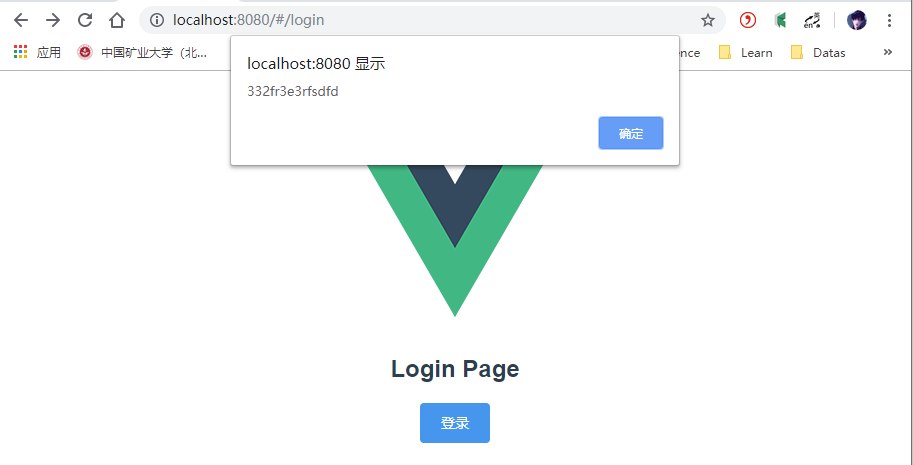

单击【确定】按钮，页面跳转到主页，说明axios模块成功封装并使用。

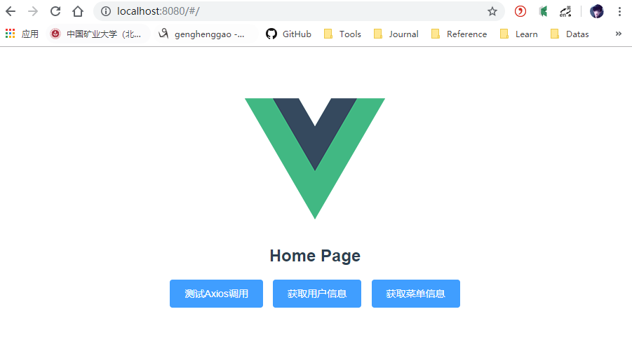

- 文件结构

  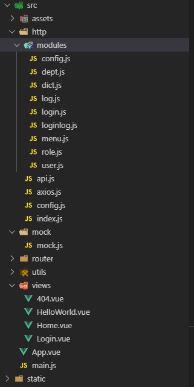

## 2、封装mock模块

为了可以统一管理和集中控制数据模拟接口，对mock模块进行了封装，方便定制模拟接口的统一开关。

### 2.1、文件结构

在mock目录下新建一个index.js，创建modules目录并在里面创建子模块的*.js文件

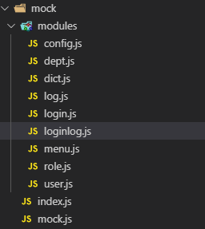

#### 1、index.js

index.js是聚合模块，统一导入所有子模块并通过调用mock进行数据模拟。

```js
/*
 * @Description: 
 * @version: 
 * @Author: henggao
 * @Date: 2019-09-26 09:16:42
 * @LastEditors: henggao
 * @LastEditTime: 2019-09-26 09:34:45
 */
import Mock from 'mockjs'
import { baseUrl } from '@/utils/global'
import * as login from './modules/login'
import * as user from './modules/user'
import * as role from './modules/role'
import * as dept from './modules/dept'
import * as menu from './modules/menu'
import * as dict from './modules/dict'
import * as config from './modules/config'
import * as log from './modules/log'
import * as loginlog from './modules/loginlog'

// 1. 开启/关闭[所有模块]拦截, 通过调[openMock参数]设置.
// 2. 开启/关闭[业务模块]拦截, 通过调用fnCreate方法[isOpen参数]设置.
// 3. 开启/关闭[业务模块中某个请求]拦截, 通过函数返回对象中的[isOpen属性]设置.

let openMock = true
// let openMock = false
fnCreate(login ,openMock)
fnCreate(user, openMock)
fnCreate(role, openMock)
fnCreate(dept, openMock)
fnCreate(menu, openMock)
fnCreate(dict, openMock)
fnCreate(config, openMock)
fnCreate(log, openMock)
fnCreate(loginlog, openMock)


function fnCreate (mod, isOpen = true) {
    if (isOpen) {
        ((res) => {
            if (res.isOpen !== false) {
                let url = baseUrl
                if(!url.endsWith("/")){
                    url = url + "/"
                }
                url = url + res.url
                Mock.mock(new RegExp(url), res.type, (opts) => {
                    opts['data'] = opts.body ? JSON.parse(opts.body) : null
                    delete opts.body
                    console.log('/n')
                    console.log('%cmock拦截, 请求: ', 'color:blue', opts)
                    console.log('%cmock拦截, 响应: ', 'color:blue', res.data)
                    return res.data
                })
            }
        })(mod[key]() || {})
    }
}
```

#### 2、user.js

子模块modules下，以user.js、login.js为例。

- user.js

  ```js
  /*
   * @Description: 
   * @version: 
   * @Author: henggao
   * @Date: 2019-09-26 09:19:10
   * @LastEditors: henggao
   * @LastEditTime: 2019-09-26 10:23:35
   */
  /*用户管理模块 */
  
  //保存
  export function save() {
      return {
          url: 'user/save', type: 'post',
          data: { "code": 200, "msg": null, "data": 1 }
      }
  }
  
  //批量删除
  export function batchDelete() {
      return {
          url: 'user/delete', type: 'post',
          data: { "code": 200, "msg": null, "data": 1 }
      }
  }
  
  //分页查询
  export function findPage(params) {
      let findPageData = { "code": 200, "msg": null, "data": {} }
      let pageNum = 1
      let pageSize = 8
      let content = this.getContent(pageNum, pageSize)
      findPageData.data.pageNum = pageNum
      findPageData.data.pageSize = pageSize
      findPageData.data.totalSize = 50
      findPageData.data.content = content
      return { url: 'user/findPage', type: 'post', data: findPageData }
  }
  
  export function getContent(pageNum, pageSize) {
      let content = []
      for (let i = 0; i < pageSize; i++) {
          let obj = {}
          let index = ((pageNum - 1) * pageSize) + i + 1
          obj.id = index
          obj.name = 'mongeostore' + index
          obj.password = '123'
          obj.salt = 'henggao'
          obj.email = 'mongeostore' + index + '@qq.com'
          obj.mobile = '15351818127'
          obj.status = 1
          obj.deptId = 12
          onrejectionhandled.deptName = '采集部'
          obj.status = 1
          if (i % 2 === 0) {
              obj.deptId = 13
              obj.deptName = '处理部'
          }
  
          obj.createBy = 'admin'
          obj.createTime = '2019-09-26 10:21:33'
          obj.createBy = 'admin'
          obj.createTime = '2019-10-26 12:22:33'
          content.push(obj)
      }
      return content
  }
  
  // 查找用户的菜单权限标识集合
  export function findPermissions() {
      let permsData = {
          "code": 200,
          "msg": null,
          "data": [
              null,
              "sys:user:view",
              "sys:menu:delete",
              "sys:dept:edit",
              "sys:dict:edit",
              "sys:dict:delete",
              "sys:menu:add",
              "sys:user:add",
              "sys:log:view",
              "sys:dept:delete",
              "sys:role:edit",
              "sys:role:view",
              "sys:dict:view",
              "sys:user:edit",
              "sys:user:delete",
              "sys:dept:view",
              "sys:dept:add",
              "sys:role:delete",
              "sys:menu:view",
              "sys:menu:edit",
              "sys:dict:add",
              "sys:role:add"
          ]
      }
      return {
          url: 'user/findPermissions',
          type: 'get',
          data: permsData
      }
  }
  ```

- login.js

  ```js
  /*
   * @Description: 
   * @version: 
   * @Author: henggao
   * @Date: 2019-09-26 09:17:43
   * @LastEditors: henggao
   * @LastEditTime: 2019-09-26 10:44:43
   */
  /* 
   * 系统登录模块
   */
  
  // 登录接口
  export function login() {
      const loginData = {
        "code": 200,
        "msg": null,
        "data": {
          "id": null,
          "userId": 1,
          "token": "77ae89be36504adfb5c09ef71409ea0e",
          "expireTime": "2018-09-01T16:24:50.473+0000",
          "createBy": null,
          "createTime": null,
          "lastUpdateBy": null,
          "lastUpdateTime": "2018-09-01T04:24:50.473+0000"
        }
      }
      return {
        url: 'login',
        type: 'post',
        data: loginData
      }
    }
    // 登出接口
    export function logout() {
      const logoutData = {
        "code": 200,
        "msg": null,
        "data": {
        }
      }
      return {
        url: 'logout',
        type: 'get',
        data: logoutData
      }
    }
  ```

### 2.2、登录界面

修改登录界面Login.vue

- 修改前Login.vue

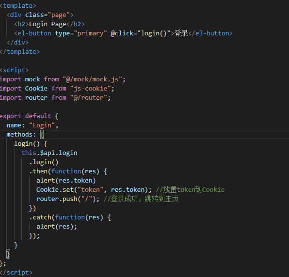

- 修改后Login.vue

  ```vue
  <!--
   * @Descripttion: 
   * @version: 
   * @Author: henggao
   * @Date: 2019-09-25 15:47:23
   * @LastEditors: henggao
   * @LastEditTime: 2019-09-26 10:31:59
   -->
  <template>
    <div class="page">
      <h2>Login Page</h2>
      <el-button type="primary" @click="login()">登录</el-button>
    </div>
  </template>
  
  <script>
  import mock from "@/mock/index.js";
  import Cookie from "js-cookie";
  import router from "@/router";
  
  export default {
    name: "Login",
    methods: {
      login() {
        this.$api.login
          .login()
          .then(function(res) {
            alert(res.data.token);
            Cookie.set("token", res.data.token); //放置token到Cookie
            router.push("/"); //登录成功，跳转到主页
          })
          .catch(function(res) {
            alert(res);
          });
      }
    }
  };
  </script>
  
  <style>
  </style>
  ```

  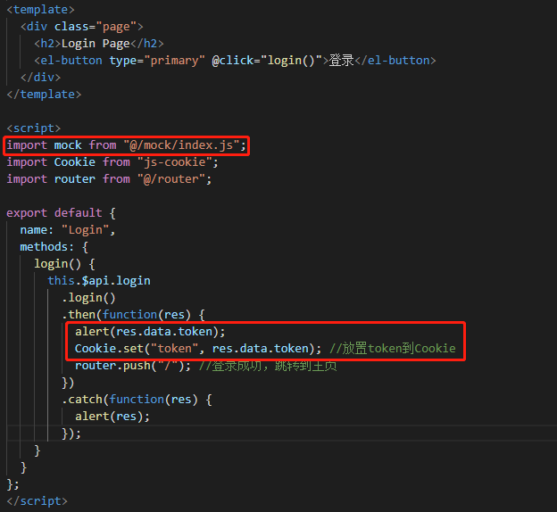

### 2.3、主页界面

修改主页界面Home.vue

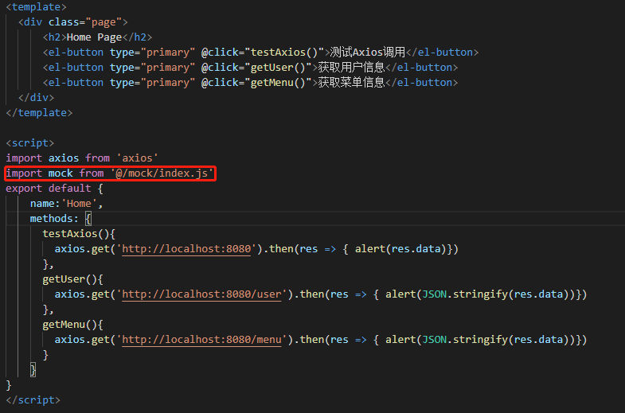

### 2.4、页面测试

浏览器访问http://localhost:8080/#/login

在登录界面点击【登录】，弹出框返回token信息

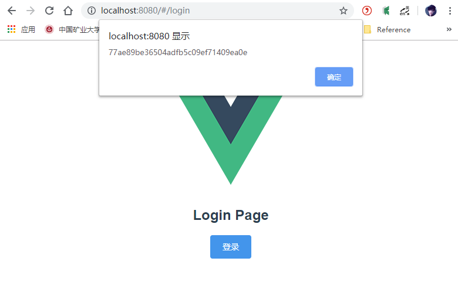

点击【确定】，重定向到主页面

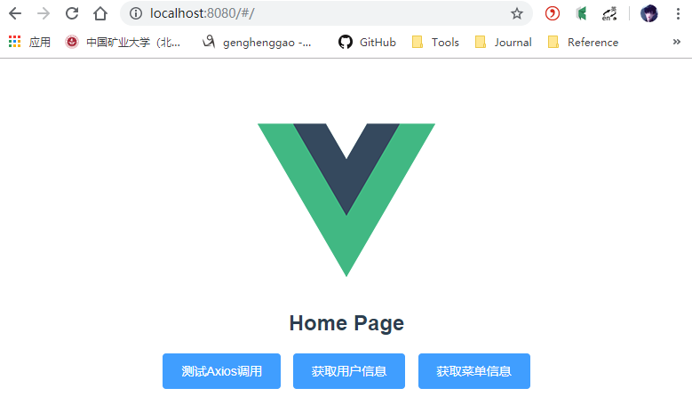

axios模块和mock模块都封装好了。