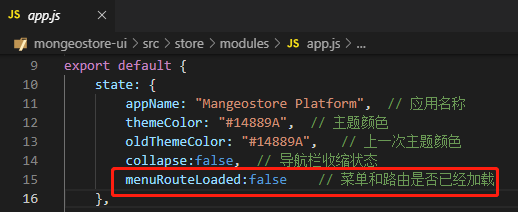
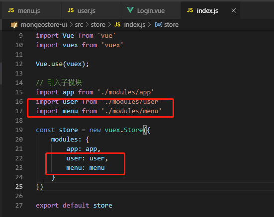
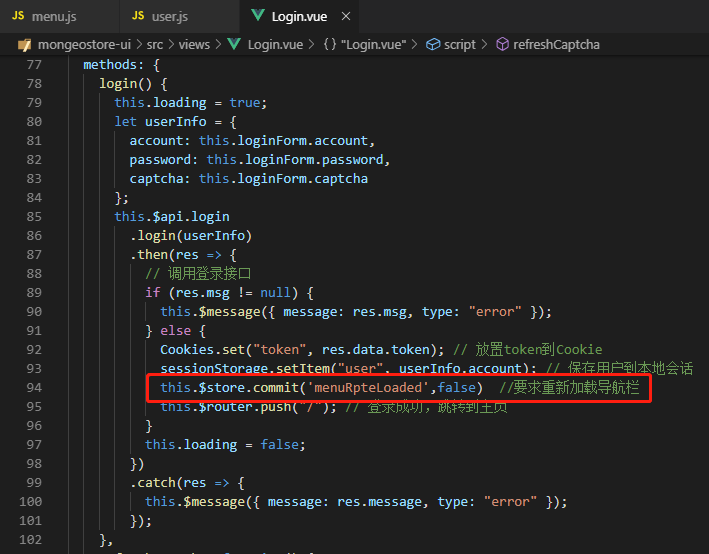
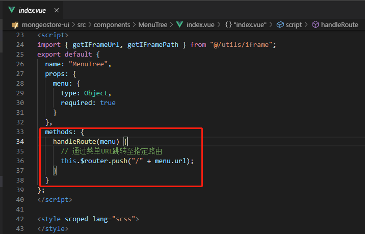
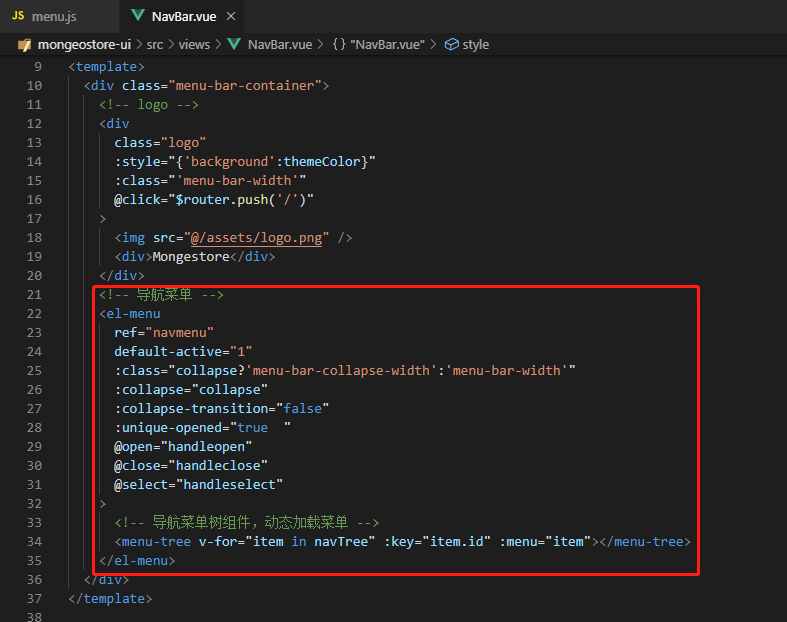
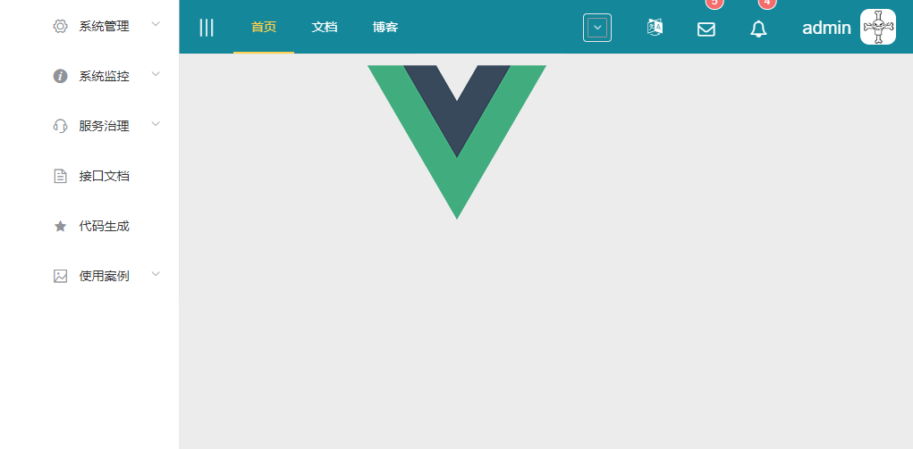

# 九、动态加载菜单

[TOC]

## 1、添加Store

先添加几个Store状态，后续来共享应用。

在store/modules下的app.js中添加一个menuRouteLoaded状态，判断路由是否加载过。



在store/modules下新建menu.js，在indexjs中引入，里面保存着加载后的导航菜单树数据。

```js
/*
 * @Description: 
 * @version: 
 * @Author: henggao
 * @Date: 2019-09-29 15:21:50
 * @LastEditors: henggao
 * @LastEditTime: 2019-09-29 15:21:50
 */
export  default{
    state:{
        navTree:[], //导航菜单树
    },
    getters:{

    },
    mutations:{
        setNavTree(state,navTree){  //设置导航菜单树
            state.navTree = navTree;
        }
    }
}
```

在store/modules下新建user.js，在index.js中引入，里面保存加载后的用户权限数据。

- user.js

```js
/*
 * @Description: 
 * @version: 
 * @Author: henggao
 * @Date: 2019-09-29 15:26:06
 * @LastEditors: henggao
 * @LastEditTime: 2019-09-29 15:26:06
 */
export default {
    state: {
        perms: [],   //用户权限表示集合
    },
    getters: {

    },
    mutations: {
        setPerms(state, peims) { //用户权限集合标识
            state.perms = perms;
        }
    }
}
```



## 2、登录界面

打开登录界面Login.vue，在登录接口设置菜单加载状态，要求重新登录之后重新加载菜单

- Login.vue

  

## 3、导航守卫

修改router/index.js文件，添加导航守卫，在每次路由时判断用户绘画是否过期。如果登录有效且跳转的是登录界面，就直接路由到主页；如果是非登录页面且会话过期，就跳转到登陆界面要求登录；否则，加载动态菜单和路由并路由到目标页面。

- index.js

```js
router.beforeEach((to, from, next) => {
  //登录界面登陆成功之后，会把用户信息保存在会话
  // 存在时间为会话生命周期，页面关闭即失效。
  let userName = sessionStorage.getItem('user')
  if (to.path === '/login') {
    //如果是访问登录界面，且用户会话信息存在，则代表已经登录过，跳转到主页
    if (userName) {
      next({ path: '/' })
    } else {
      next()
    }
  } else {
    if (!userName) {
      //如果是访问非登录界面，且用户会话信息存在，则代表已经登录过，跳转到主页
      next({
        path: '/login'
      })
    } else {
      // 加载动态动态菜单和路由
      addDynamicMenuAndRoutes(userName, to, from)
      next()
    }
  }
})
```

加载动态路由的方法。首先判断动态菜单是否已经存在，如果存在就不再重复加载损耗性能，否则调用后台接口加载数据库存储菜单数据，加载成功之后通过router.addRoutes方法将菜单数据动态添加到路由器并同时保存菜单数据及加载状态以备用。导航菜单加载成功之后，调用后台接口查找用户权限数据并保存起来，共权限判断是=时读取。

- index.js

  ```js
  /**
   * 加载动态菜单和路由
   */
  function addDynamicMenuAndRoutes(userName, to, from) {
    if (store.state.app.menuRouteLoaded) {
      console.log('动态菜单和路由已经存在.')
      return
    }
    api.menu.findNavTree({ 'userName': userName }).then(res => {
      // 添加动态路由
      let dynamicRoutes = addDynamicRoutes(res.data)
      touter.options.routes[0].children = router.options.routes[0].children.concat(dynamicRoutes)
      router.addRoutes(router.options.routes)
      // 保存加载状态
      store.commit('menurouteLoaded', true)
      // 保存菜单树
      store.commit('setNavTree', res.data).then(res => {
        api.user.finPermissions({ 'name': userName }).then(res => {
          store.commit('setPerms'.res.data)
        })
      })
        .catch(function (res) {
        })
    })
  }
  ```

  遍历菜单数据实际创路由对象逻辑

  ```js
  /**
   * 添加动态菜单路由
   * @param {*} menuList  菜单列表
   * @param {*} routes  递归创建的动态菜单路由
   */
  function addDynamicRoutes(menuList = [], routes = []) {
    var temp = []
    for (var i = 0; i < menuList.length; i++) {
      if (menuList[i].children && menuList[i].children.length >= 1) {
        temp = temp.concat(menuList[i].children)
      } else if (menuList[i].url && /\S/.test(menuList[i].url)) {
        menuList[i].url = menuList[i].url.replace(/^\//, '')
        // 创建路由配置
        var route = {
          path: menuList[i].url,
          component: null,
          name: menuList[i].name,
          meta: {
            icon: menuList[i].icon,
            index: menuList[i].id
          }
        }
        try {
          // 根据菜单URL动态加载vue组件，这里要求vue组件须按照url路径存储
          // 如url="sys/user"，则组件路径应是"@/views/sys/user.vue",否则组件加载不到
          let array = menuList[i].url.split('/')
          let url = ''
          for (let i = 0; i < array.length; i++) {
            url += array[i].substring(0, 1).toUpperCase() + array[i].substring(1) + '/'
          }
          url = url.substring(0, url.length - 1)
          route['component'] = resolve => require([`@/views/${url}`], resolve)
        } catch (e) { }
        routes.push(route)
      }
    }
    if (temp.length >= 1) {
      addDynamicRoutes(temp, routes)
    } else {
      console.log('动态路由加载...')
      console.log(routes)
      console.log('动态路由加载完成.')
    }
    return routes
  }
  ```

  

完整的index.js

```js
/*
 * @Descripttion: 
 * @version: 
 * @Author: henggao
 * @Date: 2019-09-25 14:08:37
 * @LastEditors: henggao
 * @LastEditTime: 2019-09-30 10:00:28
 */
import Vue from 'vue'
import Router from 'vue-router'
import Login from '@/views/Login'
import Home from '@/views/Home'
import NotFound from '@/views/404'
import api from '@/http/api'
import store from '@/store'

Vue.use(Router)

const router = new Router({
  routes: [
    {
      path: '/',
      name: 'Home',
      component: Home,
      children: []
    }, {
      path: '/login',
      name: 'Login',
      component: Login
    }, {
      path: '/404',
      name: 'notFound',
      component: NotFound
    }
  ]
})

router.beforeEach((to, from, next) => {
  //登录界面登陆成功之后，会把用户信息保存在会话
  // 存在时间为会话生命周期，页面关闭即失效。
  let userName = sessionStorage.getItem('user')
  if (to.path === '/login') {
    //如果是访问登录界面，且用户会话信息存在，则代表已经登录过，跳转到主页
    if (userName) {
      next({ path: '/' })
    } else {
      next()
    }
  } else {
    if (!userName) {
      //如果是访问非登录界面，且用户会话信息存在，则代表已经登录过，跳转到主页
      next({
        path: '/'
      })
    } else {
      // 加载动态动态菜单和路由
      addDynamicMenuAndRoutes(userName, to, from)
      next()
    }
  }
})

/**
 * 加载动态菜单和路由
 */
function addDynamicMenuAndRoutes(userName, to, from) {
  if (store.state.app.menuRouteLoaded) {
    console.log('动态菜单和路由已经存在.')
    return
  }
  api.menu.findNavTree({ 'userName': userName }).then(res => {
    // 添加动态路由
    let dynamicRoutes = addDynamicRoutes(res.data)
    touter.options.routes[0].children = router.options.routes[0].children.concat(dynamicRoutes)
    router.addRoutes(router.options.routes)
    // 保存加载状态
    store.commit('menurouteLoaded', true)
    // 保存菜单树
    store.commit('setNavTree', res.data).then(res => {
      parseInt.user.finPermissions({ 'name': userName }).then(res => {
        store.commit('setPerms'.res.data)
      })
    })
      .catch(function (res) {
      })
  })
}

/**
 * 添加动态菜单路由
 * @param {*} menuList  菜单列表
 * @param {*} routes  递归创建的动态菜单路由
 */
function addDynamicRoutes(menuList = [], routes = []) {
  var temp = []
  for (var i = 0; i < menuList.length; i++) {
    if (menuList[i].children && menuList[i].children.length >= 1) {
      temp = temp.concat(menuList[i].children)
    } else if (menuList[i].url && /\S/.test(menuList[i].url)) {
      menuList[i].url = menuList[i].url.replace(/^\//, '')
      // 创建路由配置
      var route = {
        path: menuList[i].url,
        component: null,
        name: menuList[i].name,
        meta: {
          icon: menuList[i].icon,
          index: menuList[i].id
        }
      }
      try {
        // 根据菜单URL动态加载vue组件，这里要求vue组件须按照url路径存储
        // 如url="sys/user"，则组件路径应是"@/views/sys/user.vue",否则组件加载不到
        let array = menuList[i].url.split('/')
        let url = ''
        for (let i = 0; i < array.length; i++) {
          url += array[i].substring(0, 1).toUpperCase() + array[i].substring(1) + '/'
        }
        url = url.substring(0, url.length - 1)
        route['component'] = resolve => require([`@/views/${url}`], resolve)
      } catch (e) { }
      routes.push(route)
    }
  }
  if (temp.length >= 1) {
    addDynamicRoutes(temp, routes)
  } else {
    console.log('动态路由加载...')
    console.log(routes)
    console.log('动态路由加载完成.')
  }
  return routes
}

export default router
```

## 4、导航树组件

在conponents目录下新建一个导航树组件MenuTree


MenuTree.vue的页面内容主要遍历菜单数据创建导航菜单，导航菜单绑定了handleRoute函数，在单击菜单项的时候路由到指定路径。

- index.vue

```vue
<!--
 * @Description: 
 * @version: 
 * @Author: henggao
 * @Date: 2019-09-30 10:02:17
 * @LastEditors: henggao
 * @LastEditTime: 2019-09-30 10:02:17
 -->
<template>
  <el-submenu v-if="menu.children && menu.children.length >= 1" :index="'' + menu.id">
    <template slot="title">
      <i :class="menu.icon"></i>
      <span slot="title">{{menu.name}}</span>
    </template>
    <MenuTree v-for="item in menu.children" :key="item.id" :menu="item"></MenuTree>
  </el-submenu>
  <el-menu-item v-else :index="'' + menu.id" @click="handleRoute(menu)">
    <i :class="menu.icon"></i>
    <span slot="title">{{menu.name}}</span>
  </el-menu-item>
</template>

<script>
import { getIFrameUrl, getIFramePath } from "@/utils/iframe";
export default {
  name: "MenuTree",
  props: {
    menu: {
      type: Object,
      required: true
    }
  },
  methods: {
    handleRoute(menu) {
      // 通过菜单URL跳转至指定路由
      this.$router.push("/" + menu.url);
    }
  }
};
</script>

<style scoped lang="scss">
</style>
```



在头部HeadBar.vue中引入导航菜单树组件，编写导航菜单区域的内容，其中的菜单数据navTree是在导航守卫加载并存储到store的。

- NavBar.vue

  ```vue
  <!--
   * @Description: 
   * @version: 
   * @Author: henggao
   * @Date: 2019-09-27 09:13:20
   * @LastEditors: henggao
   * @LastEditTime: 2019-10-03 08:47:40
   -->
  <template>
    <div class="menu-bar-container">
      <!-- logo -->
      <div
        class="logo"
        :style="{'background':themeColor}"
        :class="'menu-bar-width'"
        @click="$router.push('/')"
      >
        
        <div>Mongestore</div>
      </div>
      <!-- 导航菜单 -->
      <el-menu
        ref="navmenu"
        default-active="1"
        :class="collapse?'menu-bar-collapse-width':'menu-bar-width'"
        :collapse="collapse"
        :collapse-transition="false"
        :unique-opened="true  "
        @open="handleopen"
        @close="handleclose"
        @select="handleselect"
      >
        <!-- 导航菜单树组件，动态加载菜单 -->
        <menu-tree v-for="item in navTree" :key="item.id" :menu="item"></menu-tree>
      </el-menu>
    </div>
  </template>
  
  <script>
  import { mapState } from "vuex";
  import MenuTree from "@/components/MenuTree";
  export default {
    components: {
      MenuTree
    },
    computed: {
      ...mapState({
        appName: state => state.app.appName,
        themeColor: state => state.app.themeColor,
        collapse: state => state.app.collapse,
        navTree: state => state.menu.navTree
      })
    },
    methods: {
      handleopen() {
        console.log("handleopen");
      },
      handleclose() {
        console.log("handleclose");
      },
      handleselect(a, b) {
        console.log("handleselect");
      }
    }
  };
  </script>
  
  <style scoped lang="scss">
  .menu-bar-container {
    position: fixed;
    top: 0px;
    left: 0;
    bottom: 0;
    z-index: 1020;
    .logo {
      position: absolute;
      top: 0px;
      height: 60px;
      line-height: 60px;
      background: #545c64;
      cursor: pointer;
      img {
        width: 40px;
        height: 40px;
        border-radius: 0px;
        margin: 10px 10px 10px 10px;
        float: left;
      }
      div {
        font-size: 22px;
        color: white;
        text-align: left;
        padding-left: 20px;
      }
    }
    .menu-bar-width {
      width: 200px;
    }
    .menu-bar-collapse-width {
      width: 65px;
    }
  }
  </style>
  ```
  
  

- http文件夹下modules文件夹menu.js添加如下信息

  - menu.js

  ```js
  /*
   * @Description: 
   * @version: 
   * @Author: henggao
   * @Date: 2019-09-25 20:17:37
   * @LastEditors: henggao
   * @LastEditTime: 2019-09-25 20:17:37
   */
  import axios from '../axios'
  
  /* 
   * 菜单管理模块
   */
  
  // 保存
  export const save = (data) => {
      return axios({
          url: '/menu/save',
          method: 'post',
          data
      })
  }
  // 删除
  export const batchDelete = (data) => {
      return axios({
          url: '/menu/delete',
          method: 'post',
          data
      })
  }
  // 查找导航菜单树
  export const findNavTree = (params) => {
      return axios({
          url: '/menu/findNavTree',
          method: 'get',
          params
      })
  }
  // 查找导航菜单树
  export const findMenuTree = () => {
      return axios({
          url: '/menu/findMenuTree',
          method: 'get'
      })
  }
  ```

- mock目录下modules文件夹下menu.js

  - menu.js

  ```js
  /*
   * @Description: 
   * @version: 
   * @Author: henggao
   * @Date: 2019-09-26 09:17:50
   * @LastEditors: henggao
   * @LastEditTime: 2019-09-26 09:17:50
   */
  /* 
   * 菜单管理模块
   */
  
  // 获取导航菜单树
  export function findNavTree() {
      const navTreeData = {
          "code": 200,
          "msg": null,
          "data": [{
              "id": 1,
              "createBy": null,
              "createTime": null,
              "lastUpdateBy": null,
              "lastUpdateTime": null,
              "parentId": 0,
              "name": "系统管理",
              "url": null,
              "perms": null,
              "type": 0,
              "icon": "el-icon-setting",
              "orderNum": 0,
              "delFlag": 0,
              "parentName": null,
              "level": 0,
              "children": [{
                  "id": 2,
                  "createBy": null,
                  "createTime": null,
                  "lastUpdateBy": null,
                  "lastUpdateTime": null,
                  "parentId": 1,
                  "name": "用户管理",
                  "url": "/sys/user",
                  "perms": null,
                  "type": 1,
                  "icon": "el-icon-service",
                  "orderNum": 1,
                  "delFlag": 0,
                  "parentName": "系统管理",
                  "level": 1,
                  "children": []
              }, {
                  "id": 3,
                  "createBy": null,
                  "createTime": null,
                  "lastUpdateBy": null,
                  "lastUpdateTime": null,
                  "parentId": 1,
                  "name": "机构管理",
                  "url": "/sys/dept",
                  "perms": null,
                  "type": 1,
                  "icon": "el-icon-news",
                  "orderNum": 2,
                  "delFlag": 0,
                  "parentName": "系统管理",
                  "level": 1,
                  "children": []
              }, {
                  "id": 4,
                  "createBy": null,
                  "createTime": null,
                  "lastUpdateBy": null,
                  "lastUpdateTime": null,
                  "parentId": 1,
                  "name": "角色管理",
                  "url": "/sys/role",
                  "perms": null,
                  "type": 1,
                  "icon": "el-icon-view",
                  "orderNum": 4,
                  "delFlag": 0,
                  "parentName": "系统管理",
                  "level": 1,
                  "children": []
              }, {
                  "id": 5,
                  "createBy": null,
                  "createTime": null,
                  "lastUpdateBy": null,
                  "lastUpdateTime": null,
                  "parentId": 1,
                  "name": "菜单管理",
                  "url": "/sys/menu",
                  "perms": null,
                  "type": 1,
                  "icon": "el-icon-menu",
                  "orderNum": 5,
                  "delFlag": 0,
                  "parentName": "系统管理",
                  "level": 1,
                  "children": []
              }, {
                  "id": 7,
                  "createBy": null,
                  "createTime": null,
                  "lastUpdateBy": null,
                  "lastUpdateTime": null,
                  "parentId": 1,
                  "name": "字典管理",
                  "url": "/sys/dict",
                  "perms": null,
                  "type": 1,
                  "icon": "el-icon-edit-outline",
                  "orderNum": 7,
                  "delFlag": 0,
                  "parentName": "系统管理",
                  "level": 1,
                  "children": []
              }, {
                  "id": 8,
                  "createBy": null,
                  "createTime": null,
                  "lastUpdateBy": "admin",
                  "lastUpdateTime": "2018-09-23T11:32:28.000+0000",
                  "parentId": 1,
                  "name": "系统日志",
                  "url": "/sys/log",
                  "perms": "sys:log:view",
                  "type": 1,
                  "icon": "el-icon-info",
                  "orderNum": 8,
                  "delFlag": 0,
                  "parentName": "系统管理",
                  "level": 1,
                  "children": []
              }]
          }, {
              "id": 43,
              "createBy": "admin",
              "createTime": "2018-12-27T02:57:29.000+0000",
              "lastUpdateBy": "admin",
              "lastUpdateTime": "2018-12-27T03:02:26.000+0000",
              "parentId": 0,
              "name": "系统监控",
              "url": "",
              "perms": "",
              "type": 0,
              "icon": "el-icon-info",
              "orderNum": 1,
              "delFlag": 0,
              "parentName": null,
              "level": 0,
              "children": [{
                  "id": 6,
                  "createBy": null,
                  "createTime": null,
                  "lastUpdateBy": "admin",
                  "lastUpdateTime": "2018-12-27T03:03:45.000+0000",
                  "parentId": 43,
                  "name": "数据监控",
                  "url": "http://139.196.87.48:8001/druid/login.html",
                  "perms": null,
                  "type": 1,
                  "icon": "el-icon-warning",
                  "orderNum": 0,
                  "delFlag": 0,
                  "parentName": "系统监控",
                  "level": 1,
                  "children": []
              }, {
                  "id": 38,
                  "createBy": "admin",
                  "createTime": "2018-11-02T12:02:15.000+0000",
                  "lastUpdateBy": "admin",
                  "lastUpdateTime": "2018-12-27T03:03:53.000+0000",
                  "parentId": 43,
                  "name": "服务监控",
                  "url": "http://139.196.87.48:8000/",
                  "perms": "",
                  "type": 1,
                  "icon": "el-icon-view",
                  "orderNum": 1,
                  "delFlag": 0,
                  "parentName": "系统监控",
                  "level": 1,
                  "children": []
              }]
          }, {
              "id": 44,
              "createBy": "admin",
              "createTime": "2018-12-27T03:05:48.000+0000",
              "lastUpdateBy": "admin",
              "lastUpdateTime": "2018-12-27T03:06:39.000+0000",
              "parentId": 0,
              "name": "服务治理",
              "url": "",
              "perms": "",
              "type": 0,
              "icon": "el-icon-service",
              "orderNum": 2,
              "delFlag": 0,
              "parentName": null,
              "level": 0,
              "children": [{
                  "id": 41,
                  "createBy": "admin",
                  "createTime": "2018-11-03T03:06:48.000+0000",
                  "lastUpdateBy": "admin",
                  "lastUpdateTime": "2018-12-27T03:08:11.000+0000",
                  "parentId": 44,
                  "name": "注册中心",
                  "url": "http://139.196.87.48:8500",
                  "perms": "",
                  "type": 1,
                  "icon": " el-icon-view",
                  "orderNum": 0,
                  "delFlag": 0,
                  "parentName": "服务治理",
                  "level": 1,
                  "children": []
              }]
          }, {
              "id": 35,
              "createBy": null,
              "createTime": null,
              "lastUpdateBy": "admin",
              "lastUpdateTime": "2018-12-27T03:04:18.000+0000",
              "parentId": 0,
              "name": "接口文档",
              "url": "http://139.196.87.48:8001/swagger-ui.html",
              "perms": null,
              "type": 1,
              "icon": "el-icon-document",
              "orderNum": 3,
              "delFlag": 0,
              "parentName": null,
              "level": 0,
              "children": []
          }, {
              "id": 42,
              "createBy": "admin",
              "createTime": "2018-11-15T06:39:30.000+0000",
              "lastUpdateBy": "admin",
              "lastUpdateTime": "2018-11-15T06:56:18.000+0000",
              "parentId": 0,
              "name": "代码生成",
              "url": "/generator/generator",
              "perms": "",
              "type": 1,
              "icon": "el-icon-star-on",
              "orderNum": 5,
              "delFlag": 0,
              "parentName": null,
              "level": 0,
              "children": []
          }, {
              "id": 28,
              "createBy": null,
              "createTime": null,
              "lastUpdateBy": "admin",
              "lastUpdateTime": "2018-11-15T06:39:43.000+0000",
              "parentId": 0,
              "name": "使用案例",
              "url": null,
              "perms": null,
              "type": 0,
              "icon": "el-icon-picture-outline",
              "orderNum": 6,
              "delFlag": 0,
              "parentName": null,
              "level": 0,
              "children": [{
                  "id": 29,
                  "createBy": null,
                  "createTime": null,
                  "lastUpdateBy": null,
                  "lastUpdateTime": null,
                  "parentId": 28,
                  "name": "国际化",
                  "url": "/demo/i18n",
                  "perms": null,
                  "type": 1,
                  "icon": "el-icon-edit",
                  "orderNum": 1,
                  "delFlag": 0,
                  "parentName": "使用案例",
                  "level": 1,
                  "children": []
              }, {
                  "id": 30,
                  "createBy": null,
                  "createTime": null,
                  "lastUpdateBy": null,
                  "lastUpdateTime": null,
                  "parentId": 28,
                  "name": "换皮肤",
                  "url": "/demo/theme",
                  "perms": null,
                  "type": 1,
                  "icon": "el-icon-picture",
                  "orderNum": 2,
                  "delFlag": 0,
                  "parentName": "使用案例",
                  "level": 1,
                  "children": []
              }]
          }]
      }
      return {
          url: 'menu/findNavTree',
          type: 'get',
          data: navTreeData
      }
  }
  
  // 获取菜单树
  export function findMenuTree() {
      const menuTreeData = {
          "code": 200,
          "msg": null,
          "data": [{
              "id": 1,
              "createBy": null,
              "createTime": null,
              "lastUpdateBy": null,
              "lastUpdateTime": null,
              "parentId": 0,
              "name": "系统管理",
              "url": null,
              "perms": null,
              "type": 0,
              "icon": "el-icon-setting",
              "orderNum": 0,
              "delFlag": 0,
              "parentName": null,
              "level": 0,
              "children": [{
                  "id": 2,
                  "createBy": null,
                  "createTime": null,
                  "lastUpdateBy": null,
                  "lastUpdateTime": null,
                  "parentId": 1,
                  "name": "用户管理",
                  "url": "/sys/user",
                  "perms": null,
                  "type": 1,
                  "icon": "el-icon-service",
                  "orderNum": 1,
                  "delFlag": 0,
                  "parentName": "系统管理",
                  "level": 1,
                  "children": [{
                      "id": 9,
                      "createBy": null,
                      "createTime": null,
                      "lastUpdateBy": null,
                      "lastUpdateTime": null,
                      "parentId": 2,
                      "name": "查看",
                      "url": null,
                      "perms": "sys:user:view",
                      "type": 2,
                      "icon": null,
                      "orderNum": 0,
                      "delFlag": 0,
                      "parentName": "用户管理",
                      "level": 2,
                      "children": []
                  }, {
                      "id": 10,
                      "createBy": null,
                      "createTime": null,
                      "lastUpdateBy": null,
                      "lastUpdateTime": null,
                      "parentId": 2,
                      "name": "新增",
                      "url": null,
                      "perms": "sys:user:add",
                      "type": 2,
                      "icon": null,
                      "orderNum": 0,
                      "delFlag": 0,
                      "parentName": "用户管理",
                      "level": 2,
                      "children": []
                  }, {
                      "id": 11,
                      "createBy": null,
                      "createTime": null,
                      "lastUpdateBy": null,
                      "lastUpdateTime": null,
                      "parentId": 2,
                      "name": "修改",
                      "url": null,
                      "perms": "sys:user:edit",
                      "type": 2,
                      "icon": null,
                      "orderNum": 0,
                      "delFlag": 0,
                      "parentName": "用户管理",
                      "level": 2,
                      "children": []
                  }, {
                      "id": 12,
                      "createBy": null,
                      "createTime": null,
                      "lastUpdateBy": null,
                      "lastUpdateTime": null,
                      "parentId": 2,
                      "name": "删除",
                      "url": null,
                      "perms": "sys:user:delete",
                      "type": 2,
                      "icon": null,
                      "orderNum": 0,
                      "delFlag": 0,
                      "parentName": "用户管理",
                      "level": 2,
                      "children": []
                  }]
              }, {
                  "id": 3,
                  "createBy": null,
                  "createTime": null,
                  "lastUpdateBy": null,
                  "lastUpdateTime": null,
                  "parentId": 1,
                  "name": "机构管理",
                  "url": "/sys/dept",
                  "perms": null,
                  "type": 1,
                  "icon": "el-icon-news",
                  "orderNum": 2,
                  "delFlag": 0,
                  "parentName": "系统管理",
                  "level": 1,
                  "children": [{
                      "id": 13,
                      "createBy": null,
                      "createTime": null,
                      "lastUpdateBy": null,
                      "lastUpdateTime": null,
                      "parentId": 3,
                      "name": "查看",
                      "url": null,
                      "perms": "sys:dept:view",
                      "type": 2,
                      "icon": null,
                      "orderNum": 0,
                      "delFlag": 0,
                      "parentName": "机构管理",
                      "level": 2,
                      "children": []
                  }, {
                      "id": 14,
                      "createBy": null,
                      "createTime": null,
                      "lastUpdateBy": null,
                      "lastUpdateTime": null,
                      "parentId": 3,
                      "name": "新增",
                      "url": null,
                      "perms": "sys:dept:add",
                      "type": 2,
                      "icon": null,
                      "orderNum": 0,
                      "delFlag": 0,
                      "parentName": "机构管理",
                      "level": 2,
                      "children": []
                  }, {
                      "id": 15,
                      "createBy": null,
                      "createTime": null,
                      "lastUpdateBy": null,
                      "lastUpdateTime": null,
                      "parentId": 3,
                      "name": "修改",
                      "url": null,
                      "perms": "sys:dept:edit",
                      "type": 2,
                      "icon": null,
                      "orderNum": 0,
                      "delFlag": 0,
                      "parentName": "机构管理",
                      "level": 2,
                      "children": []
                  }, {
                      "id": 16,
                      "createBy": null,
                      "createTime": null,
                      "lastUpdateBy": null,
                      "lastUpdateTime": null,
                      "parentId": 3,
                      "name": "删除",
                      "url": null,
                      "perms": "sys:dept:delete",
                      "type": 2,
                      "icon": null,
                      "orderNum": 0,
                      "delFlag": 0,
                      "parentName": "机构管理",
                      "level": 2,
                      "children": []
                  }]
              }, {
                  "id": 4,
                  "createBy": null,
                  "createTime": null,
                  "lastUpdateBy": null,
                  "lastUpdateTime": null,
                  "parentId": 1,
                  "name": "角色管理",
                  "url": "/sys/role",
                  "perms": null,
                  "type": 1,
                  "icon": "el-icon-view",
                  "orderNum": 4,
                  "delFlag": 0,
                  "parentName": "系统管理",
                  "level": 1,
                  "children": [{
                      "id": 17,
                      "createBy": null,
                      "createTime": null,
                      "lastUpdateBy": null,
                      "lastUpdateTime": null,
                      "parentId": 4,
                      "name": "查看",
                      "url": null,
                      "perms": "sys:role:view",
                      "type": 2,
                      "icon": null,
                      "orderNum": 0,
                      "delFlag": 0,
                      "parentName": "角色管理",
                      "level": 2,
                      "children": []
                  }, {
                      "id": 18,
                      "createBy": null,
                      "createTime": null,
                      "lastUpdateBy": null,
                      "lastUpdateTime": null,
                      "parentId": 4,
                      "name": "新增",
                      "url": null,
                      "perms": "sys:role:add",
                      "type": 2,
                      "icon": null,
                      "orderNum": 0,
                      "delFlag": 0,
                      "parentName": "角色管理",
                      "level": 2,
                      "children": []
                  }, {
                      "id": 19,
                      "createBy": null,
                      "createTime": null,
                      "lastUpdateBy": null,
                      "lastUpdateTime": null,
                      "parentId": 4,
                      "name": "修改",
                      "url": null,
                      "perms": "sys:role:edit",
                      "type": 2,
                      "icon": null,
                      "orderNum": 0,
                      "delFlag": 0,
                      "parentName": "角色管理",
                      "level": 2,
                      "children": []
                  }, {
                      "id": 20,
                      "createBy": null,
                      "createTime": null,
                      "lastUpdateBy": null,
                      "lastUpdateTime": null,
                      "parentId": 4,
                      "name": "删除",
                      "url": null,
                      "perms": "sys:role:delete",
                      "type": 2,
                      "icon": null,
                      "orderNum": 0,
                      "delFlag": 0,
                      "parentName": "角色管理",
                      "level": 2,
                      "children": []
                  }]
              }, {
                  "id": 5,
                  "createBy": null,
                  "createTime": null,
                  "lastUpdateBy": null,
                  "lastUpdateTime": null,
                  "parentId": 1,
                  "name": "菜单管理",
                  "url": "/sys/menu",
                  "perms": null,
                  "type": 1,
                  "icon": "el-icon-menu",
                  "orderNum": 5,
                  "delFlag": 0,
                  "parentName": "系统管理",
                  "level": 1,
                  "children": [{
                      "id": 21,
                      "createBy": null,
                      "createTime": null,
                      "lastUpdateBy": null,
                      "lastUpdateTime": null,
                      "parentId": 5,
                      "name": "查看",
                      "url": null,
                      "perms": "sys:menu:view",
                      "type": 2,
                      "icon": null,
                      "orderNum": 0,
                      "delFlag": 0,
                      "parentName": "菜单管理",
                      "level": 2,
                      "children": []
                  }, {
                      "id": 22,
                      "createBy": null,
                      "createTime": null,
                      "lastUpdateBy": null,
                      "lastUpdateTime": null,
                      "parentId": 5,
                      "name": "新增",
                      "url": null,
                      "perms": "sys:menu:add",
                      "type": 2,
                      "icon": null,
                      "orderNum": 0,
                      "delFlag": 0,
                      "parentName": "菜单管理",
                      "level": 2,
                      "children": []
                  }, {
                      "id": 23,
                      "createBy": null,
                      "createTime": null,
                      "lastUpdateBy": null,
                      "lastUpdateTime": null,
                      "parentId": 5,
                      "name": "修改",
                      "url": null,
                      "perms": "sys:menu:edit",
                      "type": 2,
                      "icon": null,
                      "orderNum": 0,
                      "delFlag": 0,
                      "parentName": "菜单管理",
                      "level": 2,
                      "children": []
                  }, {
                      "id": 24,
                      "createBy": null,
                      "createTime": null,
                      "lastUpdateBy": null,
                      "lastUpdateTime": null,
                      "parentId": 5,
                      "name": "删除",
                      "url": null,
                      "perms": "sys:menu:delete",
                      "type": 2,
                      "icon": null,
                      "orderNum": 0,
                      "delFlag": 0,
                      "parentName": "菜单管理",
                      "level": 2,
                      "children": []
                  }]
              }, {
                  "id": 7,
                  "createBy": null,
                  "createTime": null,
                  "lastUpdateBy": null,
                  "lastUpdateTime": null,
                  "parentId": 1,
                  "name": "字典管理",
                  "url": "/sys/dict",
                  "perms": null,
                  "type": 1,
                  "icon": "el-icon-edit-outline",
                  "orderNum": 7,
                  "delFlag": 0,
                  "parentName": "系统管理",
                  "level": 1,
                  "children": [{
                      "id": 31,
                      "createBy": null,
                      "createTime": null,
                      "lastUpdateBy": null,
                      "lastUpdateTime": null,
                      "parentId": 7,
                      "name": "查看",
                      "url": null,
                      "perms": "sys:dict:view",
                      "type": 2,
                      "icon": null,
                      "orderNum": 0,
                      "delFlag": 0,
                      "parentName": "字典管理",
                      "level": 2,
                      "children": []
                  }, {
                      "id": 32,
                      "createBy": null,
                      "createTime": null,
                      "lastUpdateBy": null,
                      "lastUpdateTime": null,
                      "parentId": 7,
                      "name": "新增",
                      "url": null,
                      "perms": "sys:dict:add",
                      "type": 2,
                      "icon": null,
                      "orderNum": 0,
                      "delFlag": 0,
                      "parentName": "字典管理",
                      "level": 2,
                      "children": []
                  }, {
                      "id": 33,
                      "createBy": null,
                      "createTime": null,
                      "lastUpdateBy": null,
                      "lastUpdateTime": null,
                      "parentId": 7,
                      "name": "修改",
                      "url": null,
                      "perms": "sys:dict:edit",
                      "type": 2,
                      "icon": null,
                      "orderNum": 0,
                      "delFlag": 0,
                      "parentName": "字典管理",
                      "level": 2,
                      "children": []
                  }, {
                      "id": 34,
                      "createBy": null,
                      "createTime": null,
                      "lastUpdateBy": null,
                      "lastUpdateTime": null,
                      "parentId": 7,
                      "name": "删除",
                      "url": null,
                      "perms": "sys:dict:delete",
                      "type": 2,
                      "icon": null,
                      "orderNum": 0,
                      "delFlag": 0,
                      "parentName": "字典管理",
                      "level": 2,
                      "children": []
                  }]
              }, {
                  "id": 8,
                  "createBy": null,
                  "createTime": null,
                  "lastUpdateBy": "admin",
                  "lastUpdateTime": "2018-09-23T11:32:28.000+0000",
                  "parentId": 1,
                  "name": "系统日志",
                  "url": "/sys/log",
                  "perms": "sys:log:view",
                  "type": 1,
                  "icon": "el-icon-info",
                  "orderNum": 8,
                  "delFlag": 0,
                  "parentName": "系统管理",
                  "level": 1,
                  "children": []
              }]
          }, {
              "id": 43,
              "createBy": "admin",
              "createTime": "2018-12-27T02:57:29.000+0000",
              "lastUpdateBy": "admin",
              "lastUpdateTime": "2018-12-27T03:02:26.000+0000",
              "parentId": 0,
              "name": "系统监控",
              "url": "",
              "perms": "",
              "type": 0,
              "icon": "el-icon-info",
              "orderNum": 1,
              "delFlag": 0,
              "parentName": null,
              "level": 0,
              "children": [{
                  "id": 6,
                  "createBy": null,
                  "createTime": null,
                  "lastUpdateBy": "admin",
                  "lastUpdateTime": "2018-12-27T03:03:45.000+0000",
                  "parentId": 43,
                  "name": "数据监控",
                  "url": "http://139.196.87.48:8001/druid/login.html",
                  "perms": null,
                  "type": 1,
                  "icon": "el-icon-warning",
                  "orderNum": 0,
                  "delFlag": 0,
                  "parentName": "系统监控",
                  "level": 1,
                  "children": []
              }, {
                  "id": 38,
                  "createBy": "admin",
                  "createTime": "2018-11-02T12:02:15.000+0000",
                  "lastUpdateBy": "admin",
                  "lastUpdateTime": "2018-12-27T03:03:53.000+0000",
                  "parentId": 43,
                  "name": "服务监控",
                  "url": "http://139.196.87.48:8000/",
                  "perms": "",
                  "type": 1,
                  "icon": "el-icon-view",
                  "orderNum": 1,
                  "delFlag": 0,
                  "parentName": "系统监控",
                  "level": 1,
                  "children": []
              }]
          }, {
              "id": 44,
              "createBy": "admin",
              "createTime": "2018-12-27T03:05:48.000+0000",
              "lastUpdateBy": "admin",
              "lastUpdateTime": "2018-12-27T03:06:39.000+0000",
              "parentId": 0,
              "name": "服务治理",
              "url": "",
              "perms": "",
              "type": 0,
              "icon": "el-icon-service",
              "orderNum": 2,
              "delFlag": 0,
              "parentName": null,
              "level": 0,
              "children": [{
                  "id": 41,
                  "createBy": "admin",
                  "createTime": "2018-11-03T03:06:48.000+0000",
                  "lastUpdateBy": "admin",
                  "lastUpdateTime": "2018-12-27T03:08:11.000+0000",
                  "parentId": 44,
                  "name": "注册中心",
                  "url": "http://139.196.87.48:8500",
                  "perms": "",
                  "type": 1,
                  "icon": " el-icon-view",
                  "orderNum": 0,
                  "delFlag": 0,
                  "parentName": "服务治理",
                  "level": 1,
                  "children": []
              }]
          }, {
              "id": 35,
              "createBy": null,
              "createTime": null,
              "lastUpdateBy": "admin",
              "lastUpdateTime": "2018-12-27T03:04:18.000+0000",
              "parentId": 0,
              "name": "接口文档",
              "url": "http://139.196.87.48:8001/swagger-ui.html",
              "perms": null,
              "type": 1,
              "icon": "el-icon-document",
              "orderNum": 3,
              "delFlag": 0,
              "parentName": null,
              "level": 0,
              "children": []
          }, {
              "id": 42,
              "createBy": "admin",
              "createTime": "2018-11-15T06:39:30.000+0000",
              "lastUpdateBy": "admin",
              "lastUpdateTime": "2018-11-15T06:56:18.000+0000",
              "parentId": 0,
              "name": "代码生成",
              "url": "/generator/generator",
              "perms": "",
              "type": 1,
              "icon": "el-icon-star-on",
              "orderNum": 5,
              "delFlag": 0,
              "parentName": null,
              "level": 0,
              "children": []
          }, {
              "id": 28,
              "createBy": null,
              "createTime": null,
              "lastUpdateBy": "admin",
              "lastUpdateTime": "2018-11-15T06:39:43.000+0000",
              "parentId": 0,
              "name": "使用案例",
              "url": null,
              "perms": null,
              "type": 0,
              "icon": "el-icon-picture-outline",
              "orderNum": 6,
              "delFlag": 0,
              "parentName": null,
              "level": 0,
              "children": [{
                  "id": 29,
                  "createBy": null,
                  "createTime": null,
                  "lastUpdateBy": null,
                  "lastUpdateTime": null,
                  "parentId": 28,
                  "name": "国际化",
                  "url": "/demo/i18n",
                  "perms": null,
                  "type": 1,
                  "icon": "el-icon-edit",
                  "orderNum": 1,
                  "delFlag": 0,
                  "parentName": "使用案例",
                  "level": 1,
                  "children": []
              }, {
                  "id": 30,
                  "createBy": null,
                  "createTime": null,
                  "lastUpdateBy": null,
                  "lastUpdateTime": null,
                  "parentId": 28,
                  "name": "换皮肤",
                  "url": "/demo/theme",
                  "perms": null,
                  "type": 1,
                  "icon": "el-icon-picture",
                  "orderNum": 2,
                  "delFlag": 0,
                  "parentName": "使用案例",
                  "level": 1,
                  "children": []
              }]
          }]
      }
      return {
          url: 'menu/findMenuTree',
          type: 'get',
          data: menuTreeData
      }
  }
  
  export function setParentName(data) {
      if (data == null) {
          return
      }
      let len = data.length
      for (let i = 0; i < len; i++) {
          let menu = data[i]
          menu.parentName = 'menu' + menu.parentId
          if (menu.children != null) {
              setParentName(menu.children)
          }
      }
  }
  ```


## 5、页面测试

启动应用，访问http://localhost:8080/#/login，登录进入主页，导航栏显示出来。



- 有个小问题
  - Mongeostore没有显示

- 完善内容
  - http目录下modules目录
    - config.js
    - dept.js
    - dict.js
    - log.js
    - loginlog.js
    - role.js
  - mock目录下modules目录
    - config.js
    - dept.js
    - dict.js
    - log.js
    - loginlog.js
    - role.js

