# 二、前端项目案例

[TOC]

## 1、导入项目

打开Visual Studio Code，选择File-->add Folder to Workspace,导入项目。

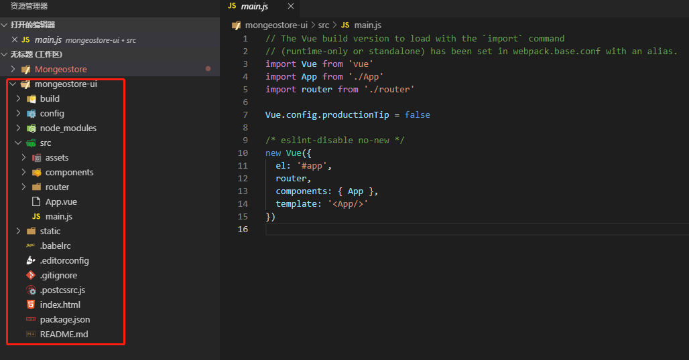

## 2、安装Element

### 2.1、安装依赖

访问地址https://element.eleme.cn/#/zh-CN/component/installation ，查看官方指南，包括框架的安装和组件的使用等。

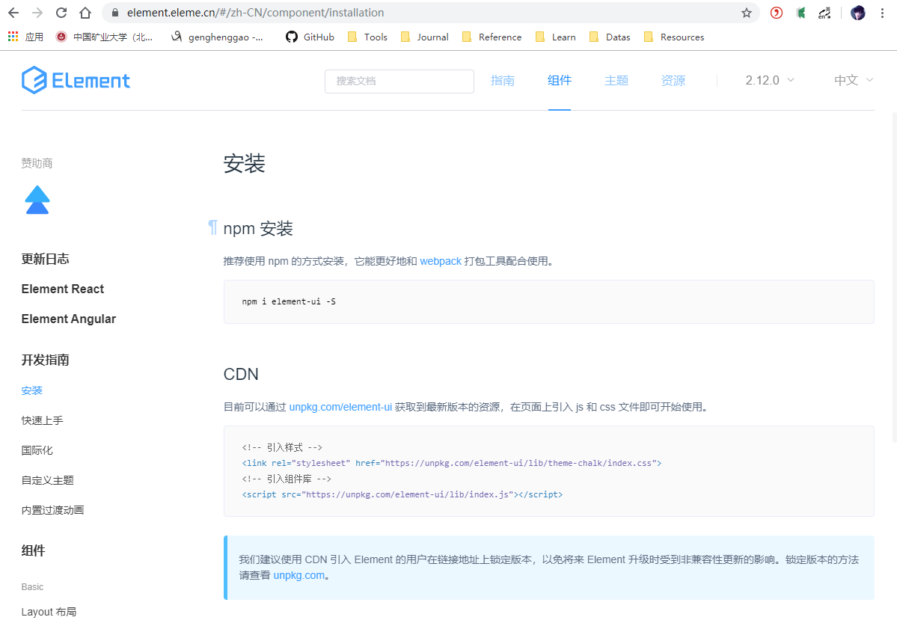

按照安装指南，选择`NPM`安装方式。

```shell
cnpm i element-ui -S
```

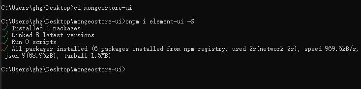

### 2.2、导入项目

在`main.js`中引入Element。

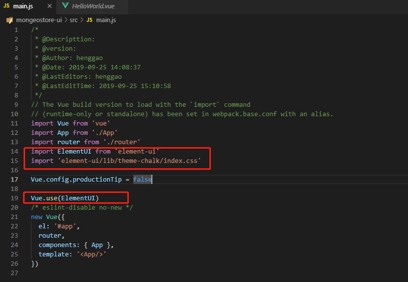

引入项目后，在原有的HelloWorld.vue页面加入一个Element的按钮，测试一下。

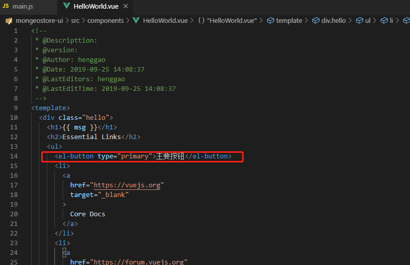

- 报错

  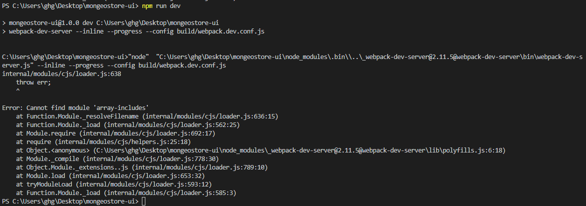

-   解决办法：

  - 删掉项目中的node_modules文件夹，

  - 执行 `npm cache clean` 或者  `cnpm cache clean` 命令清除掉cache缓存，

  - 然后`cnpm install` 和`npm run dev`就可以在这台电脑运行你的项目  

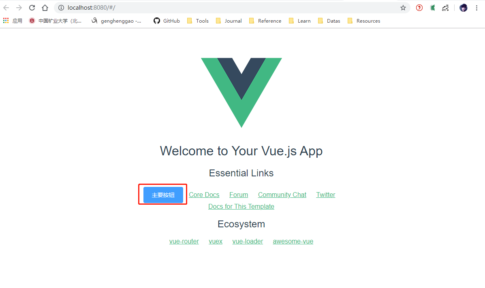

说明Element组件已经成功引入。


## 3、页面路由

### 3.1、添加页面

把components文件夹改名为views，并在view目录下添加3个页面：Login.vue、Home.vue、404.vue。

3个页面相似，Login.vue如下：

```vue
<!--
 * @Descripttion: 
 * @version: 
 * @Author: henggao
 * @Date: 2019-09-25 15:47:23
 * @LastEditors: henggao
 * @LastEditTime: 2019-09-25 15:47:23
 -->
<template>
  <div class="page">
      <h2>Login Page</h2>
  </div>
</template>

<script>
export default {
    name:'Login'
}
</script>

<style>

</style>
```

### 3.2、配置路由

打开router/index.js，添加3个路由，分别对应主页、登录和404页面。

```js
/*
 * @Descripttion: 
 * @version: 
 * @Author: henggao
 * @Date: 2019-09-25 14:08:37
 * @LastEditors: henggao
 * @LastEditTime: 2019-09-25 16:11:25
 */
import Vue from 'vue'
import Router from 'vue-router'
import Login from '@/views/Login'
import Home from '@/views/Home'
import NotFound from '@/views/404'

Vue.use(Router)

export default new Router({
  routes: [
    {
      path: '/',
      name: 'Home',
      component: Home
    },{
      path: '/login',
      name: 'Login',
      component: Login
    },{
      path: '/404',
      name: 'notFound',
      component: NotFound
    }
  ]
})

```

在浏览器中访问：localhost:8080

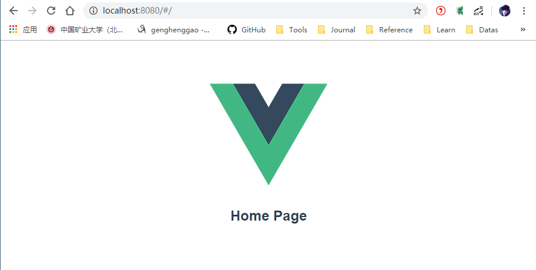

在浏览器中访问：http://localhost:8080/#/login

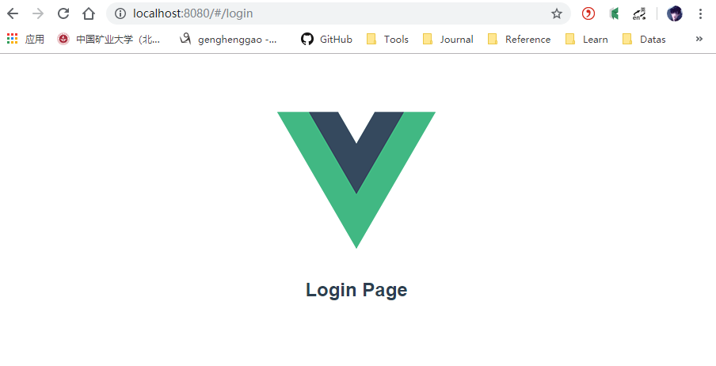

在浏览器中访问：http://localhost:8080/#/404

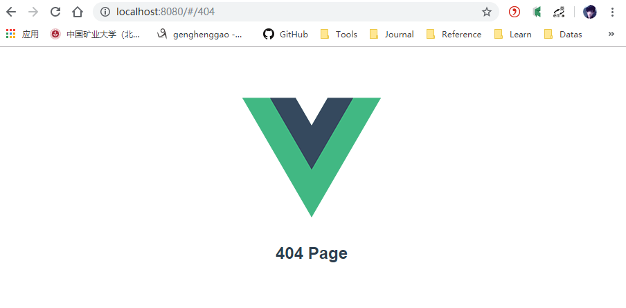

## 4、安装SCSS

### 4.1、安装依赖

后续会用到SCSS编写页面样式，先安装SCSS

```shell
cnpm install node-sass sass-loader -D
```

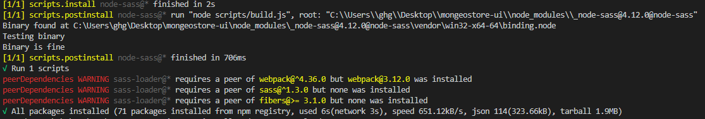

### 4.2、添加配置

在build文件夹下的`webpack.base.conf.js`的rules标签下添加配置

```js
{
    test: /\.scss$/,
    loaders: ['style', 'css', 'sass']
}
```

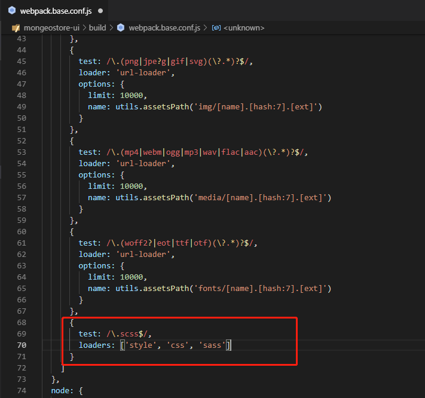

### 4.3、使用

在页面的style标签中把`lang`设置为`scss`即可。

```shell
<style lang="scss">

</style>
```

### 4.4、页面测试

丰富一下404页面内容，加如`scss`样式。

`404.vue`

```vue
<!--
 * @Descripttion: 
 * @version: 
 * @Author: henggao
 * @Date: 2019-09-25 15:50:09
 * @LastEditors: henggao
 * @LastEditTime: 2019-09-25 15:50:09
 -->
<template>
  <div class="site-wrapper site-page--not-found">
    <div class="site-content__wrapper">
      <div class="site-content">
        <h2 class="not-found-title">404</h2>
        <p class="not-found-desc">抱歉！您访问的页面<em>失联</em>啦 ...</p>
        <el-button @click="$router.go(-1)">返回上一页</el-button>
        <el-button type="primary" class="not-found-btn-gohome" @click="$router.push('/')">进入首页</el-button>
      </div>
    </div>
  </div>
</template>

<script>
  export default {
    name: '404'
  }
</script>

<style lang="scss">
  .site-wrapper.site-page--not-found {
    position: absolute;
    top: 60px;
    right: 0;
    bottom: 0;
    left: 0;
    overflow: hidden;
    .site-content__wrapper {
      padding: 0;
      margin: 0;
      background-color: #fff;
    }
    .site-content {
      position: fixed;
      top: 15%;
      left: 50%;
      z-index: 2;
      padding: 30px;
      text-align: center;
      transform: translate(-50%, 0);
    }
    .not-found-title {
      margin: 20px 0 15px;
      font-size: 8em;
      font-weight: 500;
      color: rgb(55, 71, 79);
    }
    .not-found-desc {
      margin: 0 0 30px;
      font-size: 26px;
      text-transform: uppercase;
      color: rgb(118, 131, 143);
      > em {
        font-style: normal;
        color: #ee8145;
      }
    }
    .not-found-btn-gohome {
      margin-left: 30px;
    }
  }
</style>

```

启动项目

```shell
npm run dev
```

- 报错

  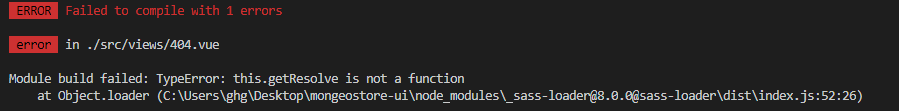

- 解决

  - 在`package.json`文件中，查到安装的sass-loader的版本为最新8.0.0

    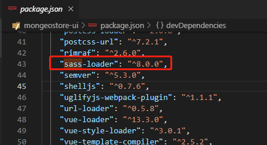

  - 把版本改为7.3.1

    

  - 执行命令，重新安装项目依赖

    ```shell
    cnpm install
    ```

  - 启动项目

    ```shell
    npm run dev
    ```

  - 项目启动成功，编译报错问题解决

    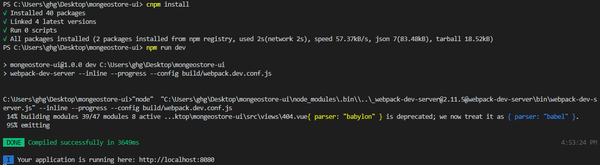

浏览器访问  http://localhost:8080/#/404

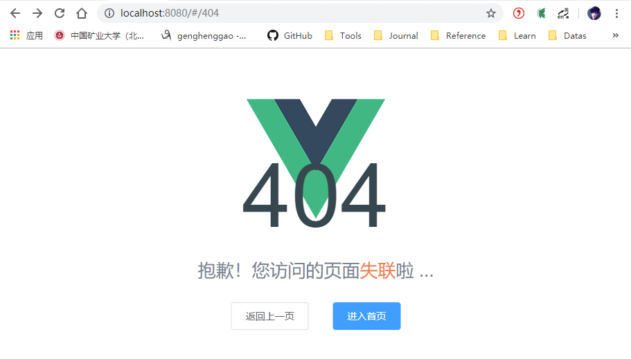

## 5、安装Axios

Axios 是一个基于 promise 的 HTTP 库，可以用在浏览器和 node.js 中。

- Features
  - 从浏览器中创建 [XMLHttpRequests](https://developer.mozilla.org/en-US/docs/Web/API/XMLHttpRequest)
  - 从 node.js 创建 [http](http://nodejs.org/api/http.html) 请求
  - 支持 [Promise](https://developer.mozilla.org/en-US/docs/Web/JavaScript/Reference/Global_Objects/Promise) API
  - 拦截请求和响应
  - 转换请求数据和响应数据
  - 取消请求
  - 自动转换 JSON 数据
  - 客户端支持防御 [XSRF](http://en.wikipedia.org/wiki/Cross-site_request_forgery)

### 5.1、安装依赖

```shell
cnpm install --save axios
```

### 5.2、编写 代码

修改`Home.vue`，进行简单的安装测试

```vue
<!--
 * @Descripttion: 
 * @version: 
 * @Author: henggao
 * @Date: 2019-09-25 15:47:23
 * @LastEditors: henggao
 * @LastEditTime: 2019-09-25 17:05:29
 -->
<template>
  <div class="page">
      <h2>Home Page</h2>
      <el-button type="primary" @click="testAxios()">测试Axios调用</el-button>
  </div>
</template>

<script>
import axios from 'axios'
export default {
    name:'Home',
    methods: {
      testAxios(){
        axios.get('http://localhost:8080').then(res => { alert(res.data)})
      }
    }
}
</script>

<style>

</style>
```

### 5.3、测试调用

打开主页，单击【测试Axios调用】，弹出页面的HTML数据。

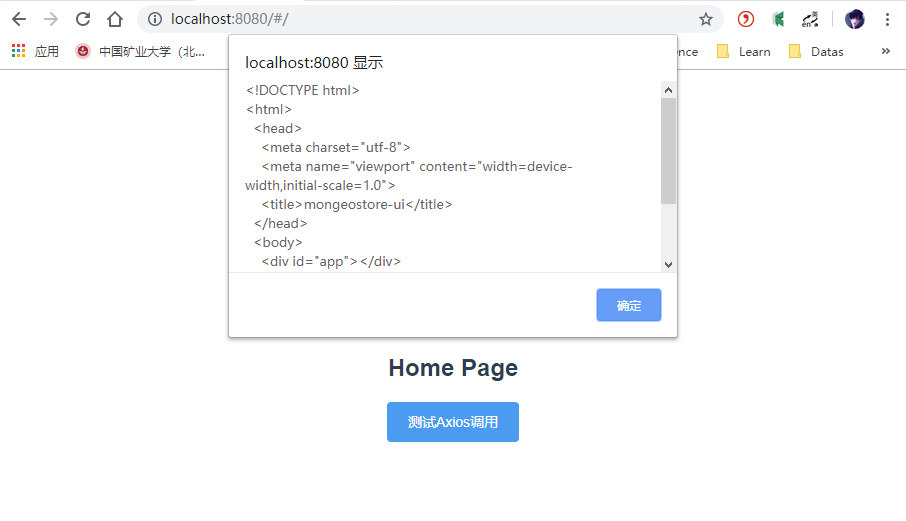

## 6、安装Mock.js

为了模拟后台接口提供页面需要的数据，引入Mock.js提供模拟数据，而不用依赖后台接口的完成。

### 6.1、安装依赖

```shell
cnpm install --save mockjs
```

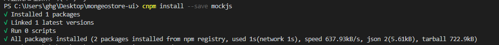

### 6.2、编写代码

在`src`目录下新建一个mock目录，创建`mock.js`,模拟两个接口，分别拦截用户和菜单的请求，返回相应数据。

```js
/*
 * @Descripttion: 
 * @version: 
 * @Author: henggao
 * @Date: 2019-09-25 17:13:45
 * @LastEditors: henggao
 * @LastEditTime: 2019-09-25 17:39:53
 */
import Mock from 'mockjs'
Mock.mock('http://localhost:8080/user',{
    'name': '@name',    //随机生成姓名
    'name': '@email',   //随机生成邮箱
    'age|1-10': 5,      //随机生成1~10岁
})

Mock.mock('http://localhost:8080/menu',{
    'id': '@increment',    //id自增
    'name': 'menu',   //名称为menu
    'order|1-20': 5,      //排序在1~20之间
})
```

修改Home.vue，在页面添加两个按钮，分别触发用户和菜单的处理请求。

```shell
<!--
 * @Descripttion: 
 * @version: 
 * @Author: henggao
 * @Date: 2019-09-25 15:47:23
 * @LastEditors: henggao
 * @LastEditTime: 2019-09-25 17:28:47
 -->
<template>
  <div class="page">
      <h2>Home Page</h2>
      <el-button type="primary" @click="testAxios()">测试Axios调用</el-button>
      <el-button type="primary" @click="getUser()">获取用户信息</el-button>
      <el-button type="primary" @click="getMenu()">获取菜单信息</el-button>
  </div>
</template>

<script>
import axios from 'axios'
import mock from '@/mock/mock.js'
export default {
    name:'Home',
    methods: {
      testAxios(){
        axios.get('http://localhost:8080').then(res => { alert(res.data)})
      },
      getUser(){
        axios.get('http://localhost:8080/user').then(res => { alert(JSON.stringify(res.data))})
      },
      getMenu(){
        axios.get('http://localhost:8080/menu').then(res => { alert(JSON.stringify(res.data))})
      }
    }
}
</script>

<style>

</style>
```

### 6.3、页面测试

浏览器访问http://localhost:8080/#/，分别点击两个按钮

- 获取用户信息

  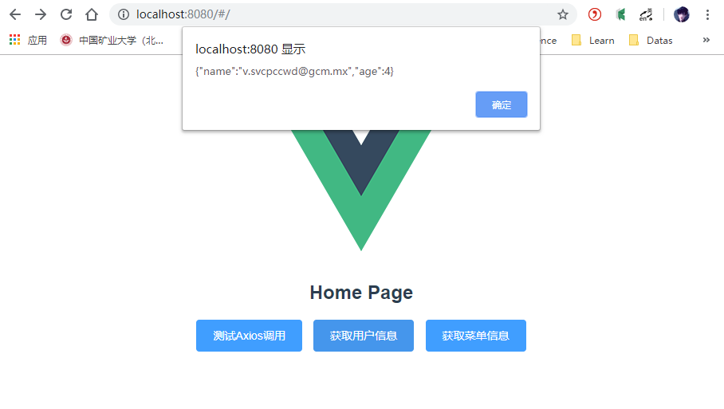

- 获取菜单信息

  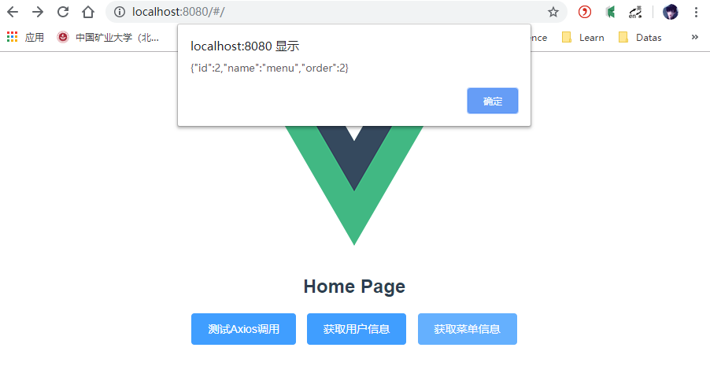

测试成功，mock成功集成进来。