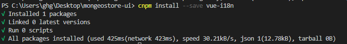
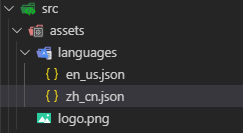
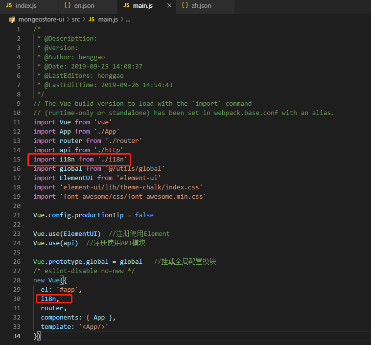
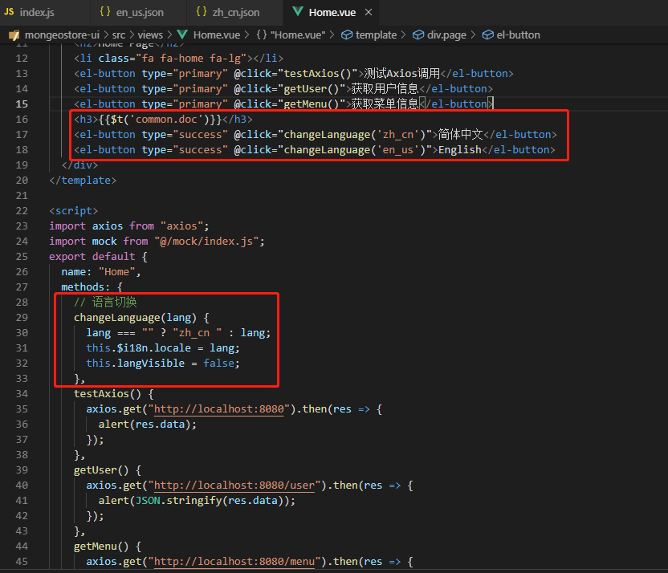
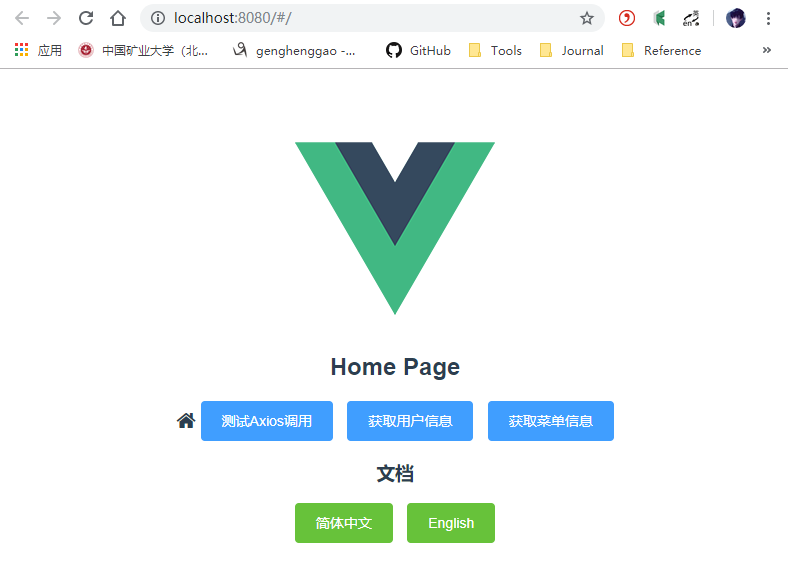
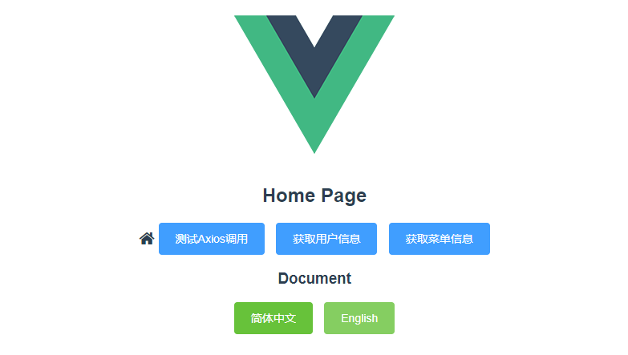
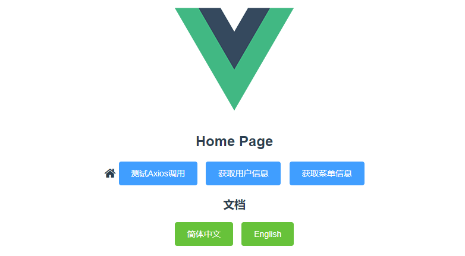

# 五、多语言国际化

[TOC]

## 1、安装依赖

```shell
cnpm install --save vue-i18n  
```



## 2、添加配置

在src目录下新建i18n目录，并创建一个index.js

- index.js

```js
/*
 * @Description: 
 * @version: 
 * @Author: henggao
 * @Date: 2019-09-26 14:10:12
 * @LastEditors: henggao
 * @LastEditTime: 2019-09-26 14:10:12
 */
import Vue from 'vue'
import VueI18n from 'vue-i18n'

//注册i18n实例并引入语言文件，文件格式
Vue.use(VueI18n)
const i18n = new VueI18n({
    locale: 'zh_cn',
    messages: {
        'zh_cn': require('@/assets/languages/zh_cn.json'),
        'en_us': require('@/assets/languages/en_us.json')
    }
})

export default i18n
```

在asset目录下创建languages文件夹，其下新建两个多语言包`en_us.json`、`zh_cn.json`



- `zh_cn.json`

```json
{
    "common": {
        "home": "首页",
        "login": "登录",
        "logout": "退出登录",
        "doc": "文档",
        "blog": "博客",
        "projectRepo": "项目",
        "myMsg": "我的消息",
        "config": "系统配置",
        "backup": "备份",
        "restore": "还原",
        "backupRestore": "备份还原",
        "versionName": "版本名称",
        "exit": "退出"
    },
    "action": {
        "operation": "操作",
        "add": "新增",
        "edit": "编辑",
        "delete": "删除",
        "batchDelete": "批量删除",
        "search": "查询",
        "loading": "拼命加载中",
        "submit": "提交",
        "comfirm": "确定",
        "cancel": "取消",
        "reset": "重置"
    }
}
```

- `en_us.json`

```json
{
    "common": {
        "home": "Home",
        "login": "Login",
        "logout": "Logout",
        "doc": "Document",
        "blog": "Blog",
        "projectRepo": "Project",
        "myMsg": "My Message",
        "config": "Config",
        "backup": "Backup",
        "restore": "Restore",
        "backupRestore": "Backup Restore",
        "versionName": "Version",
        "exit": "Exit"
    },
    "action": {
        "operation": "Operation",
        "add": "Add",
        "edit": "Edit",
        "delete": "Delete",
        "batchDelete": "Batch Delete",
        "search": "Search",
        "loading": "loading",
        "submit": "Submit",
        "comfirm": "Comfirm",
        "cancel": "Cancel",
        "reset": "Reset"
    }
}
```

在main.js中引入i18n.并注入vue对象

```js
/*
 * @Descripttion: 
 * @version: 
 * @Author: henggao
 * @Date: 2019-09-25 14:08:37
 * @LastEditors: henggao
 * @LastEditTime: 2019-09-26 14:54:33
 */
// The Vue build version to load with the `import` command
// (runtime-only or standalone) has been set in webpack.base.conf with an alias.
import Vue from 'vue'
import App from './App'
import router from './router'
import api from './http'
import i18n from './i18n'
import global from '@/utils/global'
import ElementUI from 'element-ui'
import 'element-ui/lib/theme-chalk/index.css'
import 'font-awesome/css/font-awesome.min.css'

Vue.config.productionTip = false

Vue.use(ElementUI)  //注册使用Element
Vue.use(api)  //注册使用API模块

Vue.prototype.global = global   //挂载全局配置模块
/* eslint-disable no-new */
new Vue({
  el: '#app',
  i18n,
  router,
  components: { App },
  template: '<App/>'
})
```



## 3、字符引用

打开Home.vue，在模板下面添加一个国际化字符和两个按钮做中英切换。

```vue
<h3>{{$t('common.doc')}}</h3>
<el-button type="success" @click="changeLanguage('zh_cn')">简体中文</el-button>
<el-button type="success" @click="changeLanguage('en_us')">English</el-button>
```

在方法声明区域添加以下方法，设置国际化语言

```vue
// 语言切换
    changeLanguage(lang) {
    lang === "" ? "zh_cn " : lang;
    this.$i18n.locale = lang;
    this.langVisible = false;
}
```



## 4、页面测试

启动应用，浏览器访问http://localhost:8080/#/ ，进入主页



单击【English】，国际化字符变为英文



单击【简体中文】，国际化字符变回中文



通过`this.$i18n.locale = xx`方式就可以完全切换语言。

