# 八、头部功能组件

[TOC]

## 1、主题切换组件

### 1.1、编写组件

在component目录下创建一个主题切换器组件ThemePicker，其下新建一个index.vue。


- ThemePicker实现思路是使用一个颜色选取组件el-color-picker获取一个颜色主题，然后通过动态替换Element默认CSS样式的方式替换框架的主题色primary color，并在主题色切换成功之后提供回调函数，通过回调函数同步和更新需要替换为主题色的页面或组件。
- 通过watch监听theme属性及主题色的更新状态替换CSS样式，修改主题色。

- index.vue

  ```vue
  <!--
   * @Description: 
   * @version: 
   * @Author: henggao
   * @Date: 2019-09-27 19:56:22
   * @LastEditors: henggao
   * @LastEditTime: 2019-09-27 20:25:55
   -->
  <template>
    <el-color-picker
      class="theme-picker"
      popper-class="theme-picker-dropdown"
      v-model="theme"
      :size="size"
    ></el-color-picker>
  </template>
  
  <script>
  const version = require("element-ui/package.json").version; // element-ui
  const ORIGINAL_THEME = "#409EFF"; // default color
  
  export default {
    name: "ThemePicker",
    props: {
      default: {
        // 初始化主题，可由外部传入
        type: String,
        default: null
      },
      size: {
        // 初始化主题，可由外部传入
        type: String,
        default: "small"
      }
    },
    data() {
      return {
        chalk: "", // content of theme-chalk css
        theme: ORIGINAL_THEME,
        showSuccess: true // 是否弹出换肤成功消息
      };
    },
    mounted() {
      if (this.default != null) {
        this.theme = this.default;
        this.$emit("onThemeChange", this.theme);
        this.showSuccess = false;
      }
    },
    watch: {
      theme(val, oldVal) {
        if (typeof val !== "string") return;
        // 替换CSS样式，修改主题色
        const themeCluster = this.getThemeCluster(val.replace("#", ""));
        const originalCluster = this.getThemeCluster(oldVal.replace("#", ""));
        console.log(themeCluster, originalCluster);
        const getHandler = (variable, id) => {
          return () => {
            const originalCluster = this.getThemeCluster(
              ORIGINAL_THEME.replace("#", "")
            );
            const newStyle = this.updateStyle(
              this[variable],
              originalCluster,
              themeCluster
            );
  
            let styleTag = document.getElementById(id);
            if (!styleTag) {
              styleTag = document.createElement("style");
              styleTag.setAttribute("id", id);
              document.head.appendChild(styleTag);
            }
            styleTag.innerText = newStyle;
          };
        };
        const chalkHandler = getHandler("chalk", "chalk-style");
        if (!this.chalk) {
          const url = `https://unpkg.com/element-ui@${version}/lib/theme-chalk/index.css`;
          this.getCSSString(url, chalkHandler, "chalk");
        } else {
          chalkHandler();
        }
        const styles = [].slice
          .call(document.querySelectorAll("style"))
          .filter(style => {
            const text = style.innerText;
            return (
              new RegExp(oldVal, "i").test(text) && !/Chalk Variables/.test(text)
            );
          });
        styles.forEach(style => {
          const { innerText } = style;
          if (typeof innerText !== "string") return;
          style.innerText = this.updateStyle(
            innerText,
            originalCluster,
            themeCluster
          );
        });
        // 响应外部操作
        this.$emit("onThemeChange", val);
        if (this.showSuccess) {
          this.$message({ message: "换肤成功", type: "success" });
        } else {
          this.showSuccess = true;
        }
      }
    },
    methods: {
      updateStyle(style, oldCluster, newCluster) {
        let newStyle = style;
        oldCluster.forEach((color, index) => {
          newStyle = newStyle.replace(new RegExp(color, "ig"), newCluster[index]);
        });
        return newStyle;
      },
  
      getCSSString(url, callback, variable) {
        const xhr = new XMLHttpRequest();
        xhr.onreadystatechange = () => {
          if (xhr.readyState === 4 && xhr.status === 200) {
            this[variable] = xhr.responseText.replace(/@font-face{[^}]+}/, "");
            callback();
          }
        };
        xhr.open("GET", url);
        xhr.send();
      },
  
      getThemeCluster(theme) {
        const tintColor = (color, tint) => {
          let red = parseInt(color.slice(0, 2), 16);
          let green = parseInt(color.slice(2, 4), 16);
          let blue = parseInt(color.slice(4, 6), 16);
  
          if (tint === 0) {
            // when primary color is in its rgb space
            return [red, green, blue].join(",");
          } else {
            red += Math.round(tint * (255 - red));
            green += Math.round(tint * (255 - green));
            blue += Math.round(tint * (255 - blue));
  
            red = red.toString(16);
            green = green.toString(16);
            blue = blue.toString(16);
  
            return `#${red}${green}${blue}`;
          }
        };
  
        const shadeColor = (color, shade) => {
          let red = parseInt(color.slice(0, 2), 16);
          let green = parseInt(color.slice(2, 4), 16);
          let blue = parseInt(color.slice(4, 6), 16);
  
          red = Math.round((1 - shade) * red);
          green = Math.round((1 - shade) * green);
          blue = Math.round((1 - shade) * blue);
  
          red = red.toString(16);
          green = green.toString(16);
          blue = blue.toString(16);
  
          return `#${red}${green}${blue}`;
        };
  
        const clusters = [theme];
        for (let i = 0; i <= 9; i++) {
          clusters.push(tintColor(theme, Number((i / 10).toFixed(2))));
        }
        clusters.push(shadeColor(theme, 0.1));
        return clusters;
      }
    }
  };
  </script>
  
  <style>
  .theme-picker .el-color-picker__trigger {
    vertical-align: middle;
  }
  
  .theme-picker-dropdown .el-color-dropdown__link-btn {
    display: none;
  }
  </style>
  ```

  在HeadBar.vue中引入Themepicker组件。

- HeadBar.vue


在页面中添加一个主题色切换器菜单

- HeadBar.vue

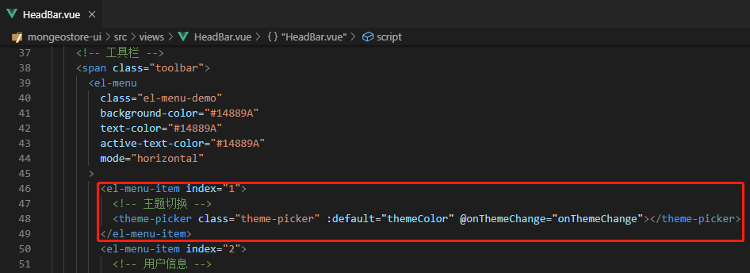

在方法区定义主题切换的回调函数，同步设置到store中的themeColor。

- HeadBar.vue

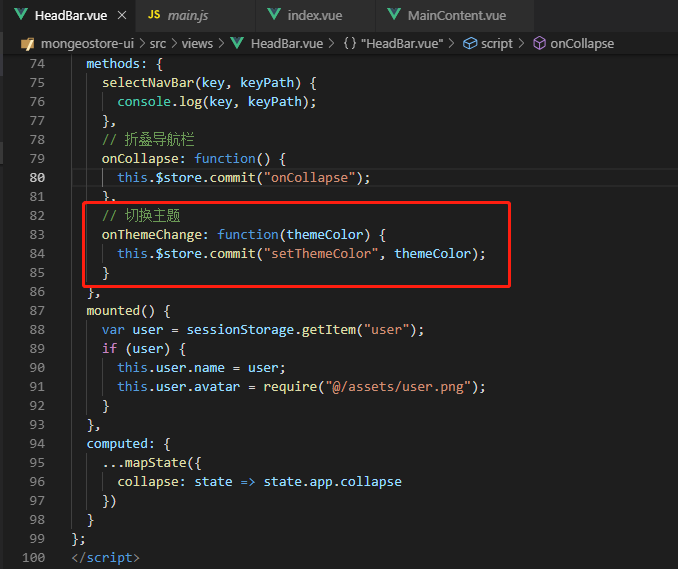

在各个页面中需要同步主题色的页面或组件绑定store中的主题色属性themeColor，这样每次通过切换器切换主题色的时候会把主题色通过store传递到页面组件。

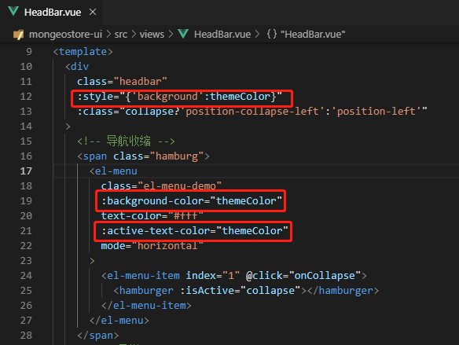

在页面中引入

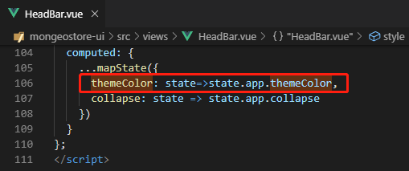

- HeadBar.vue

  ```vue
  <!--
   * @Description: 
   * @version: 
   * @Author: henggao
   * @Date: 2019-09-27 09:13:12
   * @LastEditors: henggao
   * @LastEditTime: 2019-09-29 09:22:33
   -->
  <template>
    <div
      class="headbar"
      :style="{'background':themeColor}"
      :class="collapse?'position-collapse-left':'position-left'"
    >
      <!-- 导航收缩 -->
      <span class="hamburg">
        <el-menu
          class="el-menu-demo"
          :background-color="themeColor"
          text-color="#fff"
          :active-text-color="themeColor"
          mode="horizontal"
        >
          <el-menu-item index="1" @click="onCollapse">
            <hamburger :isActive="collapse"></hamburger>
          </el-menu-item>
        </el-menu>
      </span>
      <!-- 工具栏 -->
      <span class="toolbar">
        <el-menu
          class="el-menu-demo"
          background-color="#14889A"
          text-color="#14889A"
          active-text-color="#14889A"
          mode="horizontal"
        >
          <el-menu-item index="1">
            <!-- 主题切换 -->
            <theme-picker class="theme-picker" :default="themeColor" @onThemeChange="onThemeChange"></theme-picker>
          </el-menu-item>
          <el-menu-item index="2">
            <!-- 用户信息 -->
            <span class="user-info">
              
              {{user.name}}
            </span>
          </el-menu-item>
        </el-menu>
      </span>
    </div>
  </template>
  
  <script>
  import { mapState } from "vuex";
  import mock from "@/mock/index";
  import Hamburger from "@/components/Hamburger";
  import ThemePicker from "@/components/ThemePicker";
  export default {
    components: {
      Hamburger,
      ThemePicker
    },
    data() {
      return {
        user: {
          name: "henggao",
          avatar: "",
          role: "超级管理员",
          registerInfo: "注册时间: 2019-10-01"
        },
        activeIndex: "1",
        langVisible: false
      };
    },
    methods: {
      selectNavBar(key, keyPath) {
        console.log(key, keyPath);
      },
      //折叠导航栏
      onCollapse: function() {
        this.$store.commit("onCollapse");
      },
      //切换主题
      onThemeChange: function(themeColor) {
        this.$store.commit('setThemeColor', themeColor);
      }
    },
    mounted() {
      var user = sessionStorage.getItem("user");
      if (user) {
        this.user.name = user;
        this.user.avatar = require("@/assets/user.png");
      }
    },
    computed: {
      ...mapState({
        themeColor: state=>state.app.themeColor,
        collapse: state => state.app.collapse
      })
    }
  };
  </script>
  
  <style scoped lang="scss">
  .headbar {
    position: fixed;
    top: 0;
    right: 0;
    z-index: 1030;
    height: 60px;
    line-height: 60px;
    border-color: rgba(180, 190, 190, 0.8);
    border-left-width: 1px;
    border-left-style: solid;
  }
  .hamburg,
  .navbar {
    float: left;
  }
  .toolbar {
    float: right;
  }
  .user-info {
    font-size: 20px;
    color: #fff;
    cursor: pointer;
    img {
      width: 40px;
      height: 40px;
      border-radius: 10px;
      margin: 10px 0px 10px 10px;
      float: right;
    }
  }
  .position-left {
    left: 200px;
  }
  .position-collapse-left {
    left: 65px;
  }
  </style>
  ```

### 1.2、页面测试

启动访问，访问http://localhost:8080/#/

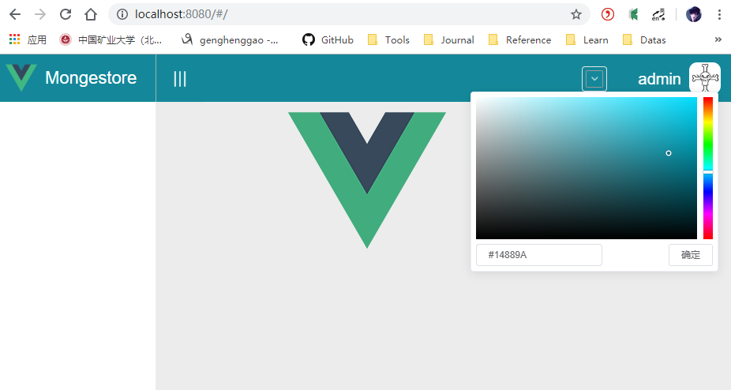

选取一个主题，单击【确定】

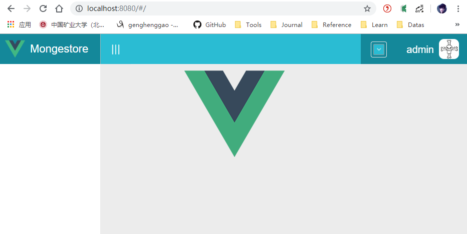

- 补充

  - 工具栏修改HeadBar.vue

    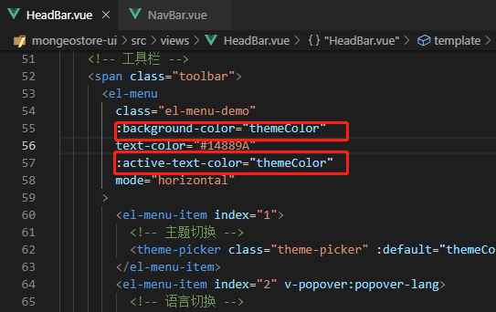

  - 左侧导航NavBar.vue

    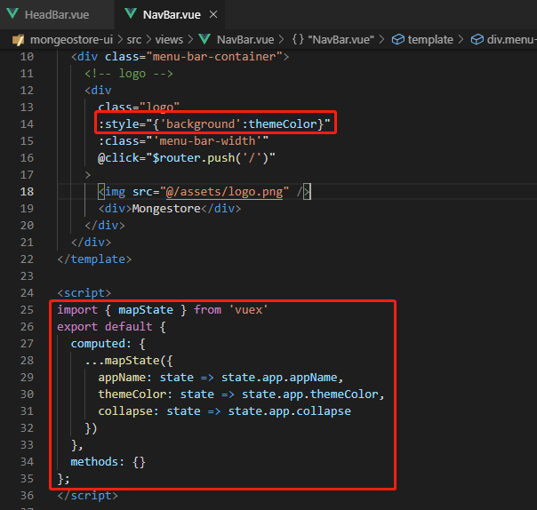

这样可以保持头部一致。

## 2、语言切换

### 2.1、编写组件

在HedaBar.vue工具栏切换器放置一个语言切换组件，可以选择中英两种语言。

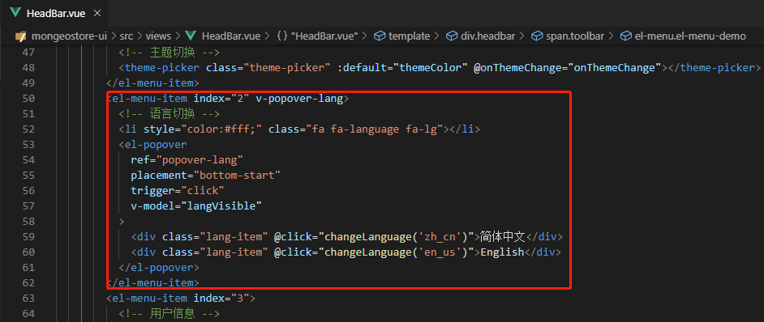

语言切切换响应函数，设置local值并弹出下拉面板消失。

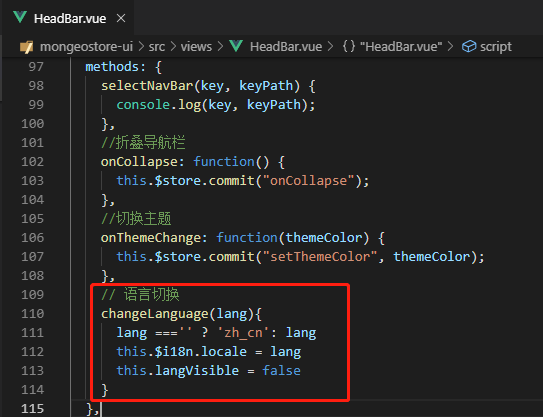

在头部工具栏左侧放置一些菜单项，使用国际化字符串，以测试多语言切换效果。

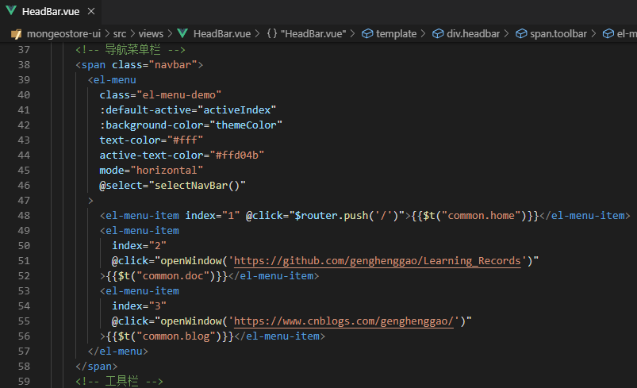

设置一下样式

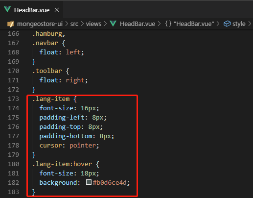

### 2.2、页面测试

启动应用，访问http://localhost:8080/#/ , 单击语言切换按钮，选择【English】

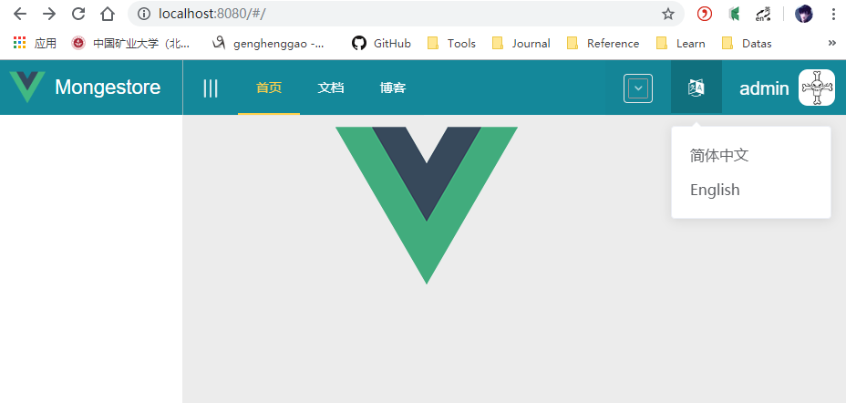

页面上的国际化字符成功转换为英文字符

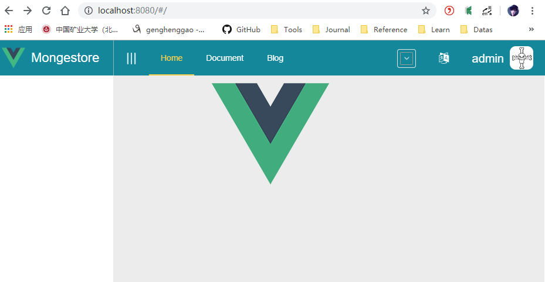

## 3、用户信息模块

### 3.1、编写组件

在views目录下新建core目录，其下新建一个用户信息面板PersonalPanel.vue，在单击用户头像时弹出用户信息面板，显示用户信息和一些操作。

- PersonPanel.vue

```vue
<!--
 * @Description: 
 * @version: 
 * @Author: henggao
 * @Date: 2019-09-29 10:06:21
 * @LastEditors: henggao
 * @LastEditTime: 2019-09-29 10:15:28
 -->
<template>
  <div class="personal-panel">
    <div class="personal-desc" :style="{'background':this.$store.state.app.themeColor}">
        <div class="avatar-container">
          
        </div>  
        <div class="name-role">
          <span class="sender">{{ user.name }} - {{ user.role }}</span>  
        </div>  
        <div class="registe-info">
          <span class="registe-info">
            <li class="fa fa-clock-o"></li>
            {{ user.registeInfo }}
          </span>
        </div>  
    </div>
    <div class="personal-relation">
        <span class="relation-item">followers</span>  
        <span class="relation-item">watches</span>  
        <span class="relation-item">friends</span>
    </div>
    <div class="main-operation">
        <span class="main-operation-item">
          <el-button size="small" icon="fa fa-male"> 个人中心</el-button>
        </span>    
        <span class="main-operation-item">
          <el-button size="small" icon="fa fa-key"> 修改密码</el-button>
        </span>    
    </div>
    <div class="other-operation">
        <div class="other-operation-item">
          <li class="fa fa-eraser"></li>
          清除缓存
        </div>    
        <div class="other-operation-item">
          <li class="fa fa-user"></li>
          在线人数
        </div>    
        <div class="other-operation-item">
          <li class="fa fa-bell"></li>
          访问次数
        </div>    
        <div class="other-operation-item">
          <li class="fa fa-undo"></li>
          {{$t("common.backupRestore")}}
        </div>    
    </div>
    <div class="personal-footer" @click="logout">
      <li class="fa fa-sign-out"></li>
      {{$t("common.logout")}}
    </div>
  </div>
</template>

<script>
export default {
  name: 'PersonalPanel',
  components:{
  },
  props: {
    user: {
      type: Object,
      default: {
        name: "admin",
        avatar: "@/assets/user.png",
        role: "超级管理员",
        registeInfo: "注册时间：2018-12-25 "
      }
    }
  },
  data() {
    return {
    }
  },
  methods: {
    // 退出登录
    logout: function() {
      this.$confirm("确认退出吗?", "提示", {
        type: "warning"
      })
      .then(() => {
        sessionStorage.removeItem("user")
        this.$router.push("/login")
        this.$api.login.logout().then((res) => {
          }).catch(function(res) {
        })
      })
      .catch(() => {})
    }
  },
  mounted() {
  }
}
</script>

<style scoped>
.personal-panel {
  font-size: 14px;
  width: 280px;
  text-align: center;
  border-color: rgba(180, 190, 190, 0.2);
  border-width: 1px;
  border-style: solid;
  background: rgba(182, 172, 172, 0.1);
  margin: -14px;
}
.personal-desc {
  padding: 15px;
  color: #fff;
}
.avatar {
  width: 80px;
  height: 80px;
  border-radius: 90px;
}
.name-role {
  font-size: 16px;
  padding: 5px;
}
.personal-relation {
  font-size: 16px;
  padding: 12px;
  margin-right: 1px;
  background: rgba(200, 209, 204, 0.3);
}
.relation-item {
  padding: 12px;
}
.relation-item:hover {
  cursor: pointer;
  color: rgb(19, 138, 156);
}
.main-operation {
  padding: 8px;
  margin-right: 1px;
  /* background: rgba(175, 182, 179, 0.3); */
  border-color: rgba(201, 206, 206, 0.2);
  border-top-width: 1px;
  border-top-style: solid;
}
.main-operation-item {
  margin: 15px;
}
.other-operation {
  padding: 15px;
  margin-right: 1px;
  text-align: left;
  border-color: rgba(180, 190, 190, 0.2);
  border-top-width: 1px;
  border-top-style: solid;
}
.other-operation-item {
  padding: 12px;
}
.other-operation-item:hover {
  cursor: pointer;
  background: #9e94941e;
  color: rgb(19, 138, 156);
}
.personal-footer {
  margin-right: 1px;
  font-size: 14px;
  text-align: center;
  padding-top: 10px;
  padding-bottom: 10px;
  border-color: rgba(180, 190, 190, 0.2);
  border-top-width: 1px;
  border-top-style: solid;
}
.personal-footer:hover {
  cursor: pointer;
  color: rgb(19, 138, 156);
  background: #b1a6a61e;
}
</style>
```

退出登录处理函数，确认 推出后清理空本地存储，返回登录界面并调用后台退出登录接口。

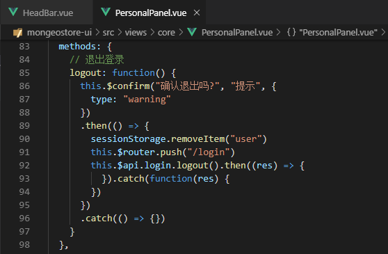

在头部引入组件，在用户头像信息组件下通过popover组件关联用户信息面板。

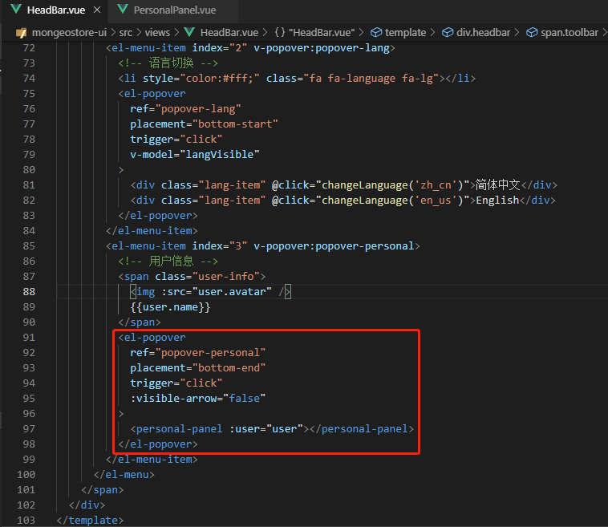

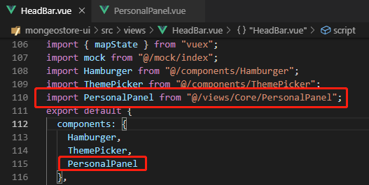

### 3.2、页面测试

启动应用，访问http://localhost:8080/#/login ， 单击【登录】按钮，进入主页面，单击头像区域，弹出用户信息面板。

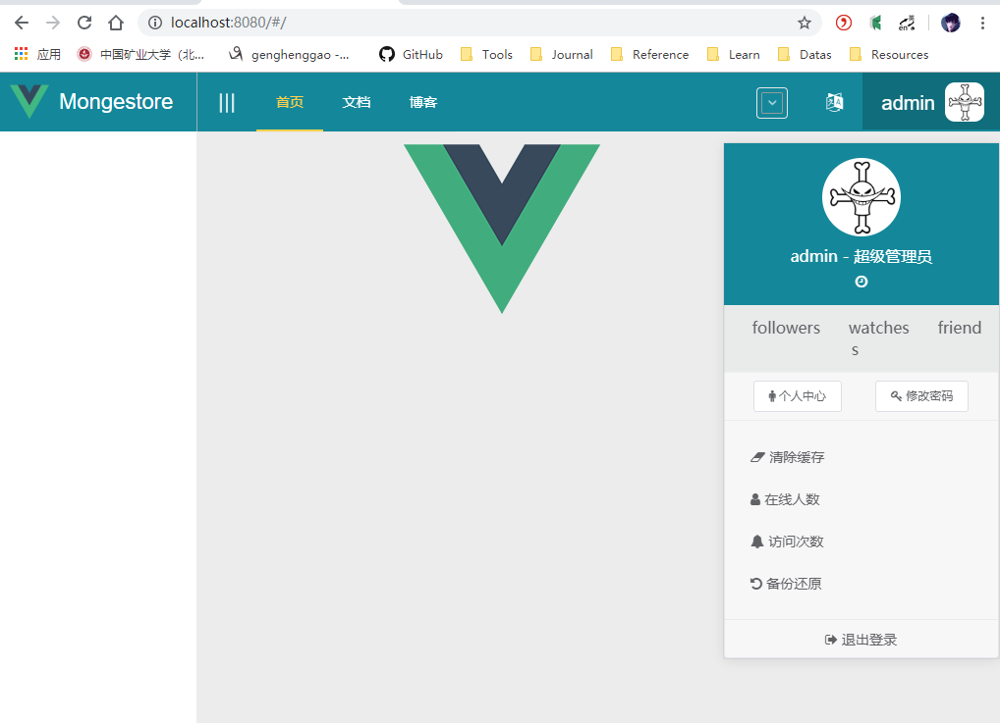

单击信息面板最下面的【退出登录】，弹出确认提示框，单击【确认】，返回登录界面。

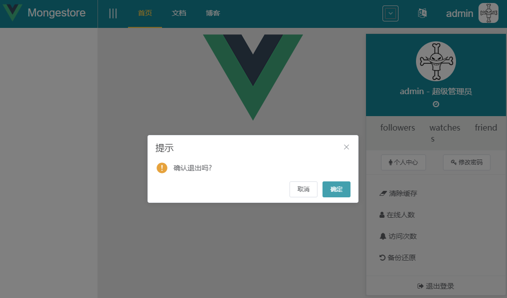

## 4、系统通知面板

### 4.1、编写组件

在views/core目录下新建一个系统通知面板Noticepanel.vue，在头部工具栏添加系统通知组件，单击弹出系统通知信息面板。

- NoticePanel.vue

  ```vue
  <!--
   * @Description: 
   * @version: 
   * @Author: henggao
   * @Date: 2019-09-29 10:48:28
   * @LastEditors: henggao
   * @LastEditTime: 2019-09-29 10:48:28
   -->
  <template>
    <div class="notice-panel">
      <div class="header">您有 {{data.length}} 条通知</div>
      <div class="notice-content">
        <div v-for="item in data" :key="item.key" class="notice-item">
          <span class="notice-icon">
            <li :class="item.icon"></li>
          </span>
          <span class="notice-cotent">{{ item.content }}</span>
        </div>
      </div>
      <div class="notice-footer">查看所有通知</div>
    </div>
  </template>
  
  <script>
  export default {
    name: "NoticePanel",
    props: {
      data: {
        type: Array,
        default: () => [
          {
            key: "1",
            icon: "fa fa-envelope-o",
            content: "你修改了用户密码"
          },
          {
            key: "2",
            icon: "fa fa-music",
            content: "你修改了用户头像"
          },
          {
            key: "3",
            icon: "fa fa-edit",
            content: "今日25名新成员加入"
          },
          {
            key: "4",
            icon: "fa fa-edit",
            content: "您发表了一篇新随笔"
          }
        ]
      }
    },
    data() {
      return {};
    },
    methods: {
      handleClick: function() {
        // 按钮操作处理函数
        this.$emit("click", {});
      }
    },
    mounted() {}
  };
  </script>
  
  <style scoped>
  .notice-panel {
    font-size: 15px;
    width: 250px;
    margin: -12px;
  }
  .header {
    padding-left: 10px;
    font-size: 14px;
    padding-top: 6px;
    padding-bottom: 6px;
  }
  .notice-content {
    font-size: 15px;
  }
  .notice-item {
    border-color: rgba(180, 190, 190, 0.8);
    border-top-width: 1px;
    border-top-style: solid;
    padding-top: 10px;
    padding-bottom: 10px;
  }
  .notice-item:hover {
    cursor: pointer;
    background: #b1a6a61e;
  }
  .notice-icon {
    padding-left: 10px;
    padding-right: 5px;
  }
  .notice-footer {
    font-size: 14px;
    text-align: center;
    padding-top: 10px;
    padding-bottom: 10px;
    border-color: rgba(180, 190, 190, 0.8);
    border-top-width: 1px;
    border-top-style: solid;
  }
  .notice-footer:hover {
    cursor: pointer;
    background: #b1a6a61e;
  }
  </style>
  ```

在头部区域HeadBar.vue中引入组件并通过popover组件关联通知面板


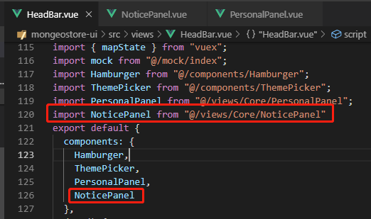

### 4.2、页面测试

启动应用，访问http://localhost:8080/#/login ， 单击【登录】按钮，进入主页面，单击通知区域，弹出系统通知面板。

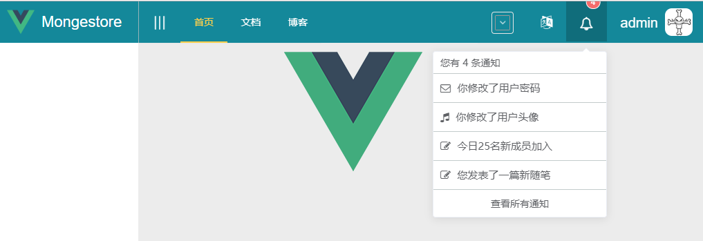

## 5、用户私信面板

### 5.1、编写组件

在views/core目录下新建一个系统通知面板MesagePanel.vue，在头部工具栏添加用户私信组件，单击弹出用户私信信息面板。

```vue
<!--
 * @Description: 
 * @version: 
 * @Author: henggao
 * @Date: 2019-09-29 11:00:43
 * @LastEditors: henggao
 * @LastEditTime: 2019-09-29 11:00:43
 -->
<template>
  <div class="message-panel">
    <div class="message-header">您有 {{data.length}} 条消息</div>
    <div class="message-content">
      <div v-for="item in data" :key="item.key" class="message-item">
        <div class="message-avatar">
          
        </div>
        <span class="sender">{{ item.sender }}</span>
        <span class="time">
          <li class="fa fa-clock-o"></li>
          {{ item.time }}
        </span>
        <div class="message-cotent">{{ item.content }}</div>
      </div>
    </div>
    <div class="message-footer">查看所有消息</div>
  </div>
</template>

<script>
export default {
  name: "MessagePanel",
  props: {
    data: {
      type: Array,
      default: () => [
        {
          key: "1",
          avatar: "@/assets/user.png",
          content: "你修改了用户密码",
          sender: "诸葛亮",
          time: "5分钟前"
        },
        {
          key: "2",
          avatar: "@/assets/user.png",
          content: "你修改了用户头像",
          sender: "武则天",
          time: "2小时前"
        },
        {
          key: "3",
          avatar: "@/assets/user.png",
          content: "今日25名新成员加入",
          sender: "王语嫣",
          time: "昨天"
        },
        {
          key: "4",
          avatar: "@/assets/user.png",
          content: "您发表了一篇新随笔",
          sender: "苍井空",
          time: "昨天"
        },
        {
          key: "5",
          avatar: "@/assets/user.png",
          content: "您发表了一篇新随笔",
          sender: "上官婉儿",
          time: "前天"
        }
      ]
    }
  },
  data() {
    return {};
  },
  methods: {
    handleClick: function() {
      // 按钮操作处理函数
      this.$emit("click", {});
    }
  },
  mounted() {}
};
</script>

<style scoped>
.message-panel {
  font-size: 15px;
  width: 300px;
  margin: -12px;
}
.message-header {
  padding-left: 10px;
  font-size: 14px;
  padding-top: 6px;
  padding-bottom: 6px;
}
.message-content {
  font-size: 15px;
}
.message-item {
  border-color: rgba(180, 190, 190, 0.8);
  border-top-width: 1px;
  border-top-style: solid;
  padding-top: 10px;
  padding-bottom: 10px;
}
.message-item:hover {
  cursor: pointer;
  background: #b1a6a61e;
}
.message-avatar {
  padding-left: 10px;
}
.avatar {
  margin-right: 10px;
}
.sender {
  font-size: 16px;
  font-weight: bold;
}
.time {
  font-size: 12px;
  float: right;
  padding-right: 10px;
}
.message-footer {
  font-size: 14px;
  text-align: center;
  padding-top: 10px;
  padding-bottom: 10px;
  border-color: rgba(180, 190, 190, 0.8);
  border-top-width: 1px;
  border-top-style: solid;
}
.message-footer:hover {
  cursor: pointer;
  background: #b1a6a61e;
}
.avatar {
  width: 40px;
  height: 40px;
  border-radius: 90px;
  float: left;
}
</style>
```

在头部HeadBar.vue中引入组件并通过popover组件关联私信面板


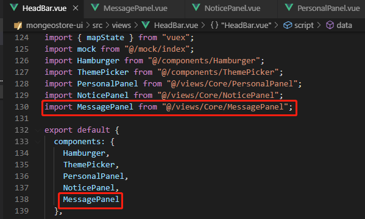

### 5.2、页面测试

启动应用，访问http://localhost:8080/#/login ， 单击【登录】按钮，进入主页面，单击私信区域，弹出用户私信知面板。

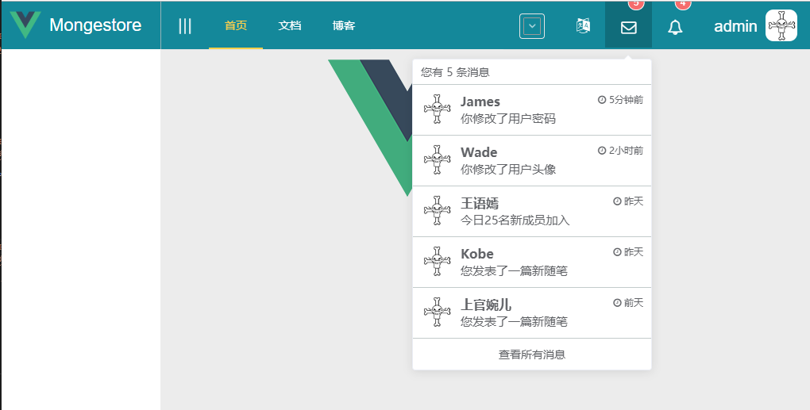