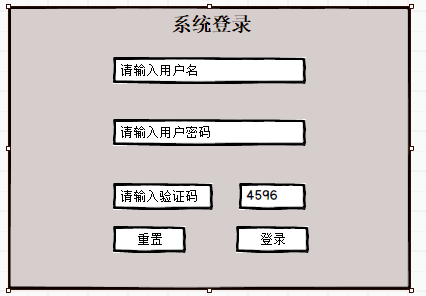
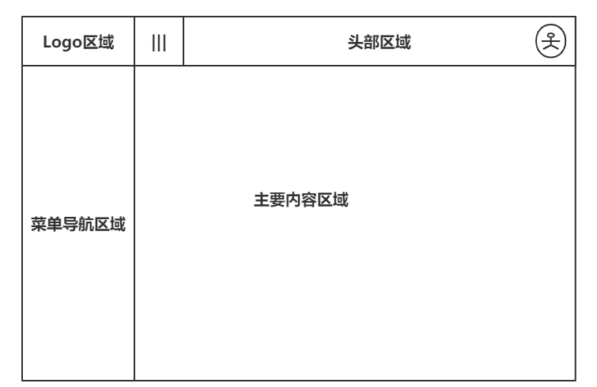
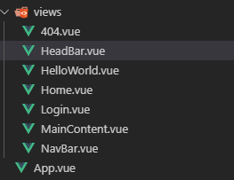
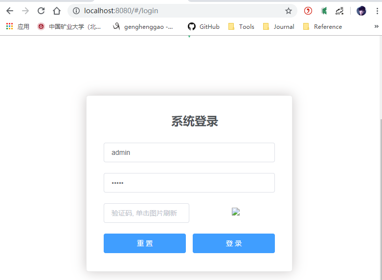
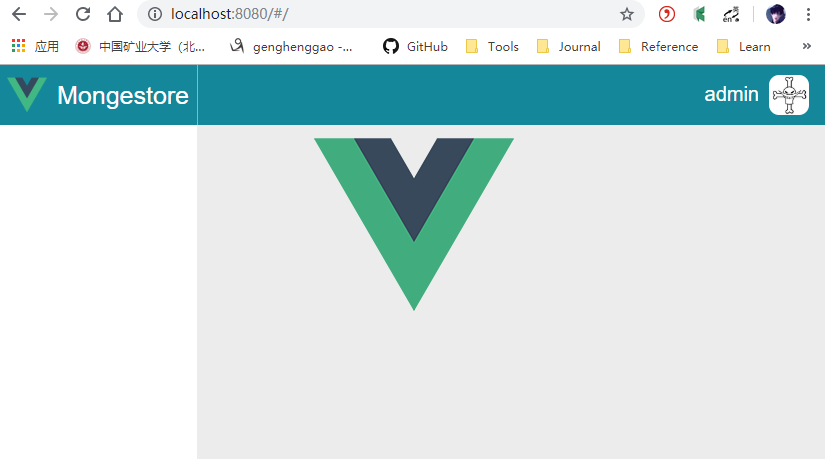

# 六、登录流程完善

[TOC]

## 1、登录界面

### 1.1、界面设计

首先简单设计一个登陆界面



### 1.2、关键代码

调用后台登录接口，并在成功登录后保存token到Cookie，保存到本地存储，然后跳转到主页面。

Login.vue

```vue
<!--
 * @Descripttion: 
 * @version: 
 * @Author: henggao
 * @Date: 2019-09-25 15:47:23
 * @LastEditors: henggao
 * @LastEditTime: 2019-09-27 10:21:29
 -->
<template>
  <el-form
    :model="loginForm"
    :rules="fieldRules"
    ref="loginForm"
    label-position="left"
    label-width="0px"
    class="demo-ruleForm login-container"
  >
    <span class="tool-bar"></span>
    <h2 class="title" style="padding-left:22px;">系统登录</h2>
    <el-form-item prop="account">
      <el-input type="text" v-model="loginForm.account" auto-complete="off" placeholder="账号"></el-input>
    </el-form-item>
    <el-form-item prop="password">
      <el-input type="password" v-model="loginForm.password" auto-complete="off" placeholder="密码"></el-input>
    </el-form-item>
    <el-form-item>
      <el-col :span="12">
        <el-form-item prop="captcha">
          <el-input
            type="test"
            v-model="loginForm.captcha"
            auto-complete="off"
            placeholder="验证码, 单击图片刷新"
            style="width: 100%;"
          ></el-input>
        </el-form-item>
      </el-col>
      <el-col class="line" :span="1">&nbsp;</el-col>
      <el-col :span="11">
        <el-form-item>
          
        </el-form-item>
      </el-col>
    </el-form-item>
    <el-form-item style="width:100%;">
      <el-button type="primary" style="width:48%;" @click.native.prevent="reset">重 置</el-button>
      <el-button
        type="primary"
        style="width:48%;"
        @click.native.prevent="login"
        :loading="loading"
      >登 录</el-button>
    </el-form-item>
  </el-form>
</template>

<script>
import Cookies from "js-cookie";
export default {
  name: "Login",
  data() {
    return {
      loading: false,
      loginForm: {
        account: "admin",
        password: "admin",
        captcha: "",
        src: ""
      },
      fieldRules: {
        account: [{ required: true, message: "请输入账号", trigger: "blur" }],
        password: [{ required: true, message: "请输入密码", trigger: "blur" }]
      },
      checked: true
    };
  },
  methods: {
    login() {
      this.loading = true;
      let userInfo = {
        account: this.loginForm.account,
        password: this.loginForm.password,
        captcha: this.loginForm.captcha
      };
      this.$api.login
        .login(userInfo)
        .then(res => {
          // 调用登录接口
          if (res.msg != null) {
            this.$message({ message: res.msg, type: "error" });
          } else {
            Cookies.set("token", res.data.token); // 放置token到Cookie
            sessionStorage.setItem("user", userInfo.account); // 保存用户到本地会话
            this.$router.push("/"); // 登录成功，跳转到主页
          }
          this.loading = false;
        })
        .catch(res => {
          this.$message({ message: res.message, type: "error" });
        });
    },
    refreshCaptcha: function() {
      this.loginForm.src =
        this.global.baseUrl + "/captcha.jpg?t=" + new Date().getTime();
    },
    reset() {
      this.$refs.loginForm.resetFields();
    }
  },
  mounted() {
    this.refreshCaptcha();
  }
};
</script>

<style lang="scss" scoped>
.login-container {
  -webkit-border-radius: 5px;
  border-radius: 5px;
  -moz-border-radius: 5px;
  background-clip: padding-box;
  margin: 100px auto;
  width: 350px;
  padding: 35px 35px 15px 35px;
  background: #fff;
  border: 1px solid #eaeaea;
  box-shadow: 0 0 25px #cac6c6;
  .title {
    margin: 0px auto 30px auto;
    text-align: center;
    color: #505458;
  }
}
</style>
```

## 2、主页面

### 2.1、界面设计

简单设计一下主页面整体框架



### 2.2、关键代码

在views文件夹下添加头部【HeadBar.vue】、左侧导航【NavBar.vue】和主要内容区域【MainContent.vue】页面文件。



#### 2.2.1、Home.vue

主页有导航菜单、头部区域和主要内容区域组成。

```vue
<!--
 * @Descripttion: 
 * @version: 
 * @Author: henggao
 * @Date: 2019-09-25 15:47:23
 * @LastEditors: henggao
 * @LastEditTime: 2019-09-27 10:26:55
 -->
<template>
  <div class="container">
    <!-- 导航菜单栏 -->
    <nav-bar></nav-bar>
    <!-- 头部区域 -->
    <head-bar></head-bar>
    <!-- 主内容区域 -->
    <main-content></main-content>
  </div>
</template>

<script>
import HeadBar from "./HeadBar";
import NavBar from "./NavBar";
import MainContent from "./MainContent";
export default {
  components: {
    HeadBar,
    NavBar,
    MainContent
  }
};
</script>

<style scoped lang="scss">
.container {
  position: absolute;
  top: 0px;
  left: 0px;
  right: 0px;
  bottom: 0px;
  // background: rgba(224, 234, 235, 0.1);
}
</style>  
```

#### 2.2.2、HeadBar.vue

头部导航主要是设置样式，并在右侧添加用户名名和头像显示。

```vue
<!--
 * @Description: 
 * @version: 
 * @Author: henggao
 * @Date: 2019-09-27 09:13:12
 * @LastEditors: henggao
 * @LastEditTime: 2019-09-27 10:32:26
 -->
<template>
  <div class="headbar" style="background:#14889A" :class="'position-left'">
    <!-- 工具栏 -->
    <span class="toolbar">
      <el-menu
        class="el-menu-demo"
        background-color="#14889A"
        text-color="#14889A"
        active-text-color="#14889A"
        model="horizontal"
      >
        <el-menu-item index="1">
          <!-- 用户信息 -->
          <span class="user-info">
            
            {{user.name}}
          </span>
        </el-menu-item>
      </el-menu>
    </span>
  </div>
</template>

<script>
import mock from "@/mock/index";
export default {
  data() {
    return {
      user: {
        name: "henggao",
        avatar: "",
        role: "超级管理员",
        registerInfo: "注册时间: 2019-10-01"
      },
      activeIndex: "1",
      langVisible: false
    };
  },
  methods: {
    selectNavBar(key, keyPath) {
      console.log(key, keyPath);
    }
  },
  mounted() {
    var user = sessionStorage.getItem("user");
    if (user) {
      this.user.name = user;
      this.user.avatar = require("@/assets/user.png");
    }
  }
};
</script>

<style scoped lang="scss">
.headbar {
  position: fixed;
  top: 0;
  right: 0;
  z-index: 1030;
  height: 60px;
  line-height: 60px;
  border-color: rgba(180, 190, 190, 0.8);
  border-left-width: 1px;
  border-left-style: solid;
}
.navbar {
  float: left;
}
.toolbar {
  float: right;
}
.user-info {
  font-size: 20px;
  color: #fff;
  cursor: pointer;
  img {
    width: 40px;
    height: 40px;
    border-radius: 10px;
    margin: 10px 0px 10px 10px;
    float: right;
  }
}
.position-left {
  left: 200px;
}
</style>
```

#### 2.2.3、NavBar.vue

左侧导航栏包含上方Logo区域和下方导航菜单区域。

```vue
<!--
 * @Description: 
 * @version: 
 * @Author: henggao
 * @Date: 2019-09-27 09:13:20
 * @LastEditors: henggao
 * @LastEditTime: 2019-09-27 10:33:40
 -->
<template>
  <div class="menu-bar-container">
    <!-- logo -->
    <div
      class="logo"
      style="background:#14889A"
      :class="'menu-bar-width'"
      @click="$router.push('/')"
    >
      
      <div>Mongestore</div>
    </div>
  </div>
</template>

<script>
export default {
  methods: {}
};
</script>

<style scoped lang="scss">
.menu-bar-container {
  position: fixed;
  top: 0px;
  left: 0;
  bottom: 0;
  z-index: 1020;
  .logo {
    position: absolute;
    top: 0px;
    height: 60px;
    line-height: 60px;
    background: #545c64;
    cursor: pointer;
    img {
      width: 40px;
      height: 40px;
      border-radius: 0px;
      margin: 10px 10px 10px 10px;
      float: left;
    }
    div {
      font-size: 25px;
      color: white;
      text-align: left;
      padding-left: 20px;
    }
  }
  .menu-bar-width {
    width: 200px;
  }
}
</style>
```

#### 2.2.4、MainContent.vue

主要内容区域包含标签导航和主要内容区域，在主要内容中放置route-view，用于路由信息。

```vue
<!--
 * @Description: 
 * @version: 
 * @Author: henggao
 * @Date: 2019-09-27 09:13:32
 * @LastEditors: henggao
 * @LastEditTime: 2019-09-27 10:23:16
 -->
<template>
  <div id="main-container" class="main-container" :class="'position-left'">
    <!-- 标签页 -->
    <div class="tab-container"></div>
    <!-- 主内容区域 -->
    <div class="main-content">
      <keep-alive>
        <transition name="fade" mode="out-in">
          <router-view></router-view>
        </transition>
      </keep-alive>
    </div>
  </div>
</template>

<script>
export default {
  data() {
    return {};
  },
  methods: {}
};
</script>

<style scoped lang="scss">
.main-container {
  padding: 0 5px 5px;
  position: absolute;
  top: 60px;
  left: 1px;
  right: 1px;
  bottom: 0px;
  background: rgba(67, 69, 70, 0.1);
  .main-content {
    position: absolute;
    top: 45px;
    left: 5px;
    right: 5px;
    bottom: 5px;
    padding: 5px;
  }
}
.position-left {
  left: 200px;
}
</style>
```

## 3、页面测试

启动应用，访问http://localhost:8080/#/login ，进入登陆界面



单击【登录】,登录成功之后跳到主页面。



