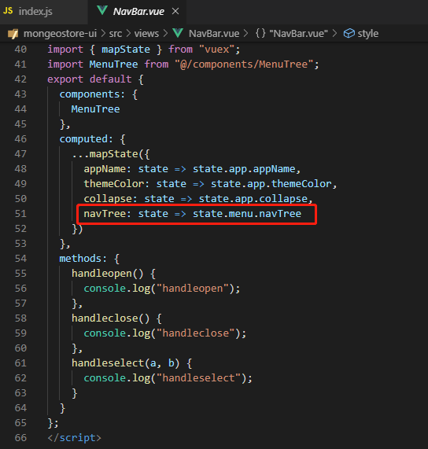
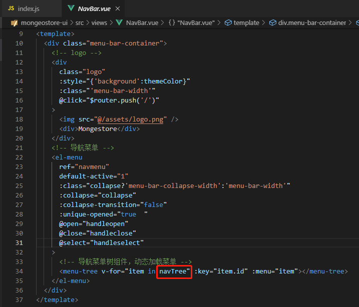
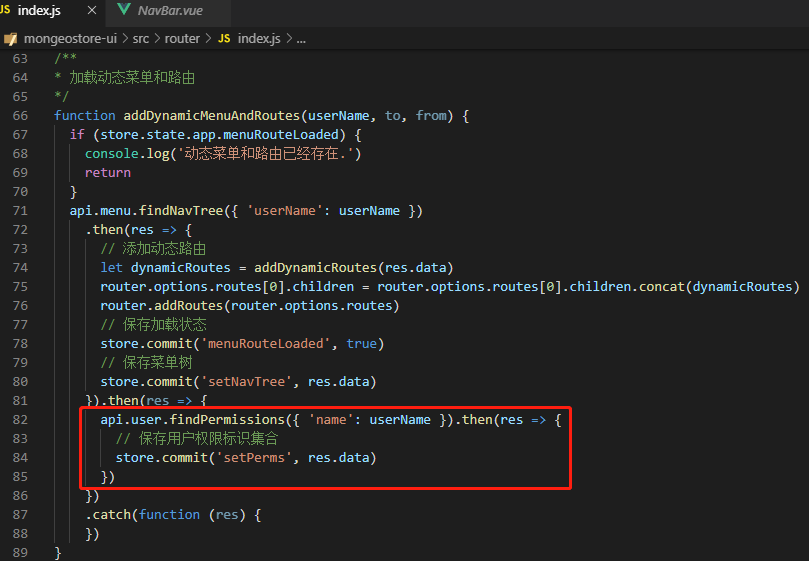
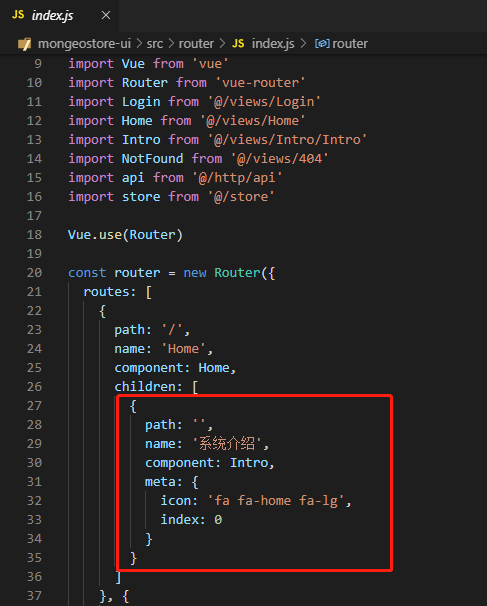

# 十、页面权限控制

[TOC]

## 1、权限控制方案

### 1.1、菜单类型

菜单类型代表页面资源类型。

### 1.2、权限标识

权限标识是对页面资源进行权限控制的唯一标识，主要是增、删、改、查的权限控制。

### 1.3、菜单表结构


## 2、导航菜单实现思路

### 2.1用户菜单实现思路

用户登录成功之后跳转到首页。

### 2.2、根据用户加载导航菜单

在路由导航守卫路由时加载用户导航菜单并存储到store。user-->user_role-->role_menu-->menu。

### 2.3导航栏读取菜单树

导航栏页面到store读取导航菜单树并进行展示。

## 3、页面按钮实现思路

### 3.1、用户登陆系统

用户登陆成功之后跳转到首页。

### 3.2、加载权限标识

在路由导航守卫路由时加载权限标识集合保存到store备用。加载过程如下：

user-->user_role-->role_menu-->menu

#### 3.3、页面按钮控制

页面操作俺就提供perms属性绑定权限标识，使用disable属性绑定权限判断方法的返回值，权限判断hasPerms(perms)通过查找上一步保存的用户权限标识集合是否包含perms来包含说明用户拥有此相关权限，否则设置当前操作按钮为不可用状态。

## 4、权限控制实现

### 4.1、导航菜单权限

#### 1、加载导航菜单

在导航守卫路由时加载导航菜单并保存状态。

- router/index.js

  

#### 2、页面组件引用

导航页面从共享状态中读取导航菜单树并展示

- views/NavBar/NavBar.vue



修改views/NavBar/NavBar.vue文件。



### 4.2、页面按钮权限

#### 1、加载权限标识

代开router/index.js，在导航守卫路由时加载权限标识并保存状态。



#### 2、权限按钮判断

封装了权限操作按钮组件，在组件根据外部传入的权限标识进行权限判断。

- views/core/KtButton.vue

```vue
<!--
 * @Description: 
 * @version: 
 * @Author: henggao
 * @Date: 2019-10-03 16:53:30
 * @LastEditors: henggao
 * @LastEditTime: 2019-10-03 16:53:30
 -->
<template>
  <el-button
    :size="size"
    :type="type"
    :icon="icon"
    :loading="loading"
    :disabled="!hasPerms(perms)"
    @click="handleClick"
  >{{label}}</el-button>
</template>

<script>
import { hasPermission } from "@/permission/index.js";
export default {
  name: "KtButton",
  props: {
    label: {
      // 按钮显示文本
      type: String,
      default: "Button"
    },
    icon: {
      // 按钮显示图标
      type: String,
      default: ""
    },
    size: {
      // 按钮尺寸
      type: String,
      default: "mini"
    },
    type: {
      // 按钮类型
      type: String,
      default: null
    },
    loading: {
      // 按钮加载标识
      type: Boolean,
      default: false
    },
    disabled: {
      // 按钮是否禁用
      type: Boolean,
      default: false
    },
    perms: {
      // 按钮权限标识，外部使用者传入
      type: String,
      default: null
    }
  },
  data() {
    return {};
  },
  methods: {
    handleClick: function() {
      // 按钮操作处理函数
      this.$emit("click", {});
    },
    hasPerms: function(perms) {
      // 根据权限标识和外部指示状态进行权限判断
      return hasPermission(perms) & !this.disabled;
    }
  },
  mounted() {}
};
</script>

<style scoped>
</style>
```

#### 3、权限判断逻辑

新建权限文件src/permission/index.js，提供权限判断方法hasPermission，传入当前组件绑定的权限perms，判断权限标识是否存在store中保存的用户权限标识集合中。

- src/permission/index.js

```js
/*
 * @Description: 
 * @version: 
 * @Author: henggao
 * @Date: 2019-10-03 16:58:19
 * @LastEditors: henggao
 * @LastEditTime: 2019-10-03 16:58:19
 */
import store from '@/store'
/**
 * 判断用户是否拥有操作权限
 * 根据传入的权限标识，查看是否存在用户权限标识集合
 * @param perms
 */
export function hasPermission(perms) {
    let hasPermission = false
    let permissions = store.state.user.perms
    for (let i = 0, len = permissions.length; i < len; i++) {
        if (permissions[i] === perms) {
            hasPermission = true;
            break
        }
    }
    return hasPermission
}
```

#### 4、权限按钮引用

在文件views/Sys/User.vue中配置相关内容。

- views/Sys/User.vue

```vue
<!--
 * @Description: 
 * @version: 
 * @Author: henggao
 * @Date: 2019-10-03 17:00:40
 * @LastEditors: henggao
 * @LastEditTime: 2019-10-03 17:00:40
 -->
<template>
  <div class="page-container">
    <!--工具栏-->
    <div class="toolbar" style="float:left;padding-top:10px;padding-left:15px;">
      <el-form :inline="true" :model="filters" :size="size">
        <el-form-item>
          <el-input v-model="filters.name" placeholder="用户名"></el-input>
        </el-form-item>
        <el-form-item>
          <kt-button
            icon="fa fa-search"
            :label="$t('action.search')"
            perms="sys:role:view"
            type="primary"
            @click="findPage(null)"
          />
        </el-form-item>
        <el-form-item>
          <kt-button
            icon="fa fa-plus"
            :label="$t('action.add')"
            perms="sys:user:add2"
            type="primary"
            @click="handleAdd"
          />
        </el-form-item>
      </el-form>
    </div>
    <div class="toolbar" style="float:right;padding-top:10px;padding-right:15px;">
      <el-form :inline="true" :size="size">
        <el-form-item>
          <el-button-group>
            <el-tooltip content="刷新" placement="top">
              <el-button icon="fa fa-refresh" @click="findPage(null)"></el-button>
            </el-tooltip>
            <el-tooltip content="列显示" placement="top">
              <el-button icon="fa fa-filter" @click="displayFilterColumnsDialog"></el-button>
            </el-tooltip>
            <el-tooltip content="导出" placement="top">
              <el-button icon="fa fa-file-excel-o"></el-button>
            </el-tooltip>
          </el-button-group>
        </el-form-item>
      </el-form>
      <!--表格显示列界面-->
      <table-column-filter-dialog
        ref="tableColumnFilterDialog"
        :columns="columns"
        @handleFilterColumns="handleFilterColumns"
      ></table-column-filter-dialog>
    </div>
    <!--表格内容栏-->
    <kt-table
      permsEdit="sys:user:edit"
      permsDelete="sys:user:delete"
      :data="pageResult"
      :columns="filterColumns"
      @findPage="findPage"
      @handleEdit="handleEdit"
      @handleDelete="handleDelete"
    ></kt-table>
    <!--新增编辑界面-->
    <el-dialog
      :title="operation?'新增':'编辑'"
      width="40%"
      :visible.sync="dialogVisible"
      :close-on-click-modal="false"
    >
      <el-form
        :model="dataForm"
        label-width="80px"
        :rules="dataFormRules"
        ref="dataForm"
        :size="size"
        label-position="right"
      >
        <el-form-item label="ID" prop="id" v-if="false">
          <el-input v-model="dataForm.id" :disabled="true" auto-complete="off"></el-input>
        </el-form-item>
        <el-form-item label="用户名" prop="name">
          <el-input v-model="dataForm.name" auto-complete="off"></el-input>
        </el-form-item>
        <el-form-item label="密码" prop="password">
          <el-input v-model="dataForm.password" type="password" auto-complete="off"></el-input>
        </el-form-item>
        <el-form-item label="机构" prop="deptName">
          <popup-tree-input
            :data="deptData"
            :props="deptTreeProps"
            :prop="dataForm.deptName"
            :nodeKey="''+dataForm.deptId"
            :currentChangeHandle="deptTreeCurrentChangeHandle"
          ></popup-tree-input>
        </el-form-item>
        <el-form-item label="邮箱" prop="email">
          <el-input v-model="dataForm.email" auto-complete="off"></el-input>
        </el-form-item>
        <el-form-item label="手机" prop="mobile">
          <el-input v-model="dataForm.mobile" auto-complete="off"></el-input>
        </el-form-item>
        <el-form-item label="角色" prop="userRoles" v-if="!operation">
          <el-select v-model="dataForm.userRoles" multiple placeholder="请选择" style="width: 100%;">
            <el-option v-for="item in roles" :key="item.id" :label="item.remark" :value="item.id"></el-option>
          </el-select>
        </el-form-item>
      </el-form>
      <div slot="footer" class="dialog-footer">
        <el-button :size="size" @click.native="dialogVisible = false">{{$t('action.cancel')}}</el-button>
        <el-button
          :size="size"
          type="primary"
          @click.native="submitForm"
          :loading="editLoading"
        >{{$t('action.submit')}}</el-button>
      </div>
    </el-dialog>
  </div>
</template>

<script>
import PopupTreeInput from "@/components/PopupTreeInput";
import KtTable from "@/views/Core/KtTable";
import KtButton from "@/views/Core/KtButton";
import TableColumnFilterDialog from "@/views/Core/TableColumnFilterDialog";
import { format } from "@/utils/datetime";
export default {
  components: {
    PopupTreeInput,
    KtTable,
    KtButton,
    TableColumnFilterDialog
  },
  data() {
    return {
      size: "small",
      filters: {
        name: ""
      },
      columns: [],
      filterColumns: [],
      pageRequest: { pageNum: 1, pageSize: 10 },
      pageResult: {},

      operation: false, // true:新增, false:编辑
      dialogVisible: false, // 新增编辑界面是否显示
      editLoading: false,
      dataFormRules: {
        name: [{ required: true, message: "请输入用户名", trigger: "blur" }]
      },
      // 新增编辑界面数据
      dataForm: {
        id: 0,
        name: "",
        password: "123456",
        deptId: 1,
        deptName: "",
        email: "test@qq.com",
        mobile: "13889700023",
        status: 1,
        userRoles: []
      },
      deptData: [],
      deptTreeProps: {
        label: "name",
        children: "children"
      },
      roles: []
    };
  },
  methods: {
    // 获取分页数据
    findPage: function(data) {
      if (data !== null) {
        this.pageRequest = data.pageRequest;
      }
      this.pageRequest.columnFilters = {
        name: { name: "name", value: this.filters.name }
      };
      this.$api.user
        .findPage(this.pageRequest)
        .then(res => {
          this.pageResult = res.data;
          this.findUserRoles();
        })
        .then(data != null ? data.callback : "");
    },
    // 加载用户角色信息
    findUserRoles: function() {
      this.$api.role.findAll().then(res => {
        // 加载角色集合
        this.roles = res.data;
      });
    },
    // 批量删除
    handleDelete: function(data) {
      this.$api.user
        .batchDelete(data.params)
        .then(data != null ? data.callback : "");
    },
    // 显示新增界面
    handleAdd: function() {
      this.dialogVisible = true;
      this.operation = true;
      this.dataForm = {
        id: 0,
        name: "",
        password: "",
        deptId: 1,
        deptName: "",
        email: "test@qq.com",
        mobile: "13889700023",
        status: 1,
        userRoles: []
      };
    },
    // 显示编辑界面
    handleEdit: function(params) {
      this.dialogVisible = true;
      this.operation = false;
      this.dataForm = Object.assign({}, params.row);
      let userRoles = [];
      for (let i = 0, len = params.row.userRoles.length; i < len; i++) {
        userRoles.push(params.row.userRoles[i].roleId);
      }
      this.dataForm.userRoles = userRoles;
    },
    // 编辑
    submitForm: function() {
      this.$refs.dataForm.validate(valid => {
        if (valid) {
          this.$confirm("确认提交吗？", "提示", {}).then(() => {
            this.editLoading = true;
            let params = Object.assign({}, this.dataForm);
            let userRoles = [];
            for (let i = 0, len = params.userRoles.length; i < len; i++) {
              let userRole = {
                userId: params.id,
                roleId: params.userRoles[i]
              };
              userRoles.push(userRole);
            }
            params.userRoles = userRoles;
            this.$api.user.save(params).then(res => {
              this.editLoading = false;
              if (res.code == 200) {
                this.$message({ message: "操作成功", type: "success" });
                this.dialogVisible = false;
                this.$refs["dataForm"].resetFields();
              } else {
                this.$message({
                  message: "操作失败, " + res.msg,
                  type: "error"
                });
              }
              this.findPage(null);
            });
          });
        }
      });
    },
    // 获取部门列表
    findDeptTree: function() {
      this.$api.dept.findDeptTree().then(res => {
        this.deptData = res.data;
      });
    },
    // 菜单树选中
    deptTreeCurrentChangeHandle(data, node) {
      this.dataForm.deptId = data.id;
      this.dataForm.deptName = data.name;
    },
    // 时间格式化
    dateFormat: function(row, column, cellValue, index) {
      return format(row[column.property]);
    },
    // 处理表格列过滤显示
    displayFilterColumnsDialog: function() {
      this.$refs.tableColumnFilterDialog.setDialogVisible(true);
    },
    // 处理表格列过滤显示
    handleFilterColumns: function(data) {
      this.filterColumns = data.filterColumns;
      this.$refs.tableColumnFilterDialog.setDialogVisible(false);
    },
    // 处理表格列过滤显示
    initColumns: function() {
      this.columns = [
        { prop: "id", label: "ID", minWidth: 50 },
        { prop: "name", label: "用户名", minWidth: 120 },
        { prop: "deptName", label: "机构", minWidth: 120 },
        { prop: "roleNames", label: "角色", minWidth: 100 },
        { prop: "email", label: "邮箱", minWidth: 120 },
        { prop: "mobile", label: "手机", minWidth: 100 },
        { prop: "status", label: "状态", minWidth: 70 }
        // {prop:"createBy", label:"创建人", minWidth:120},
        // {prop:"createTime", label:"创建时间", minWidth:120, formatter:this.dateFormat}
        // {prop:"lastUpdateBy", label:"更新人", minWidth:100},
        // {prop:"lastUpdateTime", label:"更新时间", minWidth:120, formatter:this.dateFormat}
      ];
      this.filterColumns = JSON.parse(JSON.stringify(this.columns));
    }
  },
  mounted() {
    this.findDeptTree();
    this.initColumns();
  }
};
</script>

<style scoped>
</style>
```

- 在components目录下新建PopupTreeInput目录，其下新建index.vue

- src/components/PopuTreeInput/index.vue

  ```vue
  <!--
   * @Description: 
   * @version: 
   * @Author: henggao
   * @Date: 2019-10-03 18:42:27
   * @LastEditors: henggao
   * @LastEditTime: 2019-10-03 18:42:27
   -->
  <template>
    <div>
      <el-popover ref="popover" :placement="placement" trigger="click">
        <el-tree
          :data="data"
          :props="props"
          node-key="nodeKey"
          ref="popupTree"
          @current-change="currentChangeHandle"
          :default-expand-all="defaultExpandAll"
          :highlight-current="true"
          :expand-on-click-node="true"
        ></el-tree>
      </el-popover>
      <el-input
        v-model="prop"
        v-popover:popover
        :readonly="true"
        :placeholder="placeholder"
        style="cursor:pointer;"
      ></el-input>
    </div>
  </template>
  
  <script>
  export default {
    name: "PopupTreeInput",
    props: {
      data: {
        type: Array,
        default: []
      },
      props: {
        type: Object,
        default: {}
      },
      prop: {
        type: String,
        default: ""
      },
      nodeKey: {
        type: String,
        default: ""
      },
      placeholder: {
        type: String,
        default: "点击选择内容"
      },
      placement: {
        type: String,
        default: "right-start"
      },
      defaultExpandAll: {
        type: Boolean,
        default: false
      },
      currentChangeHandle: {
        type: Function,
        default: null
      }
    }
  };
  </script>
  
  <style scoped>
  </style>
  ```

在文件views/core/KtTable.vue中配置相关内容，添加一个表格封装组件，在组件中引入权限按钮组件，并在表格中操作设计的编辑、删除、批量删除按钮绑定对应的权限标识。

- views/core/KtTable.vue

```vue
<!--
 * @Description: 
 * @version: 
 * @Author: henggao
 * @Date: 2019-10-03 17:08:52
 * @LastEditors: henggao
 * @LastEditTime: 2019-10-03 17:08:52
 -->
<template>
  <div>
    <!--表格栏-->
    <el-table
      :data="data.content"
      :highlight-current-row="highlightCurrentRow"
      @selection-change="selectionChange"
      @current-change="handleCurrentChange"
      v-loading="loading"
      :element-loading-text="$t('action.loading')"
      :border="border"
      :stripe="stripe"
      :show-overflow-tooltip="showOverflowTooltip"
      :max-height="maxHeight"
      :size="size"
      :align="align"
      style="width:100%;"
    >
      <el-table-column type="selection" width="40" v-if="showBatchDelete & showOperation"></el-table-column>
      <el-table-column
        v-for="column in columns"
        header-align="center"
        align="center"
        :prop="column.prop"
        :label="column.label"
        :width="column.width"
        :min-width="column.minWidth"
        :fixed="column.fixed"
        :key="column.prop"
        :type="column.type"
        :formatter="column.formatter"
        :sortable="column.sortable==null?true:column.sortable"
      ></el-table-column>
      <el-table-column
        :label="$t('action.operation')"
        width="185"
        fixed="right"
        v-if="showOperation"
        header-align="center"
        align="center"
      >
        <template slot-scope="scope">
          <kt-button
            icon="fa fa-edit"
            :label="$t('action.edit')"
            :perms="permsEdit"
            :size="size"
            @click="handleEdit(scope.$index, scope.row)"
          />
          <kt-button
            icon="fa fa-trash"
            :label="$t('action.delete')"
            :perms="permsDelete"
            :size="size"
            type="danger"
            @click="handleDelete(scope.$index, scope.row)"
          />
        </template>
      </el-table-column>
    </el-table>
    <!--分页栏-->
    <div class="toolbar" style="padding:10px;">
      <kt-button
        :label="$t('action.batchDelete')"
        :perms="permsDelete"
        :size="size"
        type="danger"
        @click="handleBatchDelete()"
        :disabled="this.selections.length===0"
        style="float:left;"
        v-if="showBatchDelete & showOperation"
      />
      <el-pagination
        layout="total, prev, pager, next, jumper"
        @current-change="refreshPageRequest"
        :current-page="pageRequest.pageNum"
        :page-size="pageRequest.pageSize"
        :total="data.totalSize"
        style="float:right;"
      ></el-pagination>
    </div>
  </div>
</template>

<script>
import KtButton from "@/views/Core/KtButton";
export default {
  name: "KtTable",
  components: {
    KtButton
  },
  props: {
    columns: Array, // 表格列配置
    data: Object, // 表格分页数据
    permsEdit: String, // 编辑权限标识
    permsDelete: String, // 删除权限标识
    size: {
      // 尺寸样式
      type: String,
      default: "mini"
    },
    align: {
      // 文本对齐方式
      type: String,
      default: "left"
    },
    maxHeight: {
      // 表格最大高度
      type: Number,
      default: 420
    },
    showOperation: {
      // 是否显示操作组件
      type: Boolean,
      default: true
    },
    border: {
      // 是否显示边框
      type: Boolean,
      default: false
    },
    stripe: {
      // 是否显示斑马线
      type: Boolean,
      default: true
    },
    highlightCurrentRow: {
      // // 是否高亮当前行
      type: Boolean,
      default: true
    },
    showOverflowTooltip: {
      // 是否单行显示
      type: Boolean,
      default: true
    },
    showBatchDelete: {
      // 是否显示操作组件
      type: Boolean,
      default: true
    }
  },
  data() {
    return {
      // 分页信息
      pageRequest: {
        pageNum: 1,
        pageSize: 10
      },
      loading: false, // 加载标识
      selections: [] // 列表选中列
    };
  },
  methods: {
    // 分页查询
    findPage: function() {
      this.loading = true;
      let callback = res => {
        this.loading = false;
      };
      this.$emit("findPage", {
        pageRequest: this.pageRequest,
        callback: callback
      });
    },
    // 选择切换
    selectionChange: function(selections) {
      this.selections = selections;
      this.$emit("selectionChange", { selections: selections });
    },
    // 选择切换
    handleCurrentChange: function(val) {
      this.$emit("handleCurrentChange", { val: val });
    },
    // 换页刷新
    refreshPageRequest: function(pageNum) {
      this.pageRequest.pageNum = pageNum;
      this.findPage();
    },
    // 编辑
    handleEdit: function(index, row) {
      this.$emit("handleEdit", { index: index, row: row });
    },
    // 删除
    handleDelete: function(index, row) {
      this.delete(row.id);
    },
    // 批量删除
    handleBatchDelete: function() {
      let ids = this.selections.map(item => item.id).toString();
      this.delete(ids);
    },
    // 删除操作
    delete: function(ids) {
      this.$confirm("确认删除选中记录吗？", "提示", {
        type: "warning"
      })
        .then(() => {
          let params = [];
          let idArray = (ids + "").split(",");
          for (var i = 0; i < idArray.length; i++) {
            params.push({ id: idArray[i] });
          }
          this.loading = true;
          let callback = res => {
            if (res.code == 200) {
              this.$message({ message: "删除成功", type: "success" });
              this.findPage();
            } else {
              this.$message({ message: "操作失败, " + res.msg, type: "error" });
            }
            this.loading = false;
          };
          this.$emit("handleDelete", { params: params, callback: callback });
        })
        .catch(() => {});
    }
  },
  mounted() {
    this.refreshPageRequest(1);
  }
};
</script>

<style scoped>
</style>
```

#### 5、标签页功能

新建store/modules/tab.js文件，用于存储标签页和当前选中标签选项。

- store/modules/tab.js

```js
/*
 * @Description: 
 * @version: 
 * @Author: henggao
 * @Date: 2019-10-03 17:11:47
 * @LastEditors: henggao
 * @LastEditTime: 2019-10-03 17:11:47
 */
export default {
    state: {
        // 主入口标签页
        mainTabs: [],
        // 当前标签页名
        mainTabsActiveName: ''
    },
    mutations: {
        updateMainTabs(state, tabs) {
            state.mainTabs = tabs
        },
        updateMainTabsActiveName(state, name) {
            state.mainTabsActiveName = name
        }
    }
}
```

修改views/MainContent.vue文件，在主内容区域添加标签页组件，通过Element的选项卡el-tables组件实现，能够通过切换标签页查看不同路由页面，并需要支持导航栏菜单和标签页同步。

```vue
<!--
 * @Description: 
 * @version: 
 * @Author: henggao
 * @Date: 2019-09-27 09:13:32
 * @LastEditors: henggao
 * @LastEditTime: 2019-10-03 17:17:36
 -->
<template>
  <div
    id="main-container"
    class="main-container"
    :class="$store.state.app.collapse?'position-collapse-left':'position-left'"
  >
    <!-- 标签页 -->
    <div class="tab-container">
      <el-tabs
        class="tabs"
        :class="$store.state.app.collapse?'position-collapse-left':'position-left'"
        v-model="mainTabsActiveName"
        :closable="true"
        type="card"
        @tab-click="selectedTabHandle"
        @tab-remove="removeTabHandle"
      >
        <el-dropdown class="tabs-tools" :show-timeout="0" trigger="hover">
          <div style="font-size:20px;width:50px;">
            <i class="el-icon-arrow-down"></i>
          </div>
          <el-dropdown-menu slot="dropdown">
            <el-dropdown-item @click.native="tabsCloseCurrentHandle">关闭当前标签</el-dropdown-item>
            <el-dropdown-item @click.native="tabsCloseOtherHandle">关闭其它标签</el-dropdown-item>
            <el-dropdown-item @click.native="tabsCloseAllHandle">关闭全部标签</el-dropdown-item>
            <el-dropdown-item @click.native="tabsRefreshCurrentHandle">刷新当前标签</el-dropdown-item>
          </el-dropdown-menu>
        </el-dropdown>
        <el-tab-pane
          v-for="item in mainTabs"
          :key="item.name"
          :label="item.title"
          :name="item.name"
        >
          <span slot="label">
            <i :class="item.icon"></i>
            {{item.title}}
          </span>
        </el-tab-pane>
      </el-tabs>
    </div>
    <!-- 主内容区域 -->
    <div class="main-content">
      <keep-alive>
        <transition name="fade" mode="out-in">
          <router-view></router-view>
        </transition>
      </keep-alive>
    </div>
  </div>
</template>

<script>
export default {
  data() {
    return {};
  },
  methods: {}
};
</script>

<style scoped lang="scss">
.main-container {
  padding: 0 5px 5px;
  position: absolute;
  top: 60px;
  left: 1px;
  right: 1px;
  bottom: 0px;
  background: rgba(67, 69, 70, 0.1);
  .main-content {
    position: absolute;
    top: 45px;
    left: 5px;
    right: 5px;
    bottom: 5px;
    padding: 5px;
  }
}
.position-left {
  left: 200px;
}
.position-collapse-left {
  left: 65px;
}
</style>
```


#### 6、系统介绍页

新建views/Intro/Intro.vue

- views/Intro/Intro.vue

```vue
<!--
 * @Description: 
 * @version: 
 * @Author: henggao
 * @Date: 2019-10-03 18:23:34
 * @LastEditors: henggao
 * @LastEditTime: 2019-10-03 18:23:34
 -->
<template>
  <div class="page-container" style="width:99%;margin-top:15px;">
    <el-carousel :interval="3000" type="card" height="450px" class="carousel">
      <el-carousel-item class="carousel-item-intro">
        <h2>项目介绍</h2>
        <ul>
          <li>基于 Spring Boot、Spring Cloud、Vue、Element 的 Java EE 快速开发平台</li>
          <li>旨在提供一套简洁易用的解决方案，帮助用户有效降低项目开发难度和成本</li>
          <li>博客提供项目开发过程同步系列教程文章，手把手的教你如何开发同类系统</li>
        </ul>
        <div>
          
        </div>
      </el-carousel-item>
      <el-carousel-item class="carousel-item-func">
        <h2>功能计划</h2>
        <ul>
          <li>✔ 系统登录：系统用户登录，系统登录认证（token方式）</li>
          <li>✔ 用户管理：新建用户，修改用户，删除用户，查询用户</li>
          <li>✔ 机构管理：新建机构，修改机构，删除机构，查询机构</li>
          <li>✔ 角色管理：新建角色，修改角色，删除角色，查询角色</li>
          <li>✔ 菜单管理：新建菜单，修改菜单，删除菜单，查询菜单</li>
          <li>✔ 系统日志：记录用户操作日志，查看系统执行日志记录</li>
          <li>✔ 数据监控：定制Druid信息，提供简洁有效的SQL监控</li>
          <li>✔ 聚合文档：定制在线文档，提供简洁美观的API文档</li>
          <li>✔ 备份还原：系统备份还原，一键恢复系统初始化数据</li>
          <li>✔ 主题切换：支持主题切换，自定主题颜色，一键换肤</li>
          <li>✔ 服务治理：集成Spring Cloud，实现全方位服务治理</li>
          <li>✔ 服务监控：集成Spring Boot Admin，实现微服务监控</li>
          <li>...</li>
        </ul>
      </el-carousel-item>
      <el-carousel-item class="carousel-item-env">
        <h2>开发环境</h2>
        <ul>
          <li>IDE : eclipse 4.6.x。 JDK : JDK 1.8.x。</li>
          <li>Maven : Maven 3.5.x。 MySQL: MySQL 5.7.x。</li>
          <li>IDE : VS Code 1.27。 Webpack：webpack 3.2.x。</li>
          <li>NODE: Node 8.9.x。 NPM : NPM 6.4.x。</li>
        </ul>
        <h2>技术选型</h2>
        <ul>
          <li>核心框架：Spring Boot 2.x。 服务治理：Spring Cloud。</li>
          <li>视图框架：Spring MVC 5.x。 持久层框架：MyBatis 3.x。</li>
          <li>数据库连接池：Druid 1.x。 安全框架：Shiro 1.4.x。</li>
          <li>前端框架：Vue.js 2.x。 页面组件：Element 2.x。</li>
          <li>状态管理：Vuex.js 2.x。 后台交互：axios 0.18.x。</li>
          <li>...</li>
        </ul>
      </el-carousel-item>
    </el-carousel>
  </div>
</template>

<script>
export default {
  components: {},
  methods: {}
};
</script>

<style>
.carousel {
  padding-left: 20px;
  padding-right: 20px;
  margin-right: 20px;
}
.carousel h2 {
  color: #475669;
  font-size: 22px;
  opacity: 1.75;
  line-height: 100px;
  margin: 0;
}
.carousel ul {
  color: #475669;
  font-size: 15px;
  opacity: 1.75;
  line-height: 40px;
  margin: 0;
}
.carousel-item-intro h2 {
  color: #ffffff;
  font-size: 22px;
  opacity: 1.75;
  line-height: 80px;
  margin: 0;
}
.carousel-item-intro ul {
  color: #ffffff;
  font-size: 15px;
  opacity: 1.75;
  line-height: 65px;
  padding: 5px;
  margin: 0;
}
.carousel-item-func h2 {
  color: #3f393b;
  font-size: 22px;
  opacity: 1.75;
  line-height: 50px;
  margin: 0;
}
.carousel-item-func ul {
  color: #3f393b;
  font-size: 15px;
  opacity: 1.75;
  line-height: 30px;
  text-align: left;
  padding-left: 90px;
  margin: 0;
}
.carousel-item-env h2 {
  color: #475669;
  font-size: 22px;
  opacity: 1.75;
  line-height: 50px;
  margin: 0;
}
.carousel-item-env ul {
  color: #475669;
  font-size: 15px;
  opacity: 1.75;
  line-height: 35px;
  text-align: left;
  padding-left: 110px;
  margin: 0;
}
.carousel-item-intro {
  background-color: #19aaaf73;
  -webkit-border-radius: 25px;
  border-radius: 25px;
  -moz-border-radius: 15px;
  background-clip: padding-box;
  box-shadow: 0 0 25px #a3b3b965;
}
.carousel-item-func {
  background-color: #19aaaf73;
  -webkit-border-radius: 25px;
  border-radius: 25px;
  -moz-border-radius: 15px;
  background-clip: padding-box;
  box-shadow: 0 0 25px #a3b3b965;
}
.carousel-item-env {
  background-color: #19aaaf73;
  -webkit-border-radius: 25px;
  border-radius: 25px;
  -moz-border-radius: 15px;
  background-clip: padding-box;
  box-shadow: 0 0 25px #a3b3b965;
}
.carousel-item-intro {
  background-color: #b95e5e;
}
.carousel-item-func {
  background-color: #52c578;
}
.carousel-item-env {
  background-color: #41a7b9;
}
</style>
```

在router/index.js中添加系统介绍页的路由。



- 完善部分代码

  - src/utils/datetime.js

    ```js
    /*
     * @Description: 
     * @version: 
     * @Author: henggao
     * @Date: 2019-10-03 19:10:48
     * @LastEditors: henggao
     * @LastEditTime: 2019-10-03 19:10:48
     */
    /**
     * 时间日期相关操作
     */
    
    
    /**
     * 时间格式化
     * 将 2018-09-23T11:54:16.000+0000 格式化成 2018/09/23 11:54:16
     * @param datetime 国际化日期格式
     */
    export function format(datetime) {
        return formatWithSeperator(datetime, "/", ":");
    }
    
    /**
     * 时间格式化
     * 将 2018-09-23T11:54:16.000+0000 格式化成类似 2018/09/23 11:54:16
     * 可以指定日期和时间分隔符
     * @param datetime 国际化日期格式
     */
    export function formatWithSeperator(datetime, dateSeprator, timeSeprator) {
        if (datetime != null) {
            const dateMat = new Date(datetime);
            const year = dateMat.getFullYear();
            const month = dateMat.getMonth() + 1;
            const day = dateMat.getDate();
            const hh = dateMat.getHours();
            const mm = dateMat.getMinutes();
            const ss = dateMat.getSeconds();
            const timeFormat = year + dateSeprator + month + dateSeprator + day + " " + hh + timeSeprator + mm + timeSeprator + ss;
            return timeFormat;
        }
    }
    ```

  - src/utils/validate.js

    ```js
    /*
     * @Description: 
     * @version: 
     * @Author: henggao
     * @Date: 2019-10-03 19:11:28
     * @LastEditors: henggao
     * @LastEditTime: 2019-10-03 19:11:28
     */
    /**
     * 邮箱
     * @param {*} s
     */
    export function isEmail(s) {
        return /^([a-zA-Z0-9_-])+@([a-zA-Z0-9_-])+((.[a-zA-Z0-9_-]{2,3}){1,2})$/.test(s)
    }
    
    /**
     * 手机号码
     * @param {*} s
     */
    export function isMobile(s) {
        return /^1[0-9]{10}$/.test(s)
    }
    
    /**
     * 电话号码
     * @param {*} s
     */
    export function isPhone(s) {
        return /^([0-9]{3,4}-)?[0-9]{7,8}$/.test(s)
    }
    
    /**
     * URL地址
     * @param {*} s
     */
    export function isURL(s) {
        return /^http[s]?:\/\/.*/.test(s)
    }
    ```

  - src/views/core/TableColumnFilterDialog.vue

    ```vue
    <!--
     * @Description: 
     * @version: 
     * @Author: henggao
     * @Date: 2019-10-03 19:14:26
     * @LastEditors: henggao
     * @LastEditTime: 2019-10-03 19:14:26
     -->
    <template>
      <!--表格显示列界面-->
      <el-dialog title="表格显示列" width="40%" :visible.sync="dialogVisible" :close-on-click-modal="false">
        <el-table
          ref="fitlerTable"
          :data="columns"
          height="330px"
          tooltip-effect="dark"
          header-align="left"
          align="left"
          :size="size"
          style="width: 100%"
          @selection-change="selectionChange"
        >
          <el-table-column type="selection" width="40"></el-table-column>
          <el-table-column label="属性">
            <template slot-scope="scope">{{ scope.row.prop }}</template>
          </el-table-column>
          <el-table-column label="列名">
            <template slot-scope="scope">
              <el-input :size="size" v-model="scope.row.label"></el-input>
            </template>
          </el-table-column>
          <el-table-column label="最小宽度">
            <template slot-scope="scope">
              <el-input :size="size" v-model="scope.row.minWidth"></el-input>
            </template>
          </el-table-column>
        </el-table>
        <div slot="footer" class="dialog-footer">
          <el-button :size="size" @click.native="dialogVisible = false">{{$t('action.cancel')}}</el-button>
          <el-button
            :size="size"
            type="primary"
            @click.native="handleFilterColumns"
          >{{$t('action.comfirm')}}</el-button>
        </div>
      </el-dialog>
    </template>
    
    <script>
    export default {
      name: "TableColumnFilterDialog",
      components: {},
      props: {
        columns: {
          type: Array,
          default: []
        },
        size: {
          type: String,
          default: "mini"
        }
      },
      data() {
        return {
          selections: [], // 列表选中列
          dialogVisible: false
        };
      },
      methods: {
        // 选择切换
        selectionChange: function(selections) {
          this.selections = selections;
        },
        // 设置可见性
        setDialogVisible: function(visible) {
          this.dialogVisible = visible;
        },
        // 处理表格列过滤显示
        handleFilterColumns: function() {
          let filterColumns = [];
          for (let i = 0; i < this.columns.length; i++) {
            let column = this.columns[i];
            if (this.hasColumn(column)) {
              filterColumns.push(column);
            }
          }
          this.$emit("handleFilterColumns", {
            filterColumns: JSON.parse(JSON.stringify(filterColumns))
          });
        },
        hasColumn: function(column) {
          for (let i = 0; i < this.selections.length; i++) {
            let col = this.selections[i];
            if (column.prop == col.prop) {
              return true;
            }
          }
          return false;
        }
      },
      mounted() {}
    };
    </script>
    
    <style scoped>
    </style>
    ```

    

#### 7、页面测试

启动应用，访问http://localhost:8080/#/login ， 登录后进入主页，默认显示系统介绍页

