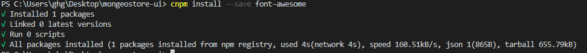
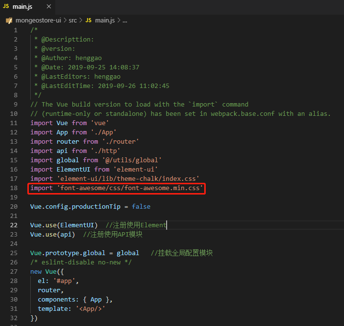
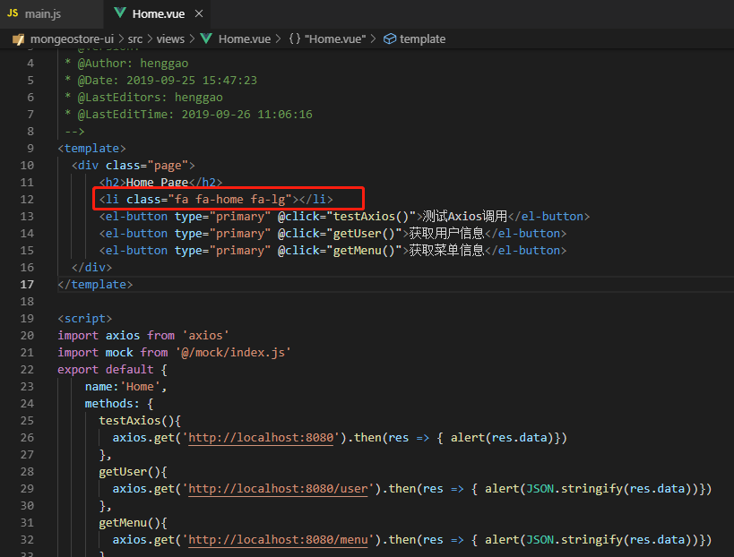

# 四、第三方图库

[TOC]

## 1、使用第三方图库

Element UI提供的字图符比较少，可以使用其他第三方图库。

## 2、Font Awesome

Font Awesome提供了可缩放的矢量图标，可以使用CSS所提供的所有特性对其进行修改，包括大小、颜色、阴影等。

### 2.1、安装依赖

执行命令，安装Font Awesome依赖。

```shell
cnpm install --save font-awesome
```



### 2.2、项目引入

在main.js引入css依赖，执行`import 'font-awesome/css/font-awesome.min.css`



### 2.3、页面使用

项目引入后，修改Home.vue，加入一个图标

```vue
<li class="fa fa-home fa-lg"></li>
```



#### 2.4、页面测试

启动应用，访问http://localhost:8080/#/


