# 六、业务功能的实现

[TOC]

## 1、工程结构规划

采用微服务架构，随着项目越来越大，代码的可重用性和可维护性会变得越来越困难，尽早对工程结构进行合理的规划，对项目前期的开发，后期的扩展和维护都非常重要。

- mongeostore-common：公共代码块，主要放置一些工具类。
- mongeostore-core：核心业务代码模板，主要封装公共业务模块。
- mongeostore-admin：后台管理模块，包括用户、角色、菜单管理等。
- mongeostore-pom：聚合模块，仅为简化打包，一键执行打包所有模块。

### 1.1、mongeostore-admin

#### 1）、将原先的mongeostore工程更名为mongeostore-admin

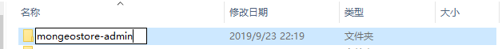

#### 2）、编辑pom.xml，将需要替换的mongeostore字符替换为mongeostore-admin

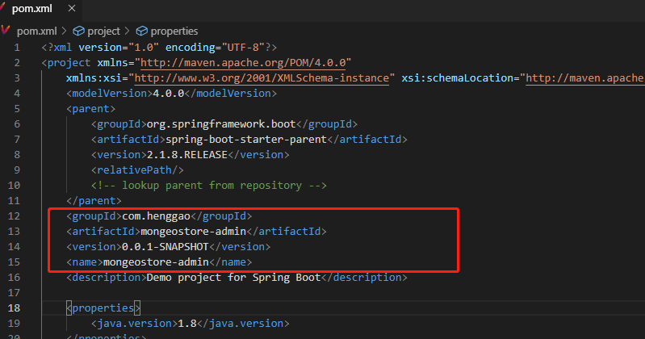

#### 3）、重构包结构，将基础包重构为con.henggao.mongeostore.admin,区分不同工程的包

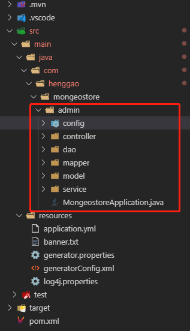


#### 4）、由于重构了包路径，但XML映射文件内容无法同步，需要将所有的MyBatis的XML映射出现的Mapper和Model的包路径修改为正确的路径，可以通过将“com.henggao.mongeostore”全部替换为"com.henggao.mongeostore.admin"

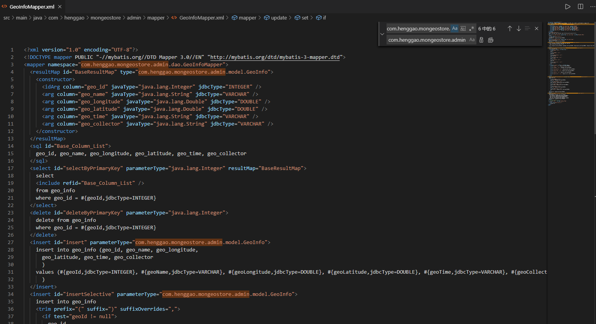

5）、将MongeostoreApplication改名为MongeostoreAdminApplication，编译启动应用，服务访问正常就成功了。

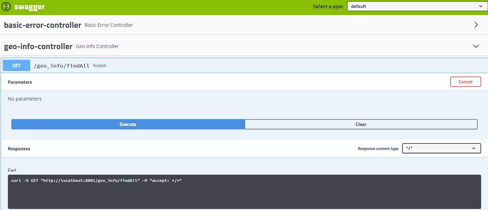


### 1.2、mongeostore-common

新建一个空的Maven工程，除了一个pom.xml，没有其他内容，后续放置一些工具方法和常量。

### 1.3、mongeostore-core

新建一个空的Maven工程，除了一个pom.xml，没有其他内容，后续放置一些公共的核心业务代码封装。

### 1.4、mongeostore-pom

为了方便打包，这个工程依赖所有模板，负责统一进行打包

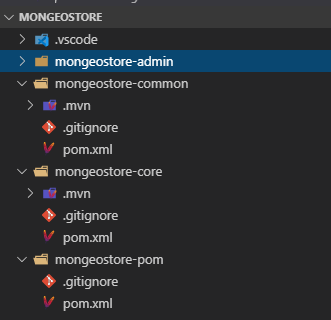

### 1.5、打包测试

由于现在各个模块还没有依赖，模块间的依赖还没有添加，所以第一次还需要遵循以下步骤：

1）、mongeostore-common下的pom.xml配置如下信息

```xml
<?xml version="1.0" encoding="UTF-8"?>
<project xmlns="http://maven.apache.org/POM/4.0.0" 
	xmlns:xsi="http://www.w3.org/2001/XMLSchema-instance" xsi:schemaLocation="http://maven.apache.org/POM/4.0.0 https://maven.apache.org/xsd/maven-4.0.0.xsd">
	<modelVersion>4.0.0</modelVersion>
	<parent>
		<groupId>org.springframework.boot</groupId>
		<artifactId>spring-boot-starter-parent</artifactId>
		<version>2.1.8.RELEASE</version>
		<relativePath/>
		<!-- lookup parent from repository -->
	</parent>
	<groupId>com.henggao.mongeostore</groupId>
	<artifactId>mongeostore-common</artifactId>
	<packaging>jar</packaging>
	<version>1.0.0</version>
	<name>mongeostore-common</name>
	<description>mongeostore-common</description>

	<properties>
		<project.build.sourceEncoding>UTF-8</project.build.sourceEncoding>
		<project.reporting.outputEncoding>UTF-8</project.reporting.outputEncoding>
		<java.version>1.8</java.version>
	</properties>

	<dependencies>
		<dependency>
			<groupId>org.springframework.boot</groupId>
			<artifactId>spring-boot-starter-web</artifactId>
		</dependency>
		<!-- commons-beanutils -->
		<dependency>
			<groupId>commons-beanutils</groupId>
			<artifactId>commons-beanutils</artifactId>
			<version>1.9.4</version>
		</dependency>
		<!-- poi-ooxml -->
		<dependency>
			<groupId>org.apache.poi</groupId>
			<artifactId>poi-ooxml</artifactId>
			<version>4.1.0</version>
		</dependency>

	</dependencies>

</project>

```

由于没有安装打包工具，这里使用maven命令进行打包。在Vscode中终端输入

```shell
PS C:\Users\ghg\Desktop\Mongeostore> cd .\mongeostore-common\
PS C:\Users\ghg\Desktop\Mongeostore\mongeostore-common> mvn clean
```

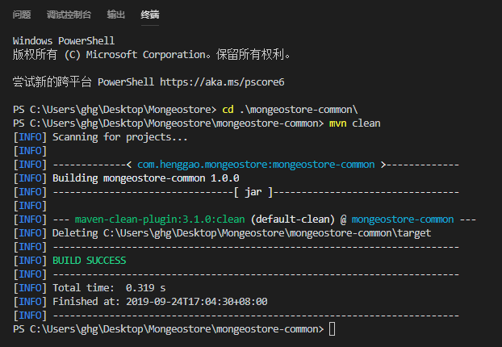

输入命令

```shell
PS C:\Users\ghg\Desktop\Mongeostore\mongeostore-common> mvn install
```

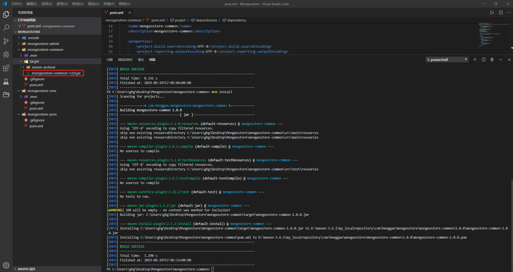

可以看到打包了`mongeostore-common\target\mongeostore-common-1.0.0.jar`。

2）、在`mongeostore-core`下的`pom.xml`,添加`mongeostore-common`为dependency依赖，然后执行打包命令。

```xml
<dependency>
    <groupId>com.henggao.mongeostore</groupId>
    <artifactId>mongeostore-common</artifactId>
    <version>1.0.0</version>
</dependency>
```

在终端执行打包命令

```shell
PS C:\Users\ghg\Desktop\Mongeostore\mongeostore-common> cd ..\mongeostore-core
PS C:\Users\ghg\Desktop\Mongeostore\mongeostore-core> mvn clean
```

```shell
PS C:\Users\ghg\Desktop\Mongeostore\mongeostore-core> mvn install
```

3）、在`mongeostore-admin`下的`pom.xml`添加`mongeostore-core`为dependency依赖，执行打包命令。

```xml
<dependency>
    <groupId>com.henggao.mongeostore</groupId>
    <artifactId>mongeostore-core</artifactId>
    <version>1.0.0</version>
</dependency>
```

4）、在`mongeostore-pom`下的`pom.xml`添加以上所有模块的modules依赖，执行编译打包命令。

```xml
<modules>
    <module>../mongeostore-admin</module>
    <module>../mongeostore-common</module>
    <module>../mongeostore-core</module>
</modules>
```

执行统一打包命令

```shell
PS C:\Users\ghg\Desktop\Mongeostore\mongeostore-admin> cd ..\mongeostore-pom\
PS C:\Users\ghg\Desktop\Mongeostore\mongeostore-pom> mvn clean
PS C:\Users\ghg\Desktop\Mongeostore\mongeostore-pom> mvn install
```

出现如下信息表示打包成功

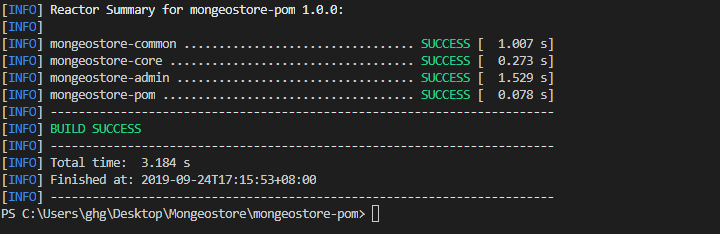

以后只要对`mongeostore-pom`下的`pom.xml`执行命令，就可以统一打包所有模块了。

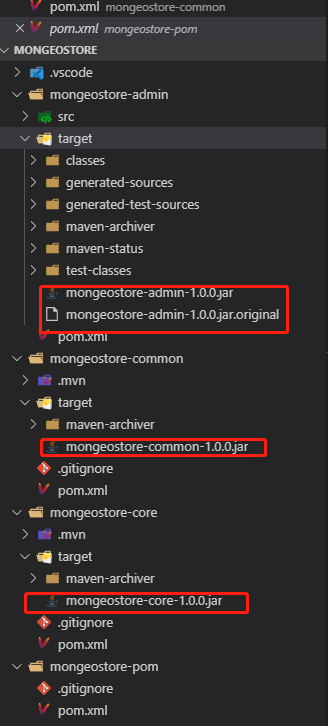

- 报错
  - 检查`java`与`javac`的版本是否一致，如果不一致，将path下的Java配置移动到最前面即可。


## 2、业务代码封装

### 2.1、通用CRUD接口

在`mongeostore-core`模块下，新建Service包。

`CurdService`是通用增删改查接口封装`CurdService.java`

```java
package com.henggao.mongoestore.core.service;

import java.util.List;

import com.henggao.mongoestore.core.page.PageRequest;
import com.henggao.mongoestore.core.page.PageResult;


/*
 * @Descripttion: 
 * @version: 
 * @Author: henggao
 * @Date: 2019-09-24 18:37:03
 * @LastEditors: henggao
 * @LastEditTime: 2019-09-24 20:44:03
 */
/**
 * 通用CURD接口
 * @param <T>
 */
public interface CurdService<T> {

    /**
     * 保存操作
     * 
     * @param record
     * @return
     */
    int save(T record);

    /**
     * 删除操作
     * 
     * @param record
     * @return
     */
    int delete(T record);

    /**
     * 批量删除操作
     * 
     * @param records
     * @return
     */
    int delete(List<T> records);

    /**
     * 根据id查询
     * 
     * @param id
     * @return
     */
    T findByID(Long id);

    PageResult findpage(PageRequest pageRequest);
}
```

### 2.2、分页请求

在page包下，新建`PageRequest.java`

```java
/*
 * @Descripttion: 
 * @version: 
 * @Author: henggao
 * @Date: 2019-09-24 18:45:07
 * @LastEditors: henggao
 * @LastEditTime: 2019-09-24 18:55:48
 */
package com.henggao.mongoestore.core.page;

import java.util.HashMap;
import java.util.Map;

/**
 * PageRequest
 */
public class PageRequest {

    /**
     * 当前页码
     */
    private int pageNum = 1 ;

    /**
     * 每页数量
     */
    private int pageSize = 10;

    /**
     * 查询参数
     */
    private Map<String, Object> params = new HashMap<>();

    public int getPageNum() {
        return pageNum;
    }

    public void setPageNum(int pageNum) {
        this.pageNum = pageNum;
    }

    public int getPageSize() {
        return pageSize;
    }

    public void setPageSize(int pageSize) {
        this.pageSize = pageSize;
    }

    public Map<String, Object> getParams() {
        return params;
    }

    public void setParams(Map<String, Object> params) {
        this.params = params;
    }

    
}
```

### 2.3、分页结果封装

在page包下新建`PageResult.java`

```java
/*
 * @Descripttion: 
 * @version: 
 * @Author: henggao
 * @Date: 2019-09-24 19:00:11
 * @LastEditors: henggao
 * @LastEditTime: 2019-09-24 19:40:21
 */
package com.henggao.mongoestore.core.page;

import java.util.List;

/**
 * PageResult
 */
public class PageResult {

    /**
     * 当前页码
     */
    private int pageNum;

    /**
     *每页数量
     */
    private int pageSize;

    /**
     * 记录总数
     */
    private long totalSize;

    /**
     * 页码总数
     */
    private int totalPages;

    /**
     * 分页数据
     */
    private List<?> content;

    public int getPageNum() {
        return pageNum;
    }

    public void setPageNum(int pageNum) {
        this.pageNum = pageNum;
    }

    public int getPageSize() {
        return pageSize;
    }

    public void setPageSize(int pageSize) {
        this.pageSize = pageSize;
    }

    public long getTotalSize() {
        return totalSize;
    }

    public void setTotalSize(long totalSize) {
        this.totalSize = totalSize;
    }

    public int getTotalPages() {
        return totalPages;
    }

    public void setTotalPages(int totalPages) {
        this.totalPages = totalPages;
    }

    public List<?> getContent() {
        return content;
    }

    public void setContent(List<?> content) {
        this.content = content;
    }


}
```

### 2.4、分页助手封装

在page包下，新建`MybatisPageHelper.java`

```java
/*
 * @Descripttion: 
 * @version: 
 * @Author: henggao
 * @Date: 2019-09-24 19:13:54
 * @LastEditors: henggao
 * @LastEditTime: 2019-09-24 19:49:03
 */
package com.henggao.mongoestore.core.page;

import java.util.List;

import com.github.pagehelper.PageHelper;
import com.github.pagehelper.PageInfo;
import com.henggao.mongeostore.common.utils.ReflectionUtils;


/**
 * MybatisPageHelper
 */
public class MybatisPageHelper {

    public static final String findPage = "findPage";

    /**
     * 分页查询，查询方法名为“findPage”
     * @param pageRequest
     * @param mapper
     * @return
     */
    public static PageResult findPage(PageRequest pageRequest,Object mapper) {
        
        return findPage(pageRequest, mapper, findPage);
    }

    /**
     * 调用分页插件进行分页查询
     * @param pageRequest
     * @param mapper
     * @param queryMethodName
     * @param args
     * @return
     */
    @SuppressWarnings({"unchecked" , "rawtypes"})
    private static PageResult findPage(PageRequest pageRequest, Object mapper, String queryMethodName, Object...args) {

        //设置分页参数
        int pageNum = pageRequest.getPageNum();
        int pageSize =  pageRequest.getPageSize();
        PageHelper.startPage(pageNum, pageSize);

        //利用反射调用查询方法
        Object result = ReflectionUtils.invoke(mapper, queryMethodName, args);
        return getPageResult(pageRequest, new PageInfo((List) result));
    }

    private static PageResult getPageResult(PageRequest pageRequest, PageInfo<?> pageInfo) {
        PageResult pageResult = new PageResult();
        pageResult.setPageNum(pageInfo.getPageNum());
        pageResult.setPageSize(pageInfo.getPageSize());
        pageResult.setTotalSize(pageInfo.getTotal());
        pageResult.setTotalPages(pageInfo.getPages());
        pageResult.setContent(pageInfo.getList());
		return pageResult;
    }
}
```

- 这里调用了`mongeostore-common`模块下的`ReflectionUtils.java`
- 在`mongeostore-common`模块下，新建`utils`包，封装`ReflectionUtils.java`

```java
/*
 * @Descripttion: 
 * @version: 
 * @Author: henggao
 * @Date: 2019-09-24 19:44:25
 * @LastEditors: henggao
 * @LastEditTime: 2019-09-24 19:44:25
 */
package com.henggao.mongeostore.common.utils;

import java.lang.reflect.InvocationTargetException;
import java.lang.reflect.Method;

/**
 * ReflectionUtils
 */
public class ReflectionUtils {

    /**
     * 根据方法名调用指定对象的方法
     * 
     * @param object 要调用方法的对象
     * @param method 要调用的方法名
     * @param args   参数对象数组
     * @return
     */
    public static Object invoke(Object object, String method, Object... args) {
        Object result = null;
        Class<? extends Object> clazz = object.getClass();
        Method queryMethod = getMethod(clazz, method, args);
        if (queryMethod != null) {
            try {
                result = queryMethod.invoke(object, args);
            } catch (IllegalAccessException e) {
                e.printStackTrace();
            } catch (IllegalArgumentException e) {
                e.printStackTrace();
            } catch (InvocationTargetException e) {
                e.printStackTrace();
            }
        } else {
            try {
                throw new NoSuchMethodException(clazz.getName() + " 类中没有找到 " + method + " 方法。");
            } catch (NoSuchMethodException e) {
                e.printStackTrace();
            }
        }
        return result;
    }

    /**
     * 根据方法名和参数对象查找方法
     * 
     * @param clazz
     * @param name
     * @param args  参数实例数据
     * @return
     */
    public static Method getMethod(Class<? extends Object> clazz, String name, Object[] args) {
        Method queryMethod = null;
        Method[] methods = clazz.getMethods();
        for (Method method : methods) {
            if (method.getName().equals(name)) {
                Class<?>[] parameterTypes = method.getParameterTypes();
                if (parameterTypes.length == args.length) {
                    boolean isSameMethod = true;
                    for (int i = 0; i < parameterTypes.length; i++) {
                        Object arg = args[i];
                        if (arg == null) {
                            arg = "";
                        }
                        if (!parameterTypes[i].equals(args[i].getClass())) {
                            isSameMethod = false;
                        }
                    }
                    if (isSameMethod) {
                        queryMethod = method;
                        break;
                    }
                }
            }
        }
        return queryMethod;
    }
}
```

### 2.5、HTTP结果封装

对接口的返回结果进行统一封装，方便前端或移动端对返回结果惊醒统一处理。

在`mongeostore-core`模块下，新建`http`包，其下创建`HttpResult.java`

```java
/*
 * @Descripttion: 
 * @version: 
 * @Author: henggao
 * @Date: 2019-09-24 19:52:43
 * @LastEditors: henggao
 * @LastEditTime: 2019-09-24 20:16:40
 */
package com.henggao.mongoestore.core.http;


/**
 * HTTP结果封装
 * HttpResult
 */
public class HttpResult {

    private int code = 200;
    private String msg;
    private Object data;

	public static HttpResult error() {
		return error(HttpStatus.SC_INTERNAL_SERVER_ERROR, "未知异常，请联系管理员");
	}
	
	public static HttpResult error(String msg) {
		return error(HttpStatus.SC_INTERNAL_SERVER_ERROR, msg);
	}
	
	public static HttpResult error(int code, String msg) {
		HttpResult r = new HttpResult();
		r.setCode(code);
		r.setMsg(msg);
		return r;
	}

	public static HttpResult ok(String msg) {
		HttpResult r = new HttpResult();
		r.setMsg(msg);
		return r;
	}
	
	public static HttpResult ok(Object data) {
		HttpResult r = new HttpResult();
		r.setData(data);
		return r;
	}
	
	public static HttpResult ok() {
		return new HttpResult();
	}

    public int getCode() {
        return code;
    }

    public void setCode(int code) {
        this.code = code;
    }

    public String getMsg() {
        return msg;
    }

    public void setMsg(String msg) {
        this.msg = msg;
    }

    public Object getData() {
        return data;
    }

    public void setData(Object data) {
        this.data = data;
    }
}
```

- 在`http`包下新建`HttpStatus.java`

```java
/*
 * @Descripttion: 
 * @version: 
 * @Author: henggao
 * @Date: 2019-09-24 20:12:31
 * @LastEditors: henggao
 * @LastEditTime: 2019-09-24 20:12:31
 */
package com.henggao.mongoestore.core.http;

/**
 * Constants enumerating the HTTP status codes.
 * All status codes defined in RFC1945 (HTTP/1.0), RFC2616 (HTTP/1.1), and
 * RFC2518 (WebDAV) are listed.
 *
 * @see StatusLine
 *
 * @since 4.0
 */
public interface HttpStatus {

    // --- 1xx Informational ---

    /** {@code 100 Continue} (HTTP/1.1 - RFC 2616) */
    public static final int SC_CONTINUE = 100;
    /** {@code 101 Switching Protocols} (HTTP/1.1 - RFC 2616)*/
    public static final int SC_SWITCHING_PROTOCOLS = 101;
    /** {@code 102 Processing} (WebDAV - RFC 2518) */
    public static final int SC_PROCESSING = 102;

    // --- 2xx Success ---

    /** {@code 200 OK} (HTTP/1.0 - RFC 1945) */
    public static final int SC_OK = 200;
    /** {@code 201 Created} (HTTP/1.0 - RFC 1945) */
    public static final int SC_CREATED = 201;
    /** {@code 202 Accepted} (HTTP/1.0 - RFC 1945) */
    public static final int SC_ACCEPTED = 202;
    /** {@code 203 Non Authoritative Information} (HTTP/1.1 - RFC 2616) */
    public static final int SC_NON_AUTHORITATIVE_INFORMATION = 203;
    /** {@code 204 No Content} (HTTP/1.0 - RFC 1945) */
    public static final int SC_NO_CONTENT = 204;
    /** {@code 205 Reset Content} (HTTP/1.1 - RFC 2616) */
    public static final int SC_RESET_CONTENT = 205;
    /** {@code 206 Partial Content} (HTTP/1.1 - RFC 2616) */
    public static final int SC_PARTIAL_CONTENT = 206;
    /**
     * {@code 207 Multi-Status} (WebDAV - RFC 2518)
     * or
     * {@code 207 Partial Update OK} (HTTP/1.1 - draft-ietf-http-v11-spec-rev-01?)
     */
    public static final int SC_MULTI_STATUS = 207;

    // --- 3xx Redirection ---

    /** {@code 300 Mutliple Choices} (HTTP/1.1 - RFC 2616) */
    public static final int SC_MULTIPLE_CHOICES = 300;
    /** {@code 301 Moved Permanently} (HTTP/1.0 - RFC 1945) */
    public static final int SC_MOVED_PERMANENTLY = 301;
    /** {@code 302 Moved Temporarily} (Sometimes {@code Found}) (HTTP/1.0 - RFC 1945) */
    public static final int SC_MOVED_TEMPORARILY = 302;
    /** {@code 303 See Other} (HTTP/1.1 - RFC 2616) */
    public static final int SC_SEE_OTHER = 303;
    /** {@code 304 Not Modified} (HTTP/1.0 - RFC 1945) */
    public static final int SC_NOT_MODIFIED = 304;
    /** {@code 305 Use Proxy} (HTTP/1.1 - RFC 2616) */
    public static final int SC_USE_PROXY = 305;
    /** {@code 307 Temporary Redirect} (HTTP/1.1 - RFC 2616) */
    public static final int SC_TEMPORARY_REDIRECT = 307;

    // --- 4xx Client Error ---

    /** {@code 400 Bad Request} (HTTP/1.1 - RFC 2616) */
    public static final int SC_BAD_REQUEST = 400;
    /** {@code 401 Unauthorized} (HTTP/1.0 - RFC 1945) */
    public static final int SC_UNAUTHORIZED = 401;
    /** {@code 402 Payment Required} (HTTP/1.1 - RFC 2616) */
    public static final int SC_PAYMENT_REQUIRED = 402;
    /** {@code 403 Forbidden} (HTTP/1.0 - RFC 1945) */
    public static final int SC_FORBIDDEN = 403;
    /** {@code 404 Not Found} (HTTP/1.0 - RFC 1945) */
    public static final int SC_NOT_FOUND = 404;
    /** {@code 405 Method Not Allowed} (HTTP/1.1 - RFC 2616) */
    public static final int SC_METHOD_NOT_ALLOWED = 405;
    /** {@code 406 Not Acceptable} (HTTP/1.1 - RFC 2616) */
    public static final int SC_NOT_ACCEPTABLE = 406;
    /** {@code 407 Proxy Authentication Required} (HTTP/1.1 - RFC 2616)*/
    public static final int SC_PROXY_AUTHENTICATION_REQUIRED = 407;
    /** {@code 408 Request Timeout} (HTTP/1.1 - RFC 2616) */
    public static final int SC_REQUEST_TIMEOUT = 408;
    /** {@code 409 Conflict} (HTTP/1.1 - RFC 2616) */
    public static final int SC_CONFLICT = 409;
    /** {@code 410 Gone} (HTTP/1.1 - RFC 2616) */
    public static final int SC_GONE = 410;
    /** {@code 411 Length Required} (HTTP/1.1 - RFC 2616) */
    public static final int SC_LENGTH_REQUIRED = 411;
    /** {@code 412 Precondition Failed} (HTTP/1.1 - RFC 2616) */
    public static final int SC_PRECONDITION_FAILED = 412;
    /** {@code 413 Request Entity Too Large} (HTTP/1.1 - RFC 2616) */
    public static final int SC_REQUEST_TOO_LONG = 413;
    /** {@code 414 Request-URI Too Long} (HTTP/1.1 - RFC 2616) */
    public static final int SC_REQUEST_URI_TOO_LONG = 414;
    /** {@code 415 Unsupported Media Type} (HTTP/1.1 - RFC 2616) */
    public static final int SC_UNSUPPORTED_MEDIA_TYPE = 415;
    /** {@code 416 Requested Range Not Satisfiable} (HTTP/1.1 - RFC 2616) */
    public static final int SC_REQUESTED_RANGE_NOT_SATISFIABLE = 416;
    /** {@code 417 Expectation Failed} (HTTP/1.1 - RFC 2616) */
    public static final int SC_EXPECTATION_FAILED = 417;

    /**
     * Static constant for a 418 error.
     * {@code 418 Unprocessable Entity} (WebDAV drafts?)
     * or {@code 418 Reauthentication Required} (HTTP/1.1 drafts?)
     */
    // not used
    // public static final int SC_UNPROCESSABLE_ENTITY = 418;

    /**
     * Static constant for a 419 error.
     * {@code 419 Insufficient Space on Resource}
     * (WebDAV - draft-ietf-webdav-protocol-05?)
     * or {@code 419 Proxy Reauthentication Required}
     * (HTTP/1.1 drafts?)
     */
    public static final int SC_INSUFFICIENT_SPACE_ON_RESOURCE = 419;
    /**
     * Static constant for a 420 error.
     * {@code 420 Method Failure}
     * (WebDAV - draft-ietf-webdav-protocol-05?)
     */
    public static final int SC_METHOD_FAILURE = 420;
    /** {@code 422 Unprocessable Entity} (WebDAV - RFC 2518) */
    public static final int SC_UNPROCESSABLE_ENTITY = 422;
    /** {@code 423 Locked} (WebDAV - RFC 2518) */
    public static final int SC_LOCKED = 423;
    /** {@code 424 Failed Dependency} (WebDAV - RFC 2518) */
    public static final int SC_FAILED_DEPENDENCY = 424;

    // --- 5xx Server Error ---

    /** {@code 500 Server Error} (HTTP/1.0 - RFC 1945) */
    public static final int SC_INTERNAL_SERVER_ERROR = 500;
    /** {@code 501 Not Implemented} (HTTP/1.0 - RFC 1945) */
    public static final int SC_NOT_IMPLEMENTED = 501;
    /** {@code 502 Bad Gateway} (HTTP/1.0 - RFC 1945) */
    public static final int SC_BAD_GATEWAY = 502;
    /** {@code 503 Service Unavailable} (HTTP/1.0 - RFC 1945) */
    public static final int SC_SERVICE_UNAVAILABLE = 503;
    /** {@code 504 Gateway Timeout} (HTTP/1.1 - RFC 2616) */
    public static final int SC_GATEWAY_TIMEOUT = 504;
    /** {@code 505 HTTP Version Not Supported} (HTTP/1.1 - RFC 2616) */
    public static final int SC_HTTP_VERSION_NOT_SUPPORTED = 505;

    /** {@code 507 Insufficient Storage} (WebDAV - RFC 2518) */
    public static final int SC_INSUFFICIENT_STORAGE = 507;

}

```


## 3、MyBatis分页查询

### 3.1、添加依赖

在`mongoestore-core`下的`pom.xml`文件内添加分页插件依赖，因为`mongoestore-admin`模块依赖`mongoestore-core`模块，所以`mongoestore-admin`模块也能获取分页插件依赖。

```xml
<!-- pagehelper -->
<dependency>
    <groupId>com.github.pagehelper</groupId>
    <artifactId>pagehelper-spring-boot-starter</artifactId>
    <version>1.2.12</version>
</dependency>
```

### 3.2、添加配置

在`mongoestore-admin`配置文件内添加分页插件配置。

`application.yml`

```yaml
#pagehelper
pagehelper:
  helper-dialect: mysql
  reasonable: true
  support-methods-arguments: true
  params: count=countSql
```

### 3.3、分页代码

在`DAO`层添加一个分页查询方法，

`mongeostore-admin\src\main\java\com\henggao\mongeostore\admin\dao\GeoInfoMapper.java`

```java
    /**
     * 分页查询
     * @return
     */
    List<GeoInfo> findPage();
```

`mongeostore-admin\src\main\java\com\henggao\mongeostore\admin\mapper\GeoInfoMapper.xml`

```xml
<!-- 添加一个findPage查询 -->
<select id="findPage" resultMap="BaseResultMap">
    select
    <include refid="Base_Column_List" />
    from geo_info
</select>
```

服务层调用`DAO`层完成分页查询，让`GeoInfoService.java`继承`CurdService.java`接口

`GeoInfoService.java`

```java
/*
 * @Descripttion: 
 * @version: 
 * @Author: henggao
 * @Date: 2019-09-23 22:26:19
 * @LastEditors: henggao
 * @LastEditTime: 2019-09-24 20:46:51
 */
package com.henggao.mongeostore.admin.service;

import java.util.List;

import com.henggao.mongeostore.admin.model.GeoInfo;
import com.henggao.mongoestore.core.service.CurdService;

/**
 * GeoInfoService
 */
public interface GeoInfoService extends CurdService<GeoInfo>{

    /**
     * 查询所有用户
     * 
     * @return
     */
    List<GeoInfo> findAll();
}
```

`GeoInfoServiceImpl.java`

```java
/*
 * @Descripttion: 
 * @version: 
 * @Author: henggao
 * @Date: 2019-09-23 22:28:54
 * @LastEditors: henggao
 * @LastEditTime: 2019-09-23 22:28:54
 */
package com.henggao.mongeostore.admin.service.impl;

import java.util.List;

import com.henggao.mongeostore.admin.dao.GeoInfoMapper;
import com.henggao.mongeostore.admin.model.GeoInfo;
import com.henggao.mongeostore.admin.service.GeoInfoService;
import com.henggao.mongoestore.core.page.MybatisPageHelper;
import com.henggao.mongoestore.core.page.PageRequest;
import com.henggao.mongoestore.core.page.PageResult;

import org.springframework.beans.factory.annotation.Autowired;
import org.springframework.stereotype.Service;

/**
 * GeoInfoServiceImpl
 */
@Service
public class GeoInfoServiceImpl implements GeoInfoService {

    @Autowired
    private GeoInfoMapper geoInfoMapper;

    @Override
    public List<GeoInfo> findAll() {
        return geoInfoMapper.findAll();
    }

    @Override
    public PageResult findPage(PageRequest pageRequest){

        return MybatisPageHelper.findPage(pageRequest, geoInfoMapper);
    }
}
```

`GeoInfoController.java`

```java
/*
 * @Descripttion: 
 * @version: 
 * @Author: henggao
 * @Date: 2019-09-23 22:32:24
 * @LastEditors: henggao
 * @LastEditTime: 2019-09-24 21:19:17
 */
package com.henggao.mongeostore.admin.controller;

import com.henggao.mongeostore.admin.service.GeoInfoService;
import com.henggao.mongoestore.core.http.HttpResult;
import com.henggao.mongoestore.core.page.PageRequest;

import org.springframework.beans.factory.annotation.Autowired;
import org.springframework.web.bind.annotation.GetMapping;
import org.springframework.web.bind.annotation.PostMapping;
import org.springframework.web.bind.annotation.RequestBody;
import org.springframework.web.bind.annotation.RequestMapping;
import org.springframework.web.bind.annotation.RestController;

/**
 * GeoInfoController
 */
@RestController
@RequestMapping("geo_info")
public class GeoInfoController {

    @Autowired
    private GeoInfoService geoInfoService;

    @GetMapping(value = "/findAll")
    public Object findAll() {
        return geoInfoService.findAll();
    }

    @PostMapping(value = "/findPage")
    public HttpResult findPage(@RequestBody PageRequest pageRequest){
        return HttpResult.ok(geoInfoService.findPage(pageRequest));
    }
}
```

3.4、接口测试

启动编译应用，访问 localhost:8001/swagger-ui.html

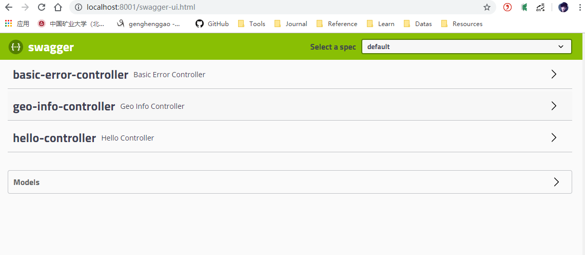

输入不同的分页查询参数，查看返回的分页结果

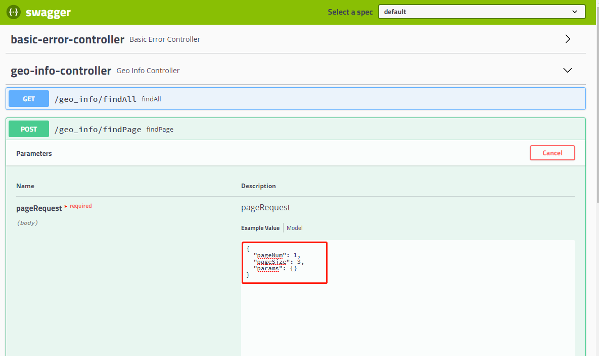

返回结果

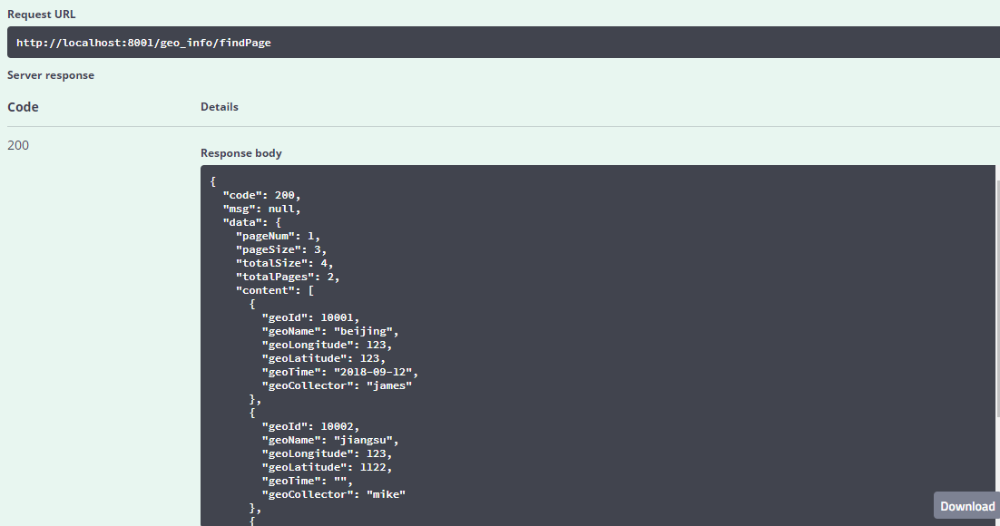


## 4、业务功能开发

### 4.1、编写DAO接口

打开`DAO`接口，添加`findPage`、`findByLable`和`findByLable`接口

`GeoDicMapper.java`

```

```

- 在`mongeostore-admin`模块model包下新建`BaseModel.java`

  ```java
  /*
   * @Descripttion: 
   * @version: 
   * @Author: henggao
   * @Date: 2019-09-24 21:50:33
   * @LastEditors: henggao
   * @LastEditTime: 2019-09-24 21:50:33
   */
  package com.henggao.mongeostore.admin.model;
  
  import java.util.Date;
  
  /**
   * 基础模型
   * BaseModel
   */
  public class BaseModel {
  
      private Long id;
  
      private String createBy;
  
      private Date createTime;
  
      private String lastUpdateBy;
  
      private Date lastUpdateTime;
  
      public Long getId() {
          return id;
      }
  
      public void setId(Long id) {
          this.id = id;
      }
  
      public String getCreateBy() {
          return createBy;
      }
  
      public void setCreateBy(String createBy) {
          this.createBy = createBy;
      }
  
      public Date getCreateTime() {
          return createTime;
      }
  
      public void setCreateTime(Date createTime) {
          this.createTime = createTime;
      }
  
      public String getLastUpdateBy() {
          return lastUpdateBy;
      }
  
      public void setLastUpdateBy(String lastUpdateBy) {
          this.lastUpdateBy = lastUpdateBy;
      }
  
      public Date getLastUpdateTime() {
          return lastUpdateTime;
      }
  
      public void setLastUpdateTime(Date lastUpdateTime) {
          this.lastUpdateTime = lastUpdateTime;
      }
  
  }
  ```

- 在`mongeostore-admin`模块model包下新建`GeoDict.java`

```java
/*
 * @Descripttion: 
 * @version: 
 * @Author: henggao
 * @Date: 2019-09-24 21:49:05
 * @LastEditors: henggao
 * @LastEditTime: 2019-09-24 21:49:05
 */
package com.henggao.mongeostore.admin.model;

/**
 * GeoDict
 */
public class GeoDict extends BaseModel {

    private String value;

    private String label;

    private String type;

    private String description;

    private Long sort;

    private String remarks;

    private Byte delFlag;

    public String getValue() {
        return value;
    }

    public void setValue(String value) {
        this.value = value;
    }

    public String getLabel() {
        return label;
    }

    public void setLabel(String label) {
        this.label = label;
    }

    public String getType() {
        return type;
    }

    public void setType(String type) {
        this.type = type;
    }

    public String getDescription() {
        return description;
    }

    public void setDescription(String description) {
        this.description = description;
    }

    public Long getSort() {
        return sort;
    }

    public void setSort(Long sort) {
        this.sort = sort;
    }

    public String getRemarks() {
        return remarks;
    }

    public void setRemarks(String remarks) {
        this.remarks = remarks;
    }

    public Byte getDelFlag() {
        return delFlag;
    }

    public void setDelFlag(Byte delFlag) {
        this.delFlag = delFlag;
    }
}
```

