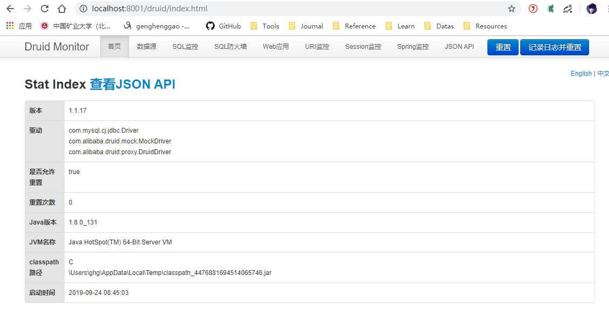
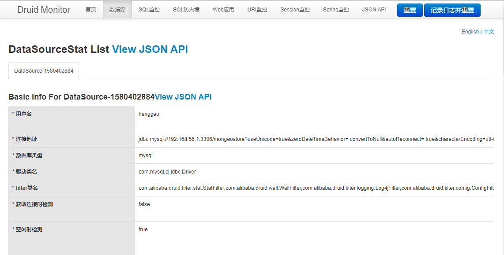
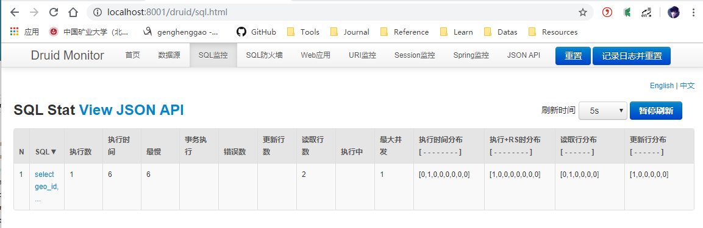

# 四、集成Druid数据源

[TOC]

## 1、Druid介绍

Druid时阿里来源的一个JDBC应用组件，主要包括3部分

- DruidDriver

- DruidDataSource

- SQLParser


## 2、添加依赖

在pom.xml文件中添加Druid的maven依赖

```xml
<!-- https://mvnrepository.com/artifact/com.alibaba/druid-spring-boot-starter -->
<dependency>
    <groupId>com.alibaba</groupId>
    <artifactId>druid-spring-boot-starter</artifactId>
    <version>1.1.20</version>
</dependency>
<!-- https://mvnrepository.com/artifact/log4j/log4j -->
<dependency>
    <groupId>log4j</groupId>
    <artifactId>log4j</artifactId>
    <version>1.2.17</version>
</dependency>
```

## 3、添加配置

### 3.1、在application.yml中，把原有的数据源配置替换成Druid数据源并配置相关参数

```yaml
spring:
  datasource:
    name: druidDataSource
    type: com.alibaba.druid.pool.DruidDataSource
    druid:
      driver-class-name: com.mysql.cj.jdbc.Driver
      url: jdbc:mysql://192.168.56.1:3306/mongeostore?useUnicode=true&zeroDateTimeBehavior= convertToNull&autoReconnect= true&characterEncoding=utf-8
      username: henggao
      password: abc123
      filters: stat,wall,log4j,config
      max-active: 100
      initial-size: 1
      max-wait: 60000
      min-idle: 1
      time-between-eviction-runs-millis: 60000
      min-evictable-idle-time-millis: 300000
      validation-query: select 'x'
      test-while-idle: true
      test-on-borrow: false
      test-on-return: false
      pool-prepared-statements: true
      max-open-prepared-statements: 50
      max-pool-prepared-statement-per-connection-size: 20
```

### 3.2、在resources目录下，新建一个log4j.properties

```properties
### set log levels ###    
log4j.rootLogger = INFO,DEBUG, console, infoFile, errorFile ,debugfile,mail 
LocationInfo=true    

log4j.appender.console = org.apache.log4j.ConsoleAppender  
log4j.appender.console.Target = System.out  
log4j.appender.console.layout = org.apache.log4j.PatternLayout 

log4j.appender.console.layout.ConversionPattern =[%d{yyyy-MM-dd HH:mm:ss,SSS}]-[%p]:%m   %x %n 

log4j.appender.infoFile = org.apache.log4j.DailyRollingFileAppender  
log4j.appender.infoFile.Threshold = INFO  
log4j.appender.infoFile.File = C:/logs/log
log4j.appender.infoFile.DatePattern = '.'yyyy-MM-dd'.log'  
log4j.appender.infoFile.Append=true
log4j.appender.infoFile.layout = org.apache.log4j.PatternLayout  
log4j.appender.infoFile.layout.ConversionPattern =[%d{yyyy-MM-dd HH:mm:ss,SSS}]-[%p]:%m  %x %n 

log4j.appender.errorFile = org.apache.log4j.DailyRollingFileAppender  
log4j.appender.errorFile.Threshold = ERROR  
log4j.appender.errorFile.File = C:/logs/error  
log4j.appender.errorFile.DatePattern = '.'yyyy-MM-dd'.log'  
log4j.appender.errorFile.Append=true  
log4j.appender.errorFile.layout = org.apache.log4j.PatternLayout  
log4j.appender.errorFile.layout.ConversionPattern =[%d{yyyy-MM-dd HH:mm:ss,SSS}]-[%p]:%m  %x %n

log4j.appender.debugfile = org.apache.log4j.DailyRollingFileAppender  
log4j.appender.debugfile.Threshold = DEBUG  
log4j.appender.debugfile.File = C:/logs/debug  
log4j.appender.debugfile.DatePattern = '.'yyyy-MM-dd'.log'  
log4j.appender.debugfile.Append=true  
log4j.appender.debugfile.layout = org.apache.log4j.PatternLayout  
log4j.appender.debugfile.layout.ConversionPattern =[%d{yyyy-MM-dd HH:mm:ss,SSS}]-[%p]:%m  %x %n
```

### 3.3、如果需要通过定制的配置文件对Druid进行自定义属性配置，在config目录下添加配置类DruidDataSourceProperties.java如下

```java
/*
 * @Descripttion: 
 * @version: 
 * @Author: henggao
 * @Date: 2019-09-24 08:23:42
 * @LastEditors: henggao
 * @LastEditTime: 2019-09-24 08:23:42
 */
package com.henggao.mongeostore.config;

import org.springframework.boot.context.properties.ConfigurationProperties;

/**
 * DruidDataSourceProperties
 */
@ConfigurationProperties(prefix = "spring.datasource.druid")
public class DruidDataSourceProperties {

	// jdbc
	private String driverClassName;
	private String url;
	private String username;
	private String password;
	// jdbc connection pool
	private int initialSize;
	private int minIdle;
	private int maxActive = 100;
	private long maxWait;
	private long timeBetweenEvictionRunsMillis;
	private long minEvictableIdleTimeMillis;
	private String validationQuery;
	private boolean testWhileIdle;
	private boolean testOnBorrow;
	private boolean testOnReturn;
	private boolean poolPreparedStatements;
	private int maxPoolPreparedStatementPerConnectionSize;
	// filter
	private String filters;

    public String getDriverClassName() {
        return driverClassName;
    }

    public void setDriverClassName(String driverClassName) {
        this.driverClassName = driverClassName;
    }

    public String getUrl() {
        return url;
    }

    public void setUrl(String url) {
        this.url = url;
    }

    public String getUsername() {
        return username;
    }

    public void setUsername(String username) {
        this.username = username;
    }

    public String getPassword() {
        return password;
    }

    public void setPassword(String password) {
        this.password = password;
    }

    public int getInitialSize() {
        return initialSize;
    }

    public void setInitialSize(int initialSize) {
        this.initialSize = initialSize;
    }

    public int getMinIdle() {
        return minIdle;
    }

    public void setMinIdle(int minIdle) {
        this.minIdle = minIdle;
    }

    public int getMaxActive() {
        return maxActive;
    }

    public void setMaxActive(int maxActive) {
        this.maxActive = maxActive;
    }

    public long getMaxWait() {
        return maxWait;
    }

    public void setMaxWait(long maxWait) {
        this.maxWait = maxWait;
    }

    public long getTimeBetweenEvictionRunsMillis() {
        return timeBetweenEvictionRunsMillis;
    }

    public void setTimeBetweenEvictionRunsMillis(long timeBetweenEvictionRunsMillis) {
        this.timeBetweenEvictionRunsMillis = timeBetweenEvictionRunsMillis;
    }

    public long getMinEvictableIdleTimeMillis() {
        return minEvictableIdleTimeMillis;
    }

    public void setMinEvictableIdleTimeMillis(long minEvictableIdleTimeMillis) {
        this.minEvictableIdleTimeMillis = minEvictableIdleTimeMillis;
    }

    public String getValidationQuery() {
        return validationQuery;
    }

    public void setValidationQuery(String validationQuery) {
        this.validationQuery = validationQuery;
    }

    public boolean isTestWhileIdle() {
        return testWhileIdle;
    }

    public void setTestWhileIdle(boolean testWhileIdle) {
        this.testWhileIdle = testWhileIdle;
    }

    public boolean isTestOnBorrow() {
        return testOnBorrow;
    }

    public void setTestOnBorrow(boolean testOnBorrow) {
        this.testOnBorrow = testOnBorrow;
    }

    public boolean isTestOnReturn() {
        return testOnReturn;
    }

    public void setTestOnReturn(boolean testOnReturn) {
        this.testOnReturn = testOnReturn;
    }

    public boolean isPoolPreparedStatements() {
        return poolPreparedStatements;
    }

    public void setPoolPreparedStatements(boolean poolPreparedStatements) {
        this.poolPreparedStatements = poolPreparedStatements;
    }

    public int getMaxPoolPreparedStatementPerConnectionSize() {
        return maxPoolPreparedStatementPerConnectionSize;
    }

    public void setMaxPoolPreparedStatementPerConnectionSize(int maxPoolPreparedStatementPerConnectionSize) {
        this.maxPoolPreparedStatementPerConnectionSize = maxPoolPreparedStatementPerConnectionSize;
    }

    public String getFilters() {
        return filters;
    }

    public void setFilters(String filters) {
        this.filters = filters;
    }

    
}
```

## 4、配置Servlet和Filter

在config包下新建一个DruidConfig配置类

```java
/*
 * @Descripttion: 
 * @version: 
 * @Author: henggao
 * @Date: 2019-09-24 08:29:55
 * @LastEditors: henggao
 * @LastEditTime: 2019-09-24 08:38:05
 */
package com.henggao.mongeostore.config;

import java.sql.SQLException;

import javax.servlet.Filter;
import javax.servlet.Servlet;
import javax.sql.DataSource;

import com.alibaba.druid.pool.DruidDataSource;
import com.alibaba.druid.support.http.StatViewServlet;
import com.alibaba.druid.support.http.WebStatFilter;

import org.springframework.beans.factory.annotation.Autowired;
import org.springframework.boot.autoconfigure.condition.ConditionalOnMissingBean;
import org.springframework.boot.context.properties.EnableConfigurationProperties;
import org.springframework.boot.web.servlet.FilterRegistrationBean;
import org.springframework.boot.web.servlet.ServletRegistrationBean;
import org.springframework.context.annotation.Bean;
import org.springframework.context.annotation.Configuration;

/**
 * DruidConfig
 */
@Configuration
@EnableConfigurationProperties({ DruidDataSourceProperties.class })
public class DruidConfig {

    @Autowired
    private DruidDataSourceProperties properties;

    @Bean
    @ConditionalOnMissingBean
    public DataSource druidDataSource() {

        // 属性设置
        DruidDataSource druidDataSource = new DruidDataSource();
        druidDataSource.setDriverClassName(properties.getDriverClassName());
        druidDataSource.setUrl(properties.getUrl());
        druidDataSource.setUsername(properties.getUsername());
        druidDataSource.setPassword(properties.getPassword());
        druidDataSource.setInitialSize(properties.getInitialSize());
        druidDataSource.setMinIdle(properties.getMinIdle());
        druidDataSource.setMaxActive(properties.getMaxActive());
        druidDataSource.setMaxWait(properties.getMaxWait());
        druidDataSource.setTimeBetweenEvictionRunsMillis(properties.getTimeBetweenEvictionRunsMillis());
        druidDataSource.setMinEvictableIdleTimeMillis(properties.getMinEvictableIdleTimeMillis());
        druidDataSource.setValidationQuery(properties.getValidationQuery());
        druidDataSource.setTestWhileIdle(properties.isTestWhileIdle());
        druidDataSource.setTestOnBorrow(properties.isTestOnBorrow());
        druidDataSource.setTestOnReturn(properties.isTestOnReturn());
        druidDataSource.setPoolPreparedStatements(properties.isPoolPreparedStatements());
        druidDataSource.setMaxPoolPreparedStatementPerConnectionSize(
                properties.getMaxPoolPreparedStatementPerConnectionSize());

        try {
            druidDataSource.setFilters(properties.getFilters());
            druidDataSource.init();
        } catch (SQLException e) {
            e.printStackTrace();
        }

        return druidDataSource;
    }

    /**
     * 注册Servlet信息， 配置监控视图
     *
     * @return
     */
    @Bean
    @ConditionalOnMissingBean
    public ServletRegistrationBean<Servlet> druidServlet() {
        ServletRegistrationBean<Servlet> servletRegistrationBean = new ServletRegistrationBean<Servlet>(
                new StatViewServlet(), "/druid/*");

        // 白名单：
        // servletRegistrationBean.addInitParameter("allow","127.0.0.1,192.168.56.1");
        // IP黑名单 (存在共同时，deny优先于allow) : 如果满足deny的话提示:Sorry, you are not permitted to
        // view this page.
        servletRegistrationBean.addInitParameter("deny", "192.168.56.1");
        // 登录查看信息的账号密码, 用于登录Druid监控后台
        servletRegistrationBean.addInitParameter("loginUsername", "admin");
        servletRegistrationBean.addInitParameter("loginPassword", "admin");
        // 是否能够重置数据.
        servletRegistrationBean.addInitParameter("resetEnable", "true");
        return servletRegistrationBean;

    }

    /**
     * 注册Filter信息, 监控拦截器
     *
     * @return
     */
    @Bean
    @ConditionalOnMissingBean
    public FilterRegistrationBean<Filter> filterRegistrationBean() {
        FilterRegistrationBean<Filter> filterRegistrationBean = new FilterRegistrationBean<Filter>();
        filterRegistrationBean.setFilter(new WebStatFilter());
        filterRegistrationBean.addUrlPatterns("/*");
        filterRegistrationBean.addInitParameter("exclusions", "*.js,*.gif,*.jpg,*.png,*.css,*.ico,/druid/*");
        return filterRegistrationBean;
    }
}
```

## 5、编译运行

启动MongeostoreApplication.java

## 6、查看监控

### 6.1登陆界面

启动应用，访问http://localhost:8001/druid/login.html


## 6.2、监控首页

用户名就是DruidConfig.java中配置的登录账号和密码，用户名：admin，密码：admin，输入信息登录



### 6.3、数据源



### 6.4、SQL监控

访问http://localhost:8001/geo_info/findAll，接口调用成功后，可以看到SQL监控的执行记录。




参考：

《Spring Boot+Spring Cloud+Vue+Element项目实战：手把手教你开发权限管理系统》

https://gitee.com/liuge1988/mango-platform