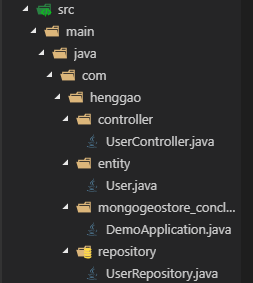

# MongoGeoStore

## 一、注册登录

1.目录结构，如图：



3.在entity文件夹编写User.java

```java
package com.henggao.entity;

import org.springframework.data.annotation.Id;

import lombok.Data;

/**
 * User
 */
@Data
public class User {

    @Id
    private String id;
    // private String username;
    private String email;

    private String password;

    public User() {

    }

    public User(String email, String password) {

        this.email = email;
        this.password = password;
    }

}
```

4.在repository文件夹下，编写UserRepository.java

```java
package com.henggao.repository;

// import java.util.List;

import com.henggao.entity.User;

import org.springframework.data.mongodb.repository.MongoRepository;

/**
 * UserRespository
 */
public interface UserRepository extends MongoRepository<User, String> {

	public User findByEmail(String email);

	// List<User> findByEmail(String email);
	// void deleteByEmail(String email);

}
```

5.在controller文件夹下编写UserController.java

```java
package com.henggao.controller;

import java.util.List;

import javax.servlet.http.HttpServletRequest;

import com.henggao.entity.User;
import com.henggao.repository.UserRepository;

import org.springframework.beans.factory.annotation.Autowired;
import org.springframework.data.mongodb.core.MongoTemplate;
import org.springframework.stereotype.Controller;
import org.springframework.ui.Model;
import org.springframework.web.bind.annotation.RequestMapping;
import org.springframework.web.bind.annotation.ResponseBody;

/**
 * UserController
 */
// 使用@Controller 才可以返回html页面，使用@ResController 返回的是字符串
@Controller
@RequestMapping(value = "/index")
public class UserController {

    @Autowired
    private UserRepository userRepository;

    @Autowired
    private MongoTemplate mongoTemplate;

    /**
     * 首页
     * 
     * @param request
     * @return
     */

    @RequestMapping(value = "/index")
    public String index(Model model, HttpServletRequest request) {

        User user = (User) request.getAttribute("user");

        if (user == null) {
            System.out.println(user);
            User usero = new User("##errors##", "1234");
            model.addAttribute("user", user);
        }

        return "index";
    }

    /**
     * 打开登陆界面
     * 
     * @return
     */
    @RequestMapping(value = "/oplogin")
    public String oplogin() {

        return "login";
    }

    /**
     * 登录
     * 
     * @param model
     * @return
     */
    @RequestMapping(value = "/login")
    public String login(HttpServletRequest request) {
        // 获取用户及密码
        String email = request.getParameter("email");
        String password = request.getParameter("password");

        // 根据用户名查询，用户是否存在
        User user = userRepository.findByEmail(email);

        // 如果存在
        if (user != null) {

            if (user.getPassword().equals(password)) {
                // 如果密码正确
                // 将用户信息放入到会话中...
                request.setAttribute("user", user);

                return "index";

            } else {
                // 如果密码错误
                System.out.println("密码错误");
                // System.out.println(user.getEmail());
                // System.out.println(user.getPassword());
                // System.out.println("----------------------");
                return "ferror";
            }
        } else {
            // 如果不存在，代码邮箱和密码输入有误
            System.out.println("用户不存在");
            return "ferror";
        }
    }

    /**
     * 打开注册界面
     * 
     * @return
     */
    @RequestMapping("/resgi")
    private String resgi() {
        return "resgi";
    }

    /**
     * 注册控制层
     * 
     * @param request
     * @return
     */
    @RequestMapping(value = "/rege")
    public String resig(HttpServletRequest request) {
        // 获取用户和密码
        String email = request.getParameter("email");
        String password = request.getParameter("password1");

        // 根据昵称查询，用户是否存在
        User user = userRepository.findByEmail(email);

        // 若存在
        if (user != null) {
            // 昵称重复
            return "ferror";
        }

        // 若不存在
        User newUser = new User(email, password);
        // 注册
        userRepository.save(newUser);

        // 将信息设置session作用域
        request.setAttribute("user", newUser);

        return "index";
    }

    @ResponseBody
    @RequestMapping("/findByEmail")
    public User findByEmail() {

        return userRepository.findByEmail("genghenggao@ooutlook.com");
    }

    @ResponseBody
    @RequestMapping("/find")
    public List<User> find() {

        return mongoTemplate.findAll(User.class);
    }

}
```

6.在Mongogeostore_conclusion下编写启动类DemoApplication.java

```java
package com.henggao.mongogeostore_conclusion;

import org.springframework.boot.SpringApplication;
import org.springframework.boot.autoconfigure.SpringBootApplication;
import org.springframework.boot.autoconfigure.domain.EntityScan;
// import org.springframework.context.annotation.Bean;
import org.springframework.data.mongodb.repository.config.EnableMongoRepositories;
// import org.thymeleaf.dialect.springdata.SpringDataDialect;

@SpringBootApplication(scanBasePackages = "com.henggao")
@EntityScan("com.henggao.entity")
@EnableMongoRepositories("com.henggao.repository")
public class DemoApplication {

	// thymeleaf-spring-data-dialect，实现分页
	// @Bean
	// public SpringDataDialect springDataDialect() {
	// 	return new SpringDataDialect();
	// }

	// 默认启动
	public static void main(String[] args) {
		SpringApplication.run(DemoApplication.class, args);
	}

}
```

2.在resources/templates文件夹下，编写login.html

```html
<!DOCTYPE html>
<html lang="zh-CN">

<head>
    <meta charset="utf-8">
    <meta http-equiv="X-UA-Compatible" content="IE=edge">
    <meta name="viewport" content="width=device-width, initial-scale=1">
    <!-- 上述3个meta标签*必须*放在最前面，任何其他内容都*必须*跟随其后！ -->
    <title>MongoGeoStore_Login</title>

    <!-- Bootstrap -->
    <link href="../static/css/bootstrap.css" rel="stylesheet">
    <link rel="stylesheet" href="../static/css/MongoGeoStore.css">
    <!-- 标题栏： -->
    <link rel="icon" href="../static/img/earth_logo.ico" type="image/x-icon">
    <!-- 收藏夹： -->
    <link rel="shortcut icon" href="../static/img/earth_logo.ico" type="image/x-icon">

</head>

<body>
    <div class="container">
        <div class="row text-center">
            <div class="col-md-12" id="login_box">
                <!-- 修改 -->
                <form action="/index/login" method="POST" class="form-horizontal">
                    <!-- 修改 -->
                    
                    <h3 style="text-align:center;">Please&nbsp;sign&nbsp;in</h3>
                    <div class="form-group mar20">
                        <label for="inputEmail3" class="col-sm-4 control-label">Username</label>
                        <div class="col-sm-6">
                            <input type="email" name="email" class="form-control" id="inputEmail3" placeholder="Email">
                        </div>
                    </div>
                    <div class="form-group">
                        <label for="inputPassword3" class="col-sm-4 control-label">Password</label>
                        <div class="col-sm-6">
                            <input type="password" name="password" class="form-control" id="inputPassword3"
                                placeholder="Password">
                        </div>
                    </div>
                    <div class="form-group">
                        <div class="col-sm-offset-1 col-sm-11">
                            <div class="checkbox">
                                <label>
                                    <input type="checkbox"> Remember me
                                </label>
                            </div>
                        </div>
                    </div>
                    <div class="form-group">
                        <div class="row">
                            <div class="col-sm-offset-5 col-sm-1">
                                <button type="submit" class="btn btn-default">Sign in</button>
                            </div>
                            <div class="col-sm-3">
                                <a href="" role="button" data-toggle="modal" data-target="#myModal">
                                    <button type="submit" class="btn btn-default">Login in</button>
                                </a>
                            </div>
                        </div>
                    </div>
                    <p class="mt-5 mb-3 text-muted">© 2018-2019</p>
                </form>
            </div>
        </div>
        <!-- 注册 -->
        <div class="modal fade" id="myModal" tabindex="-1" role="dialog" aria-labelledby="myModalLabel">
            <div class="modal-dialog" role="document">
                <div class="modal-content">
                    <div class="modal-header">
                        <button type="button" class="close" data-dismiss="modal" aria-label="Close"><span
                                aria-hidden="true">&times;</span></button>
                        <h4 class="modal-title" id="myModalLabel">注册</h4>
                    </div>
                    <form action="/index/rege" method="POST">
                        <div class="modal-body">
                            <div class="form-group">
                                <label for="addemail">请输入用户邮箱</label>
                                <input type="email" name="email" id="addemail" class="form-control"
                                    placeholder="请输入用户邮箱">
                            </div>
                            <div class="form-group">
                                <label for="addpassword">用户密码</label>
                                <input type="password" name="password1" id="addpassword" class="form-control"
                                    placeholder="请输入用户密码">
                            </div>
                        </div>
                        <div class="modal-footer">
                            <button type="button" class="btn btn-default" data-dismiss="modal">关闭</button>
                            <button type="submit" class="btn btn-primary">Submit</button>
                        </div>
                    </form>
                </div>
            </div>
        </div>
    </div>


    <!-- jQuery (Bootstrap 的所有 JavaScript 插件都依赖 jQuery，所以必须放在前边) -->
    <script src="../static/js/jquery-3.4.1.js"></script>
    <!-- 加载 Bootstrap 的所有 JavaScript 插件。你也可以根据需要只加载单个插件。 -->
    <script src="../static/js/bootstrap.js"></script>
    <!-- <script>
        $(document).ready(function () {

            // $("input").click(function(){
            //     $(this).css("background-color","red");
            // })

            $(".form-horizontal").submit(function () {
                var $email = $("#inputEmail3").val();
                var $password = $("#inputPassword3").val();
                if ($email.length > 2 || $email.length < 16) {
                    alert("用户名必须是2-16");
                    return false;
                }
                if ($password.length < 6) {
                    alert("密码必须大于6");
                    return false;
                }

                return true;
            })
        })
    </script> -->
</body>

</html>
```


## 二、数据增删改查

