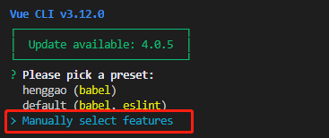
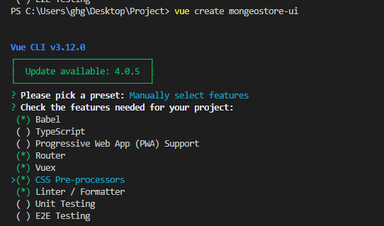
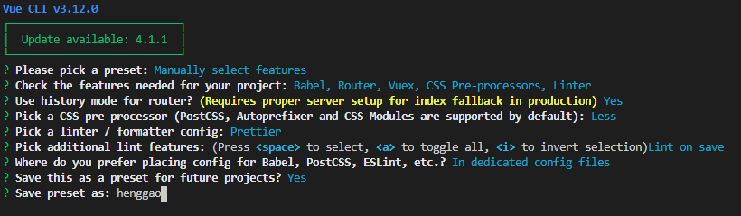
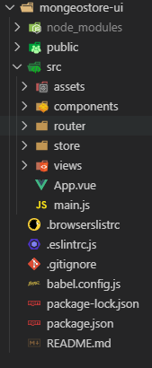
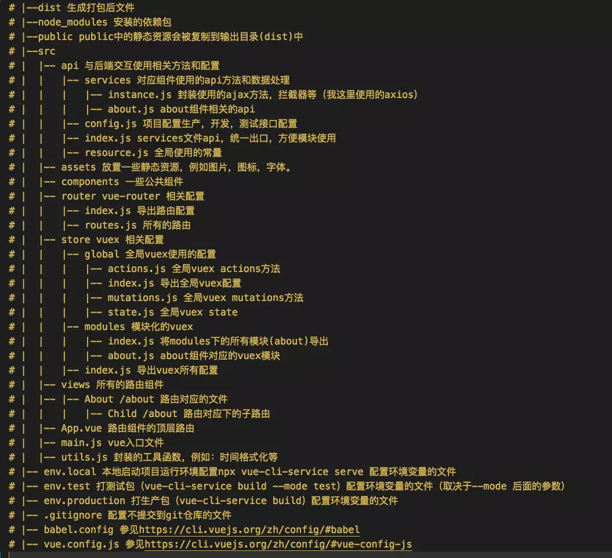

# MogGeoStore

[TOC]

## 一、创建Mongeotore_ui

1、使用vue-cli3创建项目

```shell
vue create mongeostore-ui
```



-  按上下键 选择哪一个，按空格键确定 。选择好后回车进入下一步。

  

```
 1 ? Check the features needed for your project: (Press <space> to select, <a> to toggle all, <i> to invert selection)
 2 >( ) Babel //转码器，可以将ES6代码转为ES5代码，从而在现有环境执行。 
 3 ( ) TypeScript// TypeScript是一个JavaScript（后缀.js）的超集（后缀.ts）包含并扩展了 JavaScript 的语法，需要被编译输出为 JavaScript在浏览器运行，目前较少人再用
 4 ( ) Progressive Web App (PWA) Support// 渐进式Web应用程序
 5 ( ) Router // vue-router（vue路由）
 6 ( ) Vuex // vuex（vue的状态管理模式）
 7 ( ) CSS Pre-processors // CSS 预处理器（如：less、sass）
 8 ( ) Linter / Formatter // 代码风格检查和格式化（如：ESlint）
 9 ( ) Unit Testing // 单元测试（unit tests）
10 ( ) E2E Testing // e2e（end to end） 测试
```

- 下面是我的设置

  

- 看一下目录结构

  

- Vue cli3目录介绍

  

