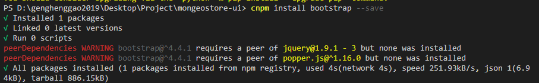
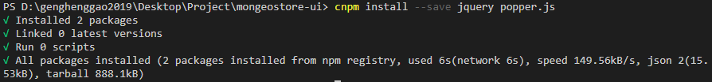
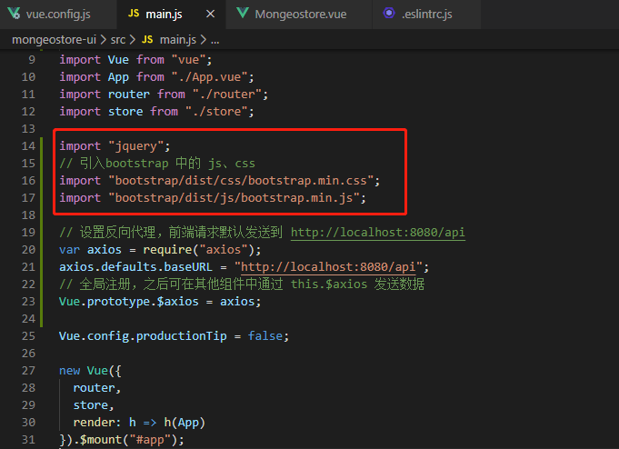
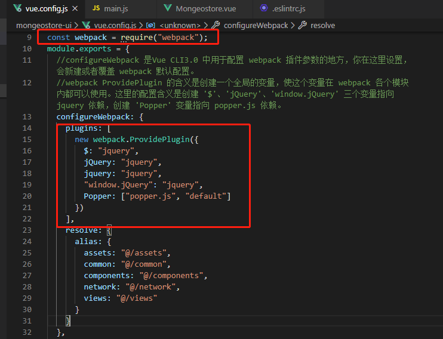
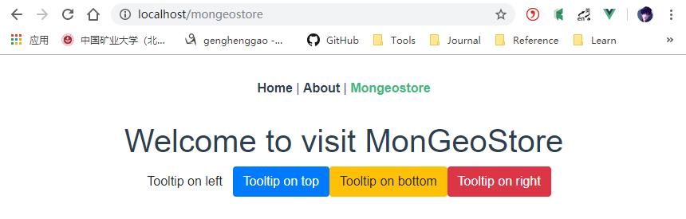
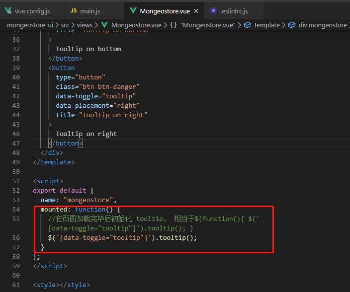
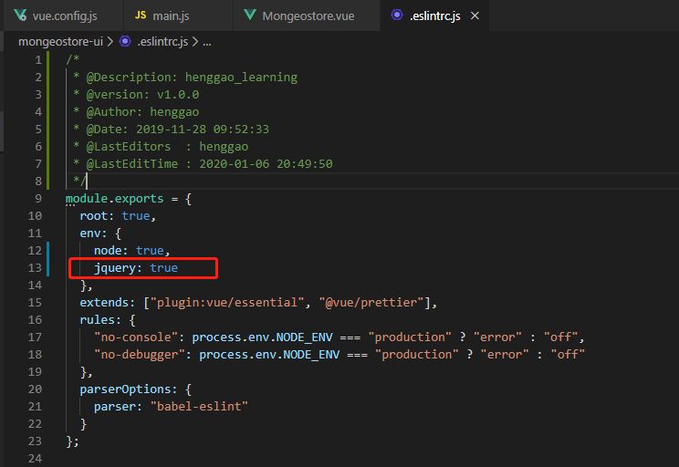
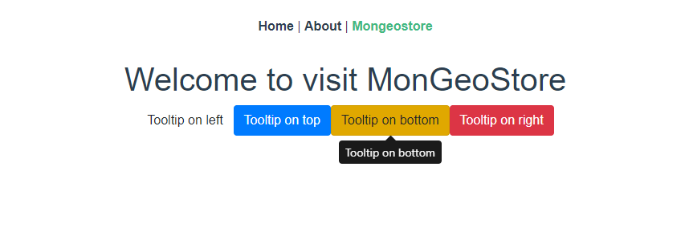

# MogGeoStore

[TOC]

## 一、Vue中引用Bootstrap

1、首先 使用 `cli` 进行初始化项目，创建好项目。

2、使用npm进行安装

```
cnpm install bootstrap --save
```



提示 jquery 以及 popper.js 找不到

3、安装jquery、popper.js

```
cnpm install --save jquery popper.js
```



## 二、配置main.js

引入Bootstrap

```js
/*
 * @Description: henggao_learning
 * @version: v1.0.0
 * @Author: henggao
 * @Date: 2019-11-28 09:52:33
 * @LastEditors  : henggao
 * @LastEditTime : 2020-01-06 20:48:25
 */
import Vue from "vue";
import App from "./App.vue";
import router from "./router";
import store from "./store";

import "jquery";
// 引入bootstrap 中的 js、css
import "bootstrap/dist/css/bootstrap.min.css";
import "bootstrap/dist/js/bootstrap.min.js";

// 设置反向代理，前端请求默认发送到 http://localhost:8080/api
var axios = require("axios");
axios.defaults.baseURL = "http://localhost:8080/api";
// 全局注册，之后可在其他组件中通过 this.$axios 发送数据
Vue.prototype.$axios = axios;

Vue.config.productionTip = false;

new Vue({
  router,
  store,
  render: h => h(App)
}).$mount("#app");

```



## 三、配置vue.config.js文件

Vue CLI3.0 中的所有配置都在 vue.config.js 文件，你在这里配置好，脚手架自动使用你的配置覆盖掉默认的配置。
 如果你的项目中没有 vue.config.js 文件，请你在 package.json 文件的同级目录新建一个 vue.config.js 文件。文件内具体的配置如下：

1、首先引入 `webpack`

```js
const webpack = require("webpack");
```

 2、在`vue.conf.js` 中的 `module.exports = {}` 添加如下内容：

```js
    plugins: [
      new webpack.ProvidePlugin({
        $: "jquery",
        jQuery: "jquery",
        jquery: "jquery",
        "window.jQuery": "jquery",
        Popper: ["popper.js", "default"]
      })
    ],
```



## 四、具体使用

在测试页面写一个测试代码

```vue
<!--
 * @Description: henggao_learning
 * @version: v1.0.0
 * @Author: henggao
 * @Date: 2019-11-28 10:39:23
 * @LastEditors  : henggao
 * @LastEditTime : 2020-01-06 20:14:30
 -->
<template>
  <div class="mongeostore">
    <h1>Welcome to visit MonGeoStore</h1>
    <button
      type="button"
      class="btn btn-default"
      data-toggle="tooltip"
      data-placement="left"
      title="Tooltip on left"
    >
      Tooltip on left
    </button>
    <button
      type="button"
      class="btn btn-primary"
      data-toggle="tooltip"
      data-placement="top"
      title="Tooltip on top"
    >
      Tooltip on top
    </button>
    <button
      type="button"
      class="btn btn-warning"
      data-toggle="tooltip"
      data-placement="bottom"
      title="Tooltip on bottom"
    >
      Tooltip on bottom
    </button>
    <button
      type="button"
      class="btn btn-danger"
      data-toggle="tooltip"
      data-placement="right"
      title="Tooltip on right"
    >
      Tooltip on right
    </button>
  </div>
</template>

<script>
export default {
  name: "mongeostore"
};
</script>

<style></style>

```




## 五、使用Jquery

在上述页面使用Jquery。

```vue
<!--
 * @Description: henggao_learning
 * @version: v1.0.0
 * @Author: henggao
 * @Date: 2019-11-28 10:39:23
 * @LastEditors  : henggao
 * @LastEditTime : 2020-01-06 20:49:02
 -->
<template>
  <div class="mongeostore">
    <h1>Welcome to visit MonGeoStore</h1>
    <button
      type="button"
      class="btn btn-default"
      data-toggle="tooltip"
      data-placement="left"
      title="Tooltip on left"
    >
      Tooltip on left
    </button>
    <button
      type="button"
      class="btn btn-primary"
      data-toggle="tooltip"
      data-placement="top"
      title="Tooltip on top"
    >
      Tooltip on top
    </button>
    <button
      type="button"
      class="btn btn-warning"
      data-toggle="tooltip"
      data-placement="bottom"
      title="Tooltip on bottom"
    >
      Tooltip on bottom
    </button>
    <button
      type="button"
      class="btn btn-danger"
      data-toggle="tooltip"
      data-placement="right"
      title="Tooltip on right"
    >
      Tooltip on right
    </button>
  </div>
</template>

<script>
export default {
  name: "mongeostore",
  mounted: function() {
    //在页面加载完毕后初始化 tooltip， 相当于$(function(){ $('[data-toggle="tooltip"]').tooltip(); }
    $('[data-toggle="tooltip"]').tooltip();
  }
};
</script>

<style></style>

```



在设置 .eslintrc.js 文件，避免`$`报错。

```js
module.exports = {
  env: {
    node: true,
    jquery: true
  }
};
```



鼠标放上查看



- 有一个小问题：

当我在main.js中使用`import $ from 'jquery'`引入jquery时`$`会报错。使用`import 'jquery'`正常使用。


参考：https://www.jianshu.com/p/0d0c1eaeb877

- Written in 2020 1.6

