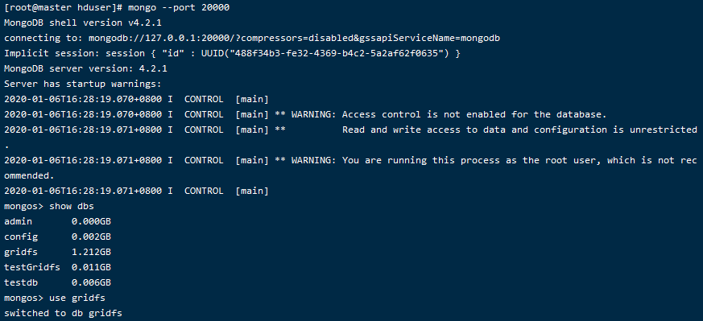
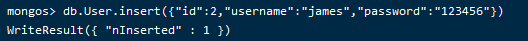
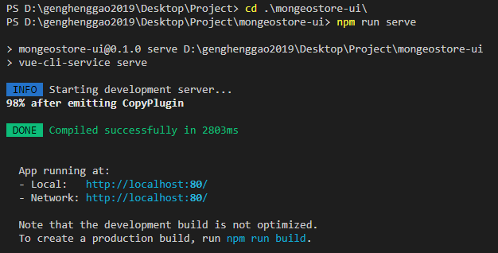
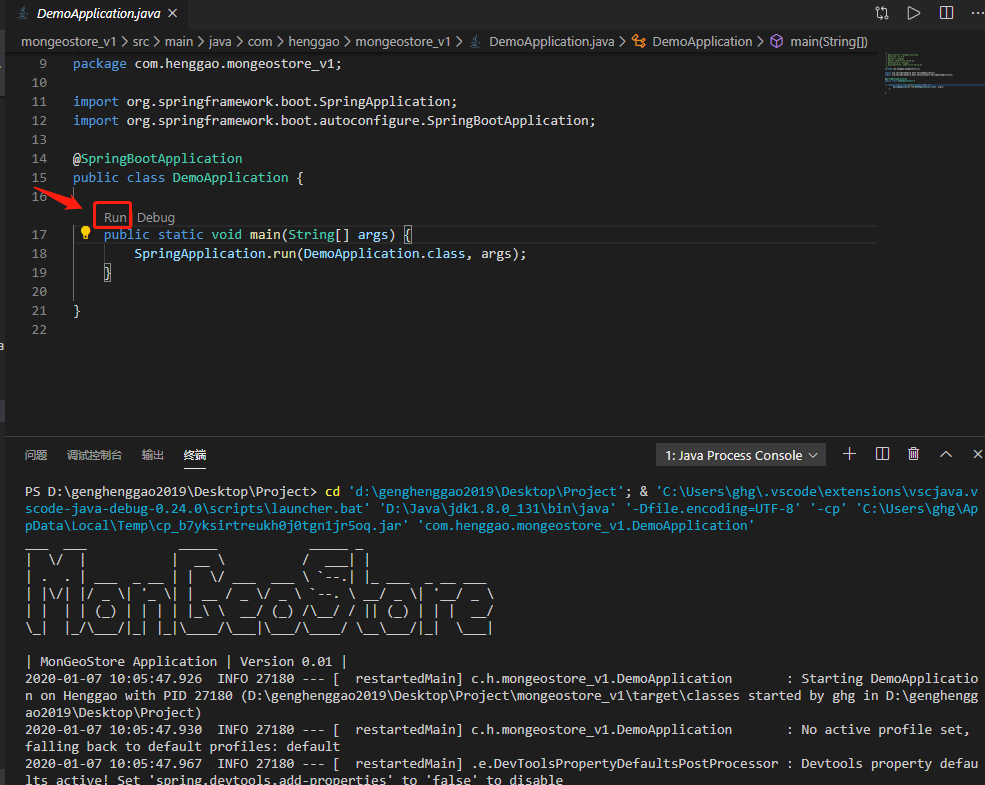
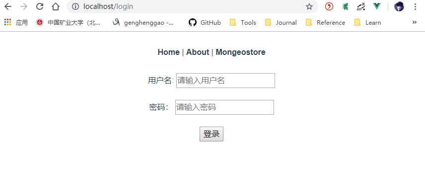
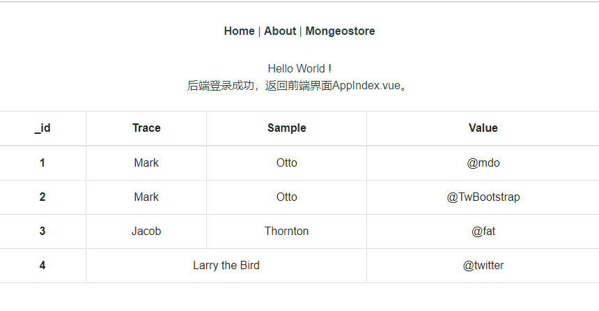

# Mongeostore

[toc]

## 一、MongoDB数据库引入

采用当前流行的非关系型数据库MongoDB

## 二、安装

参考我的Github，有详细的安装过程。

## 三、创建集合

### 1、登录mongodb，查看数据库

```
#查看数据库
show dbs

#使用gridfs数据库（注意这里只是我起的数据库名字，和MongoDB的GridFS别混淆）
use gridfs
```



### 2、插入数据

输入如下命令，插入数据。

```
db.User.insert({"id":2,"username":"james","password":"123456"})
```



**注意和下面对比**：

```
db.User.insert({"id":1,"username":"henggao","password":123456})
```

- 其实也没什么大的学问，只是给新手一点有好的提醒，password的类型需要注意一下。


## 四、编写程序

### 1、使用SpringBoot构建后端项目

具体步骤这里就不补充了。

#### 1.1 实体类User.java

```java
/*
 * @Description: henggao_learning
 * @version: v1.0.0
 * @Author: henggao
 * @Date: 2019-11-29 19:31:09
 * @LastEditors  : henggao
 * @LastEditTime : 2020-01-07 09:38:54
 */
package com.henggao.mongeostore_v1.model;

import org.springframework.data.annotation.Id;
import org.springframework.data.mongodb.core.mapping.Document;

import lombok.AllArgsConstructor;
import lombok.Data;
import lombok.NoArgsConstructor;

/**
 * User
 */
@Document(collection = "User") // 对应集合名
@Data // setter getter toString
// @Builder
@NoArgsConstructor // 无参构造
@AllArgsConstructor // 全参构造
public class User {

    @Id // 主键
    private String id; 
    private String username;
    private String password;

    public User(String username, String password) {
        this.username = username;
        this.password = password;
    }
}
```

**注意**

- 在MongoDb里要求每个文档都需要有`_id` 字段，java类中有如下情况会被映射为**_id**字段
  - 如果1个字段加上了 `@Id (org.springframework.data.annotation.Id)`注解，那么将bean保存到数据库时就会把该字段映射为文档中的**_id**字段
  - 如果java对象中没有 `@Id` 注解，名字为**id** 的字段将会被映射为文档中的**_id**字段

这个的`id`设置为String类型。可以[参考链接](https://blog.csdn.net/qq_34332010/article/details/78160075)

#### 1.2、UserRepository.java

```java
/*
 * @Description: henggao_learning
 * @version: v1.0.0
 * @Author: henggao
 * @Date: 2020-01-06 21:54:15
 * @LastEditors  : henggao
 * @LastEditTime : 2020-01-07 09:23:09
 */
package com.henggao.mongeostore_v1.repository;

import com.henggao.mongeostore_v1.model.User;

import org.bson.types.ObjectId;
import org.springframework.data.mongodb.repository.MongoRepository;

/**
 * UserRepository
 */
public interface UserRepository extends MongoRepository<User, ObjectId> {

    public User findByUsername(String username);

    public User getByUsernameAndPassword(String username, String password);

}
```

#### 1.3、UserController.java

```java
/*
 * @Description: henggao_learning
 * @version: v1.0.0
 * @Author: henggao
 * @Date: 2019-11-29 19:35:29
 * @LastEditors  : henggao
 * @LastEditTime : 2020-01-07 09:01:30
 */
package com.henggao.mongeostore_v1.controller;

// import java.util.Objects;

import com.henggao.mongeostore_v1.model.User;
import com.henggao.mongeostore_v1.repository.UserRepository;
import com.henggao.mongeostore_v1.result.Result;

import org.springframework.beans.factory.annotation.Autowired;
import org.springframework.stereotype.Controller;
import org.springframework.web.bind.annotation.CrossOrigin;
import org.springframework.web.bind.annotation.PostMapping;
import org.springframework.web.bind.annotation.RequestBody;
import org.springframework.web.bind.annotation.ResponseBody;
import org.springframework.web.util.HtmlUtils;

/**
 * UserController
 */
@Controller
public class UserController {

    @Autowired
    private UserRepository userRepository;

    @CrossOrigin
    @PostMapping(value = "api/login")
    @ResponseBody
    public Result login(@RequestBody User requestUser) {
        // 对 html 标签进行转义，防止 XSS 攻击
        String username = requestUser.getUsername();
        username = HtmlUtils.htmlEscape(username);

        User user = userRepository.getByUsernameAndPassword(username, requestUser.getPassword());
        if (null == user) {
            System.out.println("400");
            return new Result(400);
        } else {
            System.out.println("200");
            return new Result(200);
        }

    }

}
```

### 2、使用Vue-cli构建前端


### 3、启动

#### 1、启动前端



#### 2、启动后端



#### 3、浏览器访问

访问：http://localhost:80/login



填写用户名和密码登录。




- 记录一下配置信息

  - pom.xml

    ```xml
    <?xml version="1.0" encoding="UTF-8" ?>
    <project xmlns="http://maven.apache.org/POM/4.0.0" xmlns:xsi="http://www.w3.org/2001/XMLSchema-instance" xsi:schemaLocation="http://maven.apache.org/POM/4.0.0 https://maven.apache.org/xsd/maven-4.0.0.xsd">
    	<modelVersion>4.0.0</modelVersion>
    	<parent>
    		<groupId>org.springframework.boot</groupId>
    		<artifactId>spring-boot-starter-parent</artifactId>
    		<version>2.2.1.RELEASE</version>
    		<relativePath /> <!-- lookup parent from repository -->
    	</parent>
    	<groupId>com.henggao</groupId>
    	<artifactId>mongeostore_v1</artifactId>
    	<version>0.0.1-SNAPSHOT</version>
    	<name>demo</name>
    	<description>Demo project for Spring Boot</description>
    
    	<properties>
    		<java.version>1.8</java.version>
    	</properties>
    
    	<dependencies>
    		<dependency>
    			<groupId>org.springframework.boot</groupId>
    			<artifactId>spring-boot-starter-data-mongodb</artifactId>
    		</dependency>
    
    		<dependency>
    			<groupId>org.springframework.boot</groupId>
    			<artifactId>spring-boot-starter-thymeleaf</artifactId>
    			<version>2.2.1.RELEASE</version>
    		</dependency>
    
    		<!--开发IO流功能的工具类库 -->
    		<dependency>
    			<groupId>commons-io</groupId>
    			<artifactId>commons-io</artifactId>
    			<version>2.6</version>
    		</dependency>
    		<!-- https://mvnrepository.com/artifact/com.alibaba/fastjson -->
    		<dependency>
    			<groupId>com.alibaba</groupId>
    			<artifactId>fastjson</artifactId>
    			<version>1.2.62</version>
    		</dependency>
    		<dependency>
    			<groupId>org.springframework.boot</groupId>
    			<artifactId>spring-boot-starter-web</artifactId>
    		</dependency>
    
    		<dependency>
    			<groupId>org.springframework.boot</groupId>
    			<artifactId>spring-boot-devtools</artifactId>
    			<scope>runtime</scope>
    			<optional>true</optional>
    		</dependency>
    		<dependency>
    			<groupId>org.projectlombok</groupId>
    			<artifactId>lombok</artifactId>
    			<optional>true</optional>
    		</dependency>
    		<dependency>
    			<groupId>org.springframework.boot</groupId>
    			<artifactId>spring-boot-starter-test</artifactId>
    			<scope>test</scope>
    			<exclusions>
    				<exclusion>
    					<groupId>org.junit.vintage</groupId>
    					<artifactId>junit-vintage-engine</artifactId>
    				</exclusion>
    			</exclusions>
    		</dependency>
    	</dependencies>
    
    	<build>
    		<plugins>
    			<plugin>
    				<groupId>org.springframework.boot</groupId>
    				<artifactId>spring-boot-maven-plugin</artifactId>
    			</plugin>
    		</plugins>
    	</build>
    
    </project>
    ```

  - application.yml

    ```yml
    server:
      port: 8080  #端口号
    
    spring:
      thymeleaf:
        mode: HTML5
        encoding: UTF-8
        servlet:
          content-type: text/html; charset=utf-8
        cache: false
      data:
        mongodb:
          uri: mongodb://192.168.55.110:20000/gridfs,192.168.55.111:20000/gridfs,192.168.55.112:20000/gridfs
          database: gridfs
      servlet:
      #uploadfile
        multipart:
          max-file-size:
            3072MB
          max-request-size:
            3072MB  # 3 GB
    
    ```

    

