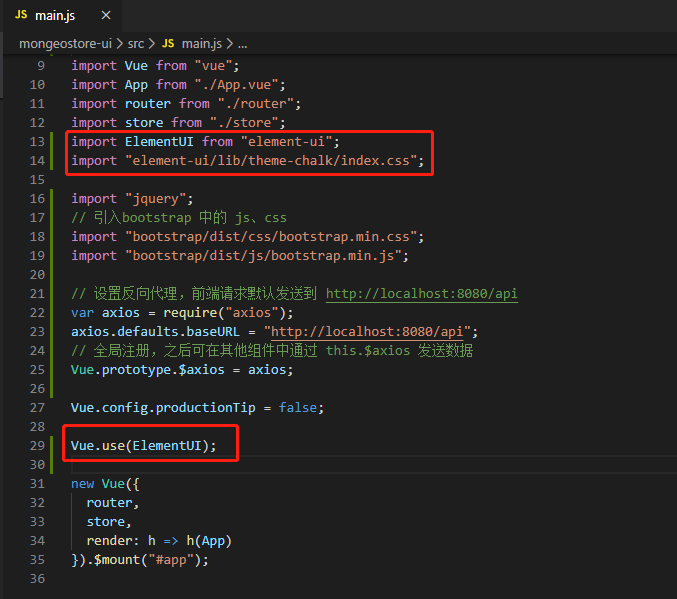
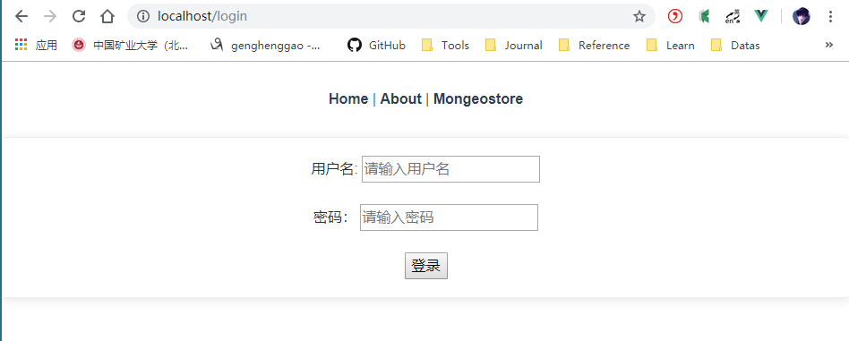
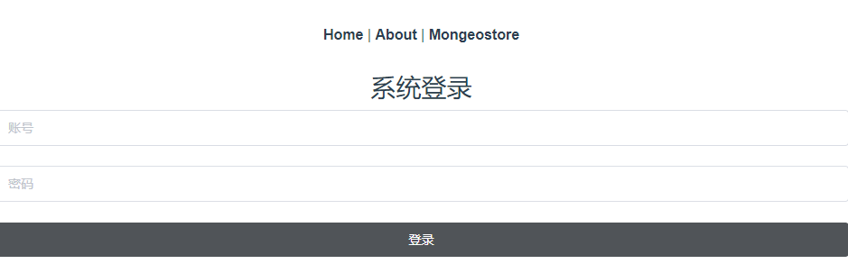
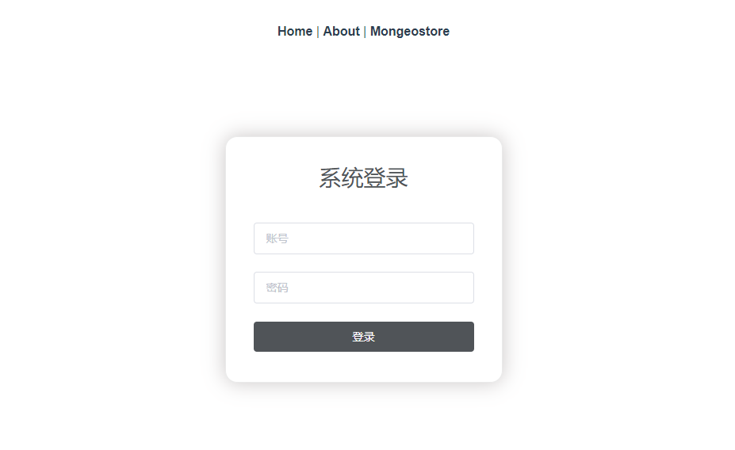
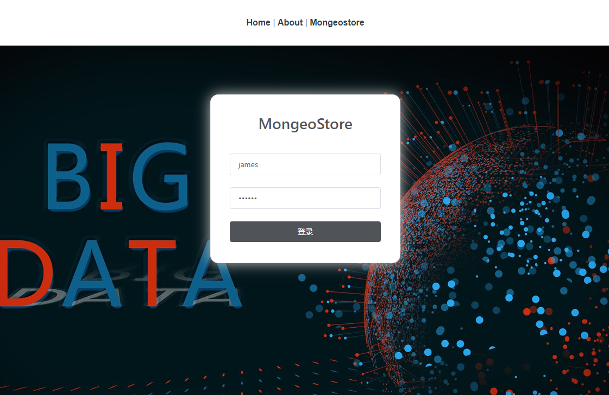
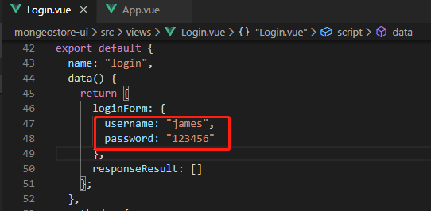

# Mongeostore

[TOC]

## 一、安装引入Element

Element - The world’s most popular Vue UI framework.

### 1、安装Element

```
npm i element-ui -S
```

### 2、引入Element

根据文档，我们需要修改 main.js 为如下内容

```js
import ElementUI from "element-ui";
import "element-ui/lib/theme-chalk/index.css";

Vue.use(ElementUI);
```



这样便完成了 Element 的引入。

### 3、测试

打开 `Login.vue`，把最外层的 `<div>` 标签改为 `<el-card>`（下面是 `<template>` 内的完整代码）

```vue
  <el-card>
      用户名:<input type="text" v-model="loginForm.username" placeholder="请输入用户名"/>
      <br><br>
      密码： <input type="password" v-model="loginForm.password" placeholder="请输入密码"/>
      <br><br>
      <button v-on:click="login">登录</button>
  </el-card>

```


访问： http://localhost:80/login



## 二、优化登录界面

### 1、使用Form组件

修改 `Login.vue` 。原来是这样的

```vue
<!--
 * @Description: henggao_learning
 * @version: v1.0.0
 * @Author: henggao
 * @Date: 2019-11-28 14:35:59
 * @LastEditors  : henggao
 * @LastEditTime : 2020-01-07 10:38:07
 -->
<template>
  <el-card>
    用户名:
    <input
      type="text"
      v-model="loginForm.username"
      placeholder="请输入用户名"
    />
    <br />
    <br />密码：
    <input
      type="password"
      v-model="loginForm.password"
      placeholder="请输入密码"
    />
    <br />
    <br />
    <button v-on:click="login">登录</button>
  </el-card>
</template>

<script>
export default {
  name: "login",
  data() {
    return {
      loginForm: {
        username: "",
        password: ""
      },
      responseResult: []
    };
  },
  methods: {
    login() {
      this.$axios
        .post("/login", {
          username: this.loginForm.username,
          password: this.loginForm.password
        })
        .then(successResponse => {
          if (successResponse.data.code === 200) {
            this.$router.replace({ path: "/index" });
          }
        })
        // eslint-disable-next-line no-unused-vars
        .catch(failResponse => {});
    }
  }
};
</script>

```

修改`<template>`里的代码

```vue
<template>
  <el-form class="login-container" label-position="left"
           label-width="0px">
    <h3 class="login_title">系统登录</h3>
    <el-form-item>
      <el-input type="text" v-model="loginForm.username"
                auto-complete="off" placeholder="账号"></el-input>
    </el-form-item>
    <el-form-item>
      <el-input type="password" v-model="loginForm.password"
                auto-complete="off" placeholder="密码"></el-input>
    </el-form-item>
    <el-form-item style="width: 100%">
      <el-button type="primary" style="width: 100%;background: #505458;border: none" v-on:click="login">登录</el-button>
    </el-form-item>
  </el-form>
</template>

```

浏览器查看



### 2、添加样式

在 `Login.vue` 的最后添加如下代码

```vue
<style>
  .login-container {
    border-radius: 15px;
    background-clip: padding-box;
    margin: 90px auto;
    width: 350px;
    padding: 35px 35px 15px 35px;
    background: #fff;
    border: 1px solid #eaeaea;
    box-shadow: 0 0 25px #cac6c6;
  }
  
  .login_title {
    margin: 0px auto 40px auto;
    text-align: center;
    color: #505458;
  }

</style>

```

浏览器刷新查看



### 3、设置背景

在 `src\assets\img` 文件夹下，命名为 `background.jpg` 这个文件夹里的图片会被自动转成 base64。

为了使用背景图片，我在 `<el-from>` 标签的外又添加了一个父标签 `<body>`，id 设置为 `poster`，并在 `<style>` 中添加如下内容

```
  #poster {
    background:url("../assets/eva.jpg") no-repeat;
    background-position: center;
    height: 100%;
    width: 100%;
    background-size: cover;
    position: fixed;
  }
  body{
    margin: 0px;
  }

```

之所以还要再写一个 body 的样式，是为了覆盖掉浏览器（用户代理）的默认样式。添加后保存，则可以看到如下效果。



在 `Login.vue` 的 data 方法中设置输入框的默认值，省的每次进来都要再输一遍。



### 4、完整代码

附上 `Login.vue` 的完整代码

```vue
<!--
 * @Description: henggao_learning
 * @version: v1.0.0
 * @Author: henggao
 * @Date: 2019-11-28 14:35:59
 * @LastEditors  : henggao
 * @LastEditTime : 2020-01-07 11:12:00
 -->
<template>
  <body id="poster">
    <el-form class="login-container" label-position="left" label-width="0px">
      <h3 class="login_title">MongeoStore</h3>
      <el-form-item>
        <el-input
          type="text"
          v-model="loginForm.username"
          auto-complete="off"
          placeholder="账号"
        ></el-input>
      </el-form-item>
      <el-form-item>
        <el-input
          type="password"
          v-model="loginForm.password"
          auto-complete="off"
          placeholder="密码"
        ></el-input>
      </el-form-item>
      <el-form-item style="width: 100%">
        <el-button
          type="primary"
          style="width: 100%;background: #505458;border: none"
          v-on:click="login"
          >登录</el-button
        >
      </el-form-item>
    </el-form>
  </body>
</template>

<script>
export default {
  name: "login",
  data() {
    return {
      loginForm: {
        username: "james",
        password: "123456"
      },
      responseResult: []
    };
  },
  methods: {
    login() {
      this.$axios
        .post("/login", {
          username: this.loginForm.username,
          password: this.loginForm.password
        })
        .then(successResponse => {
          if (successResponse.data.code === 200) {
            this.$router.replace({ path: "/index" });
          }
        })
        // eslint-disable-next-line no-unused-vars
        .catch(failResponse => {});
    }
  }
};
</script>

<style>
#poster {
  background: url("../assets/img/background.jpg") no-repeat;
  background-position: center;
  height: 100%;
  width: 100%;
  background-size: cover;
  position: fixed;
}
body {
  margin: 0px;
}
.login-container {
  border-radius: 15px;
  background-clip: padding-box;
  margin: 90px auto;
  width: 350px;
  padding: 35px 35px 15px 35px;
  background: #fff;
  border: 1px solid #eaeaea;
  box-shadow: 0 0 25px #cac6c6;
}

.login_title {
  margin: 0px auto 40px auto;
  text-align: center;
  color: #505458;
}
</style>

```

至此，登录页面的开发似乎已经较为完善了，但其实还没有完，因为这个登录页面其实没有用，别人直接输入首页的网址，就可以绕过登录页面。为了让它发挥作用，我们还需要开发一个**拦截器**。

