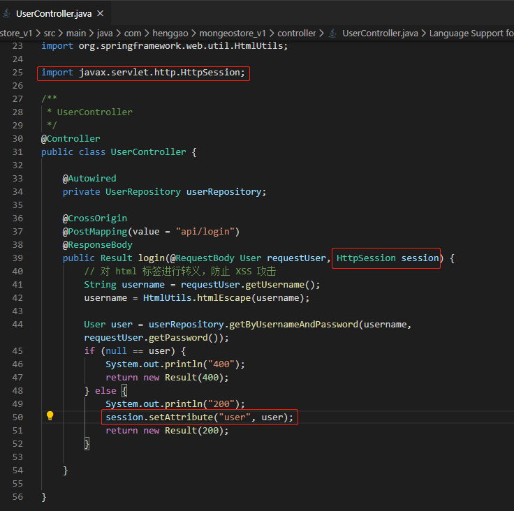
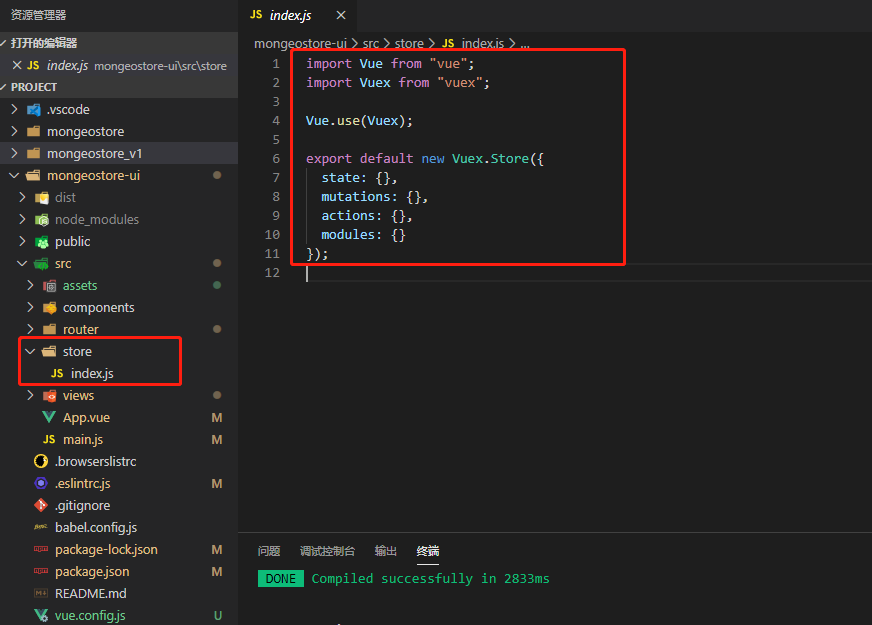
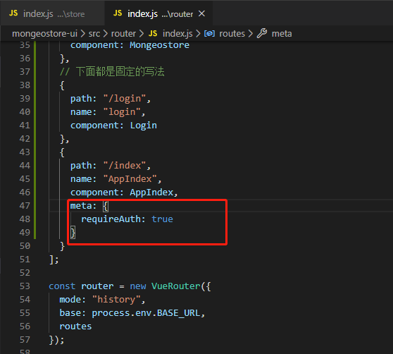
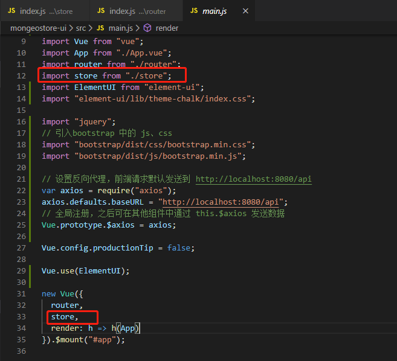
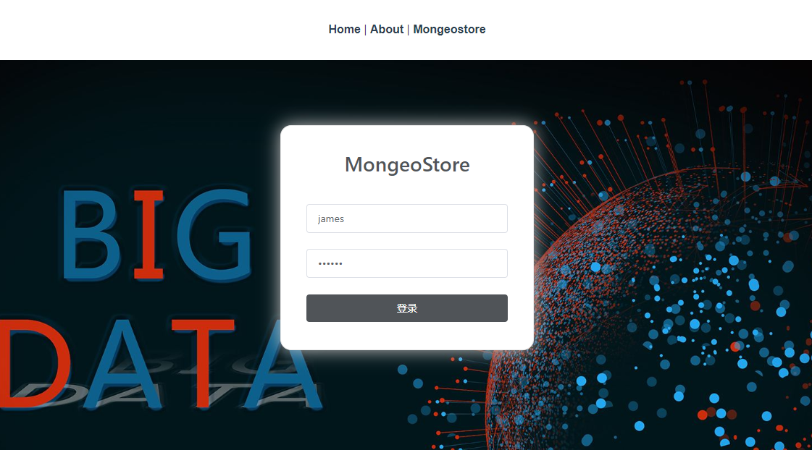

# Mongeostore

[TOC]

## 一、后端拦截器

一个简单拦截器的逻辑如下：

1.用户访问 URL，检测是否为登录页面，如果是登录页面则不拦截
2.如果用户访问的不是登录页面，检测用户是否已登录，如果未登录则跳转到登录页面

### 1、UserController

首先我们修改 `UserController` 的内容。之前我们实现了通过查询数据库验证用户名是否正确，但仅此而已。

为了保存登录状态，可以把用户信息存在 `Session` 对象中（当用户在应用程序的 Web 页之间跳转时，存储在 `Session` 对象中的变量不会丢失），这样在访问别的页面时，可以通过判断是否存在用户变量来判断用户是否登录。这是一种比较简单的方式。

修改后的代码内容如下：

```java
/*
 * @Description: henggao_learning
 * @version: v1.0.0
 * @Author: henggao
 * @Date: 2019-11-29 19:35:29
 * @LastEditors  : henggao
 * @LastEditTime : 2020-01-07 14:23:13
 */
package com.henggao.mongeostore_v1.controller;

// import java.util.Objects;

import com.henggao.mongeostore_v1.model.User;
import com.henggao.mongeostore_v1.repository.UserRepository;
import com.henggao.mongeostore_v1.result.Result;

import org.springframework.beans.factory.annotation.Autowired;
import org.springframework.stereotype.Controller;
import org.springframework.web.bind.annotation.CrossOrigin;
import org.springframework.web.bind.annotation.PostMapping;
import org.springframework.web.bind.annotation.RequestBody;
import org.springframework.web.bind.annotation.ResponseBody;
import org.springframework.web.util.HtmlUtils;

import javax.servlet.http.HttpSession;

/**
 * UserController
 */
@Controller
public class UserController {

    @Autowired
    private UserRepository userRepository;

    @CrossOrigin
    @PostMapping(value = "/api/login")
    @ResponseBody
    public Result login(@RequestBody User requestUser, HttpSession session) {
        // 对 html 标签进行转义，防止 XSS 攻击
        String username = requestUser.getUsername();
        username = HtmlUtils.htmlEscape(username);

        User user = userRepository.getByUsernameAndPassword(username, requestUser.getPassword());
        if (null == user) {
            System.out.println("400");
            return new Result(400);
        } else {
            System.out.println("200");
            session.setAttribute("user", user);
            return new Result(200);
        }

    }

}
```



### 2、UserInterceptor

新建 package 名为 `interceptor`，新建类 `LoginInterceptor`。

Interceptor 即拦截器，在 Springboot 我们可以直接继承拦截器的接口，然后实现 `preHandle` 方法。`preHandle` 方法里的代码会在访问需要拦截的页面时执行。

代码如下：

```java
/*
 * @Description: henggao_learning
 * @version: v1.0.0
 * @Author: henggao
 * @Date: 2020-01-07 14:32:59
 * @LastEditors  : henggao
 * @LastEditTime : 2020-01-07 14:47:20
 */
package com.henggao.mongeostore_v1.interceptor;

import javax.servlet.http.HttpServletRequest;
import javax.servlet.http.HttpServletResponse;
import javax.servlet.http.HttpSession;

import com.henggao.mongeostore_v1.model.User;

import org.apache.commons.lang3.StringUtils;
import org.springframework.web.servlet.HandlerInterceptor;

/**
 * UserIntercetor
 */
public class UserInterceptor implements HandlerInterceptor {
    @Override
    public boolean preHandle(HttpServletRequest httpServletRequest, HttpServletResponse httpServletResponse, Object o)
            throws Exception {
        HttpSession session = httpServletRequest.getSession();
        String contextPath = session.getServletContext().getContextPath();
        String[] requireAuthPages = new String[] { "index", };

        String uri = httpServletRequest.getRequestURI();

        uri = StringUtils.remove(uri, contextPath + "/");
        String page = uri;

        if (begingWith(page, requireAuthPages)) {
            User user = (User) session.getAttribute("user");
            if (user == null) {
                httpServletResponse.sendRedirect("login");
                return false;
            }
        }
        return true;
    }

    private boolean begingWith(String page, String[] requiredAuthPages) {
        boolean result = false;
        for (String requiredAuthPage : requiredAuthPages) {
            if (StringUtils.startsWith(page, requiredAuthPage)) {
                result = true;
                break;
            }
        }
        return result;
    }
}
```

需要在pom.xml中引入`commons-lang3`

```xml
<!-- https://mvnrepository.com/artifact/org.apache.commons/commons-lang3 -->
<dependency>
    <groupId>org.apache.commons</groupId>
    <artifactId>commons-lang3</artifactId>
    <version>3.9</version>
</dependency>
```

看起来似乎比较长，其实就是判断 session 中是否存在 user 属性，如果存在就放行，如果不存在就跳转到 login 页面。这里使用了一个路径列表（requireAuthPages），可以在里面写下需要拦截的路径。当然我们也可以拦截所有路径，那样就不用写这么多了，但会有逻辑上的问题，就是你访问了 \login 页面，仍然会需要跳转，这样就会引发多次重定向问题。


### 3、WebConfigurer

写完了拦截器，但是它却并不会生效，因为我们还没有把它配置到项目中。

新建 package 名为 `config`，新建类 `MyWebConfigurer`，代码如下：

```java
/*
 * @Description: henggao_learning
 * @version: v1.0.0
 * @Author: henggao
 * @Date: 2020-01-07 14:41:52
 * @LastEditors: henggao
 * @LastEditTime: 2020-01-07 14:47:13
 */
package com.henggao.mongeostore_v1.config;

import com.henggao.mongeostore_v1.interceptor.UserInterceptor;
import org.springframework.boot.SpringBootConfiguration;
import org.springframework.context.annotation.Bean;
import org.springframework.web.servlet.config.annotation.InterceptorRegistry;
import org.springframework.web.servlet.config.annotation.WebMvcConfigurer;

/**
 * MyWebConfigurer
 */
@SpringBootConfiguration
public class MyWebConfigurer implements WebMvcConfigurer {

    @Bean
    public UserInterceptor getUserIntercepter() {
        return new UserInterceptor();
    }

    @Override
    public void addInterceptors(InterceptorRegistry registry) {
        registry.addInterceptor(getUserIntercepter()).addPathPatterns("/**").excludePathPatterns("/index.html");
    }

}
```

通过这个配置类，我们添加了之前写好的拦截器。这里有一句非常重要的语句，即

```
registry.addInterceptor(getUserIntercepter()).addPathPatterns("/**").excludePathPatterns("/index.html");
```

这条语句的作用是对所有路径应用拦截器，除了 `/index.html`。

### 4、测试

这里报错405


## 二、Vuex与前端登录拦截器

前面我们使用了后端拦截器，但这种拦截器只有在将前后端项目整合在一起时才能生效，而前后端分离的项目实际上不推荐这么做，接下来我们尝试用前端实现相似的功能。

实现前端登录器，需要在前端判断用户的登录状态。我们可以像之前那样在组件的 data 中设置一个状态标志，但登录状态应该被视为一个全局属性，而不应该只写在某一组件中。所以我们需要引入一个新的工具——Vuex，它是专门为 Vue 开发的状态管理方案，我们可以把需要在各个组件中传递使用的变量、方法定义在这里。之前我一直没有使用它，所以在不同组件传值的问题上十分头疼，要写很多多余的代码来调用不同组件的值，所以推荐大家从一开始就去熟悉这种管理方式。

### 1、引入Vuex

在我们的项目文件夹中，运行 `npm install vuex --save`，之后，在 src 目录下新建一个文件夹 store，并在该目录下新建 index.js 文件，在该文件中引入 vue 和 vuex，代码如下：

（我这里在创建项目初已经引入了Vuex）



在 index.js 里设置我们需要的状态变量和方法。为了实现登录拦截器，我们需要一个记录用户信息的变量。为了方便日后的扩展（权限认证等），我们使用一个用户对象而不是仅仅使用一个布尔变量。同时，设置一个方法，触发这个方法时可以为我们的用户对象赋值。完整的代码如下：

```js
import Vue from "vue";
import Vuex from "vuex";

Vue.use(Vuex);

export default new Vuex.Store({
  state: {
    user: {
      username:
        window.localStorage.getItem("user" || "[]") == null
          ? ""
          : JSON.parse(window.localStorage.getItem("user" || "[]")).username
    }
  },
  mutations: {
    login(state, user) {
      state.user = user;
      window.localStorage.setItem("user", JSON.stringify(user));
    }
  },
  actions: {},
  modules: {}
});

```

### 2、修改路由配置

为了区分页面是否需要拦截，我们需要修改一下 `src\router\index.js`，在需要拦截的路由中加一条元数据，设置一个 `requireAuth` 字段如下：

```
  {
    path: "/index",
    name: "AppIndex",
    component: AppIndex,
    meta: {
      requireAuth: true
    }
```



```js
/*
 * @Description: henggao_learning
 * @version: v1.0.0
 * @Author: henggao
 * @Date: 2019-11-28 09:52:33
 * @LastEditors  : henggao
 * @LastEditTime : 2020-01-07 15:54:54
 */
import Vue from "vue";
import VueRouter from "vue-router";
import Home from "../views/Home.vue";
import Mongeostore from "../views/Mongeostore.vue";
import AppIndex from "@/views/home/AppIndex";
import Login from "@/views/Login";
Vue.use(VueRouter);

const routes = [
  {
    path: "/",
    name: "home",
    component: Home
  },
  {
    path: "/about",
    name: "about",
    // route level code-splitting
    // this generates a separate chunk (about.[hash].js) for this route
    // which is lazy-loaded when the route is visited.
    component: () =>
      import(/* webpackChunkName: "about" */ "../views/About.vue")
  },
  {
    path: "/mongeostore",
    name: "mongeostore",
    component: Mongeostore
  },
  // 下面都是固定的写法
  {
    path: "/login",
    name: "login",
    component: Login
  },
  {
    path: "/index",
    name: "AppIndex",
    component: AppIndex,
    meta: {
      requireAuth: true
    }
  }
];

const router = new VueRouter({
  mode: "history",
  base: process.env.BASE_URL,
  routes
});

export default router;

```

### 3、使用钩子函数判断是否拦截

钩子函数及在某些时机会被调用的函数。这里我们使用 `router.beforeEach()`，意思是在访问每一个路由前调用。（初始创建项目时使用了Vuex，这里自动会存在）

打开 `src\main.js` ，添加对 `store` 的引用



接着写 `beforeEach()` 函数

```js
router.beforeEach((to, from, next) => {
  if (to.meta.requireAuth) {
    if (store.state.user.username) {
      next();
    } else {
      next({
        path: "login",
        query: { redirect: to.fullPath }
      });
    }
  } else {
    next();
  }
});
```

首先判断访问的路径是否需要登录，如果需要，判断 `store` 里有没有存储 `user` 的信息，如果存在，则放行，否则跳转到登录页面，并存储访问的页面路径（以便在登录后跳转到访问页）。

完整的 main.js 代码如下：

```js
/*
 * @Description: henggao_learning
 * @version: v1.0.0
 * @Author: henggao
 * @Date: 2019-11-28 09:52:33
 * @LastEditors  : henggao
 * @LastEditTime : 2020-01-07 10:34:46
 */
import Vue from "vue";
import App from "./App.vue";
import router from "./router";
import store from "./store";
import ElementUI from "element-ui";
import "element-ui/lib/theme-chalk/index.css";

import "jquery";
// 引入bootstrap 中的 js、css
import "bootstrap/dist/css/bootstrap.min.css";
import "bootstrap/dist/js/bootstrap.min.js";

// 设置反向代理，前端请求默认发送到 http://localhost:8080/api
var axios = require("axios");
axios.defaults.baseURL = "http://localhost:8080/api";
// 全局注册，之后可在其他组件中通过 this.$axios 发送数据
Vue.prototype.$axios = axios;

Vue.config.productionTip = false;

Vue.use(ElementUI);

router.beforeEach((to, from, next) => {
  if (to.meta.requireAuth) {
    if (store.state.user.username) {
      next();
    } else {
      next({
        path: "login",
        query: { redirect: to.fullPath }
      });
    }
  } else {
    next();
  }
});

new Vue({
  router,
  store,
  render: h => h(App)
}).$mount("#app");

```

### 4、修改Login.vue

之前的登录组件中，我们只是判断后端返回的状态码，如果是 200，就重定向到首页。在经过前面的配置后，我们需要修改一下登录逻辑，以最终实现登录拦截。

修改后的逻辑如下：

1.点击登录按钮，向后端发送数据
2.受到后端返回的成功代码时，触发 store 中的 login() 方法，把 loginForm 对象传递给 store 中的 user 对象
（*这里只是简单的实现，在后端我们可以通过用户名和密码查询数据库，获得 user 表的完整信息，比如用户昵称、用户级别等，返回前端，并传递给 user 对象，以实现更复杂的功能）
3.获取登录前页面的路径并跳转，如果该路径不存在，则跳转到首页

修改后的 login() 方法如下：


```js
login() {
      var _this = this;
      console.log(this.$store.state);
      this.$axios
        .post("/login", {
          username: this.loginForm.username,
          password: this.loginForm.password
        })
        .then(successResponse => {
          if (successResponse.data.code === 200) {
            _this.$store.commit("login", _this.loginForm);
            var path = this.$route.query.redirect;
            this.$router.replace({
              path: path === "/" || path === undefined ? "/index" : path
            });
          }
        })
        // eslint-disable-next-line no-unused-vars
        .catch(failResponse => {});
    }
```

完整的 `Login.vue` 代码如下：

```vue
<!--
 * @Description: henggao_learning
 * @version: v1.0.0
 * @Author: henggao
 * @Date: 2019-11-28 14:35:59
 * @LastEditors  : henggao
 * @LastEditTime : 2020-01-07 16:05:22
 -->
<template>
  <body id="poster">
    <el-form class="login-container" label-position="left" label-width="0px">
      <h3 class="login_title">MongeoStore</h3>
      <el-form-item>
        <el-input
          type="text"
          v-model="loginForm.username"
          auto-complete="off"
          placeholder="账号"
        ></el-input>
      </el-form-item>
      <el-form-item>
        <el-input
          type="password"
          v-model="loginForm.password"
          auto-complete="off"
          placeholder="密码"
        ></el-input>
      </el-form-item>
      <el-form-item style="width: 100%">
        <el-button
          type="primary"
          style="width: 100%;background: #505458;border: none"
          v-on:click="login"
          >登录</el-button
        >
      </el-form-item>
    </el-form>
  </body>
</template>

<script>
export default {
  name: "login",
  data() {
    return {
      loginForm: {
        username: "james",
        password: "123456"
      },
      responseResult: []
    };
  },
  methods: {
    login() {
      var _this = this;
      console.log(this.$store.state);
      this.$axios
        .post("/login", {
          username: this.loginForm.username,
          password: this.loginForm.password
        })
        .then(successResponse => {
          if (successResponse.data.code === 200) {
            _this.$store.commit("login", _this.loginForm);
            var path = this.$route.query.redirect;
            this.$router.replace({
              path: path === "/" || path === undefined ? "/index" : path
            });
          }
        })
        // eslint-disable-next-line no-unused-vars
        .catch(failResponse => {});
    }
  }
};
</script>

<style>
#poster {
  background: url("../assets/img/background.jpg") no-repeat;
  background-position: center;
  height: 100%;
  width: 100%;
  background-size: cover;
  position: fixed;
}
body {
  margin: 0px;
}
.login-container {
  border-radius: 15px;
  background-clip: padding-box;
  margin: 90px auto;
  width: 350px;
  padding: 35px 35px 15px 35px;
  background: #fff;
  border: 1px solid #eaeaea;
  box-shadow: 0 0 25px #cac6c6;
}

.login_title {
  margin: 0px auto 40px auto;
  text-align: center;
  color: #505458;
}
</style>

```

### 5、测试

同时运行前后端项目，访问 http://localhost:80/index ，发现页面直接跳转到了http://localhost/login?redirect=%2Findex



