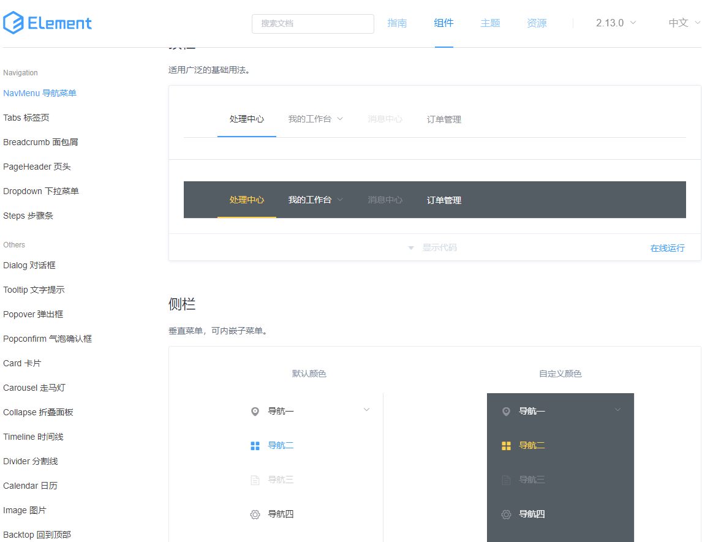
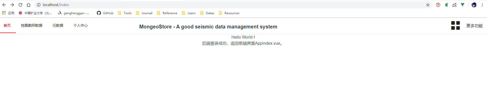
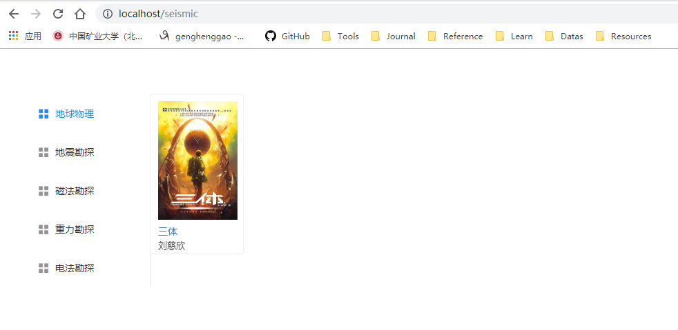

# Mongostore

[TOC]

## 一、导航栏的实现

### 1.路由配置

1、把导航栏放在其它页面的父页面中（对 Vue 来说就是父组件），之前我们讲过，`App.vue` 是所有组件的父组件，但把导航栏放进去不合适，因为我们的登录页面中不应该显示导航栏。

为了解决这个问题，修改 `components` 目录下 `Home.vue`，代码如下：

```vue
<!--
 * @Description: henggao_learning
 * @version: v1.0.0
 * @Author: henggao
 * @Date: 2019-11-28 09:52:33
 * @LastEditors: henggao
 * @LastEditTime: 2020-01-07 20:13:10
 -->
<template>
  <div>
    <router-view />
  </div>
</template>

<script>
export default {
  name: "Home"
};
</script>

<style scoped></style>

```

这里和 `App.vue` 一样，写入了一个 `<router-view />`，也就是子页面（组件）显示的地方。

2、建立路由的父子关系。注意我们在一个组件中通过导入引用了其它组件，也可以称之为父子组件，但想要通过 `<router-view />` 控制子组件的显示，则需要进行路由的相关配置。

打开 `router/index.js` ，修改代码如下

```js
/*
 * @Description: henggao_learning
 * @version: v1.0.0
 * @Author: henggao
 * @Date: 2019-11-28 09:52:33
 * @LastEditors  : henggao
 * @LastEditTime : 2020-01-07 20:15:20
 */
import Vue from "vue";
import VueRouter from "vue-router";
import Home from "../views/Home.vue";
import Mongeostore from "../views/Mongeostore.vue";
import Login from "@/views/Login";
import AppIndex from "@/views/home/AppIndex";

Vue.use(VueRouter);

const routes = [
  {
    path: "/home",
    name: "Home",
    component: Home,
    // home页面并不需要被访问
    redirect: "/index",
    children: [
      {
        path: "/index",
        name: "AppIndex",
        component: AppIndex,
        meta: {
          requireAuth: true
        }
      }
    ]
  },
  {
    path: "/about",
    name: "About",
    // route level code-splitting
    // this generates a separate chunk (about.[hash].js) for this route
    // which is lazy-loaded when the route is visited.
    component: () =>
      import(/* webpackChunkName: "about" */ "../views/About.vue")
  },
  {
    path: "/mongeostore",
    name: "Mongeostore",
    component: Mongeostore
  },
  // 下面都是固定的写法
  {
    path: "/login",
    name: "login",
    component: Login
  }
  // {
  //   path: "/index",
  //   name: "AppIndex",
  //   component: AppIndex,
  //   meta: {
  //     requireAuth: true
  //   }
  // },
];

const router = new VueRouter({
  mode: "history",
  base: process.env.BASE_URL,
  routes
});

export default router;

```

注意我们并没有把首页的访问路径设置为 `/home/index`，仍然可以通过 `/index` 访问首页，这样配置其实是感受不到 `/home` 这个路径的存在的。之后再添加新的页面，可以直接在 `children` 中增添对应的内容。

### 2.使用 NavMenu 组件

1、打开 Element 的文档，找到 NavMenu 组件相关内容

https://element.eleme.cn/#/zh-CN/component/menu



2、我们在 `components` 文件夹里新建一个 `common` 文件夹，用来存储公共的组件，并在该文件夹新建一个组件 `NavMenu.vue`，经过我修改的代码如下：

```vue
<!--
 * @Description: henggao_learning
 * @version: v1.0.0
 * @Author: henggao
 * @Date: 2020-01-07 19:27:05
 * @LastEditors  : henggao
 * @LastEditTime : 2020-01-07 21:57:55
 -->
<template>
  <el-menu
    :default-active="'/index'"
    router
    mode="horizontal"
    background-color="white"
    text-color="#222"
    active-text-color="red"
    style="min-width: 1300px"
  >
    <el-menu-item v-for="(item, i) in navList" :key="i" :index="item.name">{{
      item.navItem
    }}</el-menu-item>
    <a href="#nowhere" style="color: #222;float: right;padding: 20px;"
      >更多功能</a
    >
    <i
      class="el-icon-menu"
      style="float:right;font-size: 45px;color: #222;padding-top: 8px"
    ></i>
    <span
      style="position: absolute;padding-top: 20px;right: 43%;font-size: 20px;font-weight: bold"
      >MongeoStore - A good seismic data management system</span
    >
  </el-menu>
</template>

<script>
export default {
  name: "NavMenu",
  data() {
    return {
      navList: [
        { name: "/index", navItem: "首页" },
        { name: "/seismic", navItem: "地震勘探数据" },
        { name: "/Metadata", navItem: "元数据" },
        { name: "/admin", navItem: "个人中心" }
      ]
    };
  }
};
</script>

<style scoped>
a {
  text-decoration: none;
}

span {
  pointer-events: none;
}
</style>

```

- 在` <el-menu>` 标签中我们开启了 router 模式，在 Element 文档中的解释如下：

- 通过 v-for 指令，把 navList 数组渲染为一组 `<el-menu-item> `元素，也即导航栏的内容。当然我们也可以分开写，这种用法只是显得 six 一些（当需要动态更改列表内容时就很有用了）


接下来，我们需要把这个组件放在 `Home.vue` 中。

修改 `Home.vue` 的代码如下：

```vue
/* eslint-disable vue/no-unused-components */
<!--
 * @Description: henggao_learning
 * @version: v1.0.0
 * @Author: henggao
 * @Date: 2019-11-28 09:52:33
 * @LastEditors  : henggao
 * @LastEditTime : 2020-01-07 21:50:15
 -->
<template>
  <div class="home">
    <nav-menu></nav-menu>
    <router-view />
  </div>
</template>

<script>
// @ is an alias to /src
import NavMenu from "@/components/common/NavMenu";
export default {
  name: "Home",
  components: { NavMenu }
};
</script>

<style scoped></style>

```

浏览器 访问：http://localhost:80/index 



## 二、地震资料管理页面

### 1、SeismicIndex.vue

1、在 `views` 中新建文件夹 `seismic`，新建组件 `SeismicIndex.vue`，作为地震资料页面的根组件，代码如下

```vue
<!--
 * @Description: henggao_learning
 * @version: v1.0.0
 * @Author: henggao
 * @Date: 2020-01-07 21:31:34
 * @LastEditors  : henggao
 * @LastEditTime : 2020-01-07 21:34:21
 -->
<template>
  <el-container>
    <el-aside style="width: 200px;margin-top: 20px">
      <switch></switch>
      <!--<SideMenu></SideMenu>-->
    </el-aside>
    <el-main>
      <!--<books></books>-->
    </el-main>
  </el-container>
</template>

<script>
export default {
  name: "AppSeismic"
};
</script>

<style scoped></style>

```

这里使用了 Element 提供的 Container 布局容器，把整个页面分为了侧边栏和主要区域两个部分。

2、接下来我们配置这个页面的路由，修改 `router/index.js` 代码如下：

```js
/*
 * @Description: henggao_learning
 * @version: v1.0.0
 * @Author: henggao
 * @Date: 2019-11-28 09:52:33
 * @LastEditors  : henggao
 * @LastEditTime : 2020-01-07 22:30:48
 */
import Vue from "vue";
import VueRouter from "vue-router";
import Home from "../views/Home.vue";
import Mongeostore from "../views/Mongeostore.vue";
import Login from "@/views/Login";
import AppIndex from "@/views/home/AppIndex.vue";
import SeismicIndex from "@/views/seismic/SeismicIndex.vue";

Vue.use(VueRouter);

const routes = [
  {
    path: "/",
    name: "Home",
    component: Home,
    // home页面并不需要被访问
    redirect: "/index",
    children: [
      {
        path: "/index",
        name: "AppIndex",
        component: AppIndex,
        meta: {
          requireAuth: true
        }
      }
    ]
  },
  {
    path: "/about",
    name: "About",
    // route level code-splitting
    // this generates a separate chunk (about.[hash].js) for this route
    // which is lazy-loaded when the route is visited.
    component: () =>
      import(/* webpackChunkName: "about" */ "../views/About.vue")
  },
  {
    path: "/mongeostore",
    name: "Mongeostore",
    component: Mongeostore
  },
  // 下面都是固定的写法
  {
    path: "/login",
    name: "Login",
    component: Login
  },
  // {
  //   path: "/index",
  //   name: "AppIndex",
  //   component: AppIndex,
  //   meta: {
  //     requireAuth: true
  //   }
  // },
  {
    path: "/seismic",
    name: "Seismic",
    component: SeismicIndex,
    meta: {
      requireAuth: true
    }
  }
];

const router = new VueRouter({
  mode: "history",
  base: process.env.BASE_URL,
  routes
});

export default router;

```

### 2、SideMenu.vue

1、编写一个侧边栏组件。在 `components`中新建文件夹 `seismic`，新建组件 `SideMenu.vue`，代码如下

```vue
<!--
 * @Description: henggao_learning
 * @version: v1.0.0
 * @Author: henggao
 * @Date: 2020-01-07 21:44:37
 * @LastEditors  : henggao
 * @LastEditTime : 2020-01-08 10:21:15
 -->
<template>
  <el-menu
    class="categories"
    default-active="0"
    @select="handleSelect"
    active-text-color="#0099FF"
  >
    <el-menu-item index="0">
      <i class="el-icon-menu"></i>
      <span slot="title">地球物理</span>
    </el-menu-item>
    <el-menu-item index="1">
      <i class="el-icon-menu"></i>
      <span slot="title">地震勘探</span>
    </el-menu-item>
    <el-menu-item index="2">
      <i class="el-icon-menu"></i>
      <span slot="title">磁法勘探</span>
    </el-menu-item>
    <el-menu-item index="3">
      <i class="el-icon-menu"></i>
      <span slot="title">重力勘探</span>
    </el-menu-item>
    <el-menu-item index="4">
      <i class="el-icon-menu"></i>
      <span slot="title">电法勘探</span>
    </el-menu-item>
  </el-menu>
</template>

<script>
export default {
  name: "SideMenu"
};
</script>

<style scoped>
.categories {
  position: fixed;
  margin-left: 30%;
  left: -600px;
  top: 65px;
  width: 250px;
}
</style>

```

2、在`SeismicIndex.vue`中使用这个组件

```vue
<template>
  <el-container>
    <el-aside style="width: 200px;margin-top: 20px">
      <switch></switch>
      <SideMenu></SideMenu>
    </el-aside>
    <el-main>
    </el-main>
  </el-container>
</template>

<script>
import SideMenu from "@/components/seismic/SideMenu";
export default {
  name: "AppSeismic",
  components: { SideMenu }
};
</script>

<style scoped></style>
```


### 3、Book.vue

```vue
<template>
  <div class="content">
    <el-row style="height: 840px;">
      <!--<search-bar></search-bar>-->
      <el-tooltip
        effect="dark"
        placement="right"
        v-for="item in books"
        :key="item.id"
      >
        <p slot="content" style="font-size: 14px;margin-bottom: 6px;">
          {{ item.title }}
        </p>
        <p slot="content" style="font-size: 13px;margin-bottom: 6px">
          <span>{{ item.author }}</span> / <span>{{ item.date }}</span> /
          <span>{{ item.press }}</span>
        </p>
        <p slot="content" style="width: 300px" class="abstract">
          {{ item.abs }}
        </p>
        <el-card
          style="width: 135px;margin-bottom: 20px;height: 233px;float: left;margin-right: 15px"
          class="book"
          bodyStyle="padding:10px"
          shadow="hover"
        >
          <div class="cover">
            
          </div>
          <div class="info">
            <div class="title">
              <a href>{{ item.title }}</a>
            </div>
          </div>
          <div class="author">{{ item.author }}</div>
        </el-card>
      </el-tooltip>
    </el-row>
    <el-row>
      <el-pagination
        :current-page="1"
        :page-size="10"
        :total="20"
      ></el-pagination>
    </el-row>
  </div>
</template>

<script>
export default {
  name: "Books",
  data() {
    return {
      books: [
        {
          cover: "https://i.loli.net/2019/04/10/5cada7e73d601.jpg",
          title: "三体",
          author: "刘慈欣",
          date: "2019-05-05",
          press: "重庆出版社",
          abs:
            "文化大革命如火如荼进行的同时。军方探寻外星文明的绝秘计划“红岸工程”取得了突破性进展。但在按下发射键的那一刻，历经劫难的叶文洁没有意识到，她彻底改变了人类的命运。地球文明向宇宙发出的第一声啼鸣，以太阳为中心，以光速向宇宙深处飞驰……"
        }
      ]
    };
  }
};
</script>

<style scoped>
.content {
  margin-top: 45px;
}
.cover {
  width: 115px;
  height: 172px;
  margin-bottom: 7px;
  overflow: hidden;
  cursor: pointer;
}

img {
  width: 115px;
  height: 172px;
  /*margin: 0 auto;*/
}

.title {
  font-size: 14px;
  text-align: left;
}

.author {
  color: #333;
  width: 102px;
  font-size: 13px;
  margin-bottom: 6px;
  text-align: left;
}

.abstract {
  display: block;
  line-height: 17px;
}

a {
  text-decoration: none;
}

a:link,
a:visited,
a:focus {
  color: #3377aa;
}
</style>

```

浏览器访问http://localhost/seismic



- 咦，我们的导航栏去哪儿了？