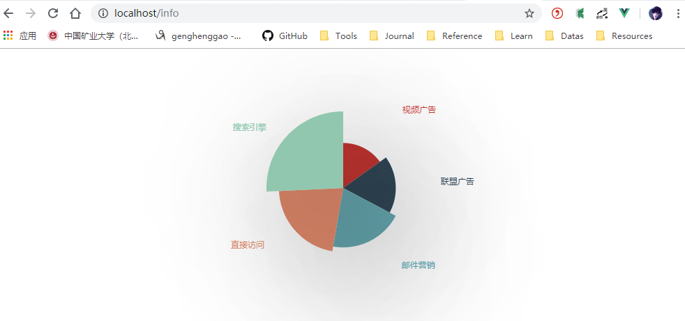

# Echarts

[TOC]

- 2010.1.9

## 一、ECharts 初体验

### 1、安装echarts依赖

```
npm install echarts --save
```

### 2、在main.js中引入

全局引入所有的echarts图表打包（导致体积过大，我们还可以采用按需引入的方式）

```
import echarts from "echarts";
Vue.prototype.$echarts = echarts;
```


### 3、测试

#### 1、Info.vue

在Info.vue中使用

```vue
<template>
  <div>
    <div id="main" ref="chart"></div>
  </div>
</template>

<script>
var echarts = require("echarts");
export default {
  name: "info",
  data() {
    return {
      data: "",
      a: "g"
    };
  },
  mounted() {
    let mychart = echarts.init(this.$refs.chart);
    mychart.showLoading();
    setTimeout(function() {
      let self = this;
      self.data = {
        series: [
          {
            name: "访问来源",
            type: "pie",
            radius: "55%",
            roseType: "angle",
            backgroundColor: "#2c343c",
            itemStyle: {
              // 阴影的大小
              shadowBlur: 200,
              // 阴影水平方向上的偏移
              shadowOffsetX: 30,
              // 阴影垂直方向上的偏移
              shadowOffsetY: 40,
              emphasis: { shadowBlur: 800 },
              // 阴影颜色
              shadowColor: "rgba(0, 0, 0, 0.5)"
            },
            textStyle: {
              color: "rgba(255, 255, 255, 0.3)"
            },
            labelLine: {
              lineStyle: {
                color: "rgba(255, 255, 255, 0.3)"
              }
            },
            // 高亮样式。
            emphasis: {
              itemStyle: {
                // 高亮时点的颜色。
                color: "blue"
              },
              label: {
                show: true,
                // 高亮时标签的文字。
                color: "black"
              }
            },
            data: [
              { value: 235, name: "视频广告" },
              { value: 274, name: "联盟广告" },
              { value: 310, name: "邮件营销" },
              { value: 335, name: "直接访问" },
              { value: 400, name: "搜索引擎" }
            ]
          }
        ]
      };
      mychart.hideLoading();
      mychart.setOption(this.data);
    }, 3000);
    console.log(this.a);
    console.log(this.data);
  }
};
</script>

<!-- Add "scoped" attribute to limit CSS to this component only -->
<style scoped>
#main {
  width: 600px;
  height: 400px;
  /* background-color:black;  */
  margin: 0 auto;
}
</style>

```

#### 2、浏览器查看




## 二、ECharts GL 三维可视化

ECharts GL 实现三维可视化

### 1、安装 ECharts GL

```
npm install echarts-gl -S
```

### 2、在main.js中引入

```
import "echarts-gl";
```


### 3、测试

#### 1、MetaData.vue

```vue
<!--
 * @Description: henggao_learning
 * @version: v1.0.0
 * @Author: henggao
 * @Date: 2020-01-08 15:22:41
 * @LastEditors  : henggao
 * @LastEditTime : 2020-01-10 09:00:34
 -->
<template>
  <div>
    <div id="main" ref="chart1"></div>
    <br />
    <div id="mapContainer" ref="chart2"></div>
  </div>
</template>

<script>
var echarts = require("echarts");
export default {
  name: "metadata",
  data() {
    return {
      data: {
        title: {
          text: "ECharts 入门示例"
        },
        tooltip: {},
        xAxis: {
          data: ["衬衫", "羊毛衫", "雪纺衫", "裤子", "高跟鞋", "袜子"]
        },
        yAxis: {},
        series: [
          {
            name: "销量",
            type: "bar",
            data: [5, 20, 36, 10, 10, 20]
          }
        ]
      }
    };
  },
  methods: {
    makeGaussian(amplitude, x0, y0, sigmaX, sigmaY) {
      return function(amplitude, x0, y0, sigmaX, sigmaY, x, y) {
        var exponent = -(
          Math.pow(x - x0, 2) / (2 * Math.pow(sigmaX, 2)) +
          Math.pow(y - y0, 2) / (2 * Math.pow(sigmaY, 2))
        );
        return amplitude * Math.pow(Math.E, exponent);
      }.bind(null, amplitude, x0, y0, sigmaX, sigmaY);
    },
    getData() {
      // 创建一个高斯分布函数
      var gaussian = this.makeGaussian(50, 0, 0, 20, 20);

      var data = [];
      for (var i = 0; i < 1000; i++) {
        // x, y 随机分布
        var x = Math.random() * 100 - 50;
        var y = Math.random() * 100 - 50;
        var z = gaussian(x, y);
        data.push([x, y, z]);
      }
      var option = {
        title: {
          text: "ECharts GL"
        },
        // 需要注意的是我们不能跟 grid 一样省略 grid3D
        grid3D: {},
        // 默认情况下, x, y, z 分别是从 0 到 1 的数值轴
        xAxis3D: {},
        yAxis3D: {},
        zAxis3D: { max: 100 },
        series: [
          {
            type: "scatter3D",
            data: data
          }
        ]
      };
      var myChart = this.$echarts.init(document.getElementById("mapContainer"));
      myChart.setOption(option);
    }
  },
  mounted() {
    echarts.init(this.$refs.chart1).setOption(this.data);
    this.getData();
  }
};
</script>

<!-- Add "scoped" attribute to limit CSS to this component only -->
<style scoped>
#main,
#mapContainer {
  width: 600px;
  height: 400px;
  background-color: blanchedalmond;
  margin: auto;
}
</style>

```

### 4、浏览器查看


参考：

https://blog.csdn.net/cygdxcw/article/details/89045919

