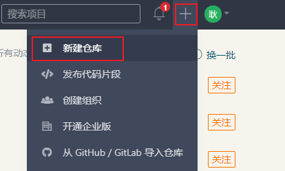
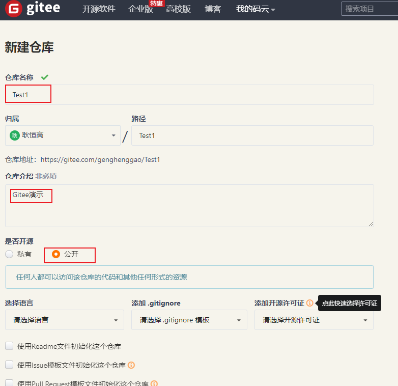
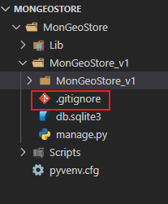
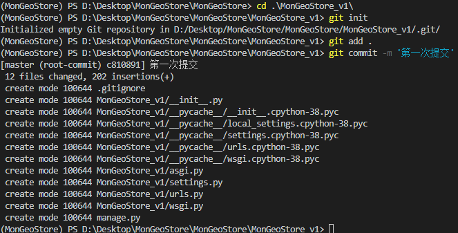
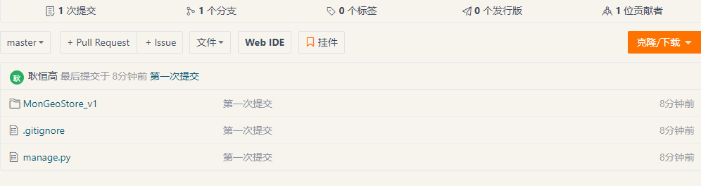
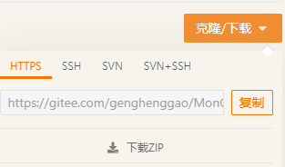

# 提交到远程仓库gitee

[TOC]

## 1. 创建远程仓库

1. 访问gitee：https://gitee.com/，新建仓库



2. 创建项目，输入项目名，其他默认默认即可，创建

   


## 2. 本地代码推送到gitee

- 让gitee忽略一些文件，创建`.gitignore`文件



- 输入忽略的配置

```
#vscode
.vscode/

__pycache__/
*.py[cod]
*$py.class

#Django stuff:
local_settings.py
*.sqlite3

```

- 管理项目

  ```
  #初始化项目
  git init
  
  #提交到本地
  git add .
  
  git commit -m '第一次提交'
  ```

  

- git本地项目推送到远程仓库，第一次需要输入用户名及密码

```
git remote add origin https://用户名:密码@gitee.com/用户名/项目名.git

git push origin master
```



以后操作

```
git add .

git commit -m '第一次提交'

git push origin master
```


## 3. 测试获取代码




```
git clone https://gitee.com/genghenggao/MonGeoStore_v1.git
```

