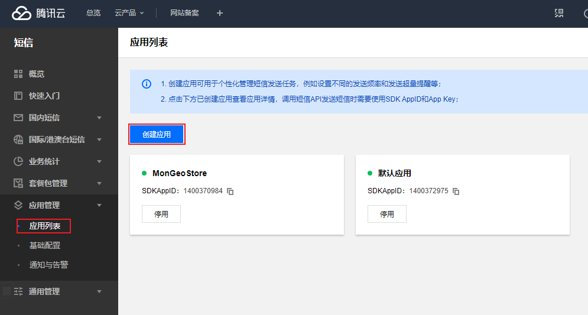
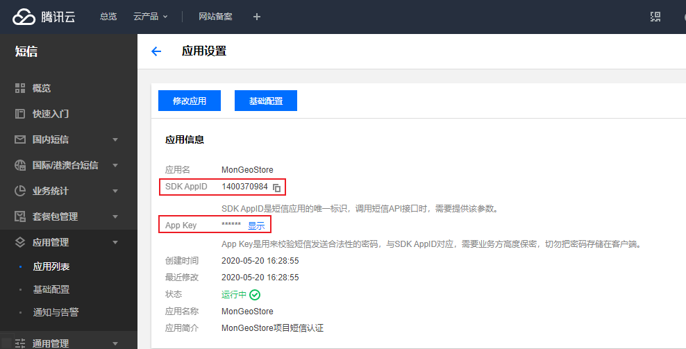
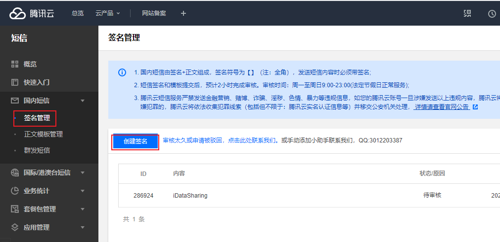
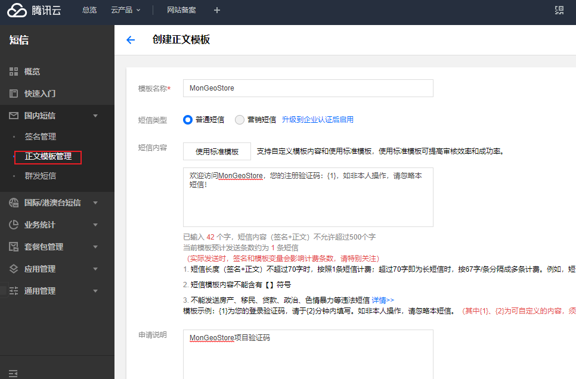
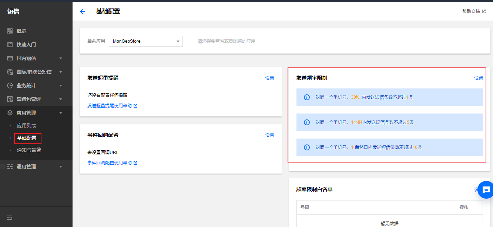

# 腾讯短信验证

[TOC]

- 腾讯短信验证
- Django的MofdelForm

- redis

- 注册逻辑设计


## 1、虚拟环境中模块版本

```
#生成安装模块的版本
pip freeze > requirements.txt

#安装对应版本的模块
pip install -r requirements.txt
```


## 2、腾讯发短信

### 1.注册腾讯云

注册地址：https://cloud.tencent.com/

### 2.开通云短信

开通地址：https://console.cloud.tencent.com/smsv2

### 3.创建应用

创建应用并将应用中生成的 `SDK AppID`和 `App Key` 复制下来，之后通过python发送短信时需要用到。





### 4.创建签名

在腾讯云短信签名时需要认证，认证需要填写签名类型：网站、APP、小程序、公众号，前三种需要提供企业资质等复杂的东西，个人公众号认证会比较便捷，所以推荐个人开发的话使用 公众号 进行签名。

#### 4.1 申请微信订阅号

注册地址：https://mp.weixin.qq.com/

选择订阅号


### 4.2创建签名

根据自己的需求选择 国内短信/国际短信 中的签名管理，进行创建签名。

**切记**：签名类型选择 公众号 ，并根据提示上传相关数据即可。

签名创建并审核通过后，把你提交的 `签名内容` 值保存下来，之后Python发送短信用。



### 5.创建模板

根据自己需求创建短信模板，以后根据模板进行发送短信，例如：*您的注册验证码：{1}，如非本人操作，请忽略本短信！*

模板创建并审核通过之后，把 `模板ID` 保存下来，之后Python发送短信用。



### 6.发送短信

上述的准备工作完成，我们开通相关服务并获取到如下几个值：

- 创建应用，获取到 `appid` 和 `appkey`
- 创建签名，获取 `签名内容`
- 创建模板，获取 `模板ID`

#### 

### 7. 关于频率限制

腾讯云短信后台可以进行短信频率 的限制。

但是，由于我们是免费用户所以无法进行设置，只能使用默认的配置（30秒发1条/1小时发5条/1天发10条）。




参考：https://pythonav.com/wiki/detail/10/81/