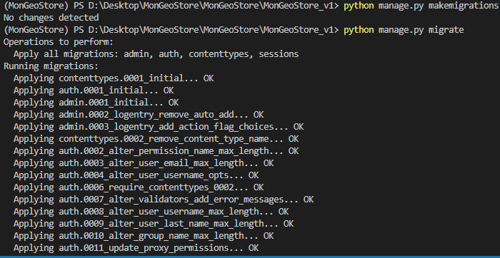
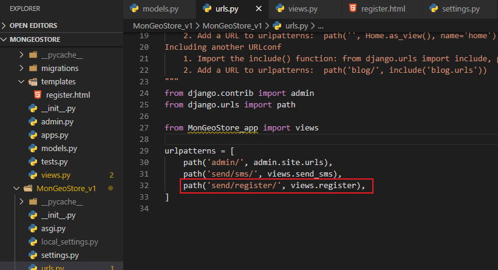
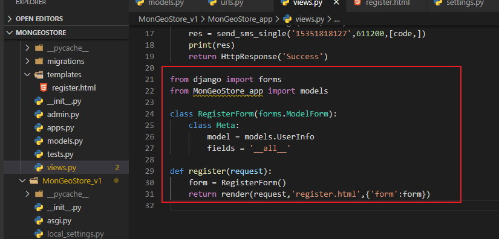
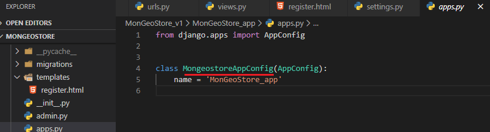
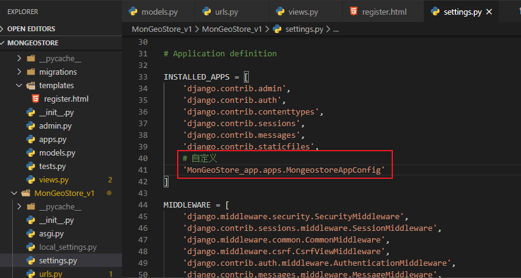
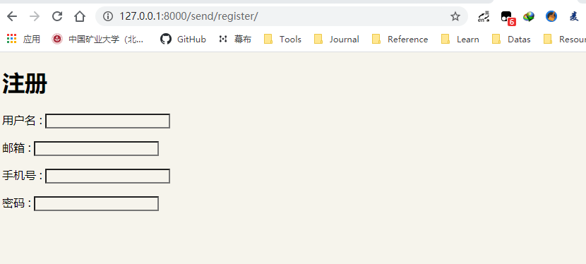
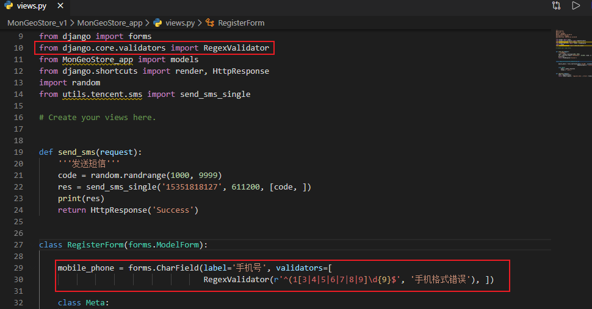
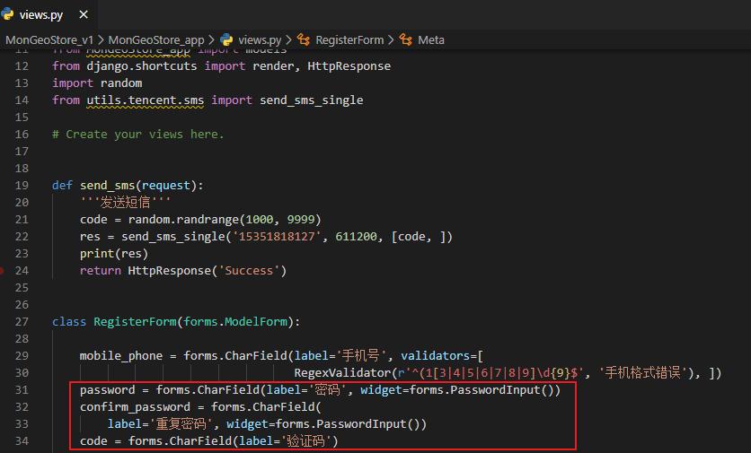
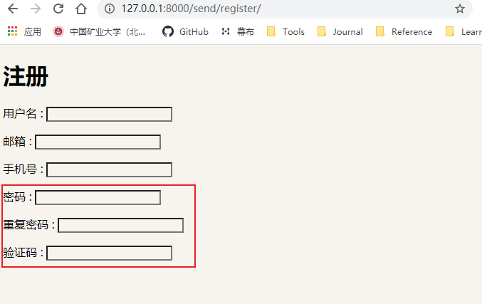

# ModelForm生成注册字段

[TOC]

## Django生成

1. 添加信息

- models.py

```
from django.db import models

# Create your models here.


class UserInfo(models.Model):
    username = models.CharField(verbose_name='用户名', max_length=32)
    email = models.EmailField(verbose_name='邮箱', max_length=32)
    mobile_phone = models.CharField(verbose_name='手机号', max_length=32)
    password = models.CharField(verbose_name='密码', max_length=32)

```

2. 生成表

```
python manage.py makemigrations

python manage.py migrate
```



每当需要修改“MonGeoStore_v1”管理的数据时，都采取如下三个步骤：

- 修改models.py；

- 对MonGeoStore_app调用makemigrations；

- 让Django迁移项目。

3. 修改urls.py

   ```
   path('send/register/', views.register),
   ```
   
   

4. 修改views.py

   ```
   from django import forms
   from MonGeoStore_app import models
   
   class RegisterForm(forms.ModelForm):
       class Meta:
           model = models.UserInfo
           fields = '__all__'
           
   def register(request):
       form = RegisterForm()
       return render(request,'register.html',{'form':form})
   ```

   

5. 创建模板，可以放在根目录，建议放在每个app里

   - MonGeoStore_app/template/register.html

     ```
     <!DOCTYPE html>
     <html lang="en">
     
     <head>
         <meta charset="UTF-8">
         <meta name="viewport" content="width=device-width, initial-scale=1.0">
         <title>Document</title>
     </head>
     
     <body>
         <h1>注册</h1>
         
         <p>{{field.label}} : {{field}}</p>
         
     </body>
     
     </html>
     ```

     

6. 设置settings.py

   - 查看app.py

     

   - 在settings.py中自定义内容

   ```
       # 自定义
       'MonGeoStore_app.apps.MongeostoreAppConfig'
   ```

   

   

   默认是从django的根目录中寻找模板，没有的话按settings中app注册顺序寻找

7. 启动程序查看

   访问：http://127.0.0.1:8000/send/register/



8. 手机号正则表达式

   在models.py中的设置，views.py进行设置，如果有则覆盖，没有则生成

- views.py	

```
from django.core.validators import RegexValidator

mobile_phone = forms.CharField(label='手机号',validators=[RegexValidator(r'^(1[3|4|5|6|7|8|9]\d{9}$','手机格式错误'),])
   
```



9.密码

- 密码密文

- views.py

  ```
      password = forms.CharField(label='密码', widget = forms.PasswordInput())
  ```

10.添加验证码

```
code = forms.CharField(label='验证码')
```



查看

