# 使用BootStrap美化页面

[TOC]

## 1. 使用Bootstrap

1. 引入BootStrap CDN

访问https://www.bootcdn.cn/twitter-bootstrap/，找到选用的版本

```
<link href="https://cdn.bootcdn.net/ajax/libs/twitter-bootstrap/4.5.0/css/bootstrap-grid.css" rel="stylesheet">
 
```

2. 表单模板

找到[表单模板](https://v4.bootcss.com/docs/components/forms/)，选用一个

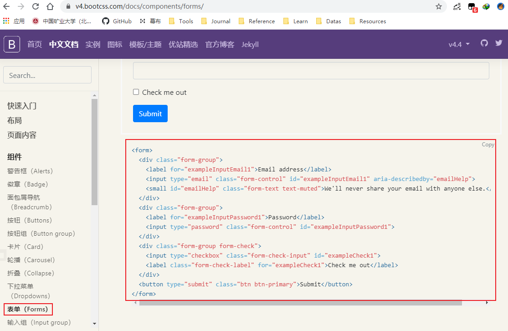

3.修改register.html

```
<!--
 * @Description: 
 * @Version: 1.0
 * @Autor: Henggao
 * @Date: 2020-05-22 10:09:02
 * @LastEditors: Henggao
 * @LastEditTime: 2020-05-24 09:28:33
--> 
<!DOCTYPE html>
<html lang="en">

<head>
    <meta charset="UTF-8">
    <meta name="viewport" content="width=device-width, initial-scale=1.0">
    <title>Document</title>
    <link href="https://cdn.bootcdn.net/ajax/libs/twitter-bootstrap/4.5.0/css/bootstrap-grid.css" rel="stylesheet">
    <style>
        .account{
            width: 600px;
            margin: 0 auto;
        }
    </style>
</head>

<body>
    <div class="account">
        <h1>注册</h1>
        <form>
            
            <div class="form-group">
              <label for="{{field.id_for_label}}">{{field.label}}</label>
              <input type="email" class="form-control" id="exampleInputEmail1" placeholder="Email">
            </div>
            
            <button type="submit" class="btn btn-default">注 册</button>
        </form>

    </div>

</body>

</html>
```

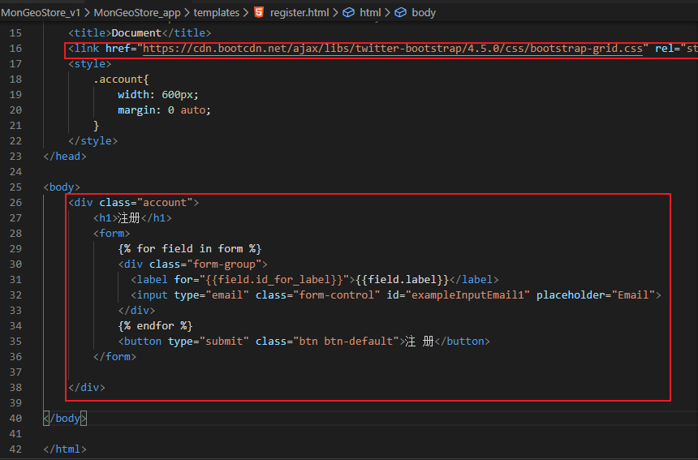

刷新页面

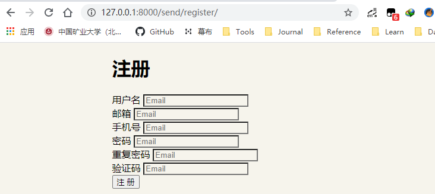

4. 但是我们想要的样式还没有体现，在RegisterForm中进行设置

   

- 修改register.html

  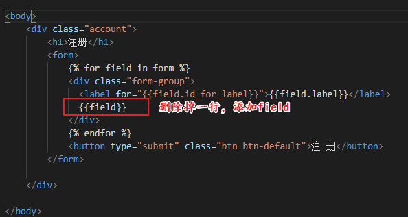

- 修改views.py，这里以重复密码为例

  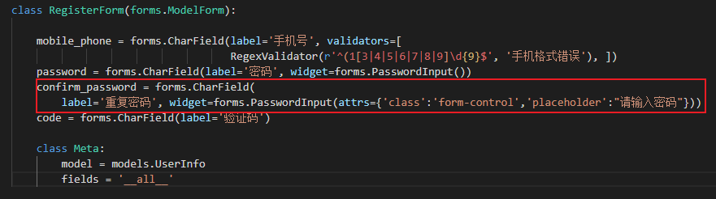

- 刷新查看

  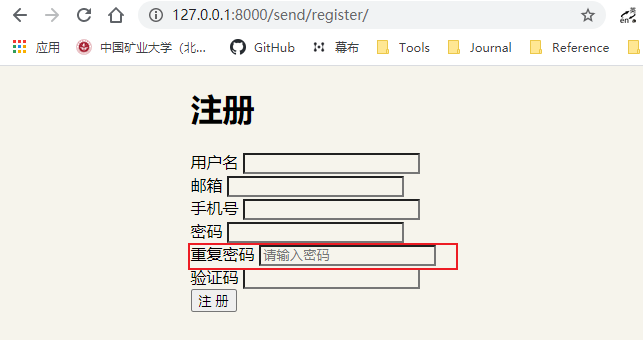

- 如果每个都这样写会很麻烦，可以重写`__init__`

  ```
  class RegisterForm(forms.ModelForm):
  
      mobile_phone = forms.CharField(label='手机号', validators=[
                                     RegexValidator(r'^(1[3|4|5|6|7|8|9]\d{9}$', '手机格式错误'), ])
      password = forms.CharField(label='密码', widget=forms.PasswordInput(
          ))
      confirm_password = forms.CharField(
          label='重复密码', widget=forms.PasswordInput())
      code = forms.CharField(label='验证码', widget=forms.PasswordInput(
          ))
  
      class Meta:
          model = models.UserInfo
          fields = '__all__'
  
      def __init__(self,*args,**kwargs):
          super().__init__(*args,**kwargs)
          for name,field in self.fields.items():
              field.widget.attrs['class'] = 'form-control'
              field.widget.attrs['placeholder'] = '请输入%s' %(field.label,)
  
  ```

  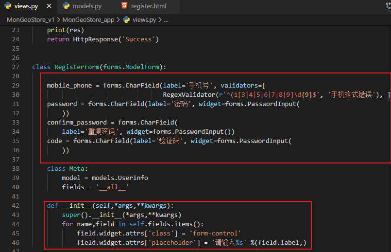

- 查看

  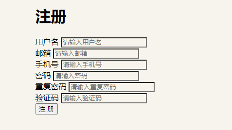

- 样式不美观是因为我导入了4.5，导入Bootstrap4.4

```
<link rel="stylesheet" href="https://cdn.jsdelivr.net/npm/bootstrap@4.4.1/dist/css/bootstrap.min.css" integrity="sha384-Vkoo8x4CGsO3+Hhxv8T/Q5PaXtkKtu6ug5TOeNV6gBiFeWPGFN9MuhOf23Q9Ifjh" crossorigin="anonymous">
```

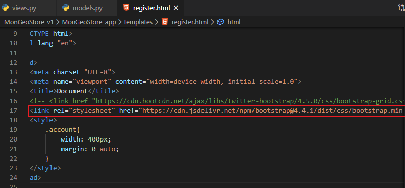

查看

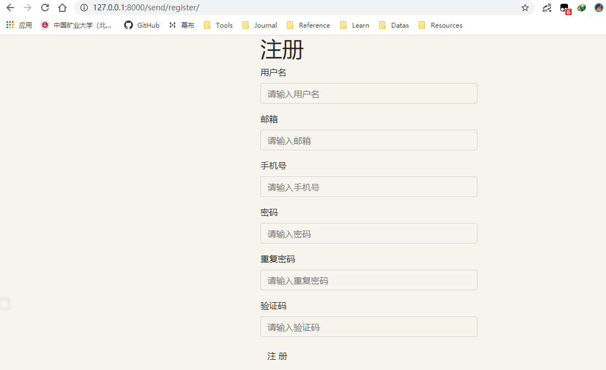

## 2. 验证码判断

验证码应该有一个按钮，进行一个判断

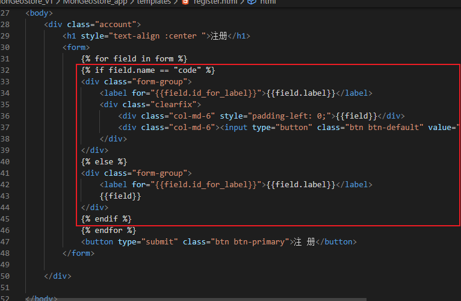

```
<body>
    <div class="account">
        <h1 style="text-align :center ">注册</h1>
        <form>
            
            
            <div class="form-group">
                <label for="{{field.id_for_label}}">{{field.label}}</label>
                <div class="clearfix">
                    <div class="col-md-6" style="padding-left: 0;">{{field}}</div>
                    <div class="col-md-6"><input type="button" class="btn btn-default" value="点击获取验证码"></div>
                </div>
            </div>
            
            <div class="form-group">
                <label for="{{field.id_for_label}}">{{field.label}}</label>
                {{field}}
            </div>
            
            
            <button type="submit" class="btn btn-primary">注 册</button>
        </form>

    </div>

</body>
```

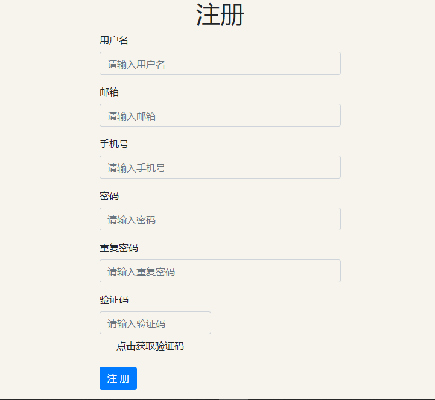

## 3. 顺序问题

- 手机号一般和验证码在一起。

- 一般是按models.py、views.py里设置的顺序，如果想自定义，可以修改views.py

  - views.py

    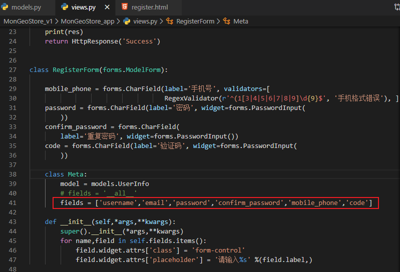

    ```
     fields = ['username','email','password','confirm_password','mobile_phone','code']
    ```

  

- 可以发现手机号已经移动到下面了

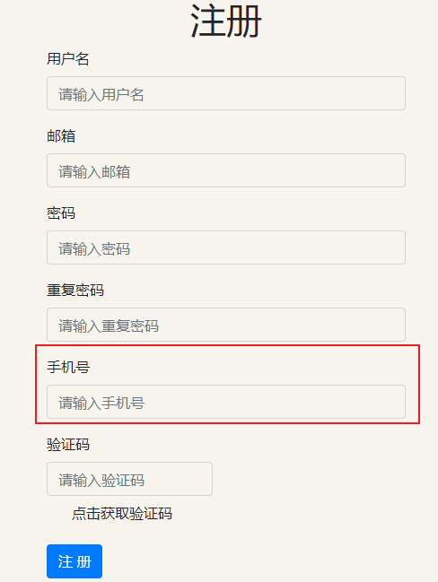