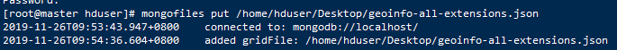
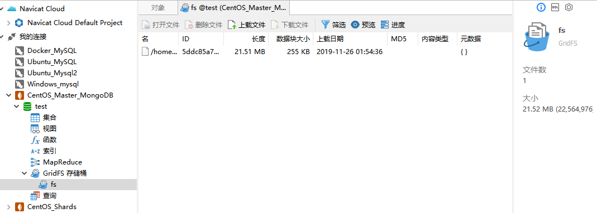
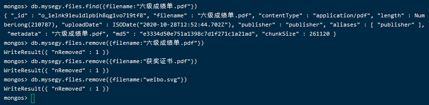

# GridFS

[TOC]

## 一、GridFS简介

- Instead of storing a file in a single document, GridFS divides the file into parts, or chunks [[1\]](https://docs.mongodb.com/manual/core/gridfs/#chunk-disambiguation), and stores each chunk as a separate document. By default, GridFS uses a default chunk size of 255 kB; that is, GridFS divides a file into chunks of 255 kB with the exception of the last chunk.  

- In MongoDB, use [GridFS](https://docs.mongodb.com/manual/reference/glossary/#term-gridfs) for storing files larger than 16 MB. 


参考： https://docs.mongodb.com/manual/core/gridfs/ 


## 二、HDFS与GridFS

- 如果需要对存储的数据进行更深层的分析和挖掘，使用HDFS优于GridFS；相反，如果进行时需要存储下来，然后就直接查询，也就是实时性较高的数据选在使用GridFS却比HDFS有着天然的优势（MongoDB高效的读取性能）。 


## 三、基本操作

1、上传到GridFS

```shell
mongofiles put /home/hduser/Desktop/geoinfo-all-extensions.json
```





2、指定主机端口号上传GridFS

```shell
mongofiles put -h 192.168.55.110:20000 /home/hduser/Desktop/geoinfo-all-extensions.json 
```


```
 列出所有文件：
　　
mongofiles list
　　
上传一个文件：
　　
mongofiles put xxx.txt
　　
下载一个文件：
　　
mongofiles get xxx.txt
　　
查找文件：
　　
mongofiles search xxx //会查找所有文件名中包含“xxx”的文件
　　
mongofiles list xxx //会查找所有文件名以“xxx”为前缀的文件
　　
参数说明：
　　
–d 指定数据库 ，默认是fs，Mongofiles list –d testGridfs
　　
-u –p 指定用户名，密码
　　
-h 指定主机
　　
-port 指定主机端口
　　
-c 指定集合名，默认是fs
　　
-t 指定文件的MIME类型，默认会忽略 
```

参考： https://www.iyunv.com/thread-627105-1-1.html 


- 我发现一个问题。当GridFS存储桶前缀为两个字母时，可以使用`--prefix=fs`进行查询，当存储同字母多余两个的时候，怎么不可以。（MongoDB4.2）🤔

```
mongofiles list -h=192.168.55.110:20000 -d=segyfile --prefix=fs
```


## 四. 文件操作

- 以下命令实在mongos下，区别于mongofiles（这是在hduser下）

```shell
#查询
db.mysegy.files.find({filename:"timg.jpg"})

#删除
db.mysegy.files.remove({filename:"timg.jpg"})
```




