# YSCB测试MongoDB

- Centos7


## 0.前言

### 1.Java安装

- 此前装过java环境

- 验证

  ```
  java -version
  ```

  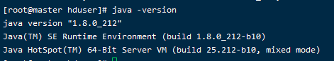


### 2.Maven安装

#### 1.下载

- 到国内开源镜像下载Maven, 推荐使用[TUNA-清华开源镜像站](https://mirrors.tuna.tsinghua.edu.cn/apache/maven/maven-3/)

  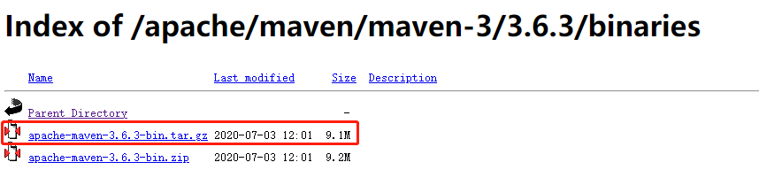

  ```
  wget https://mirrors.tuna.tsinghua.edu.cn/apache/maven/maven-3/3.6.3/binaries/apache-maven-3.6.3-bin.tar.gz
  ```

  

- 补充一个概念🍎

  ```
  bin.tar.gz是适用于linux、MacOsX系统的二进制文件
  
  bin.zip是适用于windows的二进制文件
  
  src.tar.gz是linux下的源码
  
  src.zip是windows的源码
  ```

#### 2.配置Maven

##### 2.1 解压

```
tar -zxvf apache-maven-3.6.3-bin.tar.gz -C /usr/local
```

##### 2.2 MAVEN_HOME

```
sudo vim /etc/profile
```

添加内容

```
#Maven_home
export MAVEN_HOME=/usr/local/apache-maven-3.6.3
export PATH=${MAVEN_HOME}/bin:$PATH
```

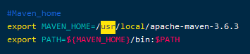

#### 2.3 Source

```
source /etc/profile
```

- 注销或重启后生效( 不重启在当前Shell 下生效)

#### 2.4 验证

```
mvn -version
```

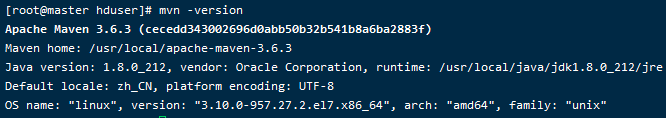


## 1.下载

```shell
curl -O --location https://github.com/brianfrankcooper/YCSB/releases/download/0.17.0/ycsb-0.17.0.tar.gz
```

- 下载了一个多小时，中间还断过几次，十分难受，所以当你遇到同样的情况的时候，不要慌~😂

## 2. 解压

```
tar xfvz ycsb-0.17.0.tar.gz
```

## 3.查看信息

- 切到目录、可以查看信息

```
cd ycsb-0.17.0

./bin/ycsb
```

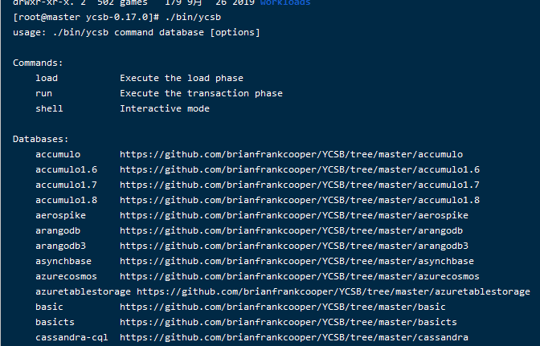

- 可以开始测试了，美滋滋~

- 查看workloads目录下的文件

```
cd workloads
```

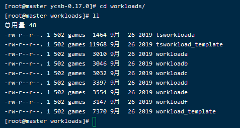

- 在ycsb/workloads/目录下建立名为mongotest_in_only的文件，写入一下内容（这是2019年测试的，2021年测试的时候报错如下，初步分析是com.yahoo.ycsb.workloads.CoreWorkload网址变换了🍎）

```
#插入100万条文档数据

recordcount=1000000

operationcount=1000000

workload=com.yahoo.ycsb.workloads.CoreWorkload

readallfields=true

readproportion=0

updateproportion=0

scanproportion=0

#只有插入的操作,1就是100%

insertproportion=1

requestdistribution=uniform

insertorder=hashed

fieldlength=250

fieldcount=8

mongodb.url=mongodb://127.0.0.1:20000/ycsb?w=0

mongodb.writeConcern=acknowledged

threadcount=100
```


## 4、运行YCSB

- 命令在**ycsb-0.17.0**目录下运行🎈

4.1 现在你已经准备好运行了！首先，使用异步驱动程序来加载数据：

```
./bin/ycsb load mongodb-async -s -P workloads/workloada > outputLoad.txt
```

4.2 然后，运行工作负载：

```
./bin/ycsb run mongodb-async -s -P workloads/workloada > outputRun.txt
```

4.3 同样，要使用来自MongoDB Inc.的同步驱动程序，我们加载数据：

```
./bin/ycsb load mongodb -s -P workloads/workloada > outputLoad.txt
```

4.4 然后，运行工作负载：

```
./bin/ycsb run mongodb -s -P workloads/workloada > outputRun.txt
```

- 说明
  - outputRun.txt是生成对应文件，可以查看

4.5 也可以简写

```
bin/ycsb.sh load basic -P workloads/workloada
bin/ycsb.sh run basic -P workloads/workloada
```

4.6 也可以命令定义测试内容，例如：

```
./bin/ycsb load mongodb-async -s -P workloads/workloada -p mongodb.url=mongodb://localhost:27017/ycsb?w=0
```

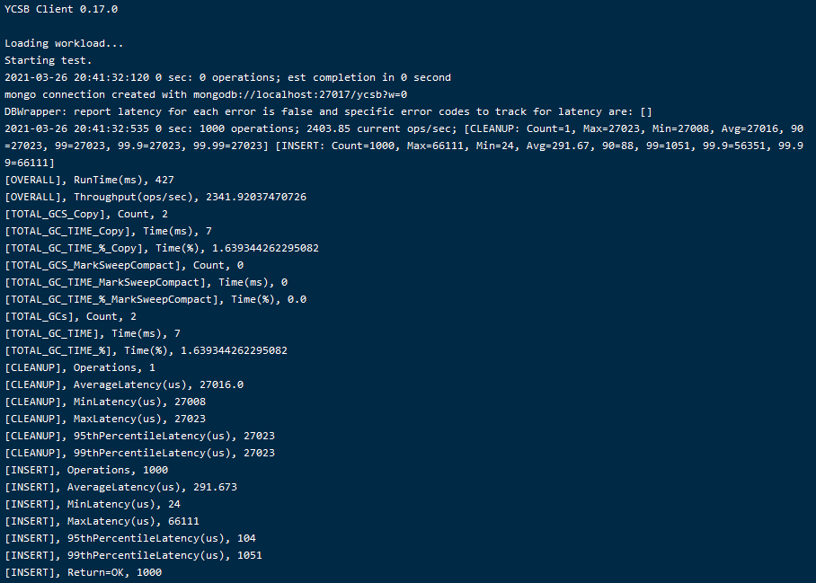

4.7 使用MongoDB公司的同步驱动程序运行：

```
./bin/ycsb load mongodb -s -P workloads/workloada -p mongodb.url=mongodb://localhost:27017/ycsb?w=0
```

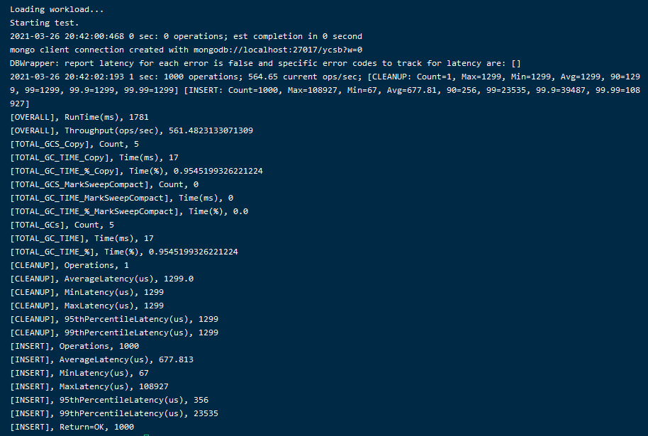


## 5、自定义测试

### 5.1编写测试内容

- 在ycsb/workloads/目录下建立名为mongotest_in_only的文件，写入一下内容（这是2019年测试的，2021年测试的时候报错如下，初步分析是com.yahoo.ycsb.workloads.CoreWorkload网址变换了🍎）

```
#插入100万条文档数据

recordcount=1000000

operationcount=1000000

workload=com.yahoo.ycsb.workloads.CoreWorkload

readallfields=true

readproportion=0

updateproportion=0

scanproportion=0

#只有插入的操作,1就是100%

insertproportion=1

requestdistribution=uniform

insertorder=hashed

fieldlength=250

fieldcount=8

mongodb.url=mongodb://127.0.0.1:20000/ycsb?w=0

mongodb.writeConcern=acknowledged

threadcount=100
```


### 5.2 测试

- 切换到ycsb目录，运行如下

- **下面有问题，先看看问题**

```shell
./bin/ycsb load mongodb -P workloads/mongotest_in_only -s >mongo_20210326.txt

./bin/ycsb run mongodb -P workloads/mongotest_read_only -s >mongo_20210326.txt

```


- 可以制定mongodb连接（覆盖workloads/mongotest_in_only设置？）

```
./bin/ycsb load mongodb -threads 100 -s -P workloads/mongotest_in_only -p mongodb.url=mongodb://127.0.0.1:20000/ycsb?w=0 > outputLoad_shard.txt
```


### 5.3 问题

- 出现如下问题

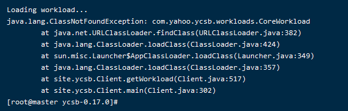

- 我以为没有安装maven，安装后，重启服务(验证不是这个错误😤)


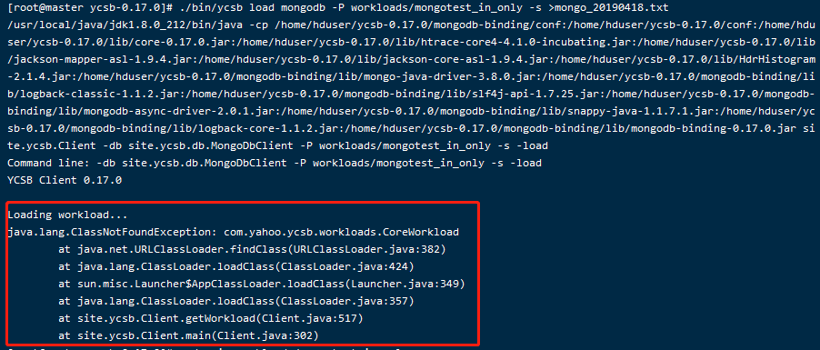


### 5.4 解决问题

- 分析问题
  
-  这是2019年测试的，2021年测试的时候报错如下，初步分析是com.yahoo.ycsb.workloads.CoreWorkload网址变换了💥
  
- 解决问题，重新修改内容

  - 生成一百万条数据
  
  ```shell
  mongodb.url=mongodb://127.0.0.1:27017/ycsb?w=0
  mongodb.batchsize=1000
  mongodb.maxconnections=10000
  table=workload_1e_2
  recordcount=1000000
  operationcount=1000000
  workload=site.ycsb.workloads.CoreWorkload
  
  readallfields=true
  
  readproportion=0.5
  updateproportion=0
  scanproportion=0
  insertproportion=0
  readmodifywriteproportion=0.5
  
requestdistribution=zipfian
  ```
  
  - 在MongoDB生成一个yscb的库，由于我们指定了collection名称，所以数据会插入到yscb.workload_1e_2这个collection里。


### 5.5 完美运行

- 在啰嗦一下，一定是在你的ycsb目录下🎈
- 通过**load**指令来生成数据:

```
 ./bin/ycsb load mongodb -P workloads/mongotest_in_only -s > mongo_20210328.txt
```

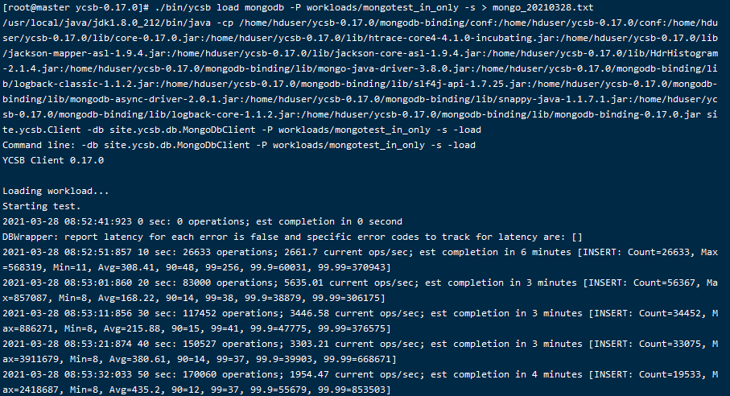

- 我这个大概生成了5min-10min，不要着急😂

- 查看生成文件信息

  ```
  cat mongo_20210328.txt
  ```

  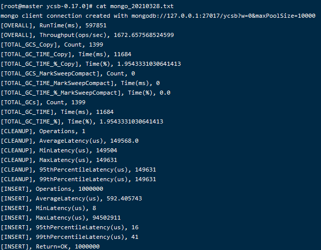

- 查看数据库

  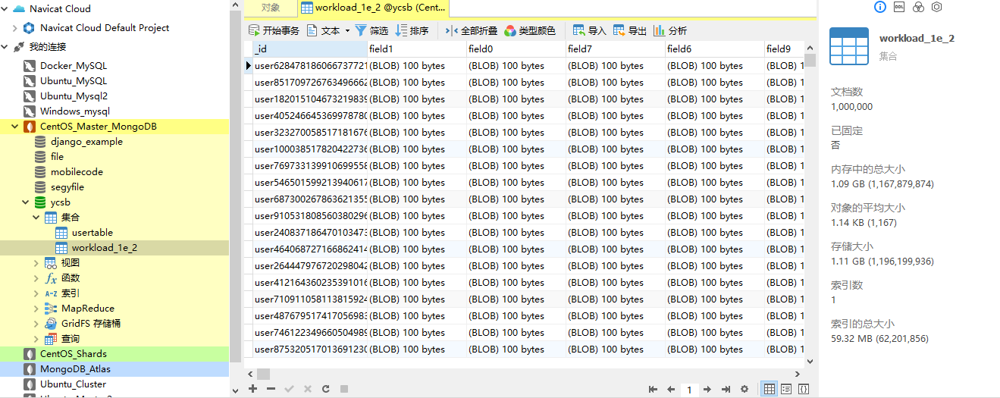

  

- 参考：
  - https://www.cnblogs.com/genghenggao/p/10729604.html
  - https://www.jianshu.com/p/375af7ea8479


### 5.6 分片测试

- 如果要测试分片集群的数据,最好提前创建好相应的集合并按_id分片:

#### 1.进入分片集群

```
mongo  127.0.0.1:20000
```

#### 2.设置片键

```shell
mongos> use ycsb
switched to db ycsb
mongos> db.createCollection('workload_1e_2')
{
        "ok" : 1,
        "operationTime" : Timestamp(1616894880, 8),
        "$clusterTime" : {
                "clusterTime" : Timestamp(1616894880, 8),
                "signature" : {
                        "hash" : BinData(0,"AAAAAAAAAAAAAAAAAAAAAAAAAAA="),
                        "keyId" : NumberLong(0)
                }
        }
}
mongos> sh.shardCollection("ycsb.workload_1e_2" ,{ "_id" : 1 })
{
        "ok" : 0,
        "errmsg" : "sharding not enabled for db ycsb",
        "code" : 20,
        "codeName" : "IllegalOperation",
        "operationTime" : Timestamp(1616894890, 4),
        "$clusterTime" : {
                "clusterTime" : Timestamp(1616894890, 4),
                "signature" : {
                        "hash" : BinData(0,"AAAAAAAAAAAAAAAAAAAAAAAAAAA="),
                        "keyId" : NumberLong(0)
                }
        }
}
```

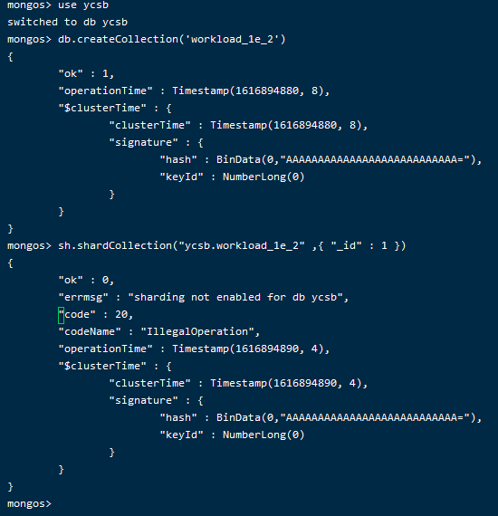


#### 3.数据准备

- 数据准备命令输出

  - 在worksload目录下添加workloadf_mongo

  ```shell
  mongodb.url=mongodb://127.0.0.1:20000/ycsb?w=0
  mongodb.batchsize=10000
  mongodb.maxconnections=10000
  table=workload_1e_2
  recordcount=1000000
  operationcount=1000000
  workload=site.ycsb.workloads.CoreWorkload
  
  readallfields=true
  
  readproportion=0.5
  updateproportion=0
  scanproportion=0
  insertproportion=0
  readmodifywriteproportion=0.5
  
  requestdistribution=zipfian
  ```

- 加载数据

```shell
./bin/ycsb load mongodb -P workloads/workloadf_mongo

#也可以使用下面这个，生成对应文件
 ./bin/ycsb load mongodb -P workloads/workloadf_mongo -s > mongo_outputload.txt
```


#### 4.实际压测

- 换成**run**命令来实际运行workloadf_mongo场景

```shell
./bin/ycsb run mongodb -P workloads/workloadf_mongo -s > mongo_outputrun.txt
```

- 使用100%读的场景再测一次
  - 添加文件信息workloadc_mongo:

```sh
mongodb.url=mongodb://127.0.0.1:20000/ycsb?w=0
mongodb.batchsize=10000
mongodb.maxconnections=10000
threadcount=10
table=workload_1e_2
recordcount=1000000
operationcount=1000000
workload=site.ycsb.workloads.CoreWorkload

readallfields=true

readproportion=1
updateproportion=0
scanproportion=0
insertproportion=0

requestdistribution=zipfian
```

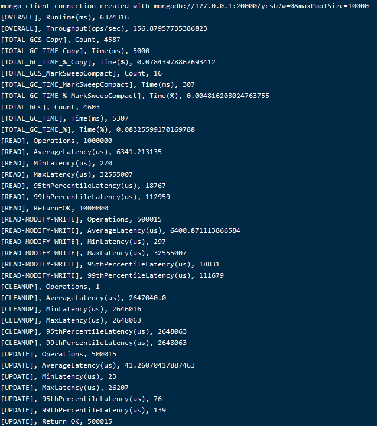

- 由于数据总量是一样的,这里就不重复生成数据了,直接run

```shell
./bin/ycsb run mongodb -P workloads/workloadc_mongo

#或者
./bin/ycsb run mongodb -P workloads/workloadc_mongo -s > mongo_outputrun.txt
```


- 结合mongostat测试

  ```
  mongostat --host 127.0.0.1:20000
  ```

  

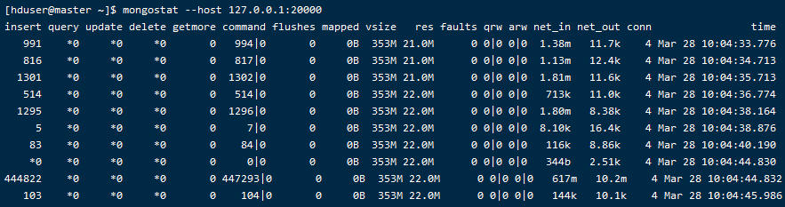


YCSB常见的几种测试

| workloada | 读写均衡型，50%读，50%写                   |
| --------- | ------------------------------------------ |
| workloadb | 读多写少型，95%读，5%更新。                |
| workloadc | 只读，100%读。                             |
| workloadd | 读最近写入记录型，95%读，5%插入。          |
| workloade | 扫描小区间型，95%扫描，5%插入。            |
| workloadf | 读写入记录均衡型，50%读，50%读、修改、写。 |


- workloada

  ```
  recordcount=1000
  operationcount=1000
  workload=site.ycsb.workloads.CoreWorkload
  
  readallfields=true
  
  readproportion=0.5
  updateproportion=0.5
  scanproportion=0
  insertproportion=0
  
  requestdistribution=zipfian
  
  ```

- workloada_mongo

  ```shell
  mongodb.url=mongodb://127.0.0.1:20000/ycsb?w=0
  mongodb.batchsize=10000
  mongodb.maxconnections=10000
  threadcount=10
  table=workload_1e_2
  recordcount=1000000
  operationcount=1000000
  workload=site.ycsb.workloads.CoreWorkload
  
  readallfields=true
  
  readproportion=0.5
  updateproportion=0.5
  scanproportion=0
  insertproportion=0
  
  requestdistribution=zipfian
  
  ```

  

- workloadb

  ```
  recordcount=1000
  operationcount=1000
  workload=site.ycsb.workloads.CoreWorkload
  
  readallfields=true
  
  readproportion=0.95
  updateproportion=0.05
  scanproportion=0
  insertproportion=0
  
  requestdistribution=zipfian
  
  ```

- workloadb_mongo

  ```shell
  mongodb.url=mongodb://127.0.0.1:20000/ycsb?w=0
  mongodb.batchsize=10000
  mongodb.maxconnections=10000
  threadcount=10
  table=workload_1e_2
  recordcount=1000000
  operationcount=1000000
  workload=site.ycsb.workloads.CoreWorkload
  
  readallfields=true
  
  readproportion=0.95
  updateproportion=0.05
  scanproportion=0
  insertproportion=0
  
  requestdistribution=zipfian
  ```

  

- workloadc

  ```
  recordcount=1000
  operationcount=1000
  workload=site.ycsb.workloads.CoreWorkload
  
  readallfields=true
  
  readproportion=1
  updateproportion=0
  scanproportion=0
  insertproportion=0
  
  requestdistribution=zipfian
  
  ```

- workloadc_mongo

  ```shell
  mongodb.url=mongodb://127.0.0.1:20000/ycsb?w=0
  mongodb.batchsize=10000
  mongodb.maxconnections=10000
  threadcount=10
  table=workload_1e_2
  recordcount=1000000
  operationcount=1000000
  workload=site.ycsb.workloads.CoreWorkload
  
  readallfields=true
  
  readproportion=1
  updateproportion=0
  scanproportion=0
  insertproportion=0
  
  requestdistribution=zipfian
  ```

  

- workloadd

  ```
  recordcount=1000
  operationcount=1000
  workload=site.ycsb.workloads.CoreWorkload
  
  readallfields=true
  
  readproportion=0.95
  updateproportion=0
  scanproportion=0
  insertproportion=0.05
  
  requestdistribution=latest
  
  ```

- workloadd_mongo

  ```shell
  mongodb.url=mongodb://127.0.0.1:20000/ycsb?w=0
  mongodb.batchsize=10000
  mongodb.maxconnections=10000
  threadcount=10
  table=workload_1e_2
  recordcount=1000000
  operationcount=1000000
  workload=site.ycsb.workloads.CoreWorkload
  
  readallfields=true
  
  readproportion=0.95
  updateproportion=0
  scanproportion=0
  insertproportion=0.05
  
  requestdistribution=latest
  
  ```

  

- workloade

```
recordcount=1000
operationcount=1000
workload=site.ycsb.workloads.CoreWorkload

readallfields=true

readproportion=0
updateproportion=0
scanproportion=0.95
insertproportion=0.05

requestdistribution=zipfian

maxscanlength=100

scanlengthdistribution=uniform

```

- workloade_mongo

```shell
mongodb.url=mongodb://127.0.0.1:20000/ycsb?w=0
mongodb.batchsize=10000
mongodb.maxconnections=10000
table=workload_1e_2
recordcount=1000000
operationcount=1000000
workload=site.ycsb.workloads.CoreWorkload

readallfields=true

readproportion=0
updateproportion=0
scanproportion=0.95
insertproportion=0.05

requestdistribution=zipfian

maxscanlength=100

scanlengthdistribution=uniform
```


- workloadf

  ```
  recordcount=1000
  operationcount=1000
  workload=site.ycsb.workloads.CoreWorkload
  
  readallfields=true
  
  readproportion=0.5
  updateproportion=0
  scanproportion=0
  insertproportion=0
  readmodifywriteproportion=0.5
  
  requestdistribution=zipfian
  
  ```

- workloadf_mongo

```shell
mongodb.url=mongodb://127.0.0.1:20000/ycsb?w=0
mongodb.batchsize=10000
mongodb.maxconnections=10000
table=workload_1e_2
recordcount=1000000
operationcount=1000000
workload=site.ycsb.workloads.CoreWorkload

readallfields=true

readproportion=0.5
updateproportion=0
scanproportion=0
insertproportion=0
readmodifywriteproportion=0.5

requestdistribution=zipfian
```

