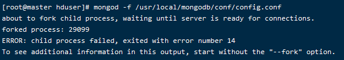
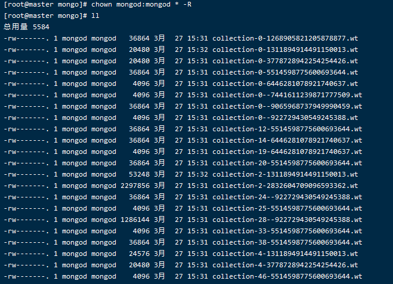
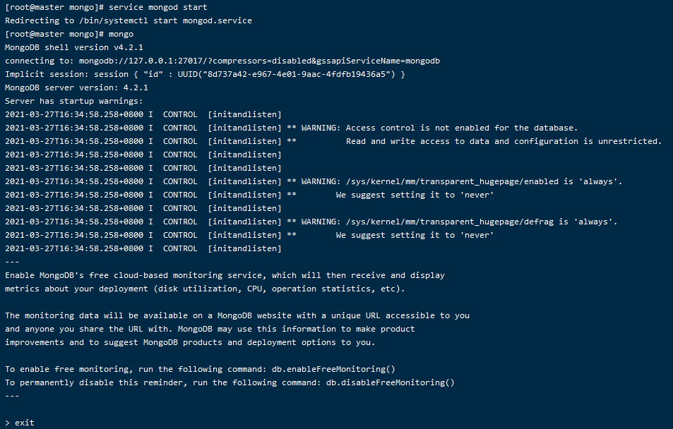

# 报错集合

[TOC]

## 1.集群报错

启动所有节点配置服务器（节点**master**）

```
mongod -f /usr/local/mongodb/conf/config.conf
```

- 报错如下


- 查阅
  - 这算是一个Mongod 启动的一个常见错误，非法关闭的时候，lock 文件没有干掉，第二次启动的时候检查到有lock 文件的时候，就报这个错误了。
- 我的集群配置实在目录`/usr/local/mongodb/config/data/mongod.lock`z

```shell
#查看
[root@master hduser]# cat /usr/local/mongodb/config/data/mongod.lock 
12023

#删除
[root@master hduser]# rm /usr/local/mongodb/config/data/mongod.lock 
rm：是否删除普通文件 "/usr/local/mongodb/config/data/mongod.lock"？y
```


- https://www.codeprj.com/blog/82bd851.html





```
rm -f /var/lib/mongo/mongod.lock
```


## 2.Mongo启动报错

### 2.1 报错描述

```
[root@master hduser]# mongo
MongoDB shell version v4.2.1
connecting to: mongodb://127.0.0.1:27017/?compressors=disabled&gssapiServiceName=mongodb
2021-03-27T15:51:43.748+0800 E  QUERY    [js] Error: couldn't connect to server 127.0.0.1:27017, connection attempt failed: SocketException: Error connecting to 127.0.0.1:27017 :: caused by :: Connection refused :
connect@src/mongo/shell/mongo.js:341:17
@(connect):2:6
2021-03-27T15:51:43.750+0800 F  -        [main] exception: connect failed
2021-03-27T15:51:43.750+0800 E  -        [main] exiting with code 1
```

### 2.2 分析

- 报错原因是`mongo`没有启动


### 方法一

#### 1.查看日志文档mongod.log

- 我的日志文件在 `/var/log/mongodb/mongod.log`

#### 2.查看权限

- 查看 `/var/lib/mongo` 目录下面文件的权限。如下：

```
[root@master hduser]# cd /var/lib/mongo/
[root@master mongo]# ll
```

- 如下：

```
-rw-------. 1 mongod mongod   36864 3月  27 15:31 collection-0-1268905821205878877.wt
-rw-------. 1 mongod mongod   20480 3月  27 15:32 collection-0-1311894914491150013.wt
-rw-------. 1 mongod mongod   20480 3月  27 15:31 collection-0-3778728942254254426.wt
-rw-------. 1 mongod mongod   36864 3月  27 15:31 collection-0-5514598775600693644.wt
-rw-------. 1 mongod mongod    4096 3月  27 15:31 collection-0-6446281078921740637.wt
-rw-------. 1 mongod mongod    4096 3月  27 15:31 collection-0--7441611239871777509.wt
-rw-------. 1 mongod mongod   36864 3月  27 15:31 collection-0--9065968737949990459.wt
-rw-------. 1 mongod mongod    4096 3月  27 15:31 collection-0--922729430549245388.wt
-rw-------. 1 mongod mongod   36864 3月  27 15:31 collection-12-5514598775600693644.wt
-rw-------. 1 mongod mongod   36864 3月  27 15:31 collection-14-6446281078921740637.wt
-rw-------. 1 mongod mongod    4096 3月  27 15:31 collection-19-6446281078921740637.wt
-rw-------. 1 mongod mongod   36864 3月  27 15:31 collection-20-5514598775600693644.wt
-rw-------. 1 mongod mongod   53248 3月  27 15:32 collection-2-1311894914491150013.wt
-rw-------. 1 mongod mongod 2297856 3月  27 15:31 collection-2-2832604709096593362.wt
-rw-------. 1 mongod mongod   36864 3月  27 15:31 collection-24--922729430549245388.wt
-rw-------. 1 mongod mongod    4096 3月  27 15:31 collection-25-5514598775600693644.wt
-rw-------. 1 mongod mongod 1286144 3月  27 15:31 collection-28--922729430549245388.wt
-rw-------. 1 mongod mongod    4096 3月  27 15:31 collection-33-5514598775600693644.wt
-rw-------. 1 mongod mongod   36864 3月  27 15:31 collection-38-5514598775600693644.wt
-rw-------. 1 mongod mongod   24576 3月  27 15:31 collection-4-1311894914491150013.wt
-rw-------. 1 mongod mongod   20480 3月  27 15:31 collection-4-3778728942254254426.wt
-rw-------. 1 mongod mongod    4096 3月  27 15:31 collection-46-5514598775600693644.wt
-rw-------. 1 mongod mongod    4096 3月  27 15:31 collection-51-5514598775600693644.wt
-rw-------. 1 mongod mongod    4096 3月  27 15:31 collection-5--922729430549245388.wt
-rw-------. 1 mongod mongod   36864 3月  27 15:31 collection-7-5514598775600693644.wt
-rw-------. 1 mongod mongod   20480 3月  27 15:31 collection-82-5514598775600693644.wt
-rw-------. 1 mongod mongod   24576 3月  27 15:31 collection-96-5514598775600693644.wt
drwx------. 2 mongod mongod    4096 3月  27 15:32 diagnostic.data
-rw-------. 1 root   root     36864 3月  27 15:32 index-0-786917299409924363.wt
-rw-------. 1 root   root     20480 3月  27 15:31 index-10-786917299409924363.wt
-rw-------. 1 root   root     20480 3月  27 15:31 index-11-786917299409924363.wt
-rw-------. 1 root   root     20480 3月  27 15:31 index-12-786917299409924363.wt
-rw-------. 1 root   root      8192 3月  27 15:31 index-13-786917299409924363.wt
-rw-------. 1 root   root      8192 3月  27 15:31 index-14-786917299409924363.wt
-rw-------. 1 root   root      8192 3月  27 15:31 index-15-786917299409924363.wt
-rw-------. 1 root   root      8192 3月  27 15:31 index-16-786917299409924363.wt
-rw-------. 1 root   root      8192 3月  27 15:31 index-17-786917299409924363.wt
-rw-------. 1 root   root      8192 3月  27 15:31 index-1-786917299409924363.wt
-rw-------. 1 root   root      8192 3月  27 15:31 index-18-786917299409924363.wt
-rw-------. 1 root   root      8192 3月  27 15:31 index-19-786917299409924363.wt
-rw-------. 1 root   root      8192 3月  27 15:31 index-20-786917299409924363.wt
-rw-------. 1 root   root      8192 3月  27 15:31 index-21-786917299409924363.wt
-rw-------. 1 root   root      8192 3月  27 15:31 index-22-786917299409924363.wt
-rw-------. 1 root   root      8192 3月  27 15:31 index-23-786917299409924363.wt
-rw-------. 1 root   root      8192 3月  27 15:31 index-24-786917299409924363.wt
-rw-------. 1 root   root      8192 3月  27 15:31 index-25-786917299409924363.wt
-rw-------. 1 root   root      8192 3月  27 15:31 index-26-786917299409924363.wt
-rw-------. 1 root   root      8192 3月  27 15:31 index-27-786917299409924363.wt
-rw-------. 1 root   root      8192 3月  27 15:31 index-2-786917299409924363.wt
-rw-------. 1 root   root     20480 3月  27 15:31 index-28-786917299409924363.wt
-rw-------. 1 root   root     20480 3月  27 15:31 index-29-786917299409924363.wt
-rw-------. 1 root   root     20480 3月  27 15:31 index-30-786917299409924363.wt
-rw-------. 1 root   root      8192 3月  27 15:31 index-31-786917299409924363.wt
-rw-------. 1 root   root      8192 3月  27 15:31 index-32-786917299409924363.wt
-rw-------. 1 root   root      8192 3月  27 15:31 index-33-786917299409924363.wt
-rw-------. 1 root   root      8192 3月  27 15:31 index-34-786917299409924363.wt
-rw-------. 1 root   root      8192 3月  27 15:31 index-35-786917299409924363.wt
-rw-------. 1 root   root     20480 3月  27 15:31 index-36-786917299409924363.wt
-rw-------. 1 root   root     20480 3月  27 15:31 index-37-786917299409924363.wt
-rw-------. 1 root   root     20480 3月  27 15:31 index-3-786917299409924363.wt
-rw-------. 1 root   root     20480 3月  27 15:31 index-38-786917299409924363.wt
-rw-------. 1 root   root     20480 3月  27 15:31 index-39-786917299409924363.wt
-rw-------. 1 root   root     20480 3月  27 15:31 index-40-786917299409924363.wt
-rw-------. 1 root   root     20480 3月  27 15:31 index-41-786917299409924363.wt
-rw-------. 1 root   root     20480 3月  27 15:31 index-42-786917299409924363.wt
-rw-------. 1 root   root     20480 3月  27 15:31 index-43-786917299409924363.wt
-rw-------. 1 root   root     20480 3月  27 15:31 index-44-786917299409924363.wt
-rw-------. 1 root   root      8192 3月  27 15:31 index-45-786917299409924363.wt
-rw-------. 1 root   root      8192 3月  27 15:31 index-46-786917299409924363.wt
-rw-------. 1 root   root      8192 3月  27 15:31 index-47-786917299409924363.wt
-rw-------. 1 root   root     20480 3月  27 15:31 index-4-786917299409924363.wt
-rw-------. 1 root   root      8192 3月  27 15:31 index-48-786917299409924363.wt
-rw-------. 1 root   root      8192 3月  27 15:31 index-49-786917299409924363.wt
-rw-------. 1 root   root     20480 3月  27 15:31 index-50-786917299409924363.wt
-rw-------. 1 root   root     20480 3月  27 15:31 index-51-786917299409924363.wt
-rw-------. 1 root   root     20480 3月  27 15:31 index-52-786917299409924363.wt
-rw-------. 1 root   root      8192 3月  27 15:31 index-53-786917299409924363.wt
-rw-------. 1 root   root      8192 3月  27 15:31 index-54-786917299409924363.wt
-rw-------. 1 root   root     20480 3月  27 15:31 index-55-786917299409924363.wt
-rw-------. 1 root   root     20480 3月  27 15:31 index-56-786917299409924363.wt
-rw-------. 1 root   root      8192 3月  27 15:31 index-57-786917299409924363.wt
-rw-------. 1 root   root     20480 3月  27 15:31 index-5-786917299409924363.wt
-rw-------. 1 root   root      8192 3月  27 15:31 index-58-786917299409924363.wt
-rw-------. 1 root   root     20480 3月  27 15:31 index-59-786917299409924363.wt
-rw-------. 1 root   root     20480 3月  27 15:31 index-60-786917299409924363.wt
-rw-------. 1 root   root     20480 3月  27 15:31 index-61-786917299409924363.wt
-rw-------. 1 root   root     20480 3月  27 15:31 index-62-786917299409924363.wt
-rw-------. 1 root   root     20480 3月  27 15:31 index-63-786917299409924363.wt
-rw-------. 1 root   root     20480 3月  27 15:31 index-64-786917299409924363.wt
-rw-------. 1 root   root     20480 3月  27 15:31 index-65-786917299409924363.wt
-rw-------. 1 root   root     20480 3月  27 15:32 index-66-786917299409924363.wt
-rw-------. 1 root   root     20480 3月  27 15:31 index-67-786917299409924363.wt
-rw-------. 1 root   root     20480 3月  27 15:31 index-6-786917299409924363.wt
-rw-------. 1 root   root     20480 3月  27 15:31 index-68-786917299409924363.wt
-rw-------. 1 root   root     20480 3月  27 15:31 index-69-786917299409924363.wt
-rw-------. 1 root   root     20480 3月  27 15:31 index-70-786917299409924363.wt
-rw-------. 1 root   root     20480 3月  27 15:31 index-71-786917299409924363.wt
-rw-------. 1 root   root     20480 3月  27 15:31 index-72-786917299409924363.wt
-rw-------. 1 root   root     45056 3月  27 15:31 index-73-786917299409924363.wt
-rw-------. 1 root   root      8192 3月  27 15:31 index-7-786917299409924363.wt
-rw-------. 1 root   root      8192 3月  27 15:31 index-8-786917299409924363.wt
-rw-------. 1 root   root      8192 3月  27 15:31 index-9-786917299409924363.wt
drwx------. 2 mongod mongod     110 3月  27 15:31 journal
-rw-------. 1 mongod mongod   45056 3月  27 15:32 _mdb_catalog.wt
-rw-------. 1 mongod mongod       0 3月  27 15:32 mongod.lock
-rw-------. 1 mongod mongod   45056 3月  27 15:32 sizeStorer.wt
-rw-------. 1 mongod mongod     114 11月 20 2019 storage.bson
-rw-------. 1 mongod mongod      47 11月 20 2019 WiredTiger
-rw-------. 1 root   root      4096 3月  27 15:32 WiredTigerLAS.wt
-rw-------. 1 mongod mongod      21 11月 20 2019 WiredTiger.lock
-rw-------. 1 root   root      1200 3月  27 15:32 WiredTiger.turtle
-rw-------. 1 mongod mongod  327680 3月  27 15:32 WiredTiger.wt

```

#### 3.修改权限

- 所有的权限改为`mongod`

```
[root@master mongo]# chown mongod:mongod * -R
[root@master mongo]# ll
```

如下：

```
[root@master mongo]# chown mongod:mongod * -R
[root@master mongo]# ll
总用量 5584
-rw-------. 1 mongod mongod   36864 3月  27 15:31 collection-0-1268905821205878877.wt
-rw-------. 1 mongod mongod   20480 3月  27 15:32 collection-0-1311894914491150013.wt
-rw-------. 1 mongod mongod   20480 3月  27 15:31 collection-0-3778728942254254426.wt
-rw-------. 1 mongod mongod   36864 3月  27 15:31 collection-0-5514598775600693644.wt
-rw-------. 1 mongod mongod    4096 3月  27 15:31 collection-0-6446281078921740637.wt
-rw-------. 1 mongod mongod    4096 3月  27 15:31 collection-0--7441611239871777509.wt
-rw-------. 1 mongod mongod   36864 3月  27 15:31 collection-0--9065968737949990459.wt
-rw-------. 1 mongod mongod    4096 3月  27 15:31 collection-0--922729430549245388.wt
-rw-------. 1 mongod mongod   36864 3月  27 15:31 collection-12-5514598775600693644.wt
-rw-------. 1 mongod mongod   36864 3月  27 15:31 collection-14-6446281078921740637.wt
-rw-------. 1 mongod mongod    4096 3月  27 15:31 collection-19-6446281078921740637.wt
-rw-------. 1 mongod mongod   36864 3月  27 15:31 collection-20-5514598775600693644.wt
-rw-------. 1 mongod mongod   53248 3月  27 15:32 collection-2-1311894914491150013.wt
-rw-------. 1 mongod mongod 2297856 3月  27 15:31 collection-2-2832604709096593362.wt
-rw-------. 1 mongod mongod   36864 3月  27 15:31 collection-24--922729430549245388.wt
-rw-------. 1 mongod mongod    4096 3月  27 15:31 collection-25-5514598775600693644.wt
-rw-------. 1 mongod mongod 1286144 3月  27 15:31 collection-28--922729430549245388.wt
-rw-------. 1 mongod mongod    4096 3月  27 15:31 collection-33-5514598775600693644.wt
-rw-------. 1 mongod mongod   36864 3月  27 15:31 collection-38-5514598775600693644.wt
-rw-------. 1 mongod mongod   24576 3月  27 15:31 collection-4-1311894914491150013.wt
-rw-------. 1 mongod mongod   20480 3月  27 15:31 collection-4-3778728942254254426.wt
-rw-------. 1 mongod mongod    4096 3月  27 15:31 collection-46-5514598775600693644.wt
-rw-------. 1 mongod mongod    4096 3月  27 15:31 collection-51-5514598775600693644.wt
-rw-------. 1 mongod mongod    4096 3月  27 15:31 collection-5--922729430549245388.wt
-rw-------. 1 mongod mongod   36864 3月  27 15:31 collection-7-5514598775600693644.wt
-rw-------. 1 mongod mongod   20480 3月  27 15:31 collection-82-5514598775600693644.wt
-rw-------. 1 mongod mongod   24576 3月  27 15:31 collection-96-5514598775600693644.wt
drwx------. 2 mongod mongod    4096 3月  27 15:32 diagnostic.data
-rw-------. 1 mongod mongod   36864 3月  27 15:32 index-0-786917299409924363.wt
-rw-------. 1 mongod mongod   20480 3月  27 15:31 index-10-786917299409924363.wt
-rw-------. 1 mongod mongod   20480 3月  27 15:31 index-11-786917299409924363.wt
-rw-------. 1 mongod mongod   20480 3月  27 15:31 index-12-786917299409924363.wt
-rw-------. 1 mongod mongod    8192 3月  27 15:31 index-13-786917299409924363.wt
-rw-------. 1 mongod mongod    8192 3月  27 15:31 index-14-786917299409924363.wt
-rw-------. 1 mongod mongod    8192 3月  27 15:31 index-15-786917299409924363.wt
-rw-------. 1 mongod mongod    8192 3月  27 15:31 index-16-786917299409924363.wt
-rw-------. 1 mongod mongod    8192 3月  27 15:31 index-17-786917299409924363.wt
-rw-------. 1 mongod mongod    8192 3月  27 15:31 index-1-786917299409924363.wt
-rw-------. 1 mongod mongod    8192 3月  27 15:31 index-18-786917299409924363.wt
-rw-------. 1 mongod mongod    8192 3月  27 15:31 index-19-786917299409924363.wt
-rw-------. 1 mongod mongod    8192 3月  27 15:31 index-20-786917299409924363.wt
-rw-------. 1 mongod mongod    8192 3月  27 15:31 index-21-786917299409924363.wt
-rw-------. 1 mongod mongod    8192 3月  27 15:31 index-22-786917299409924363.wt
-rw-------. 1 mongod mongod    8192 3月  27 15:31 index-23-786917299409924363.wt
-rw-------. 1 mongod mongod    8192 3月  27 15:31 index-24-786917299409924363.wt
-rw-------. 1 mongod mongod    8192 3月  27 15:31 index-25-786917299409924363.wt
-rw-------. 1 mongod mongod    8192 3月  27 15:31 index-26-786917299409924363.wt
-rw-------. 1 mongod mongod    8192 3月  27 15:31 index-27-786917299409924363.wt
-rw-------. 1 mongod mongod    8192 3月  27 15:31 index-2-786917299409924363.wt
-rw-------. 1 mongod mongod   20480 3月  27 15:31 index-28-786917299409924363.wt
-rw-------. 1 mongod mongod   20480 3月  27 15:31 index-29-786917299409924363.wt
-rw-------. 1 mongod mongod   20480 3月  27 15:31 index-30-786917299409924363.wt
-rw-------. 1 mongod mongod    8192 3月  27 15:31 index-31-786917299409924363.wt
-rw-------. 1 mongod mongod    8192 3月  27 15:31 index-32-786917299409924363.wt
-rw-------. 1 mongod mongod    8192 3月  27 15:31 index-33-786917299409924363.wt
-rw-------. 1 mongod mongod    8192 3月  27 15:31 index-34-786917299409924363.wt
-rw-------. 1 mongod mongod    8192 3月  27 15:31 index-35-786917299409924363.wt
-rw-------. 1 mongod mongod   20480 3月  27 15:31 index-36-786917299409924363.wt
-rw-------. 1 mongod mongod   20480 3月  27 15:31 index-37-786917299409924363.wt
-rw-------. 1 mongod mongod   20480 3月  27 15:31 index-3-786917299409924363.wt
-rw-------. 1 mongod mongod   20480 3月  27 15:31 index-38-786917299409924363.wt
-rw-------. 1 mongod mongod   20480 3月  27 15:31 index-39-786917299409924363.wt
-rw-------. 1 mongod mongod   20480 3月  27 15:31 index-40-786917299409924363.wt
-rw-------. 1 mongod mongod   20480 3月  27 15:31 index-41-786917299409924363.wt
-rw-------. 1 mongod mongod   20480 3月  27 15:31 index-42-786917299409924363.wt
-rw-------. 1 mongod mongod   20480 3月  27 15:31 index-43-786917299409924363.wt
-rw-------. 1 mongod mongod   20480 3月  27 15:31 index-44-786917299409924363.wt
-rw-------. 1 mongod mongod    8192 3月  27 15:31 index-45-786917299409924363.wt
-rw-------. 1 mongod mongod    8192 3月  27 15:31 index-46-786917299409924363.wt
-rw-------. 1 mongod mongod    8192 3月  27 15:31 index-47-786917299409924363.wt
-rw-------. 1 mongod mongod   20480 3月  27 15:31 index-4-786917299409924363.wt
-rw-------. 1 mongod mongod    8192 3月  27 15:31 index-48-786917299409924363.wt
-rw-------. 1 mongod mongod    8192 3月  27 15:31 index-49-786917299409924363.wt
-rw-------. 1 mongod mongod   20480 3月  27 15:31 index-50-786917299409924363.wt
-rw-------. 1 mongod mongod   20480 3月  27 15:31 index-51-786917299409924363.wt
-rw-------. 1 mongod mongod   20480 3月  27 15:31 index-52-786917299409924363.wt
-rw-------. 1 mongod mongod    8192 3月  27 15:31 index-53-786917299409924363.wt
-rw-------. 1 mongod mongod    8192 3月  27 15:31 index-54-786917299409924363.wt
-rw-------. 1 mongod mongod   20480 3月  27 15:31 index-55-786917299409924363.wt
-rw-------. 1 mongod mongod   20480 3月  27 15:31 index-56-786917299409924363.wt
-rw-------. 1 mongod mongod    8192 3月  27 15:31 index-57-786917299409924363.wt
-rw-------. 1 mongod mongod   20480 3月  27 15:31 index-5-786917299409924363.wt
-rw-------. 1 mongod mongod    8192 3月  27 15:31 index-58-786917299409924363.wt
-rw-------. 1 mongod mongod   20480 3月  27 15:31 index-59-786917299409924363.wt
-rw-------. 1 mongod mongod   20480 3月  27 15:31 index-60-786917299409924363.wt
-rw-------. 1 mongod mongod   20480 3月  27 15:31 index-61-786917299409924363.wt
-rw-------. 1 mongod mongod   20480 3月  27 15:31 index-62-786917299409924363.wt
-rw-------. 1 mongod mongod   20480 3月  27 15:31 index-63-786917299409924363.wt
-rw-------. 1 mongod mongod   20480 3月  27 15:31 index-64-786917299409924363.wt
-rw-------. 1 mongod mongod   20480 3月  27 15:31 index-65-786917299409924363.wt
-rw-------. 1 mongod mongod   20480 3月  27 15:32 index-66-786917299409924363.wt
-rw-------. 1 mongod mongod   20480 3月  27 15:31 index-67-786917299409924363.wt
-rw-------. 1 mongod mongod   20480 3月  27 15:31 index-6-786917299409924363.wt
-rw-------. 1 mongod mongod   20480 3月  27 15:31 index-68-786917299409924363.wt
-rw-------. 1 mongod mongod   20480 3月  27 15:31 index-69-786917299409924363.wt
-rw-------. 1 mongod mongod   20480 3月  27 15:31 index-70-786917299409924363.wt
-rw-------. 1 mongod mongod   20480 3月  27 15:31 index-71-786917299409924363.wt
-rw-------. 1 mongod mongod   20480 3月  27 15:31 index-72-786917299409924363.wt
-rw-------. 1 mongod mongod   45056 3月  27 15:31 index-73-786917299409924363.wt
-rw-------. 1 mongod mongod    8192 3月  27 15:31 index-7-786917299409924363.wt
-rw-------. 1 mongod mongod    8192 3月  27 15:31 index-8-786917299409924363.wt
-rw-------. 1 mongod mongod    8192 3月  27 15:31 index-9-786917299409924363.wt
drwx------. 2 mongod mongod     110 3月  27 15:31 journal
-rw-------. 1 mongod mongod   45056 3月  27 15:32 _mdb_catalog.wt
-rw-------. 1 mongod mongod       0 3月  27 15:32 mongod.lock
-rw-------. 1 mongod mongod   45056 3月  27 15:32 sizeStorer.wt
-rw-------. 1 mongod mongod     114 11月 20 2019 storage.bson
-rw-------. 1 mongod mongod      47 11月 20 2019 WiredTiger
-rw-------. 1 mongod mongod    4096 3月  27 15:32 WiredTigerLAS.wt
-rw-------. 1 mongod mongod      21 11月 20 2019 WiredTiger.lock
-rw-------. 1 mongod mongod    1200 3月  27 15:32 WiredTiger.turtle
-rw-------. 1 mongod mongod  327680 3月  27 15:32 WiredTiger.wt
```



#### 4.启动服务

- 启动 MongoDB 服务。如下：

```
 service mongod start
 
 mongo
```




- 参考：

  - https://www.hxstrive.com/article/808.htm

  - https://blog.csdn.net/youif/article/details/105850300

    

### 方法二

- 说在最前面，如果数据库集群刚开始装，可以试一下，**不建议**🎃

- 这种方式每一次都需要重新开一个启动窗口（可能是我自己配置的原因吧🤔）


1.创建目录 /data/db

```
cd /
mkdir data
cd data
mkdir db
```


2.查找到mongo的安装路径

```
[root@master /]# whereis mongo
mongo: /usr/bin/mongo /usr/share/man/man1/mongo.1
```


3.然后手动启动mongo

```
[root@master data]# cd /usr/bin/
[root@master bin]# sudo ./mongod  -dbpath /data/db/
```


启动成功！


- 参考：https://blog.csdn.net/cocos2dGirl/article/details/99291139