# CentOS搭建MongoDB分片集群

[TOC]

## 一、系统环境

- Vmware
  - CentOS7

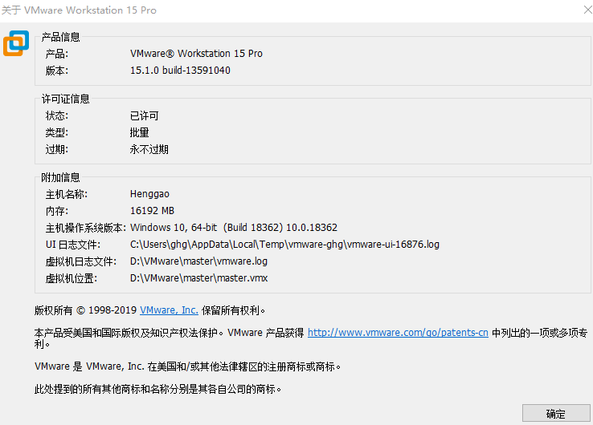


## 二、MongoDB安装

-  奇数编号的MongoDB发布版本（例如4.1）是开发版本，不适合生产部署。 

- 默认情况下，MongoDB使用`mongod`用户帐户运行，并使用以下默认目录：
  - `/var/lib/mongo` （数据目录）
  - `/var/log/mongodb` （日志目录）

### 1、参考[官网步骤](https://docs.mongodb.com/manual/tutorial/install-mongodb-on-red-hat/)安装MongoDB4.2

1.1、创建yum源文件

```shell
vim /etc/yum.repos.d/mongodb-org-4.2.repo
```

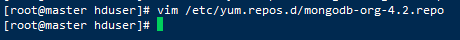

添加以下内容

```
[mongodb-org-4.2]
name=MongoDB Repository
baseurl=https://repo.mongodb.org/yum/redhat/$releasever/mongodb-org/4.2/x86_64/
gpgcheck=1
enabled=1
gpgkey=https://www.mongodb.org/static/pgp/server-4.2.asc

```

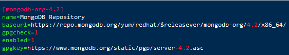

#### 1.2、安装之前更新所以的包

```shell
yum update
```

#### 1.3、安装MongoDB包

```shell
sudo yum install -y mongodb-org
```

```
[root@master hduser]# sudo yum install -y mongodb-org
Loaded plugins: fastestmirror, langpacks
Loading mirror speeds from cached hostfile
 * base: centos.ustc.edu.cn
 * extras: centos.ustc.edu.cn
 * updates: mirror.bit.edu.cn
Resolving Dependencies
--> Running transaction check
---> Package mongodb-org.x86_64 0:4.2.1-1.el7 will be installed
--> Processing Dependency: mongodb-org-tools = 4.2.1 for package: mongodb-org-4.2.1-1.el7.x86_64
--> Processing Dependency: mongodb-org-shell = 4.2.1 for package: mongodb-org-4.2.1-1.el7.x86_64
--> Processing Dependency: mongodb-org-server = 4.2.1 for package: mongodb-org-4.2.1-1.el7.x86_64
--> Processing Dependency: mongodb-org-mongos = 4.2.1 for package: mongodb-org-4.2.1-1.el7.x86_64
--> Running transaction check
---> Package mongodb-org-mongos.x86_64 0:4.2.1-1.el7 will be installed
---> Package mongodb-org-server.x86_64 0:4.2.1-1.el7 will be installed
---> Package mongodb-org-shell.x86_64 0:4.2.1-1.el7 will be installed
---> Package mongodb-org-tools.x86_64 0:4.2.1-1.el7 will be installed
--> Finished Dependency Resolution

Dependencies Resolved

===========================================================================================================================
 Package                           Arch                  Version                      Repository                      Size
===========================================================================================================================
Installing:
 mongodb-org                       x86_64                4.2.1-1.el7                  mongodb-org-4.2                5.8 k
Installing for dependencies:
 mongodb-org-mongos                x86_64                4.2.1-1.el7                  mongodb-org-4.2                 14 M
 mongodb-org-server                x86_64                4.2.1-1.el7                  mongodb-org-4.2                 25 M
 mongodb-org-shell                 x86_64                4.2.1-1.el7                  mongodb-org-4.2                 17 M
 mongodb-org-tools                 x86_64                4.2.1-1.el7                  mongodb-org-4.2                 47 M

Transaction Summary
===========================================================================================================================
Install  1 Package (+4 Dependent packages)

Total download size: 102 M
Installed size: 259 M
Downloading packages:
warning: /var/cache/yum/x86_64/7/mongodb-org-4.2/packages/mongodb-org-4.2.1-1.el7.x86_64.rpm: Header V3 RSA/SHA1 Signature, key ID 058f8b6b: NOKEY
Public key for mongodb-org-4.2.1-1.el7.x86_64.rpm is not installed
(1/5): mongodb-org-4.2.1-1.el7.x86_64.rpm                                                           | 5.8 kB  00:00:01     
(2/5): mongodb-org-mongos-4.2.1-1.el7.x86_64.rpm                                                    |  14 MB  00:00:03     
(3/5): mongodb-org-shell-4.2.1-1.el7.x86_64.rpm                                                     |  17 MB  00:00:03     
(4/5): mongodb-org-server-4.2.1-1.el7.x86_64.rpm                                                    |  25 MB  00:00:09     
(5/5): mongodb-org-tools-4.2.1-1.el7.x86_64.rpm                                                     |  47 MB  00:00:07     
---------------------------------------------------------------------------------------------------------------------------
Total                                                                                      7.0 MB/s | 102 MB  00:00:14     
Retrieving key from https://www.mongodb.org/static/pgp/server-4.2.asc
Importing GPG key 0x058F8B6B:
 Userid     : "MongoDB 4.2 Release Signing Key <packaging@mongodb.com>"
 Fingerprint: e162 f504 a20c df15 827f 718d 4b7c 549a 058f 8b6b
 From       : https://www.mongodb.org/static/pgp/server-4.2.asc
Running transaction check
Running transaction test
Transaction test succeeded
Running transaction
  Installing : mongodb-org-server-4.2.1-1.el7.x86_64                                                                   1/5 
Created symlink from /etc/systemd/system/multi-user.target.wants/mongod.service to /usr/lib/systemd/system/mongod.service.
  Installing : mongodb-org-tools-4.2.1-1.el7.x86_64                                                                    2/5 
  Installing : mongodb-org-mongos-4.2.1-1.el7.x86_64                                                                   3/5 
  Installing : mongodb-org-shell-4.2.1-1.el7.x86_64                                                                    4/5 
  Installing : mongodb-org-4.2.1-1.el7.x86_64                                                                          5/5 
  Verifying  : mongodb-org-shell-4.2.1-1.el7.x86_64                                                                    1/5 
  Verifying  : mongodb-org-mongos-4.2.1-1.el7.x86_64                                                                   2/5 
  Verifying  : mongodb-org-tools-4.2.1-1.el7.x86_64                                                                    3/5 
  Verifying  : mongodb-org-server-4.2.1-1.el7.x86_64                                                                   4/5 
  Verifying  : mongodb-org-4.2.1-1.el7.x86_64                                                                          5/5 

Installed:
  mongodb-org.x86_64 0:4.2.1-1.el7                                                                                         

Dependency Installed:
  mongodb-org-mongos.x86_64 0:4.2.1-1.el7  mongodb-org-server.x86_64 0:4.2.1-1.el7  mongodb-org-shell.x86_64 0:4.2.1-1.el7 
  mongodb-org-tools.x86_64 0:4.2.1-1.el7  

Complete!
```

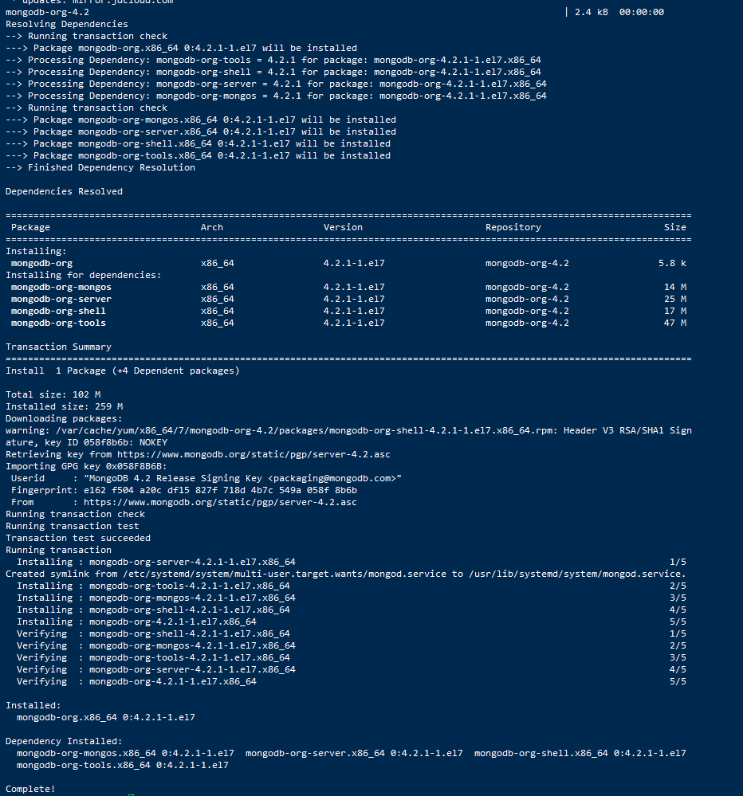

#### 1.4、设置开机启动

```shell
sudo systemctl enable mongod.service
```

#### 1.5、 MongoDB简单命令

```shell
#启动服务
sudo service mongod start

#访问MongoDB（本地访问）
mongo
#或者
mongo --host 127.0.0.1:27017
```

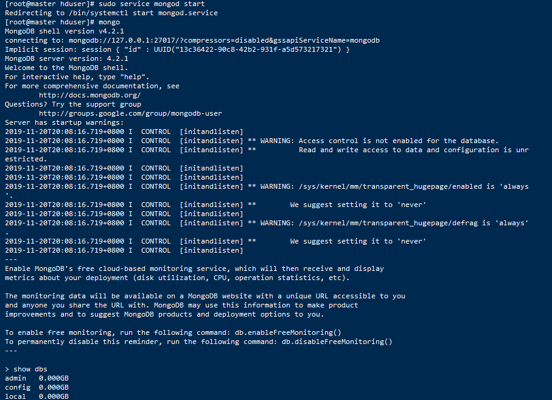

#### 1.6、MongoDB命令

```shell
sudo service mongod start #启动服务
sudo service mongod stop #关闭服务
sudo service mongod restart #重启服务
```

```shell
sudo systemctl start mongod #上面命令不行试试这个
```


#### 1.7、设置远程访问

1、编辑etc/mongod.conf

```shell
vim /etc/mongod.conf
```

2、bindIp注释掉（这个方法我使用不行,使用Navicat Premium连接时报错No suitable servers found）

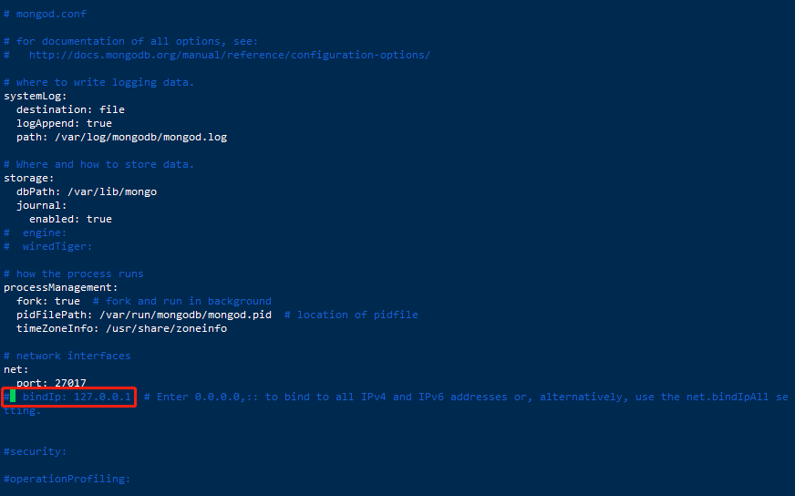

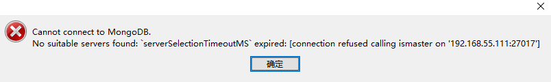

2、bindIp参数设置为0.0.0.0

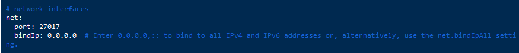

3、重启MongoDB 

```shell
sudo service mongod restart
```

- Navicat测试链接成功

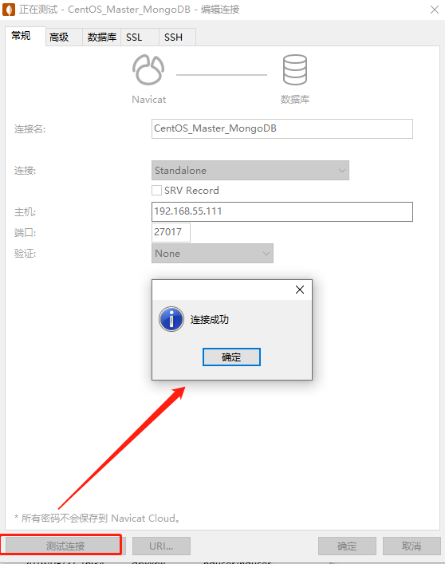


## 三、分片搭建

### 1、服务器规划 

| master:192.168.55.110 | slave1:192.168.55.111 | slave2:192.168.55.112 | slave3:192.168.55.113 |
| --------------------- | --------------------- | --------------------- | :-------------------- |
| mongos                | mongos                | mongos                |                       |
| config server         | config server         | config server         |                       |
| shard server1（主）   | shard server2（主）   | shard server3（主）   | shard server4（主）   |
| shard server4（从）   | shard server1（从）   | shard server2（从）   | shard server3（从）   |
| shard server3（仲裁） | shard server4（仲裁） | shard server1（仲裁） | shard server2（仲裁） |

-  注意关闭防火墙 
-   监听的配置服务器,只能有**1个或者3个** configs为配置服务器的副本集名字 

### 2、端口号分配

- Mongos：20000
- Config：21000
- Shard1：27001
- Shard2：27002
- Shard3：27003
- Shard4：27004

### 3、创建相关目录

- 每台机器建立conf、mongos、config、shard1、shard2、shard3、shard4目录，因为mongos不存储数据，只需要建立日志文件目录即可。

- 192.168.55.110  (master)

  - conf、mongos、config、shard1、shard3、shard4

    ```shell
    mkdir -p /usr/local/mongodb/conf
    mkdir -p /usr/local/mongodb/mongos/log
    mkdir -p /usr/local/mongodb/config/{data,log}
    mkdir -p /usr/local/mongodb/shard1/{data,log}
    mkdir -p /usr/local/mongodb/shard3/{data,log}
    mkdir -p /usr/local/mongodb/shard4/{data,log}
    ```

- 192.168.55.111  (slave1)

  - conf、mongos、config、shard1、shard2、shard4

    ```shell
    mkdir -p /usr/local/mongodb/conf
    mkdir -p /usr/local/mongodb/mongos/log
    mkdir -p /usr/local/mongodb/config/{data,log}
    mkdir -p /usr/local/mongodb/shard1/{data,log}
    mkdir -p /usr/local/mongodb/shard2/{data,log}
    mkdir -p /usr/local/mongodb/shard4/{data,log}
    ```

- 192.168.55.112  (slave2)

  - conf、mongos、config、shard1、shard2、shard3

    ```shell
    mkdir -p /usr/local/mongodb/conf
    mkdir -p /usr/local/mongodb/mongos/log
    mkdir -p /usr/local/mongodb/config/{data,log}
    mkdir -p /usr/local/mongodb/shard1/{data,log}
    mkdir -p /usr/local/mongodb/shard2/{data,log}
    mkdir -p /usr/local/mongodb/shard3/{data,log}
    ```

- 192.168.55.113  (slave3)

  - conf、shard2、shard3、shard4

    ```shell
    mkdir -p /usr/local/mongodb/conf
    mkdir -p /usr/local/mongodb/shard2/{data,log}
    mkdir -p /usr/local/mongodb/shard3/{data,log}
    mkdir -p /usr/local/mongodb/shard4/{data,log}
    ```

    

### 4、配置环境变量 

**所有节点** 

#### 4.1、配置环境变量 

```shell
vim /etc/profile
```

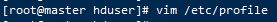

#### 4.2、添加如下信息

```properties
#MongoDB Shard
export MONGODB_HOME=/usr/local/mongodb
export PATH=$MONGODB_HOME/bin:$PATH
```

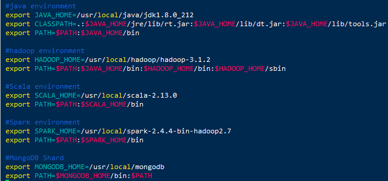

#### 4.3、使环境变量生效 

```shell
source /etc/profile
```

### 5、 **配置config server配置服务器** 

 **在节点master、slave1、slave2配置**

#### 5.1、 配置 

```shell
vi /usr/local/mongodb/conf/config.conf
```

#### 5.2、添加如下信息

```properties
## 配置文件内容
pidfilepath = /usr/local/mongodb/config/log/configsrv.pid
dbpath = /usr/local/mongodb/config/data
logpath = /usr/local/mongodb/config/log/congigsrv.log
logappend = true
 
bind_ip = 0.0.0.0
port = 21000
fork = true
 
#declare this is a config db of a cluster;
configsvr = true
 
#副本集名称
replSet=configs
 
#设置最大连接数
maxConns=20000
```

#### 5.3、 启动三台服务器的config server 

在节点**master、slave1、slave2**启动

```shell
mongod -f /usr/local/mongodb/conf/config.conf
```

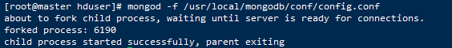

#### 5.4、初始化配置副本集 

在节点**master、slave1、slave2**，登录**任意一台**配置服务器

- 连接

```shell
mongo --port 21000
```

- 添加如下信息，回车。

```properties
config = {
        _id : "configs",
         members : [
             {_id : 0, host : "192.168.55.110:21000" },
             {_id : 1, host : "192.168.55.111:21000" },
             {_id : 2, host : "192.168.55.112:21000" },
         ]
     }
```

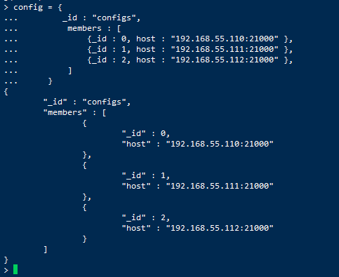


#### 5.5、初始副本集

```shell
#初始化副本集
rs.initiate(config)
```

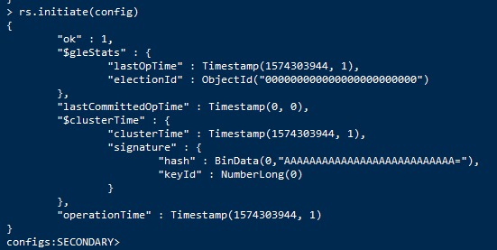

-  配置config变量，"_id" : "configs"应与配置文件中配置的replSet=configs一致，"members"中的"host"为三个节点的ip和port 

#### 5.6、查询状态

```
rs.status()
```

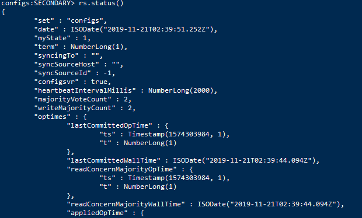

### 6、配置分片副本集

 **所有节点** 

#### 6.1、 设置第一个分片shard1副本集（三个节点master、slave1、slave2）

```shell
vi /usr/local/mongodb/conf/shard1.conf
```

- 添加信息

```properties
#配置文件内容
#——————————————–
pidfilepath = /usr/local/mongodb/shard1/log/shard1.pid
dbpath = /usr/local/mongodb/shard1/data
logpath = /usr/local/mongodb/shard1/log/shard1.log
logappend = true

bind_ip = 0.0.0.0
port = 27001
fork = true
 
#副本集名称
replSet=shard1

#declare this is a shard db of a cluster;
shardsvr = true

#设置最大连接数
maxConns=20000

```

-  启动三台服务器的shard1 server （三个节点master、slave1、slave2）

  ```shell
  mongod -f /usr/local/mongodb/conf/shard1.conf
  ```

-  登陆**任意一台**服务器（节点master、slave1），初始化副本集  (除了slave2:192.168.55.112，因为这是仲裁节点) 

  - 连接shard1：27001

  ```shell
  mongo --port 27001
  ```

  - 使用admin数据库

    ```shell
    use admin
    ```

  - 定义副本集配置，第三个节点的 "arbiterOnly":true 代表其为仲裁节点。输入如下信息，回车。

  ```properties
  config = {
      _id : "shard1",
       members : [
           {_id : 0, host : "192.168.55.110:27001" },
           {_id : 1, host : "192.168.55.111:27001" },
           {_id : 2, host : "192.168.55.112:27001" , arbiterOnly: true },
       ]
   }
  ```

  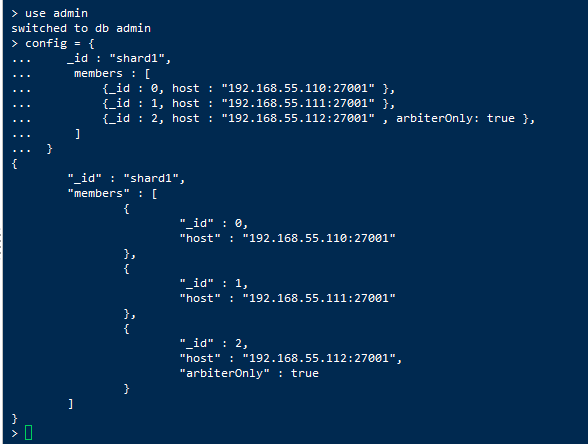

  - 初始化

  ```shell
  #初始化副本集配置
  rs.initiate(config)
  ```

  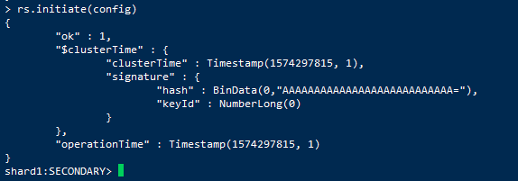

#### 6.2、 设置第二个分片shard2副本集（三个节点slave1、slave2、slave3）

```shell
vi /usr/local/mongodb/conf/shard2.conf
```

- 添加信息

```properties
#配置文件内容
#——————————————–
pidfilepath = /usr/local/mongodb/shard2/log/shard2.pid
dbpath = /usr/local/mongodb/shard2/data
logpath = /usr/local/mongodb/shard2/log/shard2.log
logappend = true
 
bind_ip = 0.0.0.0
port = 27002
fork = true
 
#副本集名称
replSet=shard2
 
#declare this is a shard db of a cluster;
shardsvr = true
 
#设置最大连接数
maxConns=20000

```

-  启动三台服务器的shard2 server （三个节点slave1、slave2、slave3）

```shell
mongod -f /usr/local/mongodb/conf/shard2.conf
```

- 登陆**任意一台**服务器（节点slave1、slave2），初始化副本集 (除了slave3:192.168.55.113，因为这是仲裁节点) 
  - 连接shard2：27002

  ```shell
  mongo --port 27002
  ```

  - 使用admin数据库

  ```shell
  use admin
  ```
  - 定义副本集配置，第三个节点的 "arbiterOnly":true 代表其为仲裁节点。输入如下信息，回车。

    ```properties
    config = {
        _id : "shard2",
         members : [
             {_id : 1, host : "192.168.55.111:27002" },
             {_id : 2, host : "192.168.55.112:27002" },
             {_id : 3, host : "192.168.55.113:27002" , arbiterOnly: true },
         ]
     }
    ```

  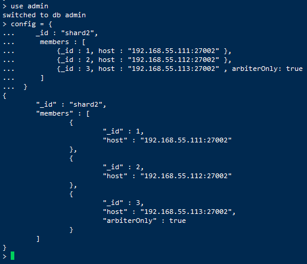

  - 初始化	

    ```shell
    #初始化副本集配置
    rs.initiate(config)
    ```

    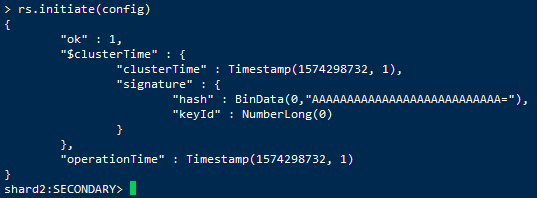

#### 6.3、 设置第三个分片shard3副本集（三个节点slave2、slave3、master）

```shell
vi /usr/local/mongodb/conf/shard3.conf
```

- 添加信息

  ```properties
  #配置文件内容
  #——————————————–
  pidfilepath = /usr/local/mongodb/shard3/log/shard3.pid
  dbpath = /usr/local/mongodb/shard3/data
  logpath = /usr/local/mongodb/shard3/log/shard3.log
  logappend = true
   
  bind_ip = 0.0.0.0
  port = 27003
  fork = true
   
  #副本集名称
  replSet=shard3
   
  #declare this is a shard db of a cluster;
  shardsvr = true
   
  #设置最大连接数
  maxConns=20000
  ```

- 启动三台服务器的shard3 server （三个节点slave2、slave3、master）

  ```shell
  mongod -f /usr/local/mongodb/conf/shard3.conf
  ```

- 登陆**任意一台**服务器（节点slave2、slave3），初始化副本集  (除了master:192.168.55.110，因为这是仲裁节点) 

  - 连接shard3：27003

    ```shell
    mongo --port 27003
    ```

  - 使用admin数据库

    ```shell
    use admin
    ```

  - 定义副本集配置，第三个节点的 "arbiterOnly":true 代表其为仲裁节点。输入如下信息，回车。

    ```properties
    config = {
        _id : "shard3",
         members : [
             {_id : 2, host : "192.168.55.112:27003" },
             {_id : 3, host : "192.168.55.113:27003" },
             {_id : 0, host : "192.168.55.110:27003" , arbiterOnly: true },
         ]
     }
    ```

    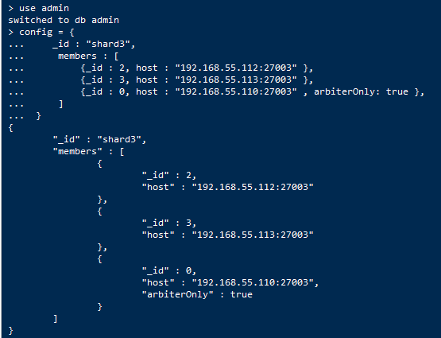

  - 初始化	

    ```shell
    #初始化副本集配置
    rs.initiate(config)
    ```

    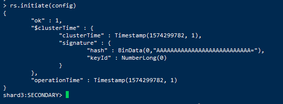

#### 6.4、 设置第四个分片shard4副本集（三个节点slave3、master、slave1）

```shell
vi /usr/local/mongodb/conf/shard4.conf
```

- 添加信息

  ```properties
  #配置文件内容
  #——————————————–
  pidfilepath = /usr/local/mongodb/shard4/log/shard4.pid
  dbpath = /usr/local/mongodb/shard4/data
  logpath = /usr/local/mongodb/shard4/log/shard4.log
  logappend = true
   
  bind_ip = 0.0.0.0
  port = 27004
  fork = true
   
  #副本集名称
  replSet=shard4
   
  #declare this is a shard db of a cluster;
  shardsvr = true
   
  #设置最大连接数
  maxConns=20000
  ```

- 启动三台服务器的shard4 server （三个节点slave3、master、slave1）

  ```shell
  mongod -f /usr/local/mongodb/conf/shard4.conf
  ```

- 登陆**任意一台**服务器（节点slave3、master），初始化副本集  (除了slave1:192.168.55.111，因为这是仲裁节点) 
  - 连接shard4：27004

    ```shell
    mongo --port 27004
    ```

  - 使用admin数据库

    ```shell
    use admin
    ```

  - 定义副本集配置，第三个节点的 "arbiterOnly":true 代表其为仲裁节点。输入如下信息，回车。

    ```properties
    config = {
        _id : "shard4",
         members : [
             {_id : 3, host : "192.168.55.113:27004" },
             {_id : 0, host : "192.168.55.110:27004" },
             {_id : 1, host : "192.168.55.111:27004" , arbiterOnly: true },
         ]
     }
    ```

    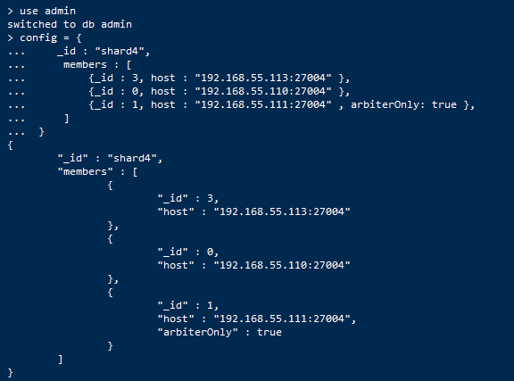

  - 初始化	

    ```shell
    #初始化副本集配置
    rs.initiate(config)
    ```

    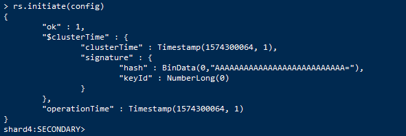


### 7、配置路由服务器 mongos

 先启动配置服务器和分片服务器,后启动路由实例启动路由实例:（三台机器master、slave1、slave2） 

```shell
vi /usr/local/mongodb/conf/mongos.conf
```

- 添加内容

  ```properties
  #内容
  pidfilepath = /usr/local/mongodb/mongos/log/mongos.pid
  logpath = /usr/local/mongodb/mongos/log/mongos.log
  logappend = true
   
  bind_ip = 0.0.0.0
  port = 20000
  fork = true
   
  #监听的配置服务器,只能有1个或者3个 configs为配置服务器的副本集名字
  configdb = configs/192.168.55.110:21000,192.168.55.111:21000,192.168.55.112:21000
   
  #设置最大连接数
  maxConns=20000
  ```

-  启动三台服务器的mongos server 

  ```shell
  mongos -f /usr/local/mongodb/conf/mongos.conf
  ```

  

### 8、启动分片

目前搭建了mongodb配置服务器、路由服务器，各个分片服务器，不过应用程序连接到mongos路由服务器并不能使用分片机制，还需要在程序里设置分片配置，让分片生效。 

-  登陆任意一台mongos （三台机器master、slave1、slave2）

```shell
mongo --port 20000
```

-  使用admin数据库 

  ```sql
  use  admin
  ```

- 串联路由服务器与分配副本集

  ```sql
  #串联路由服务器与分配副本集
  sh.addShard("shard1/192.168.55.110:27001,192.168.55.111:27001,192.168.55.112:27001")
  sh.addShard("shard2/192.168.55.111:27002,192.168.55.112:27002,192.168.55.113:27002")
  sh.addShard("shard3/192.168.55.112:27003,192.168.55.113:27003,192.168.55.110:27003")
  sh.addShard("shard4/192.168.55.113:27004,192.168.55.110:27004,192.168.55.111:27004")
  ```

  

- 查看集群状态

  ```sql
  #查看集群状态
  sh.status()
  ```

  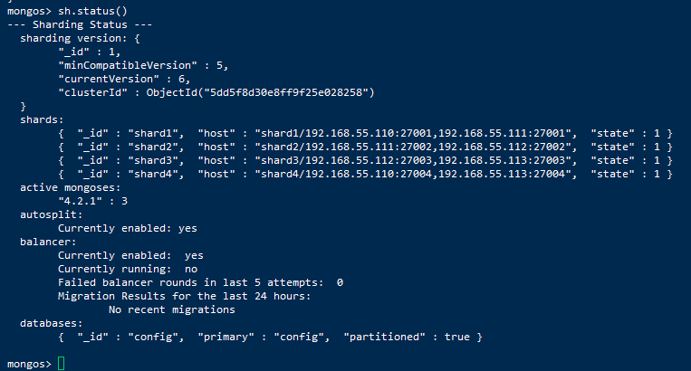


### 9、测试

 目前配置服务、路由服务、分片服务、副本集服务都已经串联起来了，但我们的目的是希望插入数据，数据能够自动分片。连接在mongos上，准备让指定的数据库、指定的集合分片生效。 

-  登陆任意一台mongos （三台机器master、slave1、slave2）

  ```shell
  mongo --port 20000
  ```

-  使用管理数据库 

  ```sql
  use  admin
  ```

-  指定testdb分片生效 

  ```sql
  #指定testdb分片生效
  db.runCommand( { enablesharding :"testdb"});
  ```

  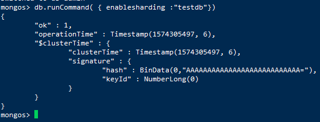

-  指定数据库里需要分片的集合和片键，**哈希id分片** 

  ```sql
  #指定数据库里需要分片的集合和片键
  db.runCommand( { shardcollection : "testdb.table1",key : {id: 1} } )
  #或者
  db.runCommand( { shardcollection : "testdb.table1",key : {"id": "hashed"} } );
  ```

  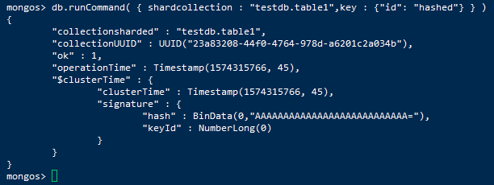

### 10、 测试分片配置结果 

-  连接mongos路由服务 

  ```shell
  mongo  127.0.0.1:20000
  ```

-  切换到testdb数据库 

  ```sql
  use  testdb
  ```

-  插入测试数据 

  ```sql
  #插入100000条测试数据
  for(i=1;i<=100000;i++){db.table1.insert({"id":i,"name":"henggao"})};
  ```

  

-  查看分片情况如下

  ```sql
  #查看分片情况，可以看到1000条数据分布于三个片上
  db.table1.stats();
  #或者
  sh.status()
  ```

  `db.table1.stats()`;有1000多行信息，，这里截取部分信息

  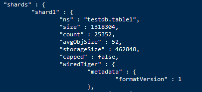

  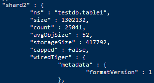

  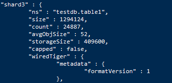

  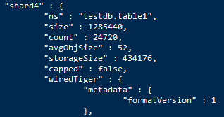

- **查看分片情况如下** 
  - **shard1：** “count”：25352
  - **shard2：** “count”：25041
  - **shard3：** “count”：24887
  - **shard4：** “count”：24720
  -  结论数据基本均匀 

-  总条数 

  ```sql
  db.table1.aggregate([{$group : {_id : "$name", totle : {$sum : 1}}}])
  ```

  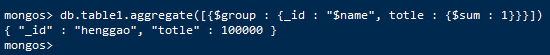

-  创建索引 

  ```sql
  db.table1.createIndex({"name":1})
  ```

  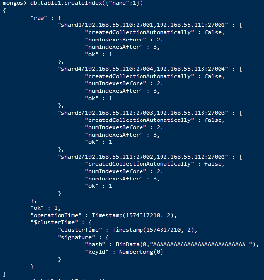

- 索引

  ```sql
  db.table1.getIndexes()
  ```

  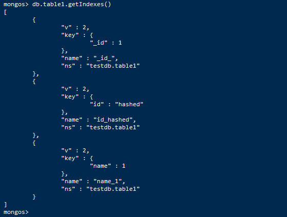

### 11、 启动关闭

- 补充一点：**在root权限下**

- mongodb的启动顺序是，先启动所有节点配置服务器（**在节点master、slave1、slave2配置**）

  ```shell
  mongod -f /usr/local/mongodb/conf/config.conf
  ```

- 再启动所有节点的分片

  - shard1 server（**在节点master、slave1、slave2配置**）

    ```shell
    mongod -f /usr/local/mongodb/conf/shard1.conf
    ```

  - shard2 server（**在节点slave1、slave2、slave3配置**）

    ```shell
    mongod -f /usr/local/mongodb/conf/shard2.conf
    ```

  - shard3 server（**在节点slave2、salve3、master配置**）

    ```shell
    mongod -f /usr/local/mongodb/conf/shard3.conf
    ```

  - shard4 server（**在节点slave3、master、slave1配置**）

    ```shell
    mongod -f /usr/local/mongodb/conf/shard4.conf
    ```

- 最后启动所有节点的mongos （**在节点master、slave1、slave2配置**）

  ```shell
  mongos -f /usr/local/mongodb/conf/mongos.conf
  ```

- 连接mongos

  ```
  mongo  127.0.0.1:20000
  ```

  

-  关闭时，直接killall杀掉所有进程 

  ```shell
  killall mongod
  killall mongos
  ```

  

参考：

 https://blog.csdn.net/my_bai/article/details/80454541 

 https://blog.csdn.net/ywd1992/article/details/81947357 

 https://www.cnblogs.com/genghenggao/p/10473547.html 

 https://www.ymq.io/2018/01/30/MongoDB-3/ 

 https://www.cnblogs.com/ityouknow/p/7566682.html 