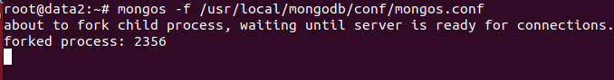
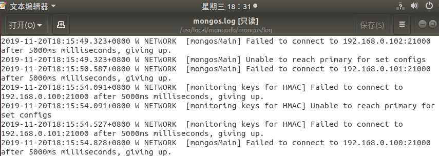

# Ubuntu中MongoDB常见问题

[TOC]

## 一、Mongos启动一直不动

- 输入以下命令

  ```shell
  mongos -f /usr/local/mongodb/conf/mongos.conf
  ```

- 一直卡在界面

  

  ```
  about to fork child process, waiting until server is ready for connections.
  forked process: 2356
  ```

- 在/usr/local/mongodb/mongos/log查看mongos.log

