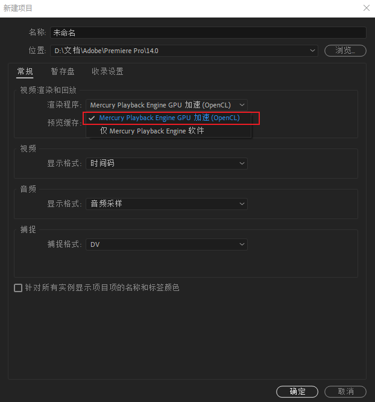
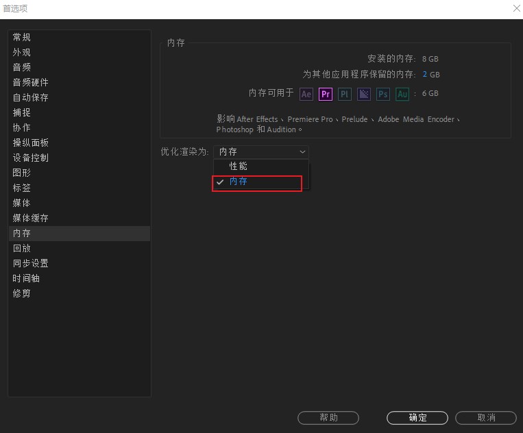

# Adobe Premiere Pro

[TOC]

## 1、导出时间慢

1、首先打开Premiere Pro 2020软件，新建一个pr项目。

2、在弹出的“新建项目”对话框中，将“渲染程序”修改为“openCL”选项。

3、然后新建好新序列，对首选项设置进行设置。

4、单击左上角的“编辑”，找到“首选项”，进入“内存”选项卡。

5、将优化渲染的首选选择为“内存”即可，这样就能加速渲染了。（需要重启）

