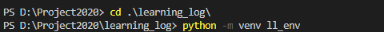
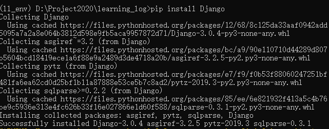
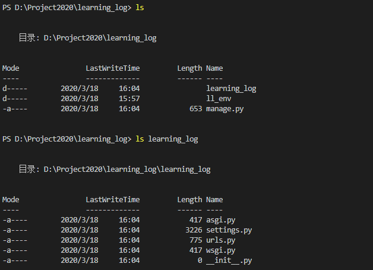
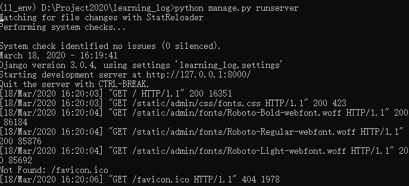

# Django入门

[TOC]

## 一、简述

你将学习如何使用Django（http://djangoproject.com/）来开发一个名为“学习笔记”（Learning Log）的项目，这是一个在线日志系统，让你能够记录所学习的有关特定主题的知识。

- 下面操作**windows10**下进行

## 二、建立虚拟环境

要使用Django，首先需要建立一个虚拟工作环境。虚拟环境是系统的一个位置，你可以在其中安装包，并将其与其他Python包隔离。

再在**终端**中切换到这个目录，并创建一个虚拟环境。如果你使用的是Python 3，可使用如下命令来创建虚拟环境：

```
python -m venv ll_env
```




## 三、激活虚拟环境

建立虚拟环境后，切换到`D:\Project2020\learning_log>`，使用下面的命令激活它（我这里cmd下使用的，在VScode终端报错😓，现已解决参考文件Vscode/05-Vscode终端报错）：

```shell
ll_env\Scripts\activate
```


要停止使用虚拟环境，可执行命令deactivate：

```
deactivate
```


## 四、安装Django

**创建并激活虚拟环境后**，就可安装Django了：

```
pip install Django
```



- Django仅在虚拟环境处于活动状态时才可用。

## 五、在Django 中创建项目

- 在依然处于活动的虚拟环境的情况下（ll_env包含在括号内），执行如下命令来新建一个项目：

```
django-admin.py startproject learning_log .
```

这个命令让Django新建一个名为learning_log的项目。这个命令末尾的句点让新项目使用合适的目录结构，这样开发完成后可轻松地将应用程序部署到服务器。


查看，我是在在VScode终端下查看，在cmd下使用`dir`



在cmd下使用`dir`


## 六、创建数据库

```
python manage.py migrate
```


查看

```
ls
```


## 七、查看项目

下面来核实Django是否正确地创建了项目。为此，可执行命令runserver

```
python manage.py runserver
```



- 若要关闭这个服务器，按Ctrl + C即可。

浏览器输入http://127.0.0.1:8000/查看


- 如果出现错误消息“That port is already in use”（指定端口已被占用），请执行命令python manage.py runserver 8001，让Diango使用另一个端口。